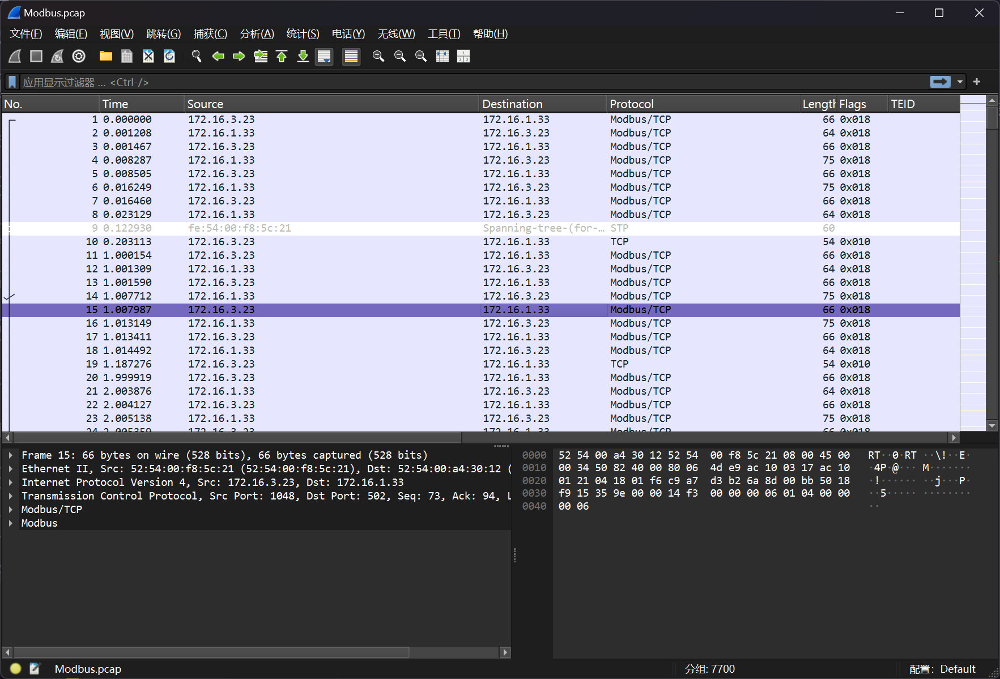
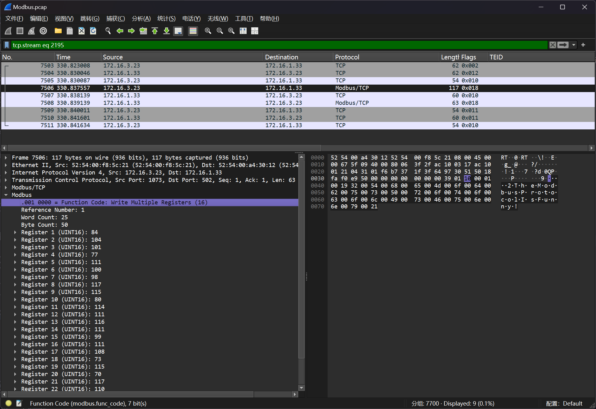

# Modbus协议

:::note

黑客通过外网进入一家工厂的控制网络，之后对工控网络中的操作员站系统进行了攻击，最终通过工控协议破坏了正常的业务。我们得到了操作员站在攻击前后的网络流量数据包，我们需要分析流量中的蛛丝马迹，找到FLAG

flag形式为 `flag{}`

:::

题目提供了一个文件 `Modbus.pcap`



在 `TCPSession 2195`中，可以看到


即可得到答案



```flag
flag{TheModbusProtocolIsFunny!}
```
