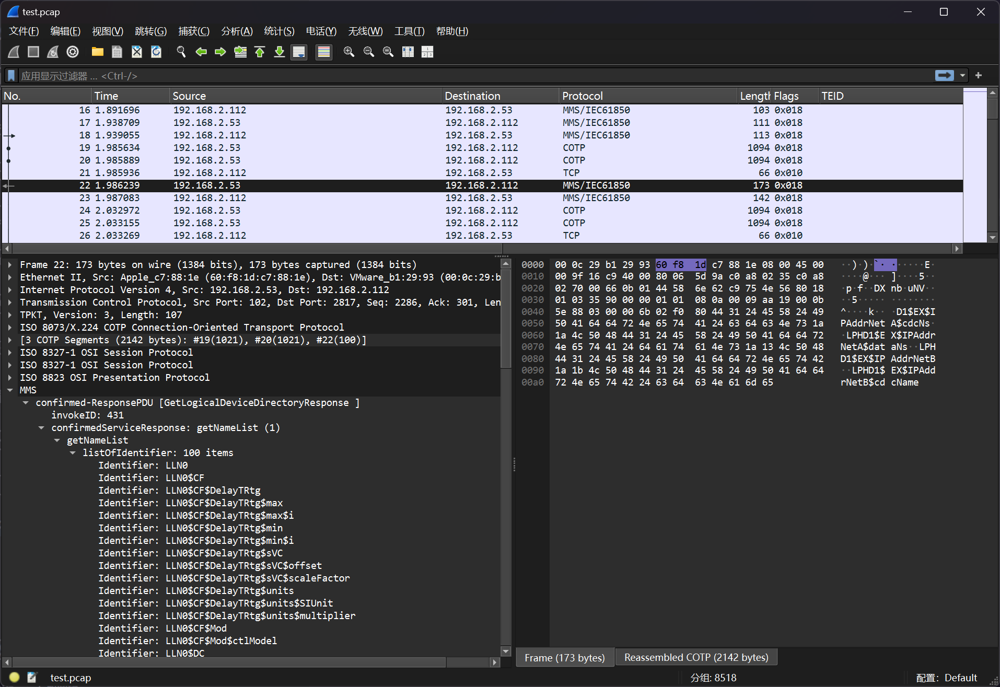
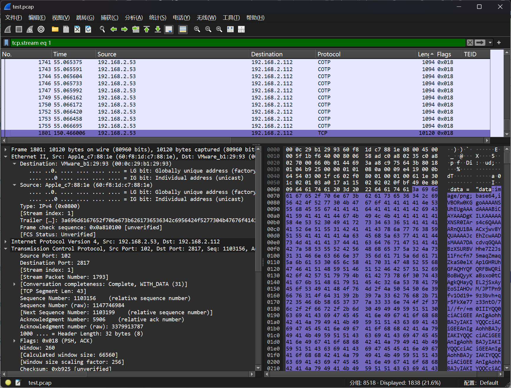
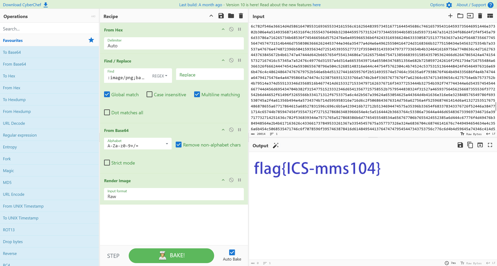

# MMS 协议分析

:::note

工业网络中存在的异常，尝试通过分析 PACP 流量包，分析出流量数据中的异常点，并拿到 FLAG

flag 形式为 `flag{}`

:::

题目提供了 `test.pcap` 流量包文件，根据题目跟踪 MMS 协议的流量



在第一个 TCPSession中，发现图像传输流量



将图像数据进行解码，即可得到答案



```flag
flag{ICS-mms104}
```
