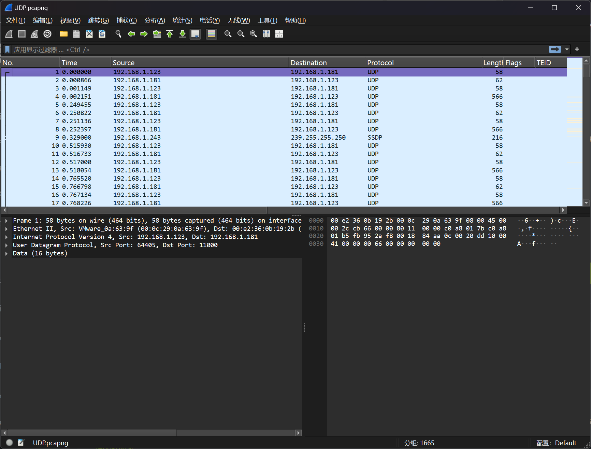
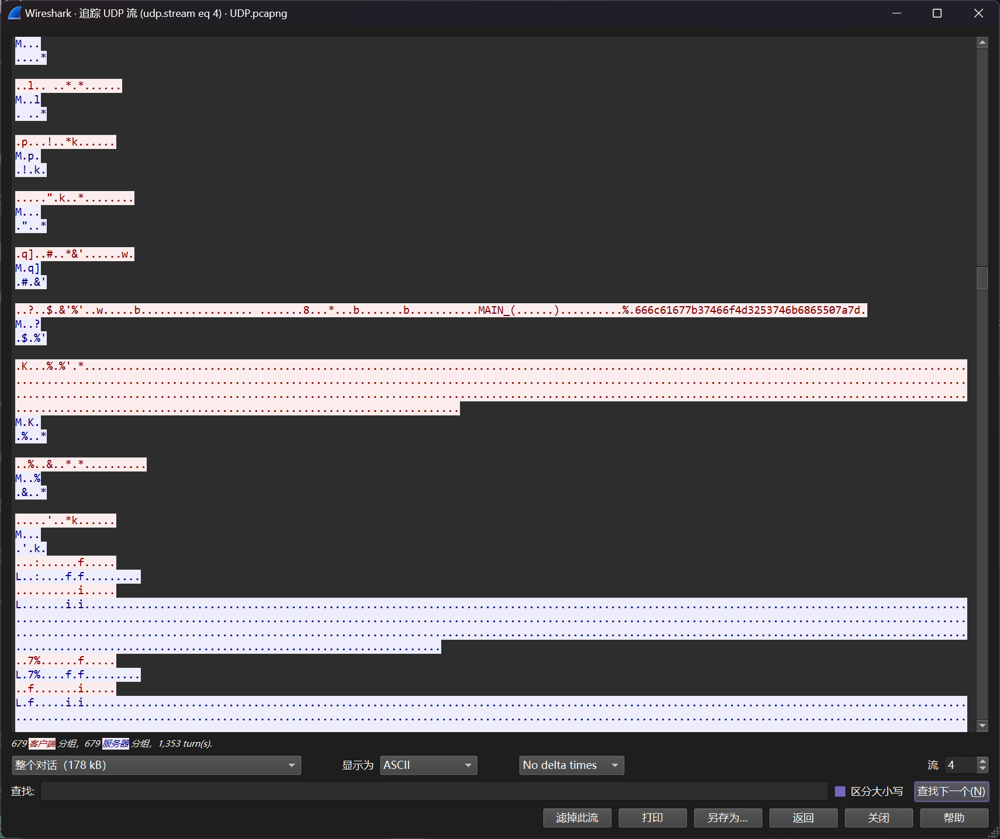
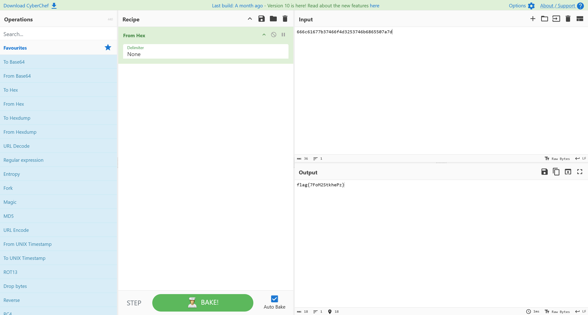

# 大工UDP协议

:::note

在进行工业企业检查评估工作中，发现了疑似感染恶意软件的上位机。现已提取出上位机通信流量，尝试分析出异常点，获取FLAG

flag形式为 `flag{}`

:::

题目提供了`UDP.pcapng` 流量包文件



对流量中的数据进行排查，发现为`MAC1000 Programable Controller`设备，并在流量中发现



对其中的数据进行Hex解码



即可得到答案

```flag
flag{7FoM2StkhePz}
```
