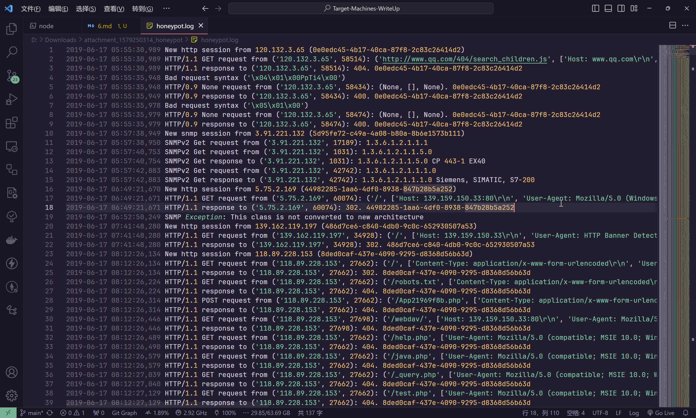
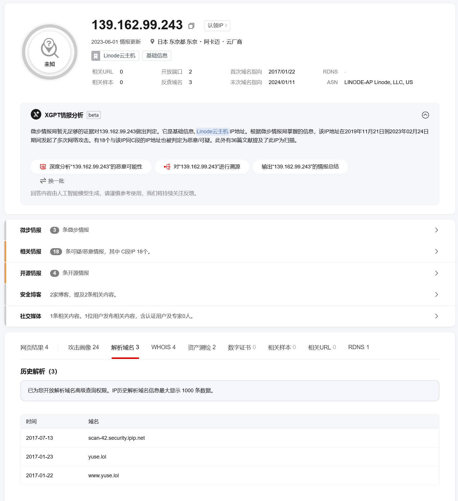

# 工控蜜罐日志分析

:::note

工控安全分析人员在互联网上部署了工控仿真蜜罐，通过蜜罐可抓取并分析互联网上针对工业资产的扫描行为，将存在高危扫描行为的 IP 加入防火墙黑名单可有效减少工业企业对于互联网的攻击面。分析出日志中针对西门子私有通信协议扫描最多的 IP，分析该扫描组织，Flag 为该 IP 的域名

flag 形式为 `flag{}`

:::

题目给出了 `honeypot.log` 日志文件



已知西门子的私有协议为 `S7comm`

使用脚本进行日志筛查

```python
with open("./honeypot.log", "r") as f:
    log_data = f.read().strip()

log_data = [i for i in log_data.split("\n") if "S7comm".lower() in i.lower()]

ip_collection = []

for i in log_data:
    date, time, data = i.split(" ", 2)
    if data == "Conpot S7Comm initialized":
        continue
    elif data.startswith("Exception caught DissectException"):
        continue
    elif data.startswith("Found and enabled"):
        continue
    elif data.startswith("S7Comm server started on"):
        continue
    elif data.startswith("New s7comm session from"):
        session_ip = data.split(" ")[4]
        ip_collection.append(session_ip)
    else:
        print(data)

session_ip_dict = {}

for i in ip_collection:
    if i not in session_ip_dict.keys():
        session_ip_dict[i] = 1
    else:
        session_ip_dict[i] += 1

print(session_ip_dict)
```

在得到的结果中，ip地址`139.162.99.243`的访问次数最多，对此ip地址进行排查



即可得到结果

```flag
flag{scan-42.security.ipip.net}
```
