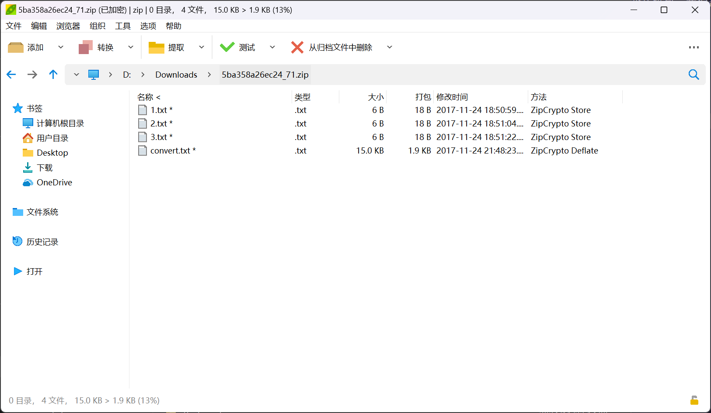
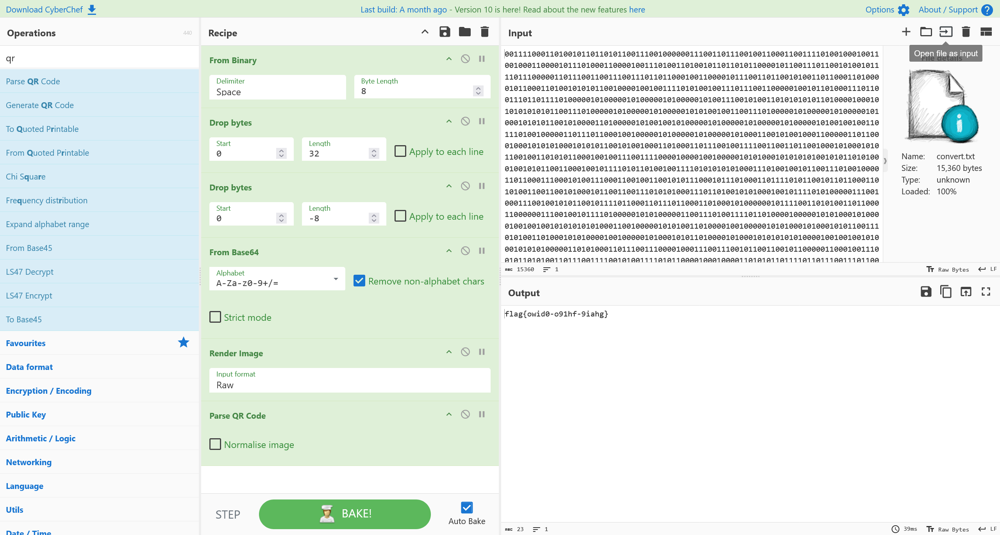

# 常见的编码转换

:::note

某企业的 SCADA 系统主机被黑客入侵，管理员小华发现黑客上传了一个压缩包，我们需要帮助小华分析压缩包内的蛛丝马迹，找到 FLAG

flag 形式为 `flag{}`

:::

题目提供了一份 `5ba358a26ec24_71.zip` 压缩包文件



前 3 个文件的大小较小，可以考虑从 CRC 值进行爆破

已知三个文件的 CRC 值对应

| FIlename |   CRC    |
| :------: | :------: |
|  1.txt   | CC86365B |
|  2.txt   | BCEE7ED5 |
|  3.txt   | CCCA7E74 |

对已知的 CRC 值进行爆破，组合得到的可能结果，得到压缩包密码为

```plaintext
forum_91ctf_com_66
```

解压压缩包，对 `convert.txt` 文件进行解码



即可得到答案

```flag
flag{owid0-o91hf-9iahg}
```
