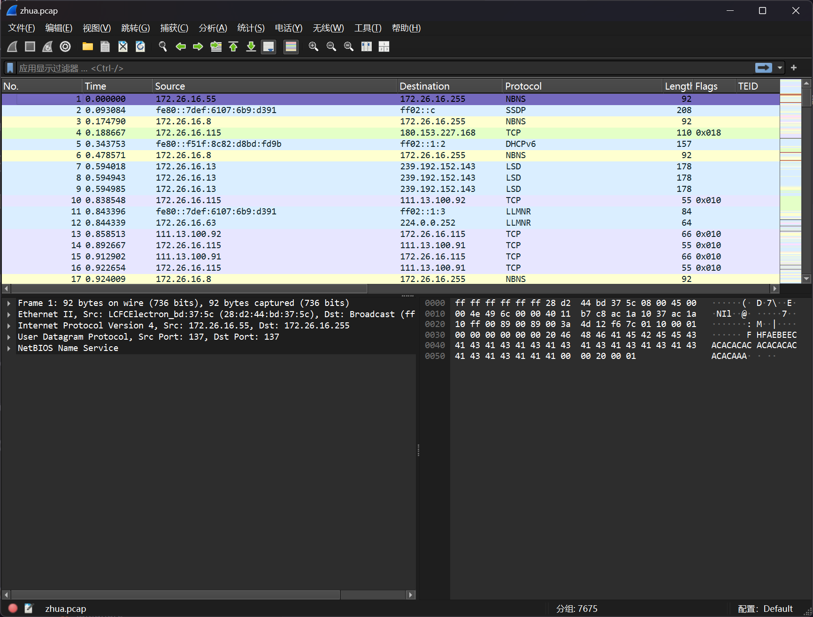
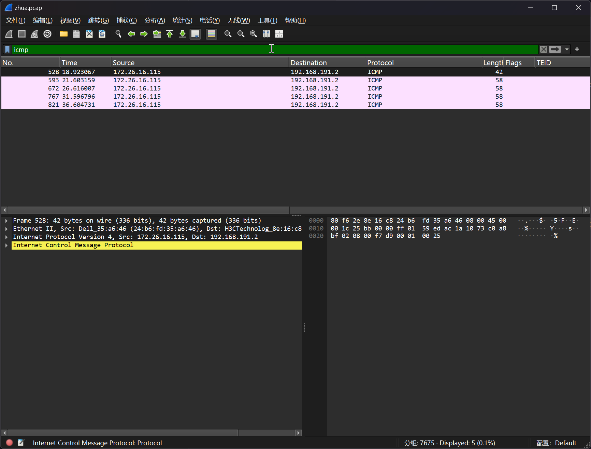
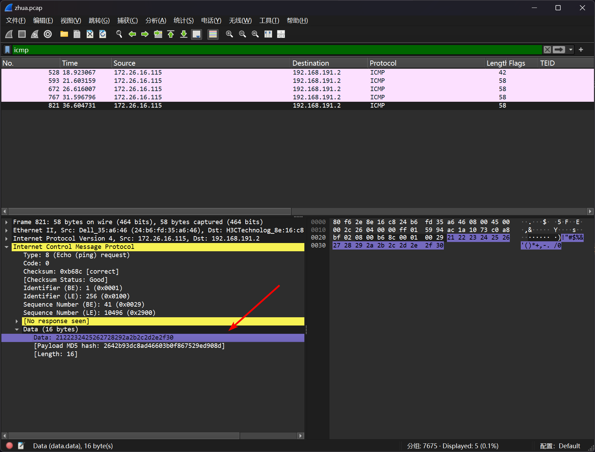

# ICMP 协议分析

:::note

某厂区遭到黑客恶意扫描，此为安全设备截取的一部分流量包，请尝试分析该流量文件，帮助安全人员找到黑客的行为轨迹，并找到隐藏的 FLAG

flag 形式为 `flag{}`

:::

题目提供了 `zhua` 文件，将其重命名为 `zhua.pcap`



根据题目意思，直接过滤 icmp 协议



可以发现后3个包的数据都是一致的，就是答案



```flag
flag{2122232425262728292a2b2c2d2e2f30}
```
