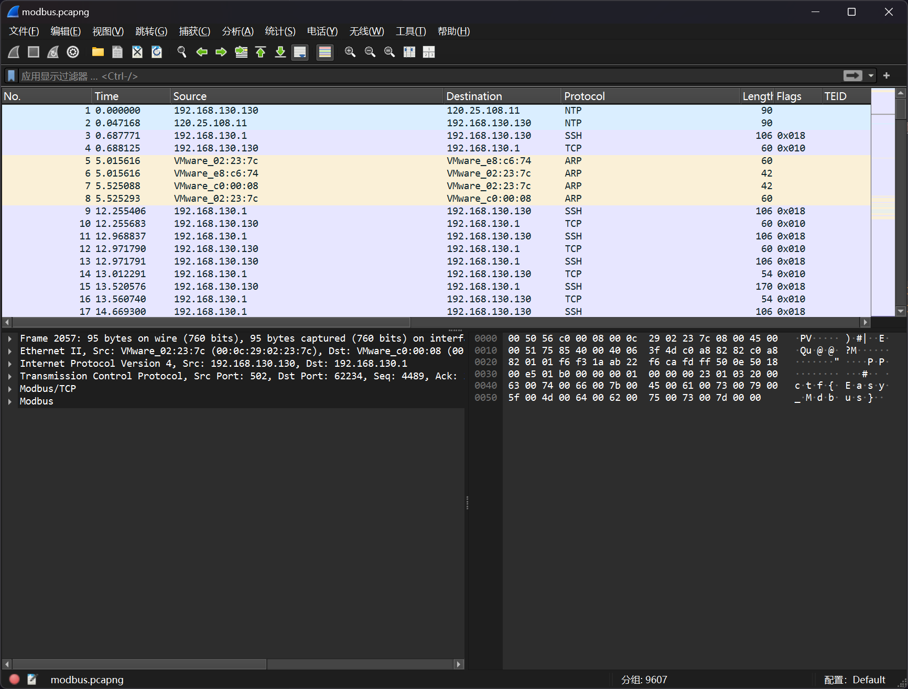
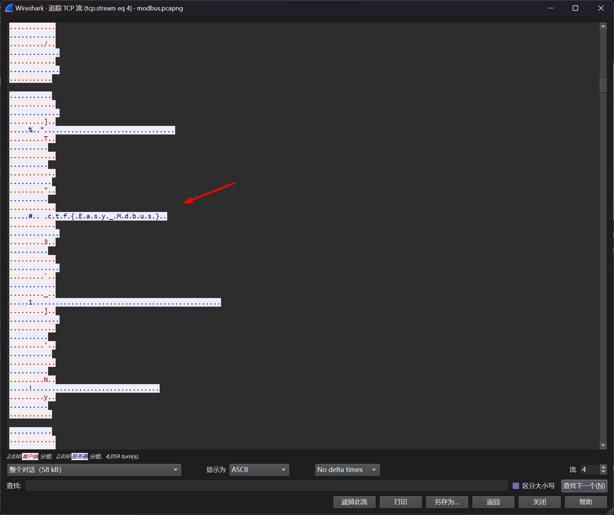

# Modbus 协议流量分析

:::note

黑客通过外网入侵到工厂的控制网络，之后对工控网络中的操作员站系统进行了攻击，最终通过工控协议破坏了正常的业务。我们通过监控工具得到黑客攻击前后的网络流量数据包，我们需要分析流量中的蛛丝马迹，找到 FLAG

flag 形式为 `flag{}`

:::

题目提供了 `modbus.pcapng` 流量包文件



分析 TCP 会话，可以发现



即可得到答案

```flag
flag{Easy_Mdbus}
```
