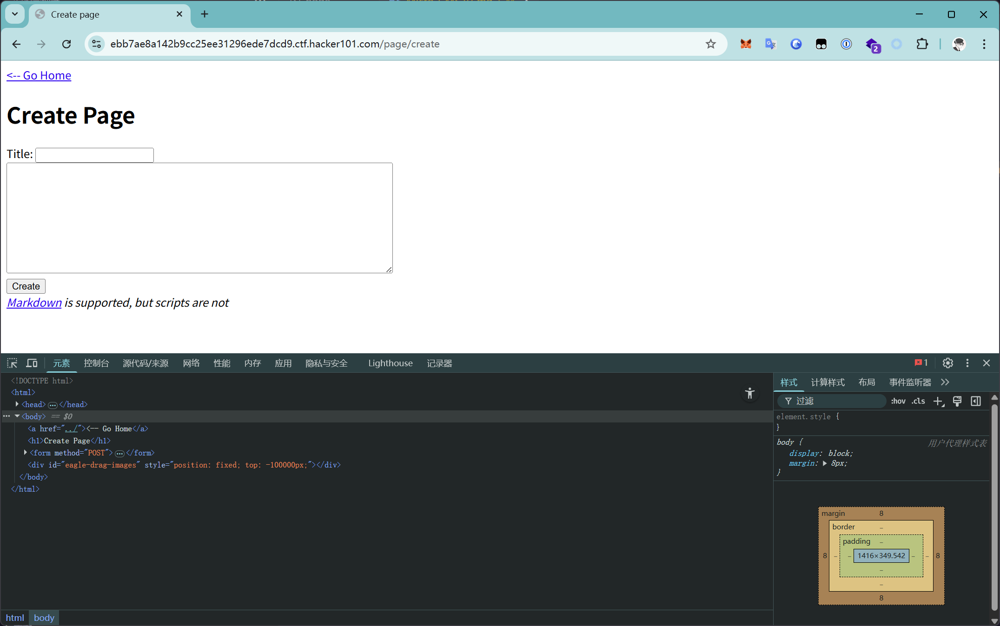
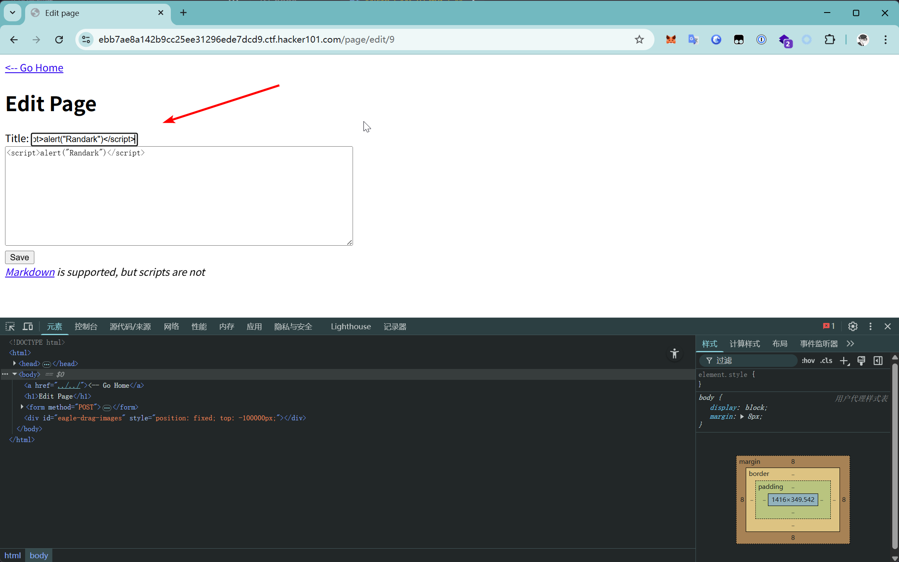

# Micro-CMS v1

## 1 XSS

访问服务

点击`Create a new page`尝试创建页面

既然是可以控制页面内容，可以考虑储存型XSS

很明显失败了，因为页面内容包裹在`scrubbed`标签中

尝试在标题处进行注入

返回主页之后，即可触发XSS

## 2 SQLi

在页面编辑页面，URL参数中很明显的是int作为页面索引

尝试在`9`后面添加一个单引号

TODO 未完成
