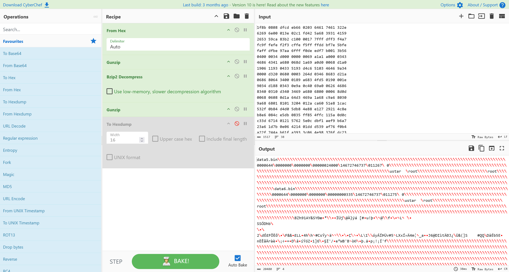
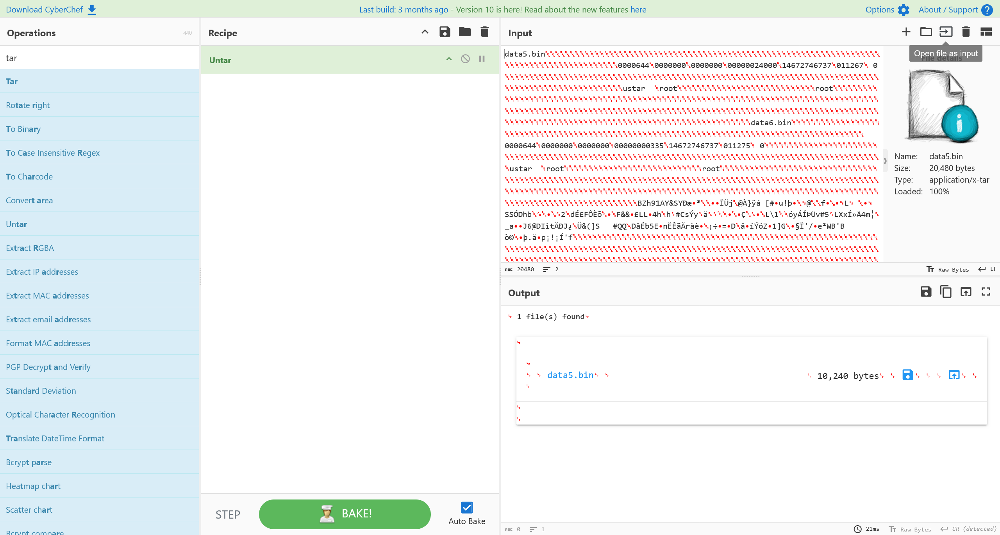
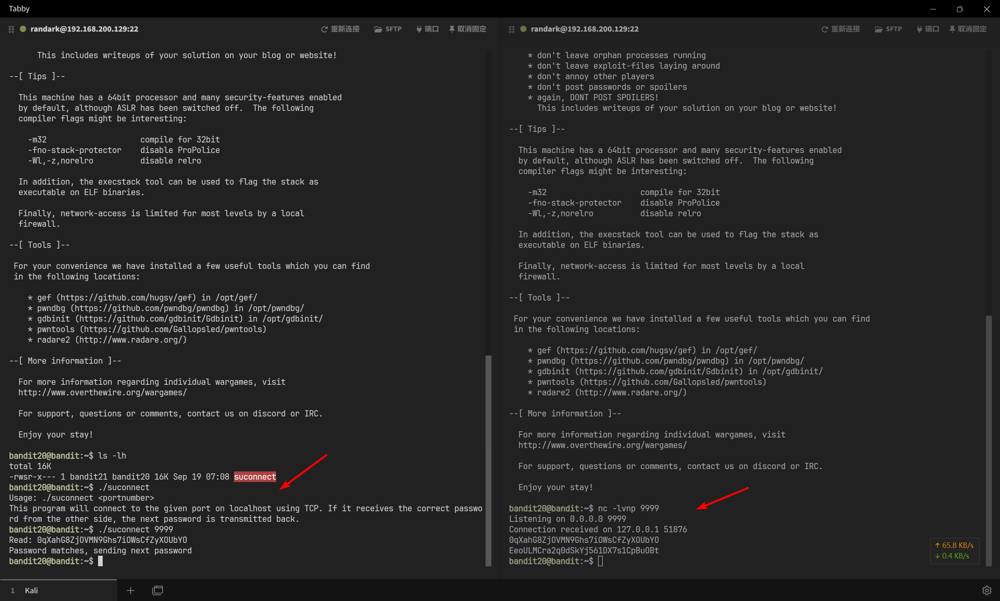
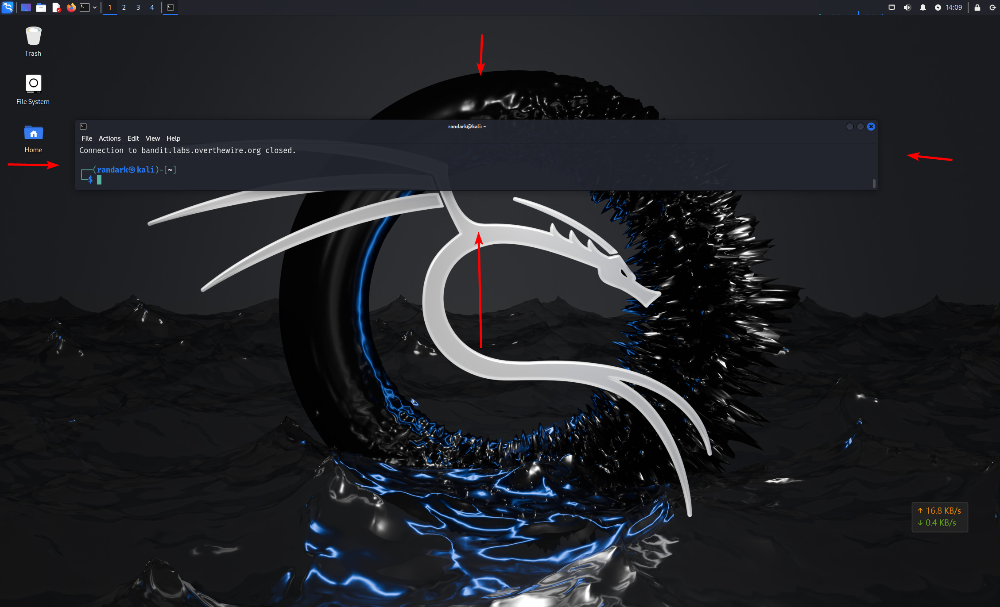

# Bandit

:::info

The Bandit wargame is aimed at absolute beginners. It will teach the basics needed to be able to play other wargames.

Bandit 夺旗游戏专为绝对初学者设计。它将教授参与其他夺旗游戏所需的基础知识。

:::

:::note Note for beginners

这个游戏和大多数其他游戏一样，是按关卡组织的。你从第 0 关开始，尝试 “通过” 或 “完成” 它。完成一个关卡后，你会获得关于如何开始下一关的信息。网站上的 `Level <X>` 页面包含了如何从上一关进入第 X 关的信息。例如，“Level 1” 的页面提供了从第 0 关进入第 1 关的方法。本游戏的每个关卡都有对应的页面，所有这些页面都可以通过本页面左侧的侧边菜单访问。

在游戏中，你会遇到许多完全不知道该怎么做的情况。别慌！也不要放弃！这个游戏的目的是让你学习基础知识，而学习基础知识的一部分就是阅读大量的新信息。如果你从未使用过命令行，一个好的起点是阅读这篇用户命令的入门介绍。

当你不知道如何继续时，可以尝试以下几种方法：

1. 如果你知道一个命令，但不知道如何使用它，可以通过输入 `man <命令>` 来查看手册（man 页面）。例如，输入 `man ls` 学习 `ls` 命令。`man` 命令本身也有手册，可以试试 `man man`。在使用 `man` 时，按 `q` 键退出（你也可以使用 `/` 搜索，按 `n` 和 `N` 切换搜索结果）。
2. 如果没有 `man` 页面，该命令可能是 `shell` 内置命令。这种情况下，可以使用 `help <命令>` 来查看帮助。例如，`help cd`
3. 使用搜索引擎：你的搜索引擎是你最好的朋友，学会如何高效使用它！推荐使用 Google。
4. 如果仍然卡住，可以通过聊天加入我们的讨论。

你已经准备好开始了！从页面左侧链接的第 0 关开始吧。祝你好运！

:::

## Level 0

:::info Level Goal

本关的目标是让您使用 SSH 登录游戏。您需要连接的主机是 `bandit.labs.overthewire.org`，端口为 2220。用户名为 `bandit0`，密码为 `bandit0`。登录后，请访问 “第 1 关” 页面，了解如何闯过第 1 关。

:::

构建 SSH 登录命令参数

```bash
┌──(randark ㉿ kali)-[~]
└─$ ssh bandit0@bandit.labs.overthewire.org -p 2220
# ASCII Art
bandit0@bandit.labs.overthewire.org's password:

# ASCII Art

Welcome to OverTheWire!

If you find any problems, please report them to the #wargames channel on
discord or IRC.

--[Playing the games]--

  This machine might hold several wargames.
  If you are playing "somegame", then:

    * USERNAMES are somegame0, somegame1, ...
    * Most LEVELS are stored in /somegame/.
    * PASSWORDS for each level are stored in /etc/somegame_pass/.

  Write-access to homedirectories is disabled. It is advised to create a
  working directory with a hard-to-guess name in /tmp/.  You can use the
  command "mktemp -d" in order to generate a random and hard to guess
  directory in /tmp/.  Read-access to both /tmp/ is disabled and to /proc
  restricted so that users cannot snoop on eachother. Files and directories
  with easily guessable or short names will be periodically deleted! The /tmp
  directory is regularly wiped.
  Please play nice:

    * don't leave orphan processes running
    * don't leave exploit-files laying around
    * don't annoy other players
    * don't post passwords or spoilers
    * again, DONT POST SPOILERS!
      This includes writeups of your solution on your blog or website!

--[Tips]--

  This machine has a 64bit processor and many security-features enabled
  by default, although ASLR has been switched off.  The following
  compiler flags might be interesting:

    -m32                    compile for 32bit
    -fno-stack-protector    disable ProPolice
    -Wl,-z,norelro          disable relro

  In addition, the execstack tool can be used to flag the stack as
  executable on ELF binaries.

  Finally, network-access is limited for most levels by a local
  firewall.

--[Tools]--

 For your convenience we have installed a few useful tools which you can find
 in the following locations:

    * gef (https://github.com/hugsy/gef) in /opt/gef/
    * pwndbg (https://github.com/pwndbg/pwndbg) in /opt/pwndbg/
    * gdbinit (https://github.com/gdbinit/Gdbinit) in /opt/gdbinit/
    * pwntools (https://github.com/Gallopsled/pwntools)
    * radare2 (http://www.radare.org/)

--[More information]--

  For more information regarding individual wargames, visit
  http://www.overthewire.org/wargames/

  For support, questions or comments, contact us on discord or IRC.

  Enjoy your stay!

bandit0@bandit:~$ whoami
bandit0
```

## Level 0 → Level 1

:::info Level Goal

下一级的密码保存在主目录下名为 `readme` 的文件中。 使用此密码通过 SSH 登录 `bandit1`

每当找到某个关卡的密码时，请使用 SSH（2220 端口）登录该关卡并继续游戏。

:::

首先查看文件内容

```bash
bandit0@bandit:~$ cat readme
Congratulations on your first steps into the bandit game!!
Please make sure you have read the rules at https://overthewire.org/rules/
If you are following a course, workshop, walkthrough or other educational activity,
please inform the instructor about the rules as well and encourage them to
contribute to the OverTheWire community so we can keep these games free!

The password you are looking for is: ZjLjTmM6FvvyRnrb2rfNWOZOTa6ip5If
```

接下来登录 `bandit1` 用户

```bash
┌──(randark ㉿ kali)-[~]
└─$ ssh bandit1@bandit.labs.overthewire.org -p 2220
# ......
bandit1@bandit:~$ whoami
bandit1
```

## Level 1 → Level 2

:::info Level Goal

下一级的密码存储在位于主目录中名为 - 的文件中

:::

查看用户目录

```bash
┌──(randark ㉿ kali)-[~]
└─$ sshpass -p ZjLjTmM6FvvyRnrb2rfNWOZOTa6ip5If ssh bandit1@bandit.labs.overthewire.org -p 2220
bandit1@bandit:~$ ls -lah
total 24K
-rw-r-----  1 bandit2 bandit1   33 Sep 19 07:08 -
drwxr-xr-x  2 root    root    4.0K Sep 19 07:08 .
drwxr-xr-x 70 root    root    4.0K Sep 19 07:09 ..
-rw-r--r--  1 root    root     220 Mar 31  2024 .bash_logout
-rw-r--r--  1 root    root    3.7K Mar 31  2024 .bashrc
-rw-r--r--  1 root    root     807 Mar 31  2024 .profile
```

由于破折号在 Bash 中有着其他作用，导致无法直接执行 `cat -` 查看文件内容

但是由于本目录下非隐藏文件中只有这个 `-` 文件，所以就可以直接使用通配符进行读取

```bash
bandit1@bandit:~$ cat ./*
263JGJPfgU6LtdEvgfWU1XP5yac29mFx
```

## Level 2 → Level 3

:::info Level Goal

下一级密码存储在主目录中一个名为 spaces 的文件中。

:::

```bash
┌──(randark ㉿ kali)-[~]
└─$ sshpass -p 263JGJPfgU6LtdEvgfWU1XP5yac29mFx ssh bandit2@bandit.labs.overthewire.org -p 2220
bandit2@bandit:~$ ls -lah
total 24K
drwxr-xr-x  2 root    root    4.0K Sep 19 07:08 .
drwxr-xr-x 70 root    root    4.0K Sep 19 07:09 ..
-rw-r--r--  1 root    root     220 Mar 31  2024 .bash_logout
-rw-r--r--  1 root    root    3.7K Mar 31  2024 .bashrc
-rw-r--r--  1 root    root     807 Mar 31  2024 .profile
-rw-r-----  1 bandit3 bandit2   33 Sep 19 07:08 spaces in this filename
```

由于文件名带有空格，使用转义符进行表达即可

```bash
bandit2@bandit:~$ cat spaces\ in\ this\ filename
MNk8KNH3Usiio41PRUEoDFPqfxLPlSmx
```

## Level 3 → Level 4

:::info Level Goal

下一级密码保存在 inhere 目录中的一个隐藏文件中

:::

```bash
┌──(randark ㉿ kali)-[~]
└─$ sshpass -p MNk8KNH3Usiio41PRUEoDFPqfxLPlSmx ssh bandit3@bandit.labs.overthewire.org -p 2220
bandit3@bandit:~$ ls -lah
total 24K
drwxr-xr-x  3 root root 4.0K Sep 19 07:08 .
drwxr-xr-x 70 root root 4.0K Sep 19 07:09 ..
-rw-r--r--  1 root root  220 Mar 31  2024 .bash_logout
-rw-r--r--  1 root root 3.7K Mar 31  2024 .bashrc
drwxr-xr-x  2 root root 4.0K Sep 19 07:08 inhere
-rw-r--r--  1 root root  807 Mar 31  2024 .profile
bandit3@bandit:~$ cd inhere/
bandit3@bandit:~/inhere$ ls -lh
total 0
bandit3@bandit:~/inhere$ ls -lah
total 12K
drwxr-xr-x 2 root    root    4.0K Sep 19 07:08 .
drwxr-xr-x 3 root    root    4.0K Sep 19 07:08 ..
-rw-r----- 1 bandit4 bandit3   33 Sep 19 07:08 ...Hiding-From-You
bandit3@bandit:~/inhere$ cat ./...Hiding-From-You
2WmrDFRmJIq3IPxneAaMGhap0pFhF3NJ
```

## Level 4 → Level 5

:::info Level Goal

下一级密码存储在 inhere 目录中唯一一个人类可读的文件中。提示：如果你的终端出了问题，试试 reset 命令

:::

```bash
┌──(randark ㉿ kali)-[~]
└─$ sshpass -p 2WmrDFRmJIq3IPxneAaMGhap0pFhF3NJ ssh bandit4@bandit.labs.overthewire.org -p 2220
bandit4@bandit:~$ ls -lah
total 24K
drwxr-xr-x  3 root root 4.0K Sep 19 07:08 .
drwxr-xr-x 70 root root 4.0K Sep 19 07:09 ..
-rw-r--r--  1 root root  220 Mar 31  2024 .bash_logout
-rw-r--r--  1 root root 3.7K Mar 31  2024 .bashrc
drwxr-xr-x  2 root root 4.0K Sep 19 07:08 inhere
-rw-r--r--  1 root root  807 Mar 31  2024 .profile
bandit4@bandit:~$ cd inhere/
bandit4@bandit:~/inhere$ ls -lah
total 48K
drwxr-xr-x 2 root    root    4.0K Sep 19 07:08 .
drwxr-xr-x 3 root    root    4.0K Sep 19 07:08 ..
-rw-r----- 1 bandit5 bandit4   33 Sep 19 07:08 -file00
-rw-r----- 1 bandit5 bandit4   33 Sep 19 07:08 -file01
-rw-r----- 1 bandit5 bandit4   33 Sep 19 07:08 -file02
-rw-r----- 1 bandit5 bandit4   33 Sep 19 07:08 -file03
-rw-r----- 1 bandit5 bandit4   33 Sep 19 07:08 -file04
-rw-r----- 1 bandit5 bandit4   33 Sep 19 07:08 -file05
-rw-r----- 1 bandit5 bandit4   33 Sep 19 07:08 -file06
-rw-r----- 1 bandit5 bandit4   33 Sep 19 07:08 -file07
-rw-r----- 1 bandit5 bandit4   33 Sep 19 07:08 -file08
-rw-r----- 1 bandit5 bandit4   33 Sep 19 07:08 -file09
bandit4@bandit:~/inhere$ strings ./*
h0~ey
4oQYVPkxZOOEOO5pTW81FB8j8lxXGUQw
`>5HYA
```

## Level 5 → Level 6

:::info Level Goal

下一级密码存储在 inhere 目录下的某个文件中，并具有以下所有属性

- human-readable 人类可阅读
- 1033 bytes in size 大小为 1033 字节
- not executable 不可执行

:::

```bash
┌──(randark ㉿ kali)-[~]
└─$ sshpass -p 4oQYVPkxZOOEOO5pTW81FB8j8lxXGUQw ssh bandit5@bandit.labs.overthewire.org -p 2220
bandit5@bandit:~$ ls -lah
total 24K
drwxr-xr-x  3 root root    4.0K Sep 19 07:08 .
drwxr-xr-x 70 root root    4.0K Sep 19 07:09 ..
-rw-r--r--  1 root root     220 Mar 31  2024 .bash_logout
-rw-r--r--  1 root root    3.7K Mar 31  2024 .bashrc
drwxr-x--- 22 root bandit5 4.0K Sep 19 07:08 inhere
-rw-r--r--  1 root root     807 Mar 31  2024 .profile
bandit5@bandit:~$ cd inhere/
bandit5@bandit:~/inhere$ find . -type f -size 1033c ! -perm /111
./maybehere07/.file2
bandit5@bandit:~/inhere$ strings ./maybehere07/.file2
HWasnPhtq9AVKe0dmk45nxy20cvUa6EG
```

## Level 6 → Level 7

:::info Level Goal

下一级密码存储在服务器上的某个地方，并具有以下所有属性

- owned by user bandit7 被用户 bandit7 拥有
- owned by group bandit6 被用户组 bandit6 拥有
- 33 bytes in size 大小为 33 字节

:::

```bash
┌──(randark ㉿ kali)-[~]
└─$ sshpass -p HWasnPhtq9AVKe0dmk45nxy20cvUa6EG ssh bandit6@bandit.labs.overthewire.org -p 2220
bandit6@bandit:~$ find / -type f -user bandit7 -group bandit6 -size 33c 2>/dev/null
/var/lib/dpkg/info/bandit7.password
bandit6@bandit:~$ cat /var/lib/dpkg/info/bandit7.password
morbNTDkSW6jIlUc0ymOdMaLnOlFVAaj
```

## Level 7 → Level 8

:::info Level Goal

下一关的密码存储在文件 data.txt 中的 `millionth` 旁边

:::

```bash
bandit7@bandit:~$ ls -lah
total 4.1M
drwxr-xr-x  2 root    root    4.0K Sep 19 07:08 .
drwxr-xr-x 70 root    root    4.0K Sep 19 07:09 ..
-rw-r--r--  1 root    root     220 Mar 31  2024 .bash_logout
-rw-r--r--  1 root    root    3.7K Mar 31  2024 .bashrc
-rw-r-----  1 bandit8 bandit7 4.0M Sep 19 07:08 data.txt
-rw-r--r--  1 root    root     807 Mar 31  2024 .profile
bandit7@bandit:~$ grep millionth data.txt
millionth       dfwvzFQi4mU0wfNbFOe9RoWskMLg7eEc
```

## Level 8 → Level 9

:::info Level Goal

下一级的密码存储在 data.txt 文件中，是唯一一行只出现一次的文本

:::

```bash
┌──(randark ㉿ kali)-[~]
└─$ sshpass -p dfwvzFQi4mU0wfNbFOe9RoWskMLg7eEc ssh bandit8@bandit.labs.overthewire.org -p 2220
bandit8@bandit:~$ sort data.txt | uniq -c | sort -n | head -n 1
      1 4CKMh1JI91bUIZZPXDqGanal4xvAg0JM
```

## Level 9 → Level 10

:::info Level Goal

下一级的密码存储在 data.txt 文件中，是少数几个人类可读的字符串之一，前面有几个 “=” 字符

:::

```bash
┌──(randark ㉿ kali)-[~]
└─$ sshpass -p 4CKMh1JI91bUIZZPXDqGanal4xvAg0JM ssh bandit9@bandit.labs.overthewire.org -p 2220
bandit9@bandit:~$ strings data.txt | grep "="
}========== the
p\l=
;c<Q=.dEXU!
3JprD========== passwordi
qC(=
~fDV3========== is
7=oc
zP=
~de=
3k=fQ
~o=0
69}=
%"=Y
=tZ~07
D9========== FGUW5ilLVJrxX9kMYMmlN4MgbpfMiqey
N=~[!N
zA=?0j
```

## Level 10 → Level 11

:::info Level Goal

下一级的密码存储在 data.txt 文件中，该文件包含 base64 编码的数据

:::

```bash
┌──(randark ㉿ kali)-[~]
└─$ sshpass -p FGUW5ilLVJrxX9kMYMmlN4MgbpfMiqey ssh bandit10@bandit.labs.overthewire.org -p 2220
bandit10@bandit:~$ ls -lah
total 24K
drwxr-xr-x  2 root     root     4.0K Sep 19 07:08 .
drwxr-xr-x 70 root     root     4.0K Sep 19 07:09 ..
-rw-r--r--  1 root     root      220 Mar 31  2024 .bash_logout
-rw-r--r--  1 root     root     3.7K Mar 31  2024 .bashrc
-rw-r-----  1 bandit11 bandit10   69 Sep 19 07:08 data.txt
-rw-r--r--  1 root     root      807 Mar 31  2024 .profile
bandit10@bandit:~$ cat data.txt
VGhlIHBhc3N3b3JkIGlzIGR0UjE3M2ZaS2IwUlJzREZTR3NnMlJXbnBOVmozcVJyCg==
bandit10@bandit:~$ cat data.txt  | base64 -d
The password is dtR173fZKb0RRsDFSGsg2RWnpNVj3qRr
```

## Level 11 → Level 12

:::info Level Goal

下一关的密码存储在文件 `data.txt` 中，其中所有小写字母 (a-z) 和大写字母 (A-Z) 都被通过 ROT13 加密方式偏移了 13 位

:::

```bash
┌──(randark ㉿ kali)-[~]
└─$ sshpass -p dtR173fZKb0RRsDFSGsg2RWnpNVj3qRr ssh bandit11@bandit.labs.overthewire.org -p 2220
bandit11@bandit:~$ cat data.txt
Gur cnffjbeq vf 7k16JArUVv5LxVuJfsSVdbbtaHGlw9D4
bandit11@bandit:~$ cat data.txt | tr 'A-Za-z' 'N-ZA-Mn-za-m'
The password is 7x16WNeHIi5YkIhWsfFIqoognUTyj9Q4
```

## Level 12 → Level 13

:::info Level Goal

下一关的密码存储在文件 `data.txt` 中，该文件是一个经过多次压缩的文件的十六进制转储（hexdump）。在这一关中，建议您在 `/tmp` 下创建一个目录以便操作。使用 `mkdir` 创建一个难以猜测的目录名称，或者更好地使用命令 `mktemp -d` 来创建临时目录。然后使用 `cp` 复制数据文件，并使用 `mv` 重命名文件（请参考手册页！）。

:::

```bash
┌──(randark ㉿ kali)-[~]
└─$ sshpass -p 7x16WNeHIi5YkIhWsfFIqoognUTyj9Q4 ssh bandit12@bandit.labs.overthewire.org -p 2220
bandit12@bandit:~$ file data.txt
data.txt: ASCII text
bandit12@bandit:~$ cat data.txt
00000000: 1f8b 0808 dfcd eb66 0203 6461 7461 322e  .......f..data2.
00000010: 6269 6e00 013e 02c1 fd42 5a68 3931 4159  bin..>...BZh91AY
00000020: 2653 59ca 83b2 c100 0017 7fff dff3 f4a7  &SY.............
00000030: fc9f fefe f2f3 cffe f5ff ffdd bf7e 5bfe  .............~[.
00000040: faff dfbe 97aa 6fff f0de edf7 b001 3b56  ......o.......;V
00000050: 0400 0034 d000 0000 0069 a1a1 a000 0343  ...4.....i.....C
00000060: 4686 4341 a680 068d 1a69 a0d0 0068 d1a0  F.CA.....i...h..
00000070: 1906 1193 0433 5193 d4c6 5103 4646 9a34  .....3Q...Q.FF.4
00000080: 0000 d320 0680 0003 264d 0346 8683 d21a  ... ....&M.F....
00000090: 0686 8064 3400 0189 a683 4fd5 0190 001e  ...d4.....O.....
000000a0: 9034 d188 0343 0e9a 0c40 69a0 0626 4686  .4...C...@i..&F.
000000b0: 8340 0310 d340 3469 a680 6800 0006 8d0d  .@...@4i..h.....
000000c0: 0068 0608 0d1a 64d3 469a 1a68 c9a6 8030  .h....d.F..h...0
000000d0: 9a68 6801 8101 3204 012a ca60 51e8 1cac  .hh...2..*.`Q...
000000e0: 532f 0b84 d4d0 5db8 4e88 e127 2921 4c8e  S/....].N..')!L.
000000f0: b8e6 084c e5db 0835 ff85 4ffc 115a 0d0c  ...L...5..O..Z..
00000100: c33d 6714 0121 5762 5e0c dbf1 aef9 b6a7  .=g..!Wb^.......
00000110: 23a6 1d7b 0e06 4214 01dd d539 af76 f0b4  #..{..B....9.v..
00000120: a22f 744a b61f a393 3c06 4e98 376f dc23  ./tJ....<.N.7o.#
00000130: 45b1 5f23 0d8f 640b 3534 de29 4195 a7c6  E._#..d.54.)A...
00000140: de0c 744f d408 4a51 dad3 e208 189b 0823  ..tO..JQ.......#
00000150: 9fcc 9c81 e58c 9461 9dae ce4a 4284 1706  .......a...JB...
00000160: 61a3 7f7d 1336 8322 cd59 e2b5 9f51 8d99  a..}.6.".Y...Q..
00000170: c300 2a9d dd30 68f4 f9f6 7db6 93ea ed9a  ..*..0h...}.....
00000180: dd7c 891a 1221 0926 97ea 6e05 9522 91f1  .|...!.&..n.."..
00000190: 7bd3 0ba4 4719 6f37 0c36 0f61 02ae dea9  {...G.o7.6.a....
000001a0: b52f fc46 9792 3898 b953 36c4 c247 ceb1  ./.F..8..S6..G..
000001b0: 8a53 379f 4831 52a3 41e9 fa26 9d6c 28f4  .S7.H1R.A..&.l(.
000001c0: 24ea e394 651d cb5c a96c d505 d986 da22  $...e..\.l....."
000001d0: 47f4 d58b 589d 567a 920b 858e a95c 63c1  G...X.Vz.....\c.
000001e0: 2509 612c 5364 8e7d 2402 808e 9b60 02b4  %.a,Sd.}$....`..
000001f0: 13c7 be0a 1ae3 1400 4796 4370 efc0 9b43  ........G.Cp...C
00000200: a4cb 882a 4aae 4b81 abf7 1c14 67f7 8a34  ...*J.K.....g..4
00000210: 0867 e5b6 1df6 b0e8 8023 6d1c 416a 28d0  .g.......#m.Aj(.
00000220: c460 1604 bba3 2e52 297d 8788 4e30 e1f9  .`.....R)}..N0..
00000230: 2646 8f5d 3062 2628 c94e 904b 6754 3891  &F.]0b&(.N.KgT8.
00000240: 421f 4a9f 9feb 2ec9 83e2 c20f fc5d c914  B.J..........]..
00000250: e142 432a 0ecb 0459 1b15 923e 0200 00    .BC*...Y...>...
```

相较于使用 Bash 管道进行处理，我更倾向于使用 Cyberchef 进行处理

提取十六进制部分

```bash
bandit12@bandit:~$ cat data.txt | awk '{print $2,$3,$4,$5,$6,$7,$8,$9}'
1f8b 0808 dfcd eb66 0203 6461 7461 322e
6269 6e00 013e 02c1 fd42 5a68 3931 4159
2653 59ca 83b2 c100 0017 7fff dff3 f4a7
fc9f fefe f2f3 cffe f5ff ffdd bf7e 5bfe
faff dfbe 97aa 6fff f0de edf7 b001 3b56
0400 0034 d000 0000 0069 a1a1 a000 0343
4686 4341 a680 068d 1a69 a0d0 0068 d1a0
1906 1193 0433 5193 d4c6 5103 4646 9a34
0000 d320 0680 0003 264d 0346 8683 d21a
0686 8064 3400 0189 a683 4fd5 0190 001e
9034 d188 0343 0e9a 0c40 69a0 0626 4686
8340 0310 d340 3469 a680 6800 0006 8d0d
0068 0608 0d1a 64d3 469a 1a68 c9a6 8030
9a68 6801 8101 3204 012a ca60 51e8 1cac
532f 0b84 d4d0 5db8 4e88 e127 2921 4c8e
b8e6 084c e5db 0835 ff85 4ffc 115a 0d0c
c33d 6714 0121 5762 5e0c dbf1 aef9 b6a7
23a6 1d7b 0e06 4214 01dd d539 af76 f0b4
a22f 744a b61f a393 3c06 4e98 376f dc23
45b1 5f23 0d8f 640b 3534 de29 4195 a7c6
de0c 744f d408 4a51 dad3 e208 189b 0823
9fcc 9c81 e58c 9461 9dae ce4a 4284 1706
61a3 7f7d 1336 8322 cd59 e2b5 9f51 8d99
c300 2a9d dd30 68f4 f9f6 7db6 93ea ed9a
dd7c 891a 1221 0926 97ea 6e05 9522 91f1
7bd3 0ba4 4719 6f37 0c36 0f61 02ae dea9
b52f fc46 9792 3898 b953 36c4 c247 ceb1
8a53 379f 4831 52a3 41e9 fa26 9d6c 28f4
24ea e394 651d cb5c a96c d505 d986 da22
47f4 d58b 589d 567a 920b 858e a95c 63c1
2509 612c 5364 8e7d 2402 808e 9b60 02b4
13c7 be0a 1ae3 1400 4796 4370 efc0 9b43
a4cb 882a 4aae 4b81 abf7 1c14 67f7 8a34
0867 e5b6 1df6 b0e8 8023 6d1c 416a 28d0
c460 1604 bba3 2e52 297d 8788 4e30 e1f9
2646 8f5d 3062 2628 c94e 904b 6754 3891
421f 4a9f 9feb 2ec9 83e2 c20f fc5d c914
e142 432a 0ecb 0459 1b15 923e 0200 00
```

然后



将 `data5.bin` 文件导出后继续分析（优化分析速度）



执行多次 `Untar` 之后，得到 `data6.bin`

但是直接多次处理十六进制数据会对 Cyberchef 的运行速度造成很大影响，回退到命令行操作

```bash
bandit12@bandit:~$ cat data.txt | awk '{print $2,$3,$4,$5,$6,$7,$8,$9}' > /tmp/randark/1.bin
bandit12@bandit:~$ cd /tmp/randark
bandit12@bandit:/tmp/randark$ file 1.bin
1.bin: ASCII text
bandit12@bandit:/tmp/randark$ xxd -r -p 1.bin 2.bin
bandit12@bandit:/tmp/randark$ file 2.bin
2.bin: gzip compressed data, was "data2.bin", last modified: Thu Sep 19 07:08:15 2024, max compression, from Unix, original size modulo 2^32 574
bandit12@bandit:/tmp/randark$ cp 2.bin 2.gz
bandit12@bandit:/tmp/randark$ gunzip -v 2.gz
2.gz:    -0.9% -- replaced with 2
bandit12@bandit:/tmp/randark$ mv 2 2.bz
bandit12@bandit:/tmp/randark$ bunzip2 -v 2.bz
  2.bz:    done
bandit12@bandit:/tmp/randark$ mv 2 2.gz
bandit12@bandit:/tmp/randark$ gunzip -v 2.gz
2.gz:    98.0% -- replaced with 2
bandit12@bandit:/tmp/randark$ tar -t -f 2
data5.bin
bandit12@bandit:/tmp/randark$ file data5.bin
data5.bin: POSIX tar archive (GNU)
bandit12@bandit:/tmp/randark$ tar -t -f data5.bin
data6.bin
bandit12@bandit:/tmp/randark$ tar -xf data5.bin
bandit12@bandit:/tmp/randark$ file data6.bin
data6.bin: bzip2 compressed data, block size = 900k
bandit12@bandit:/tmp/randark$ cp data6.bin 6.bz
bandit12@bandit:/tmp/randark$ bunzip2 -v 6.bz
  6.bz:    done
bandit12@bandit:/tmp/randark$ tar -t -f 6
data8.bin
bandit12@bandit:/tmp/randark$ tar -xf 6
bandit12@bandit:/tmp/randark$ file data8.bin
data8.bin: gzip compressed data, was "data9.bin", last modified: Thu Sep 19 07:08:15 2024, max compression, from Unix, original size modulo 2^32 49
bandit12@bandit:/tmp/randark$ cp data8.bin 8.gz
bandit12@bandit:/tmp/randark$ gunzip -v 8.gz
8.gz:    -4.1% -- replaced with 8
bandit12@bandit:/tmp/randark$ file 8
8: ASCII text
bandit12@bandit:/tmp/randark$ cat 8
The password is FO5dwFsc0cbaIiH0h8J2eUks2vdTDwAn
```

## Level 13 → Level 14

:::info Level Goal

下一关的密码存储在 `/etc/bandit_pass/bandit14` 中，并且只能由用户 bandit14 读取。在这一关，你不会得到下一个密码，而是获得一个可以用来登录到下一关的私人 SSH 密钥

注意：localhost 是指你正在使用的机器的主机名

:::

```bash
┌──(randark ㉿ kali)-[~]
└─$ sshpass -p FO5dwFsc0cbaIiH0h8J2eUks2vdTDwAn ssh bandit13@bandit.labs.overthewire.org -p 2220
bandit13@bandit:~$ ls -lah
total 24K
drwxr-xr-x  2 root     root     4.0K Sep 19 07:08 .
drwxr-xr-x 70 root     root     4.0K Sep 19 07:09 ..
-rw-r--r--  1 root     root      220 Mar 31  2024 .bash_logout
-rw-r--r--  1 root     root     3.7K Mar 31  2024 .bashrc
-rw-r--r--  1 root     root      807 Mar 31  2024 .profile
-rw-r-----  1 bandit14 bandit13 1.7K Sep 19 07:08 sshkey.private
bandit13@bandit:~$ cat sshkey.private
......
```

将得到的 SSH 私钥文件保存到本地用于登陆即可

```bash
┌──(randark ㉿ kali)-[~]
└─$ nano tmp_sshkey
┌──(randark ㉿ kali)-[~]
└─$ chmod 500 tmp_sshkey
┌──(randark ㉿ kali)-[~]
└─$ ssh -i tmp_sshkey bandit14@bandit.labs.overthewire.org -p 2220
bandit14@bandit:~$ whoami
bandit14
bandit14@bandit:~$ cat /etc/bandit_pass/bandit14
MU4VWeTyJk8ROof1qqmcBPaLh7lDCPvS
```

## Level 14 → Level 15

:::info Level Goal

下一关的密码可以通过将当前关卡的密码提交到 localhost 的 30000 端口来获取

:::

```bash
┌──(randark ㉿ kali)-[~]
└─$ sshpass -p MU4VWeTyJk8ROof1qqmcBPaLh7lDCPvS ssh bandit14@bandit.labs.overthewire.org -p 2220
bandit14@bandit:~$ nc localhost 30000
MU4VWeTyJk8ROof1qqmcBPaLh7lDCPvS
Correct!
8xCjnmgoKbGLhHFAZlGE5Tmu4M2tKJQo
```

## Level 15 → Level 16

:::info Level Goal

下一关的密码可以通过使用 SSL/TLS 加密，将当前关卡的密码提交到 localhost 的 30001 端口来获取

有用的提示：如果看到 “DONE”、“RENEGOTIATING” 或 “KEYUPDATE”？请阅读手册页中的 “CONNECTED COMMANDS” 部分

:::

如果遇到密钥更新的问题，可以考虑使用 `openssl s_client -connect localhost:31790 -ign_eof`

```bash
┌──(randark ㉿ kali)-[~]
└─$ sshpass -p 8xCjnmgoKbGLhHFAZlGE5Tmu4M2tKJQo ssh bandit15@bandit.labs.overthewire.org -p 2220
bandit15@bandit:~$ openssl s_client -connect localhost:30001
CONNECTED(00000003)
Can't use SSL_get_servername
depth=0 CN = SnakeOil
verify error:num=18:self-signed certificate
verify return:1
depth=0 CN = SnakeOil
verify return:1
---
Certificate chain
 0 s:CN = SnakeOil
   i:CN = SnakeOil
   a:PKEY: rsaEncryption, 4096 (bit); sigalg: RSA-SHA256
   v:NotBefore: Jun 10 03:59:50 2024 GMT; NotAfter: Jun  8 03:59:50 2034 GMT
---
Server certificate
-----BEGIN CERTIFICATE-----
MIIFBzCCAu+gAwIBAgIUBLz7DBxA0IfojaL/WaJzE6Sbz7cwDQYJKoZIhvcNAQEL
BQAwEzERMA8GA1UEAwwIU25ha2VPaWwwHhcNMjQwNjEwMDM1OTUwWhcNMzQwNjA4
MDM1OTUwWjATMREwDwYDVQQDDAhTbmFrZU9pbDCCAiIwDQYJKoZIhvcNAQEBBQAD
ggIPADCCAgoCggIBANI+P5QXm9Bj21FIPsQqbqZRb5XmSZZJYaam7EIJ16Fxedf+
jXAv4d/FVqiEM4BuSNsNMeBMx2Gq0lAfN33h+RMTjRoMb8yBsZsC063MLfXCk4p+
09gtGP7BS6Iy5XdmfY/fPHvA3JDEScdlDDmd6Lsbdwhv93Q8M6POVO9sv4HuS4t/
jEjr+NhE+Bjr/wDbyg7GL71BP1WPZpQnRE4OzoSrt5+bZVLvODWUFwinB0fLaGRk
GmI0r5EUOUd7HpYyoIQbiNlePGfPpHRKnmdXTTEZEoxeWWAaM1VhPGqfrB/Pnca+
vAJX7iBOb3kHinmfVOScsG/YAUR94wSELeY+UlEWJaELVUntrJ5HeRDiTChiVQ++
wnnjNbepaW6shopybUF3XXfhIb4NvwLWpvoKFXVtcVjlOujF0snVvpE+MRT0wacy
tHtjZs7Ao7GYxDz6H8AdBLKJW67uQon37a4MI260ADFMS+2vEAbNSFP+f6ii5mrB
18cY64ZaF6oU8bjGK7BArDx56bRc3WFyuBIGWAFHEuB948BcshXY7baf5jjzPmgz
mq1zdRthQB31MOM2ii6vuTkheAvKfFf+llH4M9SnES4NSF2hj9NnHga9V08wfhYc
x0W6qu+S8HUdVF+V23yTvUNgz4Q+UoGs4sHSDEsIBFqNvInnpUmtNgcR2L5PAgMB
AAGjUzBRMB0GA1UdDgQWBBTPo8kfze4P9EgxNuyk7+xDGFtAYzAfBgNVHSMEGDAW
gBTPo8kfze4P9EgxNuyk7+xDGFtAYzAPBgNVHRMBAf8EBTADAQH/MA0GCSqGSIb3
DQEBCwUAA4ICAQAKHomtmcGqyiLnhziLe97Mq2+Sul5QgYVwfx/KYOXxv2T8ZmcR
Ae9XFhZT4jsAOUDK1OXx9aZgDGJHJLNEVTe9zWv1ONFfNxEBxQgP7hhmDBWdtj6d
taqEW/Jp06X+08BtnYK9NZsvDg2YRcvOHConeMjwvEL7tQK0m+GVyQfLYg6jnrhx
egH+abucTKxabFcWSE+Vk0uJYMqcbXvB4WNKz9vj4V5Hn7/DN4xIjFko+nREw6Oa
/AUFjNnO/FPjap+d68H1LdzMH3PSs+yjGid+6Zx9FCnt9qZydW13Miqg3nDnODXw
+Z682mQFjVlGPCA5ZOQbyMKY4tNazG2n8qy2famQT3+jF8Lb6a4NGbnpeWnLMkIu
jWLWIkA9MlbdNXuajiPNVyYIK9gdoBzbfaKwoOfSsLxEqlf8rio1GGcEV5Hlz5S2
txwI0xdW9MWeGWoiLbZSbRJH4TIBFFtoBG0LoEJi0C+UPwS8CDngJB4TyrZqEld3
rH87W+Et1t/Nepoc/Eoaux9PFp5VPXP+qwQGmhir/hv7OsgBhrkYuhkjxZ8+1uk7
tUWC/XM0mpLoxsq6vVl3AJaJe1ivdA9xLytsuG4iv02Juc593HXYR8yOpow0Eq2T
U5EyeuFg5RXYwAPi7ykw1PW7zAPL4MlonEVz+QXOSx6eyhimp1VZC11SCg==
-----END CERTIFICATE-----
subject=CN = SnakeOil
issuer=CN = SnakeOil
---
No client certificate CA names sent
Peer signing digest: SHA256
Peer signature type: RSA-PSS
Server Temp Key: X25519, 253 bits
---
SSL handshake has read 2103 bytes and written 373 bytes
Verification error: self-signed certificate
---
New, TLSv1.3, Cipher is TLS_AES_256_GCM_SHA384
Server public key is 4096 bit
Secure Renegotiation IS NOT supported
Compression: NONE
Expansion: NONE
No ALPN negotiated
Early data was not sent
Verify return code: 18 (self-signed certificate)
---
---
Post-Handshake New Session Ticket arrived:
SSL-Session:
    Protocol  : TLSv1.3
    Cipher    : TLS_AES_256_GCM_SHA384
    Session-ID: 70871024DE56C6591A00015AC09F314F07BF78978E78492F8D064207844C653D
    Session-ID-ctx:
    Resumption PSK: ECF7FCA1B44680A2C0BF26D4B1EBB31D2C00EB06F356E56030F7083B0E7AC68699B4522F5DF217FDA5A7458C76F0FA7C
    PSK identity: None
    PSK identity hint: None
    SRP username: None
    TLS session ticket lifetime hint: 300 (seconds)
    TLS session ticket:
    0000 - 12 13 2a fa c5 0f 27 22-bb c1 49 b5 93 45 88 11   ..*...'"..I..E..
    0010 - 52 7d c8 ef 7a e1 3e 8b-b1 de 87 d0 d5 6c 3d 03   R}..z.>......l=.
    0020 - 0a 12 82 76 6e 85 1f 5a-6f bc 04 c1 b6 49 94 e9   ...vn..Zo....I..
    0030 - 02 b8 c6 8d bd 1c b0 ad-8f 7d 0a 78 bc 48 54 b9   .........}.x.HT.
    0040 - 7f a8 d3 57 e4 0c b1 d6-e3 1f 5c af a2 0a 70 51   ...W......\...pQ
    0050 - de e9 2f 40 93 bd 69 ba-60 84 6c 96 10 fe 9f 2a   ../@..i.`.l....*
    0060 - 94 88 15 8b 29 92 1f 5f-2c 72 50 41 d3 1c 81 04   ....).._,rPA....
    0070 - 74 ce 71 d8 eb c4 9e fd-4b 88 01 83 27 cd 30 ae   t.q.....K...'.0.
    0080 - 99 f2 b2 85 09 2f 52 32-f0 d1 fe 4f f9 c1 5b 8b   ...../R2...O..[.
    0090 - 1d 00 e9 ac 29 f2 dc 34-43 93 f2 5e 73 36 94 e3   ....)..4C..^s6..
    00a0 - a4 ef e4 ab 36 02 88 96-0c 55 2d 18 a1 53 f9 33   ....6....U-..S.3
    00b0 - 78 3a f4 ab fe 4b 66 a5-04 e6 14 7e fc 74 89 89   x:...Kf....~.t..
    00c0 - 7f 2d 62 34 1f 18 03 41-41 45 2e 40 22 45 51 c1   .-b4...AAE.@"EQ.
    00d0 - 75 b2 45 a9 b0 fa f1 4b-2c 91 cf cb 70 47 d8 83   u.E....K,...pG..

    Start Time: 1736907218
    Timeout   : 7200 (sec)
    Verify return code: 18 (self-signed certificate)
    Extended master secret: no
    Max Early Data: 0
---
read R BLOCK
---
Post-Handshake New Session Ticket arrived:
SSL-Session:
    Protocol  : TLSv1.3
    Cipher    : TLS_AES_256_GCM_SHA384
    Session-ID: 45F300AD1F84D3172B1B5889FEE4AEFE719D557F059D67A99E98E03CD7B4DA18
    Session-ID-ctx:
    Resumption PSK: E12E19671FD70F401FAE0B06EBBAAA2C3A24337F2D5837932F5837C6B6E33022B4F88AA7E7FD3711EAAFAA0C7D46FC2F
    PSK identity: None
    PSK identity hint: None
    SRP username: None
    TLS session ticket lifetime hint: 300 (seconds)
    TLS session ticket:
    0000 - 12 13 2a fa c5 0f 27 22-bb c1 49 b5 93 45 88 11   ..*...'"..I..E..
    0010 - 4b 56 fc 0b 29 17 79 75-95 a2 73 36 f4 bf cd 09   KV..).yu..s6....
    0020 - 8f ba 76 40 e0 61 69 9d-53 f2 10 a5 9a 6a be 0f   ..v@.ai.S....j..
    0030 - e7 e2 e8 62 ee cf 53 d4-41 ba a8 bc ef 61 ca 07   ...b..S.A....a..
    0040 - f3 27 26 f7 84 c7 c9 25-c5 76 b9 a6 16 ef 59 ef   .'&....%.v....Y.
    0050 - c4 10 e4 0c 71 f6 54 1b-45 44 88 45 c5 0f db 3b   ....q.T.ED.E...;
    0060 - 70 a2 0d ea 87 53 35 9a-bb 2d b8 f7 c9 16 c2 42   p....S5..-.....B
    0070 - 23 5d 76 2e 35 71 08 ea-48 f3 dc ba c9 bf 79 bd   #]v.5q..H.....y.
    0080 - 6d 54 e7 46 68 93 ed 7e-57 d1 cb 81 41 58 2f bf   mT.Fh..~W...AX/.
    0090 - ac eb 1c dd f3 a7 fa ff-86 79 8b 0d 89 dd 10 a1   .........y......
    00a0 - 38 9a 3b d4 e8 fe 31 9a-58 5a ad 09 1a f8 3a 14   8.;...1.XZ....:.
    00b0 - 02 a1 ee 50 9f c0 fa 0c-1a 69 b6 b5 ca e3 27 9a   ...P.....i....'.
    00c0 - fd f6 dd da 48 dc 9e 23-58 12 79 0e 0a 89 4f 18   ....H..#X.y...O.
    00d0 - 06 53 a5 4b 9e 79 50 47-9e 5d 89 f1 ea a3 ce dc   .S.K.yPG.]......

    Start Time: 1736907218
    Timeout   : 7200 (sec)
    Verify return code: 18 (self-signed certificate)
    Extended master secret: no
    Max Early Data: 0
---
read R BLOCK
8xCjnmgoKbGLhHFAZlGE5Tmu4M2tKJQo
Correct!
kSkvUpMQ7lBYyCM4GBPvCvT1BfWRy0Dx

closed
```

## Level 16 → Level 17

:::info Level Goal

下一关的凭据可以通过将当前关卡的密码提交到 localhost 上 31000 到 32000 端口中的一个来获取。首先，找出哪些端口上有服务器在监听。然后，找出哪些端口使用 SSL/TLS 加密，哪些没有。只有一个服务器会返回下一关的凭据，其他服务器则会将您发送的内容原封不动地返回给您。

有用的提示：如果看到 “DONE”、“RENEGOTIATING” 或 “KEYUPDATE”？请阅读手册页中

:::

```bash
┌──(randark ㉿ kali)-[~]
└─$ sshpass -p kSkvUpMQ7lBYyCM4GBPvCvT1BfWRy0Dx ssh bandit16@bandit.labs.overthewire.org -p 2220
bandit16@bandit:~$ nmap -p 31000-32000 localhost
Starting Nmap 7.94SVN (https://nmap.org) at 2025-01-15 02:17 UTC
Nmap scan report for localhost (127.0.0.1)
Host is up (0.00020s latency).
Not shown: 996 closed tcp ports (conn-refused)
PORT      STATE SERVICE
31046/tcp open  unknown
31518/tcp open  unknown
31691/tcp open  unknown
31790/tcp open  unknown
31960/tcp open  unknown

bandit16@bandit:~$ openssl s_client -connect localhost:31046 -quiet
4087F0F7FF7F0000:error:0A0000F4:SSL routines:ossl_statem_client_read_transition:unexpected message:../ssl/statem/statem_clnt.c:398:
bandit16@bandit:~$ openssl s_client -connect localhost:31518 -quiet
Can't use SSL_get_servername
depth=0 CN = SnakeOil
verify error:num=18:self-signed certificate
verify return:1
depth=0 CN = SnakeOil
verify return:1
kSkvUpMQ7lBYyCM4GBPvCvT1BfWRy0Dx
kSkvUpMQ7lBYyCM4GBPvCvT1BfWRy0Dx
bandit16@bandit:~$ openssl s_client -connect localhost:31691 -quiet
4087F0F7FF7F0000:error:0A0000F4:SSL routines:ossl_statem_client_read_transition:unexpected message:../ssl/statem/statem_clnt.c:398:
bandit16@bandit:~$ openssl s_client -connect localhost:31790 -quiet
Can't use SSL_get_servername
depth=0 CN = SnakeOil
verify error:num=18:self-signed certificate
verify return:1
depth=0 CN = SnakeOil
verify return:1
kSkvUpMQ7lBYyCM4GBPvCvT1BfWRy0Dx
Correct!
......
```

得到 SSH 私钥之后，直接登陆即可

```bash
┌──(randark ㉿ kali)-[~]
└─$ ssh -i sshkey bandit17@bandit.labs.overthewire.org -p 2220
bandit17@bandit:~$ whoami
bandit17
bandit17@bandit:~$ cat /etc/bandit_pass/bandit17
EReVavePLFHtFlFsjn3hyzMlvSuSAcRD
```

## Level 17 → Level 18

:::info Level Goal

主目录中有两个文件：`passwords.old` 和 `passwords.new`。下一关的密码在 `passwords.new` 中，并且是 `passwords.old` 和 `passwords.new` 之间唯一被更改的那一行

注意：如果您已经完成这一关，并且在尝试登录到 `bandit18` 时看到 "Byebye!"，这与下一关 `bandit19` 相关

:::

```bash
┌──(randark ㉿ kali)-[~]
└─$ sshpass -p EReVavePLFHtFlFsjn3hyzMlvSuSAcRD ssh bandit17@bandit.labs.overthewire.org -p 2220
bandit17@bandit:~$ ls -lh
total 8.0K
-rw-r----- 1 bandit18 bandit17 3.3K Sep 19 07:08 passwords.new
-rw-r----- 1 bandit18 bandit17 3.3K Sep 19 07:08 passwords.old
bandit17@bandit:~$ diff passwords.new passwords.old
42c42
< x2gLTTjFwMOhQ8oWNbMN362QKxfRqGlO
---
> ktfgBvpMzWKR5ENj26IbLGSblgUG9CzB
```

## Level 18 → Level 19

:::info Level Goal

下一关的密码存储在主目录中的文件 `readme` 中。不幸的是，有人修改了 `.bashrc` 文件，以便您通过 SSH 登录时会被自动登出

:::

```bash
┌──(randark ㉿ kali)-[~]
└─$ sshpass -p x2gLTTjFwMOhQ8oWNbMN362QKxfRqGlO ssh bandit18@bandit.labs.overthewire.org -p 2220 -q "whoami"
bandit18

┌──(randark ㉿ kali)-[~]
└─$ sshpass -p x2gLTTjFwMOhQ8oWNbMN362QKxfRqGlO ssh bandit18@bandit.labs.overthewire.org -p 2220 -q "ls -lh"
total 4.0K
-rw-r----- 1 bandit19 bandit18 33 Sep 19 07:08 readme

┌──(randark ㉿ kali)-[~]
└─$ sshpass -p x2gLTTjFwMOhQ8oWNbMN362QKxfRqGlO ssh bandit18@bandit.labs.overthewire.org -p 2220 -q "cat readme"
cGWpMaKXVwDUNgPAVJbWYuGHVn9zl3j8
```

## Level 19 → Level 20

:::info Level Goal

要进入下一关，您应该使用主目录中的 setuid 二进制文件。执行它而不带任何参数，以了解如何使用它。在使用 setuid 二进制文件后，您可以在通常的位置 (/etc/bandit_pass) 找到这一关的密码。

:::

```bash
┌──(randark ㉿ kali)-[~]
└─$ sshpass -p cGWpMaKXVwDUNgPAVJbWYuGHVn9zl3j8 ssh bandit19@bandit.labs.overthewire.org -p 2220
bandit19@bandit:~$ ls -lah
total 36K
drwxr-xr-x  2 root     root     4.0K Sep 19 07:08 .
drwxr-xr-x 70 root     root     4.0K Sep 19 07:09 ..
-rwsr-x---  1 bandit20 bandit19  15K Sep 19 07:08 bandit20-do
-rw-r--r--  1 root     root      220 Mar 31  2024 .bash_logout
-rw-r--r--  1 root     root     3.7K Mar 31  2024 .bashrc
-rw-r--r--  1 root     root      807 Mar 31  2024 .profile
bandit19@bandit:~$ ./bandit20-do
Run a command as another user.
  Example: ./bandit20-do id
bandit19@bandit:~$ ./bandit20-do cat /etc/bandit_pass/bandit20
0qXahG8ZjOVMN9Ghs7iOWsCfZyXOUbYO
```

## Level 20 → Level 21

:::info Level Goal

主目录中有一个 setuid 二进制文件，它执行以下操作：它会连接到您在命令行参数中指定的端口上的 localhost。然后，它会从连接中读取一行文本，并将其与上一关（bandit20）的密码进行比较。如果密码正确，它将传输下一关（bandit21）的密码

注意：尝试连接到您自己的网络守护进程，看看它是否按您想的那样工作

:::

开两个窗口就行



```bash
┌──(randark ㉿ kali)-[~]
└─$ sshpass -p 0qXahG8ZjOVMN9Ghs7iOWsCfZyXOUbYO ssh bandit20@bandit.labs.overthewire.org -p 2220
# No.1 Session
bandit20@bandit:~$ nc -lvnp 9999
Listening on 0.0.0.0 9999
Connection received on 127.0.0.1 51876
0qXahG8ZjOVMN9Ghs7iOWsCfZyXOUbYO
EeoULMCra2q0dSkYj561DX7s1CpBuOBt
# No.2 Session
bandit20@bandit:~$ ./suconnect 9999
Read: 0qXahG8ZjOVMN9Ghs7iOWsCfZyXOUbYO
Password matches, sending next password
```

## Level 21 → Level 22

:::info Level Goal

一个程序正在通过基于时间的任务调度器 cron 自动定期运行。请查看 `/etc/cron.d/` 目录中的配置，查看正在执行的命令。

:::

```bash
┌──(randark ㉿ kali)-[~]
└─$ sshpass -p EeoULMCra2q0dSkYj561DX7s1CpBuOBt ssh bandit21@bandit.labs.overthewire.org -p 2220
bandit21@bandit:~$ cat /etc/cron.d/cronjob_bandit*
@reboot bandit22 /usr/bin/cronjob_bandit22.sh &> /dev/null
* * * * * bandit22 /usr/bin/cronjob_bandit22.sh &> /dev/null
@reboot bandit23 /usr/bin/cronjob_bandit23.sh  &> /dev/null
* * * * * bandit23 /usr/bin/cronjob_bandit23.sh  &> /dev/null
@reboot bandit24 /usr/bin/cronjob_bandit24.sh &> /dev/null
* * * * * bandit24 /usr/bin/cronjob_bandit24.sh &> /dev/null
bandit21@bandit:~$ cat /usr/bin/cronjob_*.sh
#!/bin/bash
chmod 644 /tmp/t7O6lds9S0RqQh9aMcz6ShpAoZKF7fgv
cat /etc/bandit_pass/bandit22 > /tmp/t7O6lds9S0RqQh9aMcz6ShpAoZKF7fgv
cat: /usr/bin/cronjob_bandit23.sh: Permission denied
cat: /usr/bin/cronjob_bandit24.sh: Permission denied
bandit21@bandit:~$ cat /tmp/t7O6lds9S0RqQh9aMcz6ShpAoZKF7fgv
tRae0UfB9v0UzbCdn9cY0gQnds9GF58Q
```

## Level 22 → Level 23

:::info Level Goal

一个程序正在通过基于时间的任务调度器 cron 自动定期运行。请查看 `/etc/cron.d/` 目录中的配置，查看正在执行的命令。

注意：查看其他人编写的 shell 脚本是一个非常有用的技能。这个关卡的脚本故意写得很容易阅读。如果您在理解它的功能时遇到问题，可以尝试执行它，查看它打印的调试信息。

:::

```bash
┌──(randark ㉿ kali)-[~]
└─$ sshpass -p tRae0UfB9v0UzbCdn9cY0gQnds9GF58Q ssh bandit22@bandit.labs.overthewire.org -p 2220
bandit22@bandit:~$ cat /etc/cron.d/cronjob_bandit*
@reboot bandit22 /usr/bin/cronjob_bandit22.sh &> /dev/null
* * * * * bandit22 /usr/bin/cronjob_bandit22.sh &> /dev/null
@reboot bandit23 /usr/bin/cronjob_bandit23.sh  &> /dev/null
* * * * * bandit23 /usr/bin/cronjob_bandit23.sh  &> /dev/null
@reboot bandit24 /usr/bin/cronjob_bandit24.sh &> /dev/null
* * * * * bandit24 /usr/bin/cronjob_bandit24.sh &> /dev/null
bandit22@bandit:~$ cat /usr/bin/cronjob_*.sh
#!/bin/bash
chmod 644 /tmp/t7O6lds9S0RqQh9aMcz6ShpAoZKF7fgv
cat /etc/bandit_pass/bandit22 > /tmp/t7O6lds9S0RqQh9aMcz6ShpAoZKF7fgv
#!/bin/bash

myname=$(whoami)
mytarget=$(echo I am user $myname | md5sum | cut -d ' ' -f 1)

echo "Copying passwordfile /etc/bandit_pass/$myname to /tmp/$mytarget"

cat /etc/bandit_pass/$myname > /tmp/$mytarget
cat: /usr/bin/cronjob_bandit24.sh: Permission denied
```

对应着这条任务

```bash
@reboot bandit23 /usr/bin/cronjob_bandit23.sh  &> /dev/null
* * * * * bandit23 /usr/bin/cronjob_bandit23.sh  &> /dev/null
```

脚本内容为

```bash
#!/bin/bash

myname=$(whoami)
mytarget=$(echo I am user $myname | md5sum | cut -d ' ' -f 1)

echo "Copying passwordfile /etc/bandit_pass/$myname to /tmp/$mytarget"

cat /etc/bandit_pass/$myname > /tmp/$mytarget
```

确定运行人之后，直接读取结果即可

```bash
bandit22@bandit:~$ myname=bandit23
bandit22@bandit:~$ echo $myname
bandit23
bandit22@bandit:~$ mytarget=$(echo I am user $myname | md5sum | cut -d ' ' -f 1)
bandit22@bandit:~$ echo $mytarget
8ca319486bfbbc3663ea0fbe81326349
bandit22@bandit:~$ cat /tmp/8ca319486bfbbc3663ea0fbe81326349
0Zf11ioIjMVN551jX3CmStKLYqjk54Ga
```

## Level 23 → Level 24

:::info Level Goal

一个程序正在通过基于时间的任务调度器 cron 自动定期运行。请查看 `/etc/cron.d/` 目录中的配置，查看正在执行的命令

注意：这个关卡要求您创建自己的第一个 shell 脚本。这是一个非常重要的步骤，当您完成这个关卡时，应该为自己感到骄傲！

注意 2：请记住，一旦您的 shell 脚本执行完毕，它会被删除，所以您可能想保留一份备份...

:::

```bash
┌──(randark ㉿ kali)-[~]
└─$ sshpass -p 0Zf11ioIjMVN551jX3CmStKLYqjk54Ga ssh bandit23@bandit.labs.overthewire.org -p 2220
bandit23@bandit:~$ cat /usr/bin/cronjob_bandit24.sh
#!/bin/bash

myname=$(whoami)

cd /var/spool/$myname/foo
echo "Executing and deleting all scripts in /var/spool/$myname/foo:"
for i in * .*;
do
    if ["$i" != "." -a "$i" != ".."];
    then
        echo "Handling $i"
        owner="$(stat --format"%U"./$i)"
        if ["${owner}" = "bandit23" ]; then
            timeout -s 9 60 ./$i
        fi
        rm -f ./$i
    fi
done
```

以下命令尽可能快的完成，因为需要在定时删除之前赋予可执行权限

```bash
bandit23@bandit:~$ echo "cat /etc/bandit_pass/bandit24 > /tmp/randark/123" > /var/spool/bandit24/foo/randark.sh
bandit23@bandit:~$ chmod 777 /var/spool/bandit24/foo/randark.sh
bandit23@bandit:~$ cat /tmp/randark/123
gb8KRRCsshuZXI0tUuR6ypOFjiZbf3G8
```

## Level 24 → Level 25

:::info Level Goal

一个守护进程正在监听 30002 端口，如果提供了 bandit24 的密码和一个秘密的 4 位数字验证码，它将给你 bandit25 的密码。除了通过穷举所有 10000 个组合（即暴力破解）之外，没有其他方法可以获取验证码

您无需每次都创建新的连接

:::

编写一个自动化脚本就可以了

```python
from pwn import *

p = remote("localhost", 30002)

print(p.recvline())

for i in range(0,10000):
    passwd = str(i).rjust(4, "0")
    payload=f"gb8KRRCsshuZXI0tUuR6ypOFjiZbf3G8 {passwd}"
    print(payload)
    p.sendline(payload.encode())
    res = p.recvline()
    if res.decode().strip().endswith("Try again."):
        continue
    else:
        print(f"##### {payload} #####")
        exit()
```

然后运行

```bash
┌──(randark ㉿ kali)-[~]
└─$ sshpass -p gb8KRRCsshuZXI0tUuR6ypOFjiZbf3G8 ssh bandit24@bandit.labs.overthewire.org -p 2220
bandit24@bandit:/tmp/randark$ python3 /tmp/randark/poc.py
......
##### gb8KRRCsshuZXI0tUuR6ypOFjiZbf3G8 9297 #####
bandit24@bandit:/tmp/randark$ nc localhost 30002
I am the pincode checker for user bandit25. Please enter the password for user bandit24 and the secret pincode on a single line, separated by a space.
gb8KRRCsshuZXI0tUuR6ypOFjiZbf3G8 9297
Correct!
The password of user bandit25 is iCi86ttT4KSNe1armKiwbQNmB3YJP3q4
```

## Level 25 → Level 26

:::info Level Goal

从 bandit25 登录到 bandit26 应该相对容易…… 用户 bandit26 的 shell 不是 `/bin/bash`，而是其他的某种 shell。找出它是什么，了解它的工作原理，并找到突破它的方法。

注意：如果您是 Windows 用户，并且通常使用 Powershell 通过 SSH 连接到 bandit：Powershell 已知会对该关卡的预期解决方案造成问题。您应该改用命令提示符 (Command Prompt)

:::

```bash
┌──(randark ㉿ kali)-[~]
└─$ sshpass -p iCi86ttT4KSNe1armKiwbQNmB3YJP3q4 ssh bandit25@bandit.labs.overthewire.org -p 2220
bandit25@bandit:~$ ls -lh
total 4.0K
-r-------- 1 bandit25 bandit25 1.7K Sep 19 07:08 bandit26.sshkey
bandit25@bandit:~$ cat bandit26.sshkey
......
```

先查看用户的配置文件

```bash
bandit25@bandit:~$ cat /etc/passwd | grep bandit26
bandit26:x:11026:11026:bandit level 26:/home/bandit26:/usr/bin/showtext
```

查看具体信息

```bash title="/usr/bin/showtext"
#!/bin/sh

export TERM=linux

exec more ~/text.txt
exit 0
```

尝试进行登录

由于执行了 `more` 而且没办法劫持，于是尝试将终端尽可能地缩小



然后继续 SSH 连接，即可进入 `more` 的界面

按下 `v` 按键进入 `vim` 界面，然后依次执行以下指令

```bash
:set shell=/bin/bash
:!/bin/bash
```

即可进入终端

这个时候再将窗口的大小还原即可

```bash
bandit26@bandit:~$ whoami
bandit26
bandit26@bandit:~$ ls -lh
total 20K
-rwsr-x--- 1 bandit27 bandit26 15K Sep 19 07:08 bandit27-do
-rw-r----- 1 bandit26 bandit26 258 Sep 19 07:08 text.txt
bandit26@bandit:~$ ./bandit27-do
Run a command as another user.
  Example: ./bandit27-do id
bandit26@bandit:~$ ./bandit27-do cat /etc/bandit_pass/bandit27
upsNCc7vzaRDx6oZC6GiR6ERwe1MowGB
```

## Level 26 → Level 27

:::info Level Goal

干得好，成功获取了一个 shell！现在赶快获取 bandit27 的密码吧！

:::

上面一题已经打完了

## Level 27 → Level 28

:::info Level Goal

在端口 2220 上，可以通过 `ssh://bandit27-git@localhost/home/bandit27-git/repo` 访问一个 Git 仓库。用户 `bandit27-git` 的密码与用户 `bandit27` 的密码相同

克隆该仓库并找到下一关的密码

:::

```bash
┌──(randark ㉿ kali)-[~]
└─$ sshpass -p iCi86ttT4KSNe1armKiwbQNmB3YJP3q4 ssh bandit25@bandit.labs.overthewire.org -p 2220
bandit25@bandit:~$ mkdir -p /tmp/randark/bandit-28
bandit25@bandit:~$ cd /tmp/randark/bandit-28
bandit25@bandit:/tmp/randark/bandit-28$ git clone ssh://bandit27-git@localhost:2220/home/bandit27-git/repo
Cloning into 'repo'...
The authenticity of host '[localhost]:2220 ([127.0.0.1]:2220)' can't be established.
ED25519 key fingerprint is SHA256:C2ihUBV7ihnV1wUXRb4RrEcLfXC5CXlhmAAM/urerLY.
This key is not known by any other names.
Are you sure you want to continue connecting (yes/no/[fingerprint])? yes
Could not create directory '/home/bandit25/.ssh' (Permission denied).
Failed to add the host to the list of known hosts (/home/bandit25/.ssh/known_hosts).
                         _                     _ _ _
                        | |__   __ _ _ __   __| (_) |_
                        | '_ \ / _` |'_ \ / _` | | __|
                        | |_) | (_| | | | | (_| | | |_
                        |_.__/ \__,_|_| |_|\__,_|_|\__|


                      This is an OverTheWire game server.
            More information on http://www.overthewire.org/wargames

bandit27-git@localhost's password:
remote: Enumerating objects: 3, done.
remote: Counting objects: 100% (3/3), done.
remote: Compressing objects: 100% (2/2), done.
remote: Total 3 (delta 0), reused 0 (delta 0), pack-reused 0
Receiving objects: 100% (3/3), done.

bandit25@bandit:/tmp/randark/bandit-28$ cd repo/
bandit25@bandit:/tmp/randark/bandit-28/repo$ ls -lh
total 4.0K
-rw-rw-r-- 1 bandit25 bandit25 68 Jan 15 06:24 README
bandit25@bandit:/tmp/randark/bandit-28/repo$ cat README
The password to the next level is: Yz9IpL0sBcCeuG7m9uQFt8ZNpS4HZRcN
```

##

:::info Level Goal

在端口 2220 上，可以通过 ssh://bandit28-git@localhost/home/bandit28-git/repo 访问一个 Git 仓库。用户 bandit28-git 的密码与用户 bandit28 的密码相同

克隆该仓库并找到下一关的密码

:::

```bash
bandit25@bandit:/tmp/randark/bandit-29$ git clone ssh://bandit28-git@localhost:2220/home/bandit28-git/repo
Cloning into 'repo'...
The authenticity of host '[localhost]:2220 ([127.0.0.1]:2220)' can't be established.
ED25519 key fingerprint is SHA256:C2ihUBV7ihnV1wUXRb4RrEcLfXC5CXlhmAAM/urerLY.
This key is not known by any other names.
Are you sure you want to continue connecting (yes/no/[fingerprint])? yes
Could not create directory '/home/bandit25/.ssh' (Permission denied).
Failed to add the host to the list of known hosts (/home/bandit25/.ssh/known_hosts).
                         _                     _ _ _
                        | |__   __ _ _ __   __| (_) |_
                        | '_ \ / _` |'_ \ / _` | | __|
                        | |_) | (_| | | | | (_| | | |_
                        |_.__/ \__,_|_| |_|\__,_|_|\__|


                      This is an OverTheWire game server.
            More information on http://www.overthewire.org/wargames

bandit28-git@localhost's password:
remote: Enumerating objects: 9, done.
remote: Counting objects: 100% (9/9), done.
remote: Compressing objects: 100% (6/6), done.
remote: Total 9 (delta 2), reused 0 (delta 0), pack-reused 0
Receiving objects: 100% (9/9), done.
Resolving deltas: 100% (2/2), done.

bandit25@bandit:/tmp/randark/bandit-29$ cd repo/
bandit25@bandit:/tmp/randark/bandit-29/repo$ ls -lh
total 4.0K
-rw-rw-r-- 1 bandit25 bandit25 111 Jan 15 06:27 README.md
bandit25@bandit:/tmp/randark/bandit-29/repo$ cat README.md
# Bandit Notes
Some notes for level29 of bandit.

## credentials

- username: bandit29
- password: xxxxxxxxxx
```

查看 git 历史记录

```bash
bandit25@bandit:/tmp/randark/bandit-29/repo$ git log
commit 817e303aa6c2b207ea043c7bba1bb7575dc4ea73 (HEAD -> master, origin/master, origin/HEAD)
Author: Morla Porla <morla@overthewire.org>
Date:   Thu Sep 19 07:08:39 2024 +0000

    fix info leak

commit 3621de89d8eac9d3b64302bfb2dc67e9a566decd
Author: Morla Porla <morla@overthewire.org>
Date:   Thu Sep 19 07:08:39 2024 +0000

    add missing data

commit 0622b73250502618babac3d174724bb303c32182
Author: Ben Dover <noone@overthewire.org>
Date:   Thu Sep 19 07:08:39 2024 +0000

    initial commit of README.md

bandit25@bandit:/tmp/randark/bandit-29/repo$ git checkout 3621de89d8eac9d3b64302bfb2dc67e9a566decd
Note: switching to '3621de89d8eac9d3b64302bfb2dc67e9a566decd'.

You are in 'detached HEAD' state. You can look around, make experimental
changes and commit them, and you can discard any commits you make in this
state without impacting any branches by switching back to a branch.

If you want to create a new branch to retain commits you create, you may
do so (now or later) by using -c with the switch command. Example:

  git switch -c <new-branch-name>

Or undo this operation with:

  git switch -

Turn off this advice by setting config variable advice.detachedHead to false

HEAD is now at 3621de8 add missing data
bandit25@bandit:/tmp/randark/bandit-29/repo$ cat README.md
# Bandit Notes
Some notes for level29 of bandit.

## credentials

- username: bandit29
- password: 4pT1t5DENaYuqnqvadYs1oE4QLCdjmJ7
```

## Level 29 → Level 30

:::info Level Goal

在端口 2220 上，可以通过 `ssh://bandit29-git@localhost/home/bandit29-git/repo` 访问一个 Git 仓库。用户 `bandit29-git` 的密码与用户 `bandit29` 的密码相同

克隆该仓库并找到下一关的密码

:::

```bash
bandit25@bandit:/tmp/randark/bandit-30$ git clone ssh://bandit29-git@localhost:2220/home/bandit29-git/repo
Cloning into 'repo'...
The authenticity of host '[localhost]:2220 ([127.0.0.1]:2220)' can't be established.
ED25519 key fingerprint is SHA256:C2ihUBV7ihnV1wUXRb4RrEcLfXC5CXlhmAAM/urerLY.
This key is not known by any other names.
Are you sure you want to continue connecting (yes/no/[fingerprint])? yes
Could not create directory '/home/bandit25/.ssh' (Permission denied).
Failed to add the host to the list of known hosts (/home/bandit25/.ssh/known_hosts).
                         _                     _ _ _
                        | |__   __ _ _ __   __| (_) |_
                        | '_ \ / _` |'_ \ / _` | | __|
                        | |_) | (_| | | | | (_| | | |_
                        |_.__/ \__,_|_| |_|\__,_|_|\__|


                      This is an OverTheWire game server.
            More information on http://www.overthewire.org/wargames

bandit29-git@localhost's password:
remote: Enumerating objects: 16, done.
remote: Counting objects: 100% (16/16), done.
remote: Compressing objects: 100% (11/11), done.
remote: Total 16 (delta 2), reused 0 (delta 0), pack-reused 0
Receiving objects: 100% (16/16), done.
Resolving deltas: 100% (2/2), done.
bandit25@bandit:/tmp/randark/bandit-30$ cd repo/
bandit25@bandit:/tmp/randark/bandit-30/repo$ ls -lh
total 4.0K
-rw-rw-r-- 1 bandit25 bandit25 131 Jan 15 06:32 README.md
bandit25@bandit:/tmp/randark/bandit-30/repo$ cat README.md
# Bandit Notes
Some notes for bandit30 of bandit.

## credentials

- username: bandit30
- password: <no passwords in production!>
```

切换分支即可

```bash
bandit25@bandit:/tmp/randark/bandit-30/repo$ git branch -a
* master
  remotes/origin/HEAD -> origin/master
  remotes/origin/dev
  remotes/origin/master
  remotes/origin/sploits-dev

bandit25@bandit:/tmp/randark/bandit-30/repo$ git checkout remotes/origin/dev
Previous HEAD position was 6ac7796 fix username
HEAD is now at 081ac38 add data needed for development
bandit25@bandit:/tmp/randark/bandit-30/repo$ cat README.md
# Bandit Notes
Some notes for bandit30 of bandit.

## credentials

- username: bandit30
- password: qp30ex3VLz5MDG1n91YowTv4Q8l7CDZL
```

## Level 30 → Level 31

:::info Level Goal

在端口 2220 上，可以通过 `ssh://bandit30-git@localhost/home/bandit30-git/repo` 访问一个 Git 仓库。用户 `bandit30-git` 的密码与用户 `bandit30` 的密码相同

克隆该仓库并找到下一关的密码

:::

```bash
bandit25@bandit:/tmp/randark/bandit-31$ git clone ssh://bandit30-git@localhost:2220/home/bandit30-git/repo
Cloning into 'repo'...
The authenticity of host '[localhost]:2220 ([127.0.0.1]:2220)' can't be established.
ED25519 key fingerprint is SHA256:C2ihUBV7ihnV1wUXRb4RrEcLfXC5CXlhmAAM/urerLY.
This key is not known by any other names.
Are you sure you want to continue connecting (yes/no/[fingerprint])? yes
Could not create directory '/home/bandit25/.ssh' (Permission denied).
Failed to add the host to the list of known hosts (/home/bandit25/.ssh/known_hosts).
                         _                     _ _ _
                        | |__   __ _ _ __   __| (_) |_
                        | '_ \ / _` |'_ \ / _` | | __|
                        | |_) | (_| | | | | (_| | | |_
                        |_.__/ \__,_|_| |_|\__,_|_|\__|


                      This is an OverTheWire game server.
            More information on http://www.overthewire.org/wargames

bandit30-git@localhost's password:
remote: Enumerating objects: 4, done.
remote: Counting objects: 100% (4/4), done.
Receiving objects: 100% (4/4), done.
remote: Total 4 (delta 0), reused 0 (delta 0), pack-reused 0
bandit25@bandit:/tmp/randark/bandit-31$ cd repo/
bandit25@bandit:/tmp/randark/bandit-31/repo$ ls -lh
total 4.0K
-rw-rw-r-- 1 bandit25 bandit25 30 Jan 15 06:37 README.md
bandit25@bandit:/tmp/randark/bandit-31/repo$ cat README.md
just an epmty file... muahaha
```

查看相关信息

```bash
bandit25@bandit:/tmp/randark/bandit-31/repo$ git branch -a
* master
  remotes/origin/HEAD -> origin/master
  remotes/origin/master
bandit25@bandit:/tmp/randark/bandit-31/repo$ git log
commit acfc3c67816fc778c4aeb5893299451ca6d65a78 (HEAD -> master, origin/master, origin/HEAD)
Author: Ben Dover <noone@overthewire.org>
Date:   Thu Sep 19 07:08:44 2024 +0000

    initial commit of README.md
bandit25@bandit:/tmp/randark/bandit-31/repo$ git tag
secret
```

查看 `secret` 这个 tag 的信息

```bash
bandit25@bandit:/tmp/randark/bandit-31/repo$ git show secret
fb5S2xb7bRyFmAvQYQGEqsbhVyJqhnDy
```

## Level 31 → Level 32

:::info Level Goal

在端口 2220 上，可以通过 `ssh://bandit31-git@localhost/home/bandit31-git/repo` 访问一个 Git 仓库。用户 `bandit31-git` 的密码与用户 `bandit31` 的密码相同

克隆该仓库并找到下一关的密码

:::

```bash
bandit25@bandit:/tmp/randark$ git clone ssh://bandit31-git@localhost:2220/home/bandit31-git/repo
Cloning into 'repo'...
The authenticity of host '[localhost]:2220 ([127.0.0.1]:2220)' can't be established.
ED25519 key fingerprint is SHA256:C2ihUBV7ihnV1wUXRb4RrEcLfXC5CXlhmAAM/urerLY.
This key is not known by any other names.
Are you sure you want to continue connecting (yes/no/[fingerprint])? yes
Could not create directory '/home/bandit25/.ssh' (Permission denied).
Failed to add the host to the list of known hosts (/home/bandit25/.ssh/known_hosts).
                         _                     _ _ _
                        | |__   __ _ _ __   __| (_) |_
                        | '_ \ / _` |'_ \ / _` | | __|
                        | |_) | (_| | | | | (_| | | |_
                        |_.__/ \__,_|_| |_|\__,_|_|\__|


                      This is an OverTheWire game server.
            More information on http://www.overthewire.org/wargames

bandit31-git@localhost's password:
remote: Enumerating objects: 4, done.
remote: Counting objects: 100% (4/4), done.
remote: Compressing objects: 100% (3/3), done.
remote: Total 4 (delta 0), reused 0 (delta 0), pack-reused 0
Receiving objects: 100% (4/4), done.
bandit25@bandit:/tmp/randark$ cd repo/
bandit25@bandit:/tmp/randark/repo$ ls -lh
total 4.0K
-rw-rw-r-- 1 bandit25 bandit25 147 Jan 15 06:44 README.md
bandit25@bandit:/tmp/randark/repo$ cat README.md
This time your task is to push a file to the remote repository.

Details:
    File name: key.txt
    Content: 'May I come in?'
    Branch: master
```

按照要求进行构建，推送修改即可

```bash
bandit25@bandit:/tmp/randark/repo$ echo "May I come in?" > key.txt
bandit25@bandit:/tmp/randark/repo$ cat .gitignore 
*.txt
bandit25@bandit:/tmp/randark/repo$ rm .gitignore 
bandit25@bandit:/tmp/randark/repo$ git add .
bandit25@bandit:/tmp/randark/repo$ git commit -m "task"
[master 4646f68] task
 2 files changed, 1 insertion(+), 1 deletion(-)
 delete mode 100644 .gitignore
 create mode 100644 key.txt
bandit25@bandit:/tmp/randark/repo$ git push origin master
The authenticity of host '[localhost]:2220 ([127.0.0.1]:2220)' can't be established.
ED25519 key fingerprint is SHA256:C2ihUBV7ihnV1wUXRb4RrEcLfXC5CXlhmAAM/urerLY.
This key is not known by any other names.
Are you sure you want to continue connecting (yes/no/[fingerprint])? yes
Could not create directory '/home/bandit25/.ssh' (Permission denied).
Failed to add the host to the list of known hosts (/home/bandit25/.ssh/known_hosts).
                         _                     _ _ _   
                        | |__   __ _ _ __   __| (_) |_ 
                        | '_ \ / _` | '_ \ / _` | | __|
                        | |_) | (_| | | | | (_| | | |_ 
                        |_.__/ \__,_|_| |_|\__,_|_|\__|
                                                       

                      This is an OverTheWire game server. 
            More information on http://www.overthewire.org/wargames

bandit31-git@localhost's password: 
Enumerating objects: 4, done.
Counting objects: 100% (4/4), done.
Delta compression using up to 2 threads
Compressing objects: 100% (2/2), done.
Writing objects: 100% (3/3), 285 bytes | 285.00 KiB/s, done.
Total 3 (delta 0), reused 0 (delta 0), pack-reused 0
remote: ### Attempting to validate files... ####
remote: 
remote: .oOo.oOo.oOo.oOo.oOo.oOo.oOo.oOo.oOo.oOo.
remote: 
remote: Well done! Here is the password for the next level:
remote: 3O9RfhqyAlVBEZpVb6LYStshZoqoSx5K 
remote: 
remote: .oOo.oOo.oOo.oOo.oOo.oOo.oOo.oOo.oOo.oOo.
remote: 
To ssh://localhost:2220/home/bandit31-git/repo
 ! [remote rejected] master -> master (pre-receive hook declined)
error: failed to push some refs to 'ssh://localhost:2220/home/bandit31-git/repo'
```

## Level 32 → Level 33

:::info Level Goal

经历了所有这些 Git 的内容后，现在是时候进行另一次逃脱了。祝你好运！

:::

```bash
┌──(randark ㉿ kali)-[~]
└─$ sshpass -p 3O9RfhqyAlVBEZpVb6LYStshZoqoSx5K ssh bandit32@bandit.labs.overthewire.org -p 2220
WELCOME TO THE UPPERCASE SHELL
>> whoami
sh: 1: WHOAMI: Permission denied
>> $0
$ whoami
bandit33
$ cat /etc/bandit_pass/bandit33
tQdtbs5D5i2vJwkO8mEyYEyTL8izoeJ0
```

## Level 33

Congratulations
