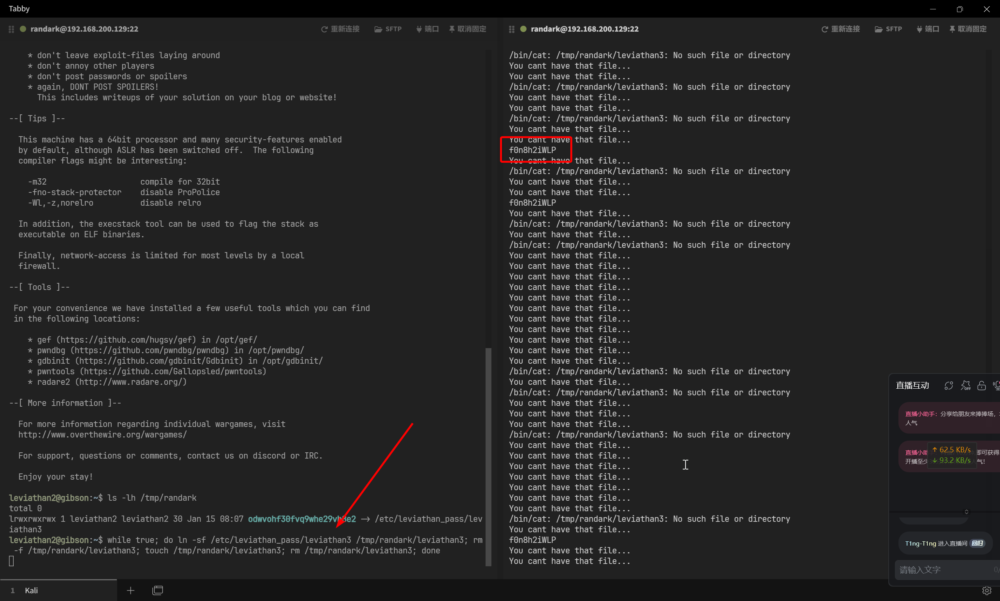
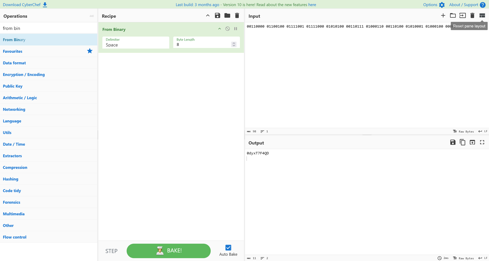

# Leviathan

:::info

Leviathan 是一款从 intruded.net 的消失中复兴的战争游戏，之前托管在 leviathan.intruded.net 上。非常感谢 adc、morla 和 reth 在复兴这款游戏中的帮助！

:::

## Level 0

```bash
┌──(randark ㉿ kali)-[~]
└─$ sshpass -p leviathan0 ssh leviathan0@leviathan.labs.overthewire.org -p 2223
leviathan0@gibson:~$ whoami
leviathan0
```

## Level 0 → Level 1

```bash
leviathan0@gibson:~$ ls -lah
total 24K
drwxr-xr-x  3 root       root       4.0K Sep 19 07:07 .
drwxr-xr-x 83 root       root       4.0K Sep 19 07:09 ..
drwxr-x---  2 leviathan1 leviathan0 4.0K Sep 19 07:07 .backup
-rw-r--r--  1 root       root        220 Mar 31  2024 .bash_logout
-rw-r--r--  1 root       root       3.7K Mar 31  2024 .bashrc
-rw-r--r--  1 root       root        807 Mar 31  2024 .profile
leviathan0@gibson:~$ cd .backup/
leviathan0@gibson:~/.backup$ ls -lah
total 140K
drwxr-x--- 2 leviathan1 leviathan0 4.0K Sep 19 07:07 .
drwxr-xr-x 3 root       root       4.0K Sep 19 07:07 ..
-rw-r----- 1 leviathan1 leviathan0 131K Sep 19 07:07 bookmarks.html
```

查看文件内容

```bash
leviathan0@gibson:~/.backup$ cat bookmarks.html | grep leviathan
<DT><A HREF="http://leviathan.labs.overthewire.org/passwordus.html | This will be fixed later, the password for leviathan1 is 3QJ3TgzHDq" ADD_DATE="1155384634" LAST_CHARSET="ISO-8859-1" ID="rdf:#$2wIU71">password to leviathan1</A>
```

## Level 1 → Level 2

```bash
┌──(randark ㉿ kali)-[~]
└─$ sshpass -p 3QJ3TgzHDq ssh leviathan1@leviathan.labs.overthewire.org -p 2223
leviathan1@gibson:~$ ls -lah
total 36K
drwxr-xr-x  2 root       root       4.0K Sep 19 07:07 .
drwxr-xr-x 83 root       root       4.0K Sep 19 07:09 ..
-rw-r--r--  1 root       root        220 Mar 31  2024 .bash_logout
-rw-r--r--  1 root       root       3.7K Mar 31  2024 .bashrc
-r-sr-x---  1 leviathan2 leviathan1  15K Sep 19 07:07 check
-rw-r--r--  1 root       root        807 Mar 31  2024 .profile
leviathan1@gibson:~$ ./check
password: 123
Wrong password, Good Bye ...
```

将这个程序下载到本地进行分析

```c
int __cdecl main(int argc, const char **argv, const char **envp)
{
    __uid_t v3; // ebx
    __uid_t v4; // eax
    char s1[4]; // [esp+0h] [ebp-24h] BYREF
    char s2[4]; // [esp+4h] [ebp-20h] BYREF
    int v8; // [esp+8h] [ebp-1Ch]
    char v9[12]; // [esp+Ch] [ebp-18h] BYREF
    unsigned int v10; // [esp+18h] [ebp-Ch]
    int *p_argc; // [esp+1Ch] [ebp-8h]

    p_argc = &argc;
    v10 = __readgsdword(0x14u);
    strcpy(s2, "sex");
    strcpy(&v9[5], "secret");
    v8 = 6582119;
    strcpy(v9, "love");
    printf("password:");
    s1[0] = getchar();
    s1[1] = getchar();
    s1[2] = getchar();
    s1[3] = 0;
    if (!strcmp(s1, s2) )
    {
        v3 = geteuid();
        v4 = geteuid();
        setreuid(v4, v3);
        system("/bin/sh");
    }
    else
    {
        puts("Wrong password, Good Bye ...");
    }
    return 0;
}
```

很明显，输入的数据比较的目标是 `sex`

明确逻辑之后，直接通过

```bash
leviathan1@gibson:~$ ./check
password: sex
$ whoami
leviathan2
$ cat /etc/leviathan_pass/leviathan2
NsN1HwFoyN
```

## Level 2 → Level 3

```bash
┌──(randark ㉿ kali)-[~]
└─$ sshpass -p NsN1HwFoyN ssh leviathan2@leviathan.labs.overthewire.org -p 2223
leviathan2@gibson:~$ ls -lh
total 16K
-r-sr-x--- 1 leviathan3 leviathan2 15K Sep 19 07:07 printfile
leviathan2@gibson:~$ ./printfile
*** File Printer ***
Usage: ./printfile filename
leviathan2@gibson:~$ ./printfile /etc/leviathan_pass/leviathan3
You cant have that file...
```

反编译看一下逻辑

```c
int __cdecl main(int argc, const char **argv, const char **envp)
{
    __uid_t v4; // ebx
    __uid_t v5; // eax
    const char **v6; // [esp+0h] [ebp-21Ch]
    char s[512]; // [esp+10h] [ebp-20Ch] BYREF
    unsigned int v8; // [esp+210h] [ebp-Ch]
    int *p_argc; // [esp+214h] [ebp-8h]

    p_argc = &argc;
    v6 = argv;
    v8 = __readgsdword(0x14u);
    if (argc> 1 )
    {
        if (access(argv[1], 4) )
        {
            puts("You cant have that file...");
            return 1;
        }
        else
        {
            snprintf(s, 0x1FFu, "/bin/cat %s", v6[1]);
            v4 = geteuid();
            v5 = geteuid();
            setreuid(v5, v4);
            system(s);
            return 0;
        }
    }
    else
    {
        puts("*** File Printer ***");
        printf("Usage: %s filename\n", *v6);
        return -1;
    }
}
```

很明显的，需要首先通过 `access(argv[1], 4)` 权限检查，通过权限检查之后，再执行 `snprintf(s, 0x1FFu, "/bin/cat %s", v6[1]);` 语句，那么就要涉及到条件竞争

可以考虑先创建一个普通的 `/tmp/randark/leviathan3` 文件，然后删除，再创建指向 `/etc/leviathan_pass/leviathan3` 的软链接

```bash
# Session 1
while true; do ./printfile /tmp/randark/leviathan3;done
# Session 2
while true; do ln -sf /etc/leviathan_pass/leviathan3 /tmp/randark/leviathan3; rm -f /tmp/randark/leviathan3; touch /tmp/randark/leviathan3; rm /tmp/randark/leviathan3; done
```



## Level 3 → Level 4

```bash
┌──(randark ㉿ kali)-[~]
└─$ sshpass -p f0n8h2iWLP ssh leviathan3@leviathan.labs.overthewire.org -p 2223
leviathan3@gibson:~$ ls -lh
total 20K
-r-sr-x--- 1 leviathan4 leviathan3 18K Sep 19 07:07 level3
leviathan3@gibson:~$ ./level3
Enter the password> 123
bzzzzzzzzap. WRONG
```

将程序下载到本地进行反编译分析

```c
int __cdecl main(int argc, const char **argv, const char **envp)
{
    char morenothing[7]; // [esp+1Ah] [ebp-2Eh] BYREF
    char kaka[7]; // [esp+21h] [ebp-27h] BYREF
    char other[10]; // [esp+28h] [ebp-20h] BYREF
    char kaka2[10]; // [esp+32h] [ebp-16h] BYREF
    unsigned int v8; // [esp+3Ch] [ebp-Ch]

    v8 = __readgsdword(0x14u);
    strcpy(other, "...s3cr3t");
    strcpy(morenothing, "h0no33");
    strcpy(kaka, "kakaka");
    strcpy(kaka2, "*32.2*[x]");
    strcmp(morenothing, kaka);
    printf("Enter the password>");
    do_stuff();
    return 0;
}
```

跟进 `do_stuff()` 函数

```c
__int64 do_stuff()
{
    __uid_t v0; // ebx
    __uid_t v1; // eax
    __int64 result; // rax
    char wtf[11]; // [esp+1h] [ebp-117h] BYREF
    char buf[256]; // [esp+Ch] [ebp-10Ch] BYREF
    unsigned int v5; // [esp+10Ch] [ebp-Ch]

    v5 = __readgsdword(0x14u);
    strcpy(wtf, "snlprintf\n");
    fgets(buf, 256, _bss_start);
    if (!strcmp(buf, wtf) )
    {
        puts("[You've got shell]!");
        v0 = geteuid();
        v1 = geteuid();
        setreuid(v1, v0);
        system("/bin/sh");
    }
    else
    {
        puts("bzzzzzzzzap. WRONG");
    }
    LODWORD(result) = 0;
    HIDWORD(result) = v5 - __readgsdword(0x14u);
    return result;
}
```

那就很简单了，硬编码的字符串比对

```bash
leviathan3@gibson:~$ ./level3
Enter the password> snlprintf
[You've got shell]!
$ whoami
leviathan4
$ cat /etc/leviathan_pass/leviathan4
WG1egElCvO
```

## Level 4 → Level 5

```bash
┌──(randark ㉿ kali)-[~]
└─$ sshpass -p WG1egElCvO ssh leviathan4@leviathan.labs.overthewire.org -p 2223
leviathan4@gibson:~$ ls -lah
total 24K
drwxr-xr-x  3 root root       4.0K Sep 19 07:07 .
drwxr-xr-x 83 root root       4.0K Sep 19 07:09 ..
-rw-r--r--  1 root root        220 Mar 31  2024 .bash_logout
-rw-r--r--  1 root root       3.7K Mar 31  2024 .bashrc
-rw-r--r--  1 root root        807 Mar 31  2024 .profile
dr-xr-x---  2 root leviathan4 4.0K Sep 19 07:07 .trash
leviathan4@gibson:~$ cd .trash/
leviathan4@gibson:~/.trash$ ls -lah
total 24K
dr-xr-x--- 2 root       leviathan4 4.0K Sep 19 07:07 .
drwxr-xr-x 3 root       root       4.0K Sep 19 07:07 ..
-r-sr-x--- 1 leviathan5 leviathan4  15K Sep 19 07:07 bin
leviathan4@gibson:~/.trash$ ./bin
00110000 01100100 01111001 01111000 01010100 00110111 01000110 00110100 01010001 01000100 00001010 
```

对其进行逆向分析

```c
int __cdecl main(int argc, const char **argv, const char **envp)
{
    char v4; // [esp+3h] [ebp-15h]
    size_t i; // [esp+4h] [ebp-14h]
    int j; // [esp+8h] [ebp-10h]
    FILE *stream; // [esp+Ch] [ebp-Ch]

    stream = fopen("/etc/leviathan_pass/leviathan5", "r");
    if ( !stream )
        return -1;
    fgets(buf, 256, stream);
    for ( i = 0; i < strlen(buf); ++i )
    {
        v4 = *(_BYTE *)(i + 134529088);
        for ( j = 0; j <= 7; ++j )
        {
            if ( v4 >= 0 )
                putchar(48);
            else
                putchar(49);
            v4 *= 2;
        }
        putchar(32);
    }
    putchar(10);
    return 0;
}
```

直接从二进制进行解码



```plaintext
0dyxT7F4QD
```

## Level 5 → Level 6

```bash
┌──(randark ㉿ kali)-[~]
└─$ sshpass -p 0dyxT7F4QD ssh leviathan5@leviathan.labs.overthewire.org -p 2223
leviathan5@gibson:~$ ls -lah
total 36K
drwxr-xr-x  2 root       root       4.0K Sep 19 07:07 .
drwxr-xr-x 83 root       root       4.0K Sep 19 07:09 ..
-rw-r--r--  1 root       root        220 Mar 31  2024 .bash_logout
-rw-r--r--  1 root       root       3.7K Mar 31  2024 .bashrc
-r-sr-x---  1 leviathan6 leviathan5  15K Sep 19 07:07 leviathan5
-rw-r--r--  1 root       root        807 Mar 31  2024 .profile
leviathan5@gibson:~$ ./leviathan5 
Cannot find /tmp/file.log
```

对其进行逆向分析

```c
int __cdecl main(int argc, const char **argv, const char **envp)
{
    __uid_t v3; // eax
    char v5; // [esp+Bh] [ebp-Dh]
    FILE *stream; // [esp+Ch] [ebp-Ch]

    stream = fopen("/tmp/file.log", "r");
    if ( !stream )
    {
        puts("Cannot find /tmp/file.log");
        exit(-1);
    }
    while ( 1 )
    {
        v5 = fgetc(stream);
        if ( feof(stream) )
        break;
        putchar(v5);
    }
    fclose(stream);
    v3 = getuid();
    setuid(v3);
    unlink("/tmp/file.log");
    return 0;
}
```

很简单，就是一个软链接的判断

```bash
leviathan5@gibson:~$ ln -s /etc/leviathan_pass/leviathan6 /tmp/file.log
leviathan5@gibson:~$ ./leviathan5 
szo7HDB88w
```

## Level 6 → Level 7

```bash
┌──(randark ㉿ kali)-[~]
└─$ sshpass -p szo7HDB88w ssh leviathan6@leviathan.labs.overthewire.org -p 2223
leviathan6@gibson:~$ ls -lah
total 36K
drwxr-xr-x  2 root       root       4.0K Sep 19 07:07 .
drwxr-xr-x 83 root       root       4.0K Sep 19 07:09 ..
-rw-r--r--  1 root       root        220 Mar 31  2024 .bash_logout
-rw-r--r--  1 root       root       3.7K Mar 31  2024 .bashrc
-r-sr-x---  1 leviathan7 leviathan6  15K Sep 19 07:07 leviathan6
-rw-r--r--  1 root       root        807 Mar 31  2024 .profile
leviathan6@gibson:~$ ./leviathan6 
usage: ./leviathan6 <4 digit code>
```

继续逆向分析

```c
int __cdecl main(int argc, const char **argv, const char **envp)
{
    __uid_t v3; // ebx
    __uid_t v4; // eax

    if ( argc != 2 )
    {
        printf("usage: %s <4 digit code>\n", *argv);
        exit(-1);
    }
    if ( atoi(argv[1]) == 7123 )
    {
        v3 = geteuid();
        v4 = geteuid();
        setreuid(v4, v3);
        system("/bin/sh");
    }
    else
    {
        puts("Wrong");
    }
    return 0;
}
```

也是很简单的固定值判断

```bash
leviathan6@gibson:~$ ./leviathan6 7123
$ whoami
leviathan7
$ cat /etc/leviathan_pass/leviathan7
qEs5Io5yM8
```

## Level 7

Congratulations
