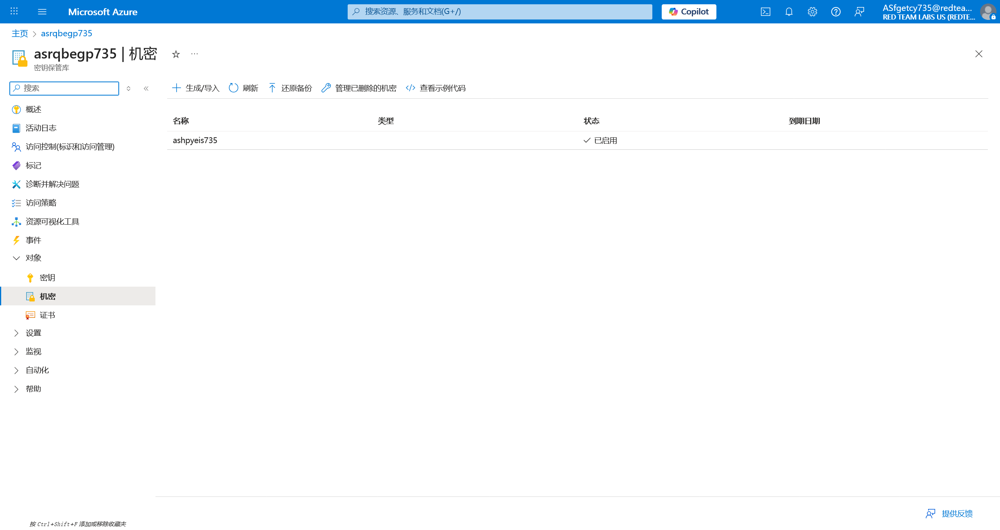

# Key Vault 04 - Subdomain Enumeration for Key Vault

> Subdomain Enumeration for Key Vault

:::info

**Scenario**

A key vault service has its own URL, we could check if a tenant or organization uses a key vault service through subdomain enumeration. Find and extract flag value from key vault through subdomain enumeration.

**Overview**

What is Azure key vault?

A Key Vault is a secure cloud service in Azure that allows us to safeguard and manage cryptographic keys, secrets, and certificates. It provides a centralized location for storing and managing sensitive information used by our applications and services.

What is subdomain enumeration?

Subdomain enumeration, also known as subdomain discovery or subdomain reconnaissance, is the process of identifying and mapping subdomains associated with a domain name.

**Hint**

- Subdomain reconnaissance.

**Impact**

- Due to high privileges to the user, the user was  able to view the key vault secret.

**Reference**

- [Azure Key Vault Docs](https://learn.microsoft.com/en-us/azure/key-vault/general/overview)
- [Microburst](https://github.com/NetSPI/MicroBurst)
- [Azure Key Vault Secrets](https://learn.microsoft.com/en-us/azure/key-vault/general/about-keys-secrets-certificates)
- [Az PowerShell](https://learn.microsoft.com/en-us/powershell/azure/new-azureps-module-az?view=azps-10.4.1)

:::

题目中已经给出了 KeyVaultName 这一关键信息

其实在界面中也可以看到


在其 对象-机密 中可以看到目标



查看其详情


只存在有一个版本，查看具体内容


:::info Flags

<details>

<summary> What is the flag value we obtained from key vault secret using subdomain enumeration technique? </summary>

```plaintext
asyfrihk735asaxgthd735
```

</details>

:::
