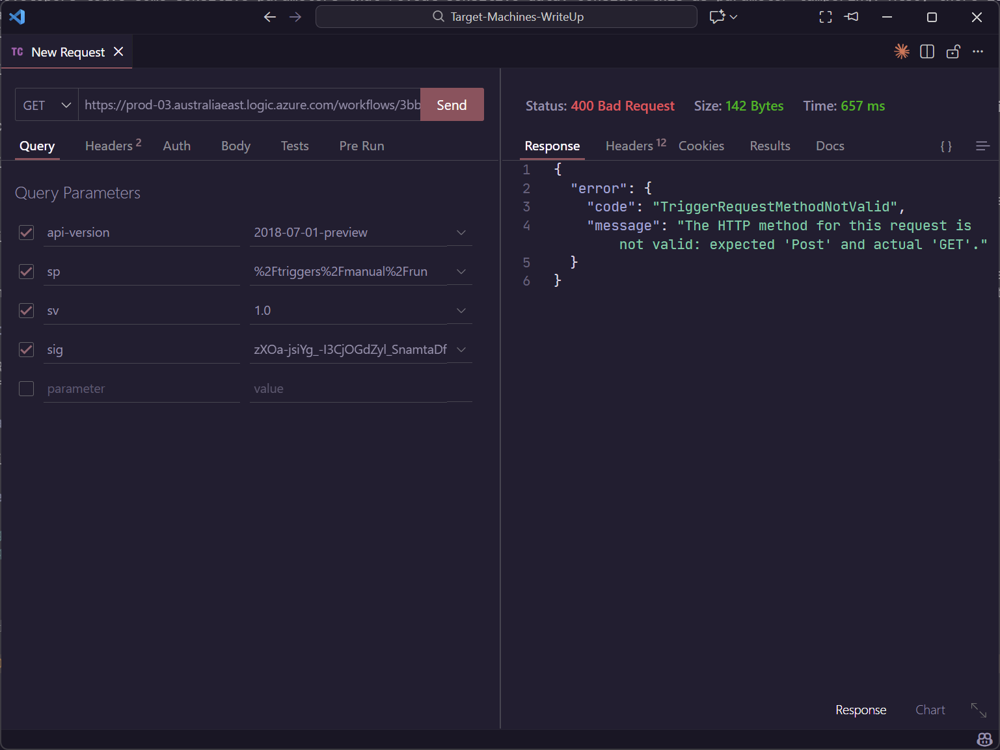
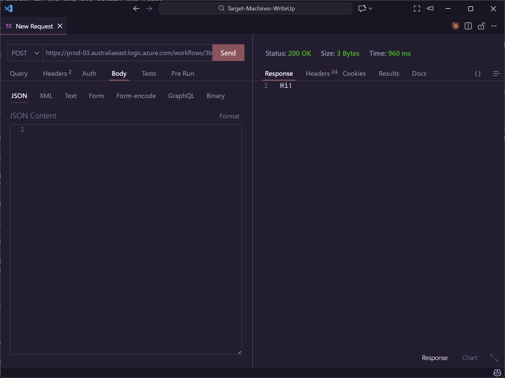

# Logic App 02 - Tamper Trigger Parameter and Request

> Tamper Trigger Parameter and Request

:::info

**Scenario**

Some developers leave some sensitive parameters that reveal sensitive data. Consider this as parameter tampering. Also, there is more than one method to send a request. Find the parameter in the URL and obtain the flag.
Overview

What is a logic app?

Azure Logic Apps is a cloud-based service provided by Microsoft Azure that allows us to create and run automated workflows and integrate various applications, systems, and services.

What is Requests trigger?

Azure Logic Apps, the "Requests" trigger is a commonly used trigger that allows us to initiate a workflow whenever an HTTP request is received.

What is IDOR?

IDOR, or Insecure Direct Object Reference, is a type of security vulnerability that occurs when an application provides direct access to objects based on user-supplied input. In simpler terms, it means that an attacker can manipulate input, such as URLs or form parameters, to gain unauthorized access to data.

**Hint**

- IDORs are common web application vulnerabilities.
- Different types of methods in a web request.

**Impact**

- Logic app using request trigger with parameter here acted as an IDOR vulnerability. When triggered with the "admin" parameter the logic app revealed sensitive data.

**Reference**

- [Logic Apps Docs](https://learn.microsoft.com/en-us/azure/logic-apps/logic-apps-overview)
- [Request/ Response](https://learn.microsoft.com/en-us/azure/connectors/connectors-native-reqres?tabs=consumption)

:::

题目给出的是一个 TriggerURL



将请求方式改为 POST 看看



在请求的 URL 中，注意到特殊之处


将 `{name}` 改为 `test` 之后


那么目标就很明确了，改为 `admin`


:::info Flags

<details>

<summary> Which HTTP method request to the endpoint revealed the flag value? (GET or POST) </summary>

```plaintext
POST
```

<summary>  What is the flag value we obtain ? </summary>

```plaintext
asobtaxp735astkjnql735
```

</details>

:::
