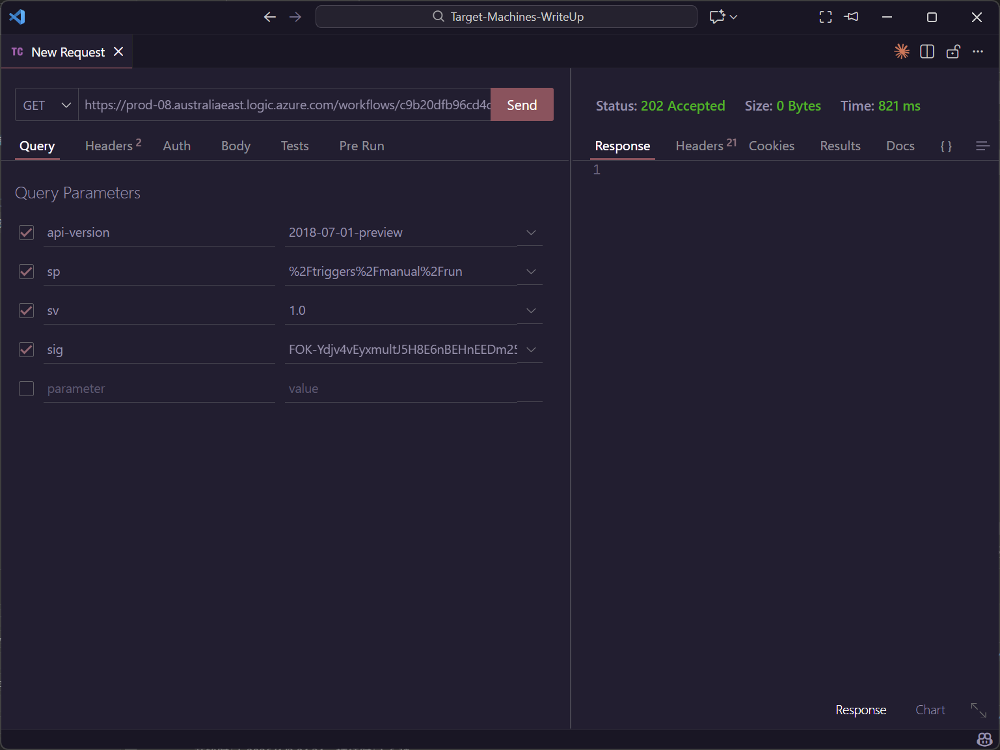
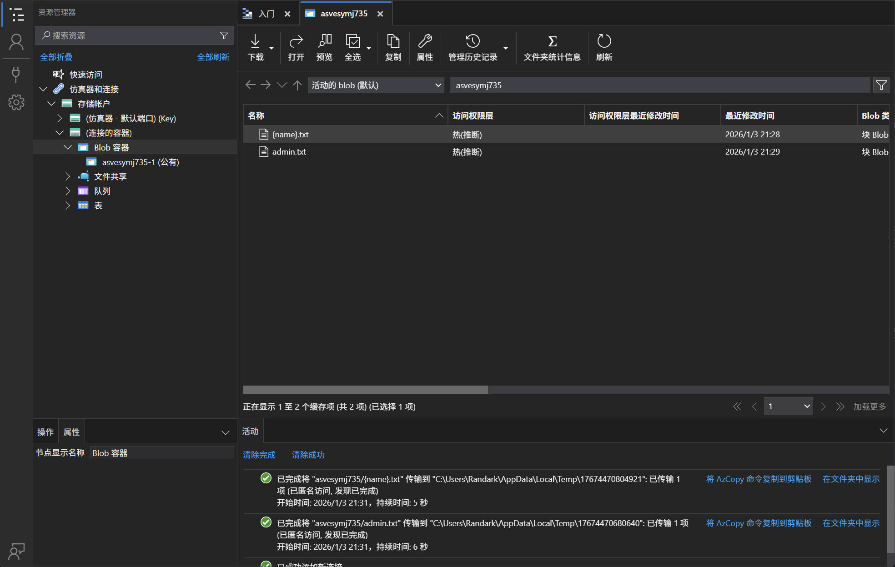
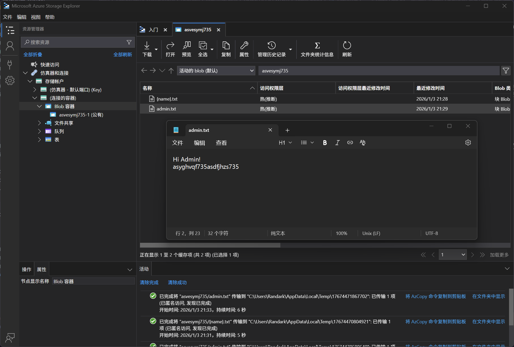

# Logic App 03 - Tamper Trigger Parameter and Abuse Storage Container

> Tamper Trigger Parameter and Abuse Storage Container

:::info

**Scenario**

In certain scenarios, a logic app might trigger and reveal sensitive data. Leverage this information to obtain the flag.

**Overview**

What is a logic app?

Azure Logic Apps is a cloud-based service provided by Microsoft Azure that allows us to create and run automated workflows and integrate various applications, systems, and services.

What is Requests trigger?

Azure Logic Apps, the "Requests" trigger is a commonly used trigger that allows us to initiate a workflow whenever an HTTP request is received.

What is IDOR?

IDOR, or Insecure Direct Object Reference, is a type of security vulnerability that occurs when an application provides direct access to objects based on user-supplied input. In simpler terms, it means that an attacker can manipulate input, such as URLs or form parameters, to gain unauthorized access to data.

**Hint**

- IDORs are common web application vulnerabilities.
- Different types of methods in a web request.

**Impact**

- Logic app using request trigger with parameter here acted as an IDOR vulnerability. When triggered with the "admin" parameter the logic app revealed sensitive data.

**Reference**

- [Logic Apps Docs](https://learn.microsoft.com/en-us/azure/logic-apps/logic-apps-overview)
- [Storage Blob Docs](https://learn.microsoft.com/en-us/azure/storage/blobs/storage-blobs-overview)
- [Azure Storage Explorer](https://azure.microsoft.com/en-in/products/storage/storage-explorer)
- [Blob Storage Connector](https://learn.microsoft.com/en-us/azure/connectors/connectors-create-api-azureblobstorage?tabs=consumption)
- [Request/ Response Connector](https://learn.microsoft.com/en-us/azure/connectors/connectors-native-reqres?tabs=consumption)

:::

题目给出了 TriggerURL 和 ContainerURL 两个信息

```plaintext title="TriggerURL"
https://prod-08.australiaeast.logic.azure.com/workflows/c9b20dfb96cd4cfc97c406e22da01991/triggers/manual/paths/invoke/%7Bname%7D?api-version=2018-07-01-preview&sp=%2Ftriggers%2Fmanual%2Frun&sv=1.0&sig=FOK-Ydjv4vEyxmultJ5H8E6nBEHnEEDm25TeZe2dS6E
```

尝试将 `{name}` 参数改为 `amdin` 发起请求



并没有得到任何信息

尝试对另外一个信息 ContainerURL 进行探测

根据其名字，直接使用 Blob Container 方式进行连接



在`admin.txt`中得到

```plaintext
Hi Admin!
asyghvqf735asdfjhzs735
```



:::info Flags

<details>

<summary> In which storage account service did we find the flag value? (Container, Queue, Table or File) </summary>

```plaintext
Container
```

</details>

<details>

<summary> What is the flag value we obtain ? </summary>

```plaintext
asyghvqf735asdfjhzs735
```

</details>

:::
