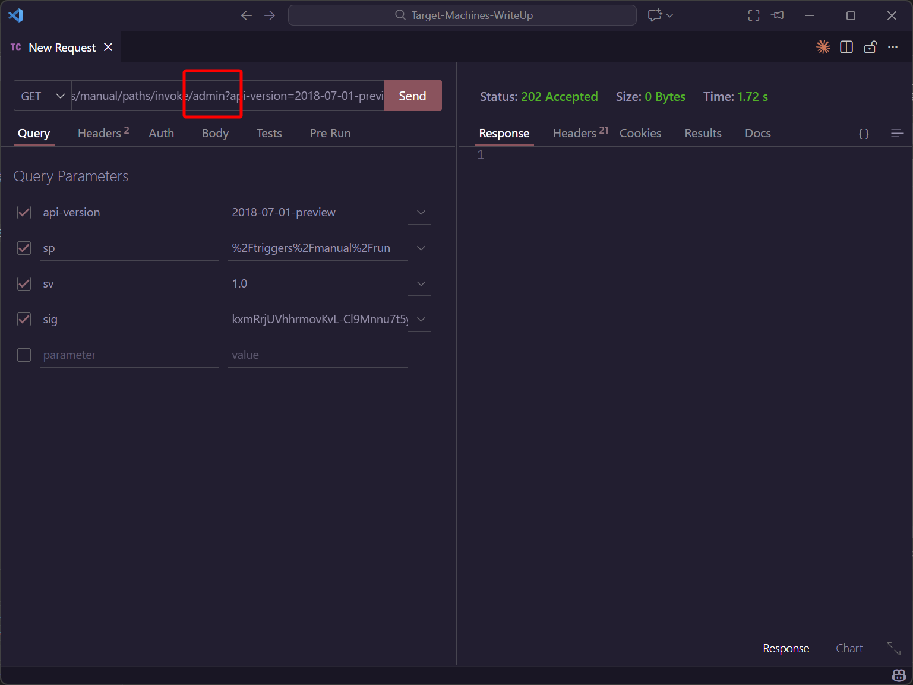
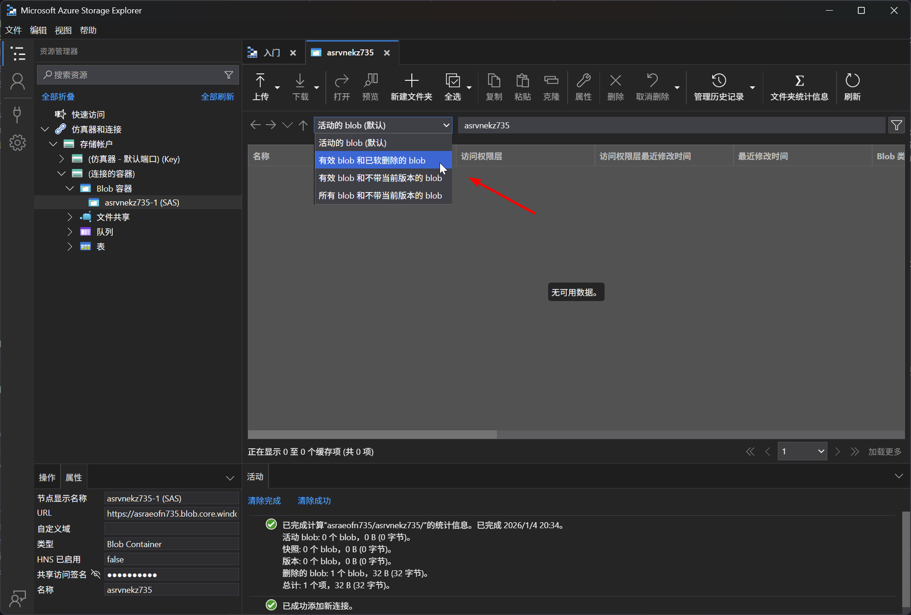

# Logic App 14 - Abuse Action and Storage Container Recovery

> Abuse Action and Storage Container Recovery

:::info

**Scenario**

Logic apps use connectors that perform defined actions when triggered, which when misconfigured or when the trigger URL is exposed could reveal sensitive data. Abuse the storage blob connector and obtain the flag.

**Overview**

What is SAS URL (Shared Access Signature URL)?

A SAS URL (Shared Access Signature URL) is a URL that contains a shared access signature token. It allows secure access to specific resources within an Azure Storage account for a limited period, without requiring the account key. SAS URLs provide us with a way to grant granular access permissions to clients or applications without exposing the storage account keys.

**Hint**

- Get deleted items.

**Impact**

- Previously soft-deleted sensitive files could contain sensitive data which could be used to increase the attack surface of the target.

**Reference**

- [Logic Apps Docs](https://learn.microsoft.com/en-us/azure/logic-apps/logic-apps-overview)
- [Storage Blob Docs](https://learn.microsoft.com/en-us/azure/storage/blobs/storage-blobs-overview)
- [Azure Storage Explorer](https://azure.microsoft.com/en-in/products/storage/storage-explorer)
- [Azure Blob Storage Connector](https://learn.microsoft.com/en-us/azure/connectors/connectors-create-api-azureblobstorage?tabs=consumption)
- [Shared Access Signature](https://learn.microsoft.com/en-us/azure/storage/common/storage-sas-overview)

:::

题目给出了 TriggerURL 和 ContainerSASURL

首先连接到 Blob Container 发现里面没有数据


尝试触发 TriggerURL



查看Blob颗粒的设置



恢复选中项


即可得到


:::info Flags

<details>

<summary> What was the data protection feature used by the storage container for blobs in this challenge? (blob versioning or soft delete) </summary>

```plaintext
soft delete
```

</details>

<details>

<summary> What is the flag value we obtain ? </summary>

```plaintext
asohvmtl735asmcexhf735
```

</details>

:::
