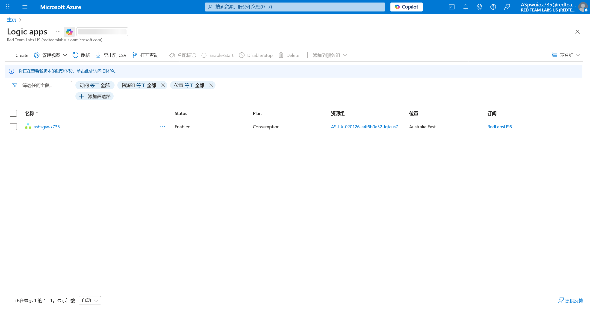

# Logic App 16 - Sensitive Info in Workflow

> Sensitive Info in Workflow

:::info

**Scenario**

In certain scenarios, the user we compromised might own the logic app or have permission to read the workflow of the logic app which can reveal sensitive data. Abuse the user permissions and obtain the flag.

**Overview**

What is logic app workflow?

A logic app workflow is a visual representation and implementation of a business process or integration scenario in Azure Logic Apps. It defines the steps, actions, and conditions that are executed in a specific sequence to automate a particular workflow.

**Hint**

- Sometimes code contains interesting stuff.

**Impact**

- Sometimes sensitive data could be hard-coded into code or template files which could be leaked.

**Reference**

- [Logic Apps Docs](https://learn.microsoft.com/en-us/azure/logic-apps/logic-apps-overview)

:::

使用所给出的凭据登录 [Azure](https://portal.azure.com/)

在 Logic apps 中可以看到



查看详情


进入 Edit 界面


可以得到Response 的 Body

```plaintext
Hi! astrikws735asrvyjzd735
```

:::info Flags

<details>

<summary> Where can we access the code/ workflow of the logic app? (Code view or Designer) </summary>

```plaintext
Code view
```

</details>

<details>

<summary> What is the flag value we obtain ? </summary>

```plaintext
astrikws735asrvyjzd735
```

</details>

:::
