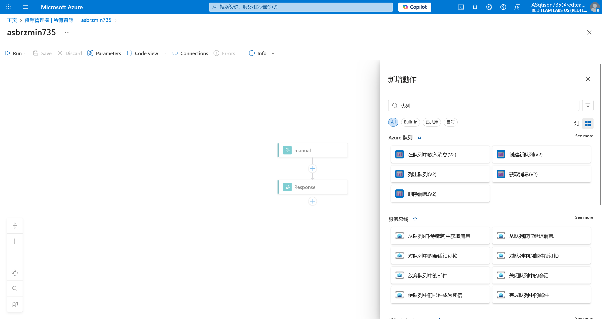

# Logic App 18 - Modify Workflow and Abuse Storage Queue

> Modify Workflow and Abuse Storage Queue

:::info

**Scenario**

Sometimes the user whom we compromised can have permission to edit the workflow of the logic app. Abuse the permission of the user on the logic and read the flag from the storage queue.

**Overview**

What is logic app workflow?

A logic app workflow is a visual representation and implementation of a business process or integration scenario in Azure Logic Apps. It defines the steps, actions, and conditions that are executed in a specific sequence to automate a particular workflow.

**Hint**

- make use of the queue connector actions.

**Impact**

- With appropriate permissions on the logic app we could manipulate the logic app to interact with other services and perform malicious activity.

**Reference**

- [Logic Apps Docs](https://learn.microsoft.com/en-us/azure/logic-apps/logic-apps-overview)
- [Storage Queues Docs](https://learn.microsoft.com/en-us/azure/storage/queues/storage-queues-introduction)
- [Azure Queue Connector](https://learn.microsoft.com/en-us/connectors/azurequeues/)

:::

题目给出了 UserCreds 信息，直接登录，查看所有资源


跟前一题一样，着手编辑 Logic app 的执行流程


添加对 Azure 队列的操作



将获取的数据插入返回包中


保存对Logic app的修改之后，触发Logic app


:::info Flags

<details>

<summary> Which storage queue logic app connector (ignore the version) did we use to fetch the flag? (Get blob content or Get Messages) </summary>

```plaintext
Get Messages
```

</details>

<details>

<summary> What is the flag value we obtain ? </summary>

```plaintext
asgqefob735asbmlpwy735
```

</details>

:::
