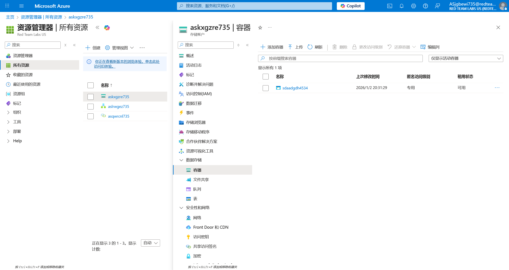
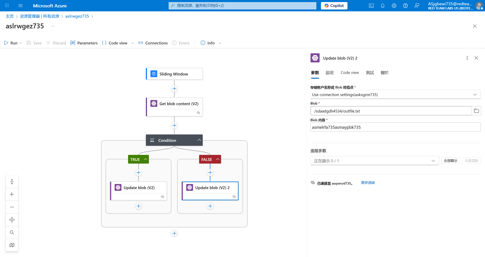

# Logic App 23 - Sliding Window Trigger and Storage Blob

> Sliding Window Trigger and Storage Blob

:::info

**Scenario**

In certain scenarios, a logic app can be triggered in multiple ways and that could reveal sensitive data. Leverage this information to obtain the flag from the blob.

**Overview**

What is logic app workflow?

A logic app workflow is a visual representation and implementation of a business process or integration scenario in Azure Logic Apps. It defines the steps, actions, and conditions that are executed in a specific sequence to automate a particular workflow.

**Hint**

- Sliding window trigger in place.

**Impact**

- Sometimes previous blob versions may contain sensitive data that could increase the attack surface of the target.

**Reference**

- [Logic Apps Docs](https://learn.microsoft.com/en-us/azure/logic-apps/logic-apps-overview)
- [Azure Blob Storage Docs](https://learn.microsoft.com/en-us/azure/storage/blobs/storage-blobs-overview)
- [Azure Blob Storage Connector](https://learn.microsoft.com/en-us/connectors/azureblob/)

:::

使用题目给出的 UserCreds 信息登录 Azure 后，查看所有资源


根据题目说明，查看 Blob Container



查看其中文件的历史版本


可以很容易看到不同的文件大小


但是其中并不存在 flag

实际上 flag 位于 Logic app 中



:::info Flags

<details>

<summary> In which storage account object did we get the flag? (Blob or Container) </summary>

```plaintext
Blob
```

</details>

<details>

<summary> What is the flag value we obtain ? </summary>

```plaintext
asmelrfa735asmaypbk735
```

</details>

:::
