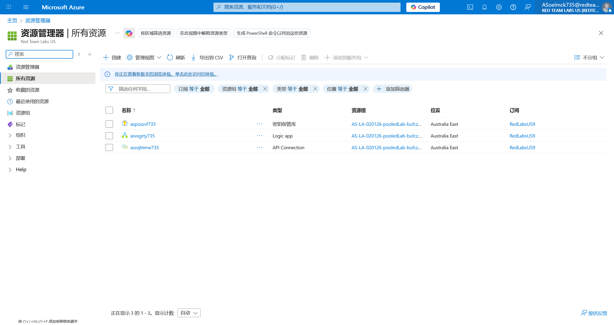
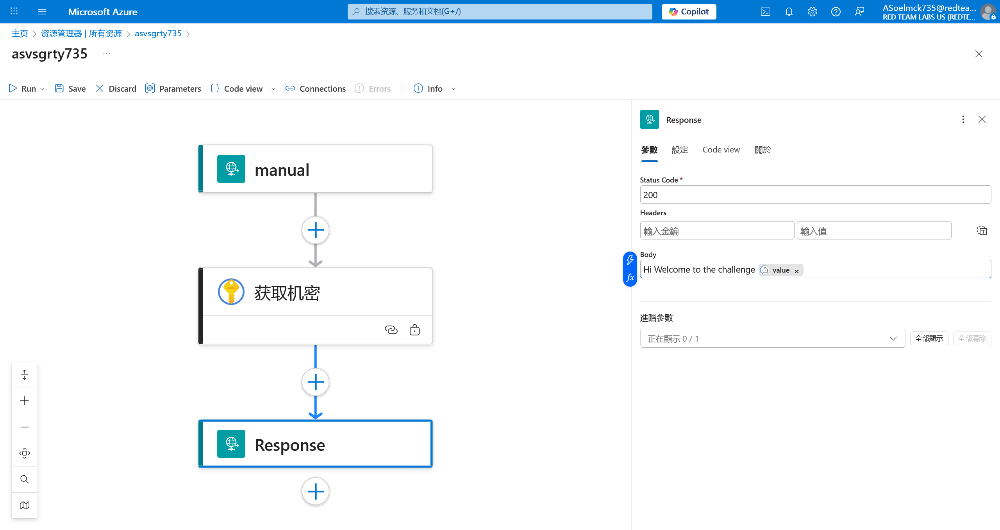
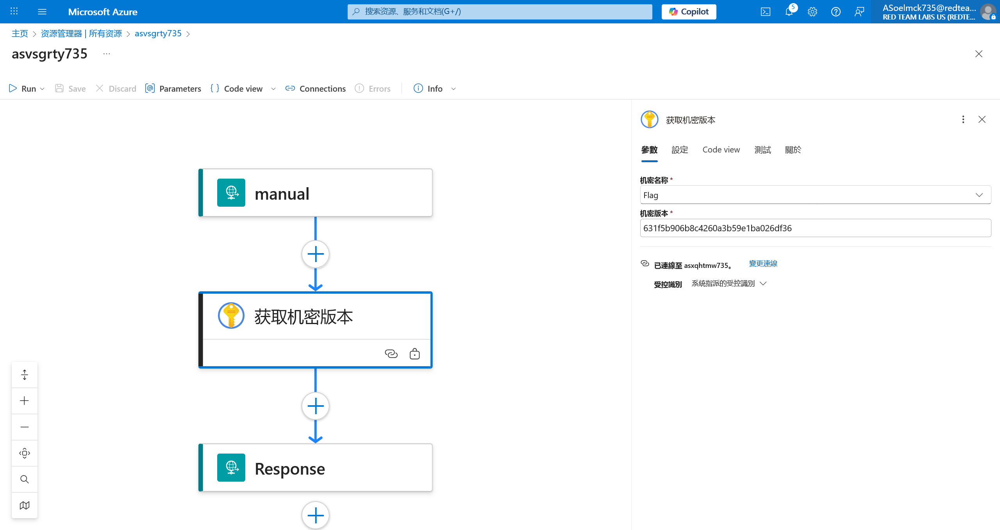

# Logic App 24 - Modify Workflow and Key Vault Version

> Modify Workflow and Key Vault Version

:::info

**Scenario**

In certain scenarios, a logic app can be triggered in multiple ways and that could reveal sensitive data. Leverage this information to obtain the flag from the key vault.

**Overview**

What is logic app workflow?

A logic app workflow is a visual representation and implementation of a business process or integration scenario in Azure Logic Apps. It defines the steps, actions, and conditions that are executed in a specific sequence to automate a particular workflow.

**Hint**

- make use of the key vault connector action.

**Impact**

- Sometimes key vault secrets versions contain sensitive credentials that could be utilized to increase the attack surface and access new or legacy applications.

**Reference**

- [Logic Apps Docs](https://learn.microsoft.com/en-us/azure/logic-apps/logic-apps-overview)
- [Azure Key Vault Docs](https://learn.microsoft.com/en-us/azure/key-vault/general/overview)
- [Azure Key Vault Connector](https://learn.microsoft.com/en-us/connectors/keyvault/)

:::

使用题目给出的 UserCreds 信息登录 Azure 后，查看所有资源



打开 Logic app的编辑界面


在其中添加获取Key Vault的操作


并将获取的机密附加到返回包中



尝试触发Logic app


更改一下，查看当前完整的Key Vault


查看完整的历史


触发 Logic app


```json
{
    "value": [
        {
            "name": "Flag",
            "version": "631f5b906b8c4260a3b59e1ba026df36",
            "contentType": null,
            "isEnabled": true,
            "createdTime": "2026-01-02T12:31:38Z",
            "lastUpdatedTime": "2026-01-02T12:31:38Z",
            "validityStartTime": null,
            "validityEndTime": null
        },
        {
            "name": "Flag",
            "version": "cf64ec29f21349e1be817c051b9325cf",
            "contentType": null,
            "isEnabled": true,
            "createdTime": "2026-01-02T12:31:39Z",
            "lastUpdatedTime": "2026-01-02T12:31:39Z",
            "validityStartTime": null,
            "validityEndTime": null
        }
    ],
    "continuationToken": null
}
```

尝试读取另外一个版本



成功得到 flag


:::info Flags

<details>

<summary> Which key vault logic app connector did we use to list the key vault versions? (Get versions or List secret versions) </summary>

```plaintext
List secret versions
```

</details>

<details>

<summary> Which key vault logic app connector did we use to fetch the flag? (Get versions or Get secret version) </summary>

```plaintext
Get secret version
```

</details>

<details>

<summary> What is the flag value we obtain ? </summary>

```plaintext
astrnlxb735aswmgzil735
```

</details>

:::
