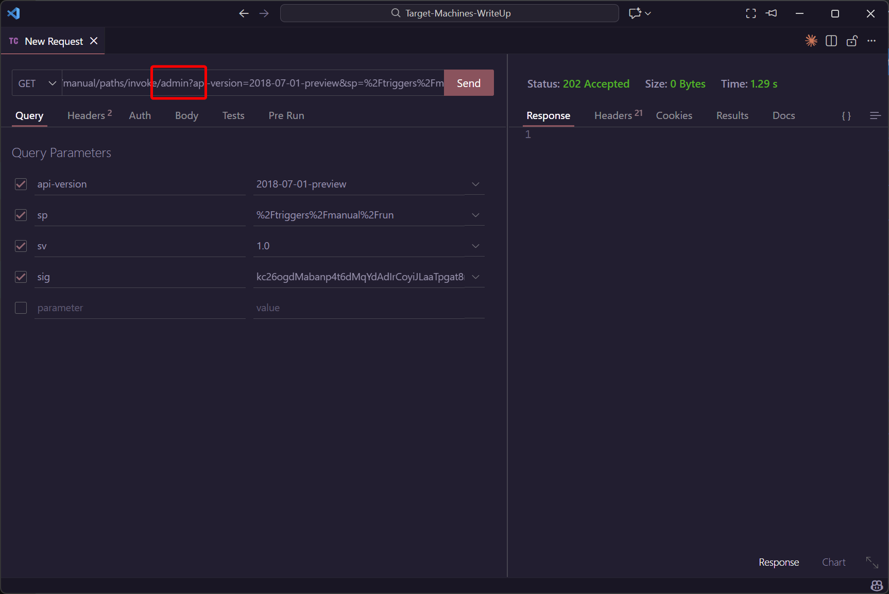

# Logic App 06 - Tamper Trigger Parameter and Abuse Storage File

> Tamper Trigger Parameter and Abuse Storage File

:::info

**Scenario**

Logic apps use connectors that perform defined actions when triggered, which when misconfigured or when the trigger URL is exposed could reveal sensitive data. Abuse the exposed trigger URL and obtain the flag.

**Overview**

What is SAS URL (Shared Access Signature URL)?

A SAS URL (Shared Access Signature URL) is a URL that contains a shared access signature token. It allows secure access to specific resources within an Azure Storage account for a limited period, without requiring the account key. SAS URLs provide us with a way to grant granular access permissions to clients or applications without exposing the storage account keys.

**Hint**

- Access resources without exposing keys.

**Reference**

- [Logic Apps Docs](https://learn.microsoft.com/en-us/azure/logic-apps/logic-apps-overview)
- [Azure Files Docs](https://learn.microsoft.com/en-us/azure/storage/files/storage-files-introduction)
- [Azure Storage Explorer](https://azure.microsoft.com/en-in/products/storage/storage-explorer)
- [Azure File Share Connector](https://learn.microsoft.com/en-us/connectors/azurefile/)

:::

题目给出了 TriggerURL 和 FileSASURL 两个信息

如法炮制，先触发 TriggerURL



再访问 FileSASURL


:::info Flags

<details>

<summary> In which storage account service did we find the flag value? (Container, Queue, Table or File) </summary>

```plaintext
File
```

</details>

<details>

<summary> What is the flag value we obtain ? </summary>

```plaintext
asitzbau735astlmvgs735
```

</details>

:::
