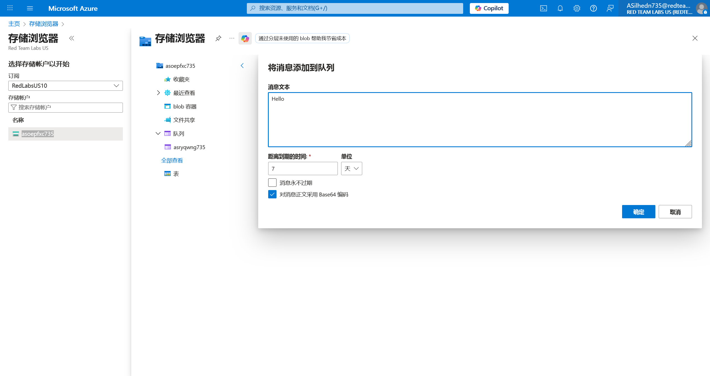

# Logic App 07 - Storage Queue Message (Count) Trigger

> Storage Queue Message (Count) Trigger

:::info

**Scenario**

Logic apps use connectors that perform defined actions when triggered, which when misconfigured or when the trigger URL is exposed could reveal sensitive data. Abuse the storage queue message connector and obtain the flag.

**Overview**

What is Queue message-based trigger? When a new message is added to the queue, the "Queue" trigger activates the Logic App and starts the workflow execution. It acts as the starting point for the workflow.

**Hint**

- Number of messages in the queue.

**Reference**

- [Logic Apps Docs](https://learn.microsoft.com/en-us/azure/logic-apps/logic-apps-overview)
- [Storage Queues Docs](https://learn.microsoft.com/en-us/azure/storage/queues/storage-queues-introduction)
- [Azure Storage Queue Connector](https://learn.microsoft.com/en-us/connectors/azurequeues/)

:::

题目只给出了 TriggerURL 这一信息，但是实际给出的是一个凭据，直接登录就完事了

在 Storage Explorer 中可以看到存在有一个Queue


结合题目信息，在其中添加多条信息



等待片刻，即可收到


:::info Flags

<details>

<summary> In which storage account service did we find the flag value? (Container, Queue, Table or File) </summary>

```plaintext
Queue
```

</details>

<details>

<summary> What is the flag value we obtain ? </summary>

```plaintext
asxmqsbl735asbxgloh735
```

</details>

:::
