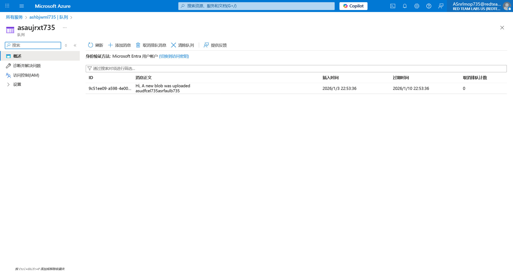

# Logic App 11 - Abusing Storage Container (Modify) Trigger

> Abusing Storage Container (Modify) Trigger

:::info

**Scenario**

Logic apps use connectors that perform defined actions when triggered, which when misconfigured or when the trigger URL is exposed could reveal sensitive data. Abuse the storage blob connector and obtain the flag.

**Overview**

What is blob trigger?

The "Blob" trigger is a type of trigger that allows us to initiate a workflow whenever a new or modified blob (file) is detected within a specified Azure Blob storage container.

**Hint**

- modify it and I will show you something.

**Reference**

- [Logic Apps Docs](https://learn.microsoft.com/en-us/azure/logic-apps/logic-apps-overview)
- [Storage Queues Docs](https://learn.microsoft.com/en-us/azure/storage/queues/storage-queues-introduction)
- [Storage Blob Docs](https://learn.microsoft.com/en-us/azure/storage/blobs/storage-blobs-overview)
- [Azure Blob Storage Connector](https://learn.microsoft.com/en-us/connectors/azureblob/)

:::

照例，题目给出了 UserCreds 信息

根据题目的说明，在 Blob 中对文件进行修改


稍等片刻，即可在 Queue 得到消息



:::info Flags

<details>

<summary> In which storage account service did we find the flag value? (Container, Queue, Table or File) </summary>

```plaintext
Container
```

</details>

<details>

<summary> What is the flag value we obtain ? </summary>

```plaintext
asudfcel735asrfaulb735
```

</details>

:::
