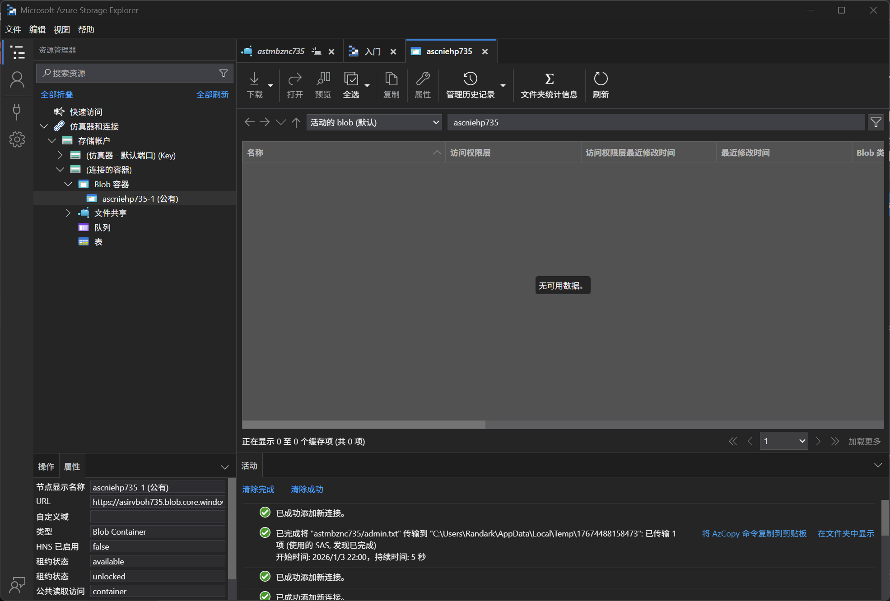

# Logic App 13 - Abuse Action and Storage Container Version

> Abuse Action and Storage Container Version

:::info

**Scenario**

Logic apps use connectors that perform defined actions when triggered, which when misconfigured or when the trigger URL is exposed could reveal sensitive data. Abuse the storage blob connector and obtain the flag.

**Overview**

What is a logic app?

Azure Logic Apps is a cloud-based service provided by Microsoft Azure that allows us to create and run automated workflows and integrate various applications, systems, and services.

What is Requests trigger?

Azure Logic Apps, the "Requests" trigger is a commonly used trigger that allows us to initiate a workflow whenever an HTTP request is received.

What are logic App actions?

Logic App actions are individual steps or tasks that we can include within a Logic App workflow. These actions are predefined operations that perform specific functions or interact with various services, systems, or APIs. By combining multiple actions, we can create powerful and automated workflows to integrate different applications and services.

**Hint**

- Each version comes with a different update.

**Impact**

- Due to versioning enabled in blob as a data protection feature leaked previously-stored sensitive data.

**Reference**

- [Logic Apps Docs](https://learn.microsoft.com/en-us/azure/logic-apps/logic-apps-overview)
- [Storage Blob Docs](https://learn.microsoft.com/en-us/azure/storage/blobs/storage-blobs-overview)
- [Azure Storage Explorer](https://azure.microsoft.com/en-in/products/storage/storage-explorer)
- [Azure Blob Storage Connector](https://learn.microsoft.com/en-us/connectors/azureblob/)

:::

题目这次给出了 TriggerURL 和 ContainerURL 两个信息

首先连接到 Blob Container中，没有数据



尝试将 `{admin}` 更改为 `admin` 触发 TriggerURL


触发后，在 Blob Container 中出现了新文件


访问历史记录


:::info Flags

<details>

<summary> What was the data protection feature used by the storage container in this challenge? (blob versioning or soft delete) </summary>

```plaintext
blob versioning
```

</details>

<details>

<summary> What is the flag value we obtain ? </summary>

```plaintext
asdcwarq735asulgwjt735
```

</details>

:::
