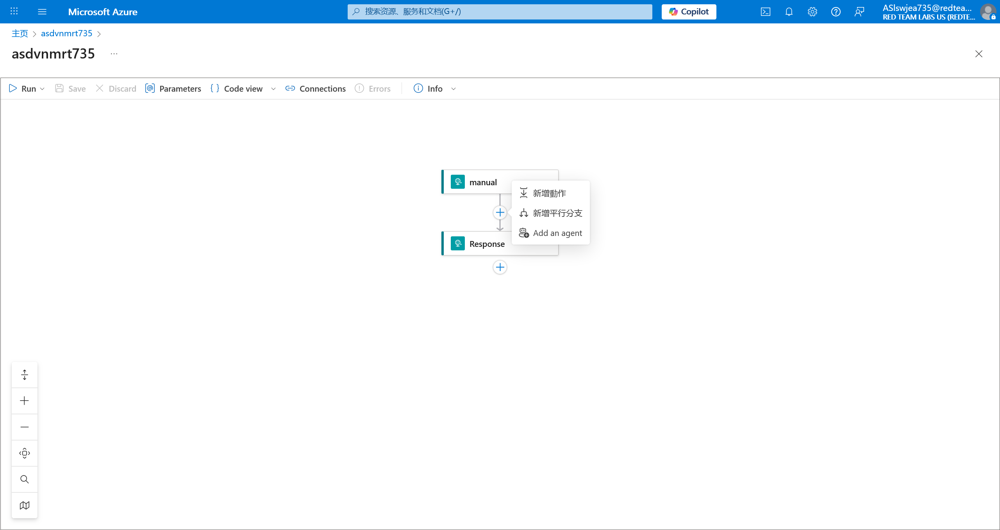

# Logic App 17 - Modify Workflow and Abuse Storage Blob

> Modify Workflow and Abuse Storage Blob

:::info

**Scenario**

Sometimes the user whom we compromised can have permission to edit the workflow of the logic app. Abuse the permission of the user on the logic and read the flag from the blob.

**Overview**

What is logic app workflow?

A logic app workflow is a visual representation and implementation of a business process or integration scenario in Azure Logic Apps. It defines the steps, actions, and conditions that are executed in a specific sequence to automate a particular workflow.

**Hint**

- make use of the blob connector action.

**Impact**

- With appropriate permissions in the logic app we could manipulate the logic app to interact with other services and perform malicious activity.

**Reference**

- [Logic Apps Docs](https://learn.microsoft.com/en-us/azure/logic-apps/logic-apps-overview)
- [Storage Blob Docs](https://learn.microsoft.com/en-us/azure/storage/blobs/storage-blobs-overview)
- [Logic App Workflow Designer](https://learn.microsoft.com/en-us/azure/logic-apps/designer-overview)
- [Blob Storage Connector](https://learn.microsoft.com/en-us/connectors/azureblob/)

:::

题目给出了 UserCreds 信息，登陆查看所有资源


经过探测，当前账户没有操作 Blob Container 的权限


但是借助 Logic app 的权限，可以尝试获取 Blob Container 的数据

在 Logic app 中，进入 Edit 界面


在其中新增动作



选择 获取 Blob 内容


设置所要读取的数据


然后将获得的数据进行输出

、

查看触发器的 URL


别忘记点击 **Save** 按钮！！

对其进行请求，即可获得


:::info Flags

<details>

<summary> Which storage blob logic app connector (ignore the version) did we use to fetch the flag? (Get blob content or Get Messages) </summary>

```plaintext
Get blob content
```

</details>

<details>

<summary> What is the flag value we obtain ? </summary>

```plaintext
assoqawv735aszrkqya735
```

</details>

:::
