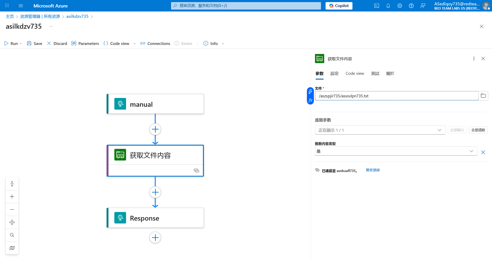
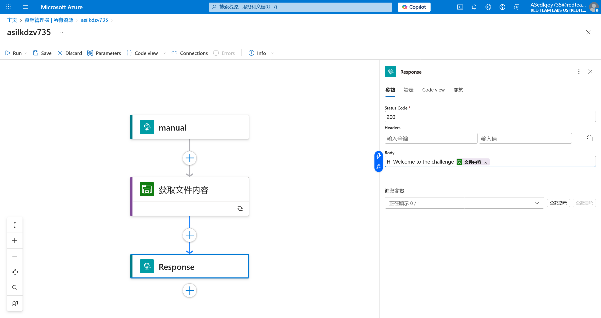

# Logic App 19 - Modify Workflow and Abuse Storage File

> Modify Workflow and Abuse Storage File

:::info

**Scenario**

Sometimes the user whom we compromised can have permission to edit the workflow of the logic app. Abuse the permission of the user on the logic and read the flag from the Azure File Share.

**Overview**

What is logic app workflow?

A logic app workflow is a visual representation and implementation of a business process or integration scenario in Azure Logic Apps. It defines the steps, actions, and conditions that are executed in a specific sequence to automate a particular workflow.

**Hint**

- Make use of the Azure file connector actions.

**Impact**

- With appropriate permissions in the logic app we could manipulate the logic app to interact with other services and perform malicious activity.

**Reference**

- [Logic Apps Docs](https://learn.microsoft.com/en-us/azure/logic-apps/logic-apps-overview)
- [Azure Files Docs](https://learn.microsoft.com/en-us/azure/storage/files/storage-files-introduction)
- [Azure File Storage Connector](https://learn.microsoft.com/en-us/connectors/azurefile/)

:::

照常，题目给出了 UserCreds

登陆后查看所有资源


常规思路，进入 Logic app的编辑界面


这一次是需要获取文件内容


设定好需要读取的文件



将文件内容输出到返回包中



保存更改后，请求这个 Logic app


:::info Flags

<details>

<summary> Which storage files logic app connector (ignore the version) did we use to fetch the flag? (Get blob content or Get file content) </summary>

```plaintext
Get file content
```

</details>

<details>

<summary> What is the flag value we obtain ? </summary>

```plaintext
asfocxma735aszhkauy735
```

</details>

:::
