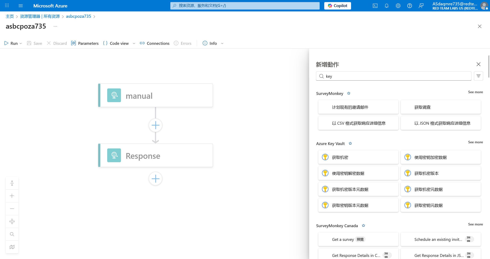
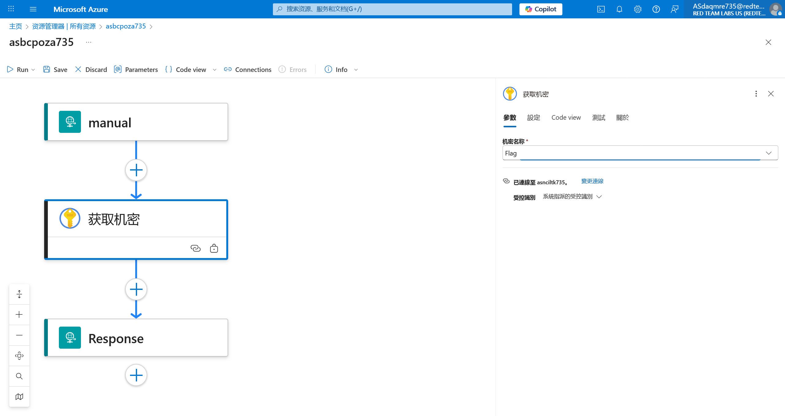

# Logic App 21 - Modify Workflow and Abuse Key Vault

> Modify Workflow and Abuse Key Vault

:::info

**Scenario**

Sometimes the user whom we compromised can have permission to edit the workflow of the logic app. Abuse the permission of the user on the logic and read the flag from the key vault.

**Overview**

What is logic app workflow?

A logic app workflow is a visual representation and implementation of a business process or integration scenario in Azure Logic Apps. It defines the steps, actions, and conditions that are executed in a specific sequence to automate a particular workflow.

**Hint**

- make use of the key vault connector action.

**Impact**

- With appropriate permissions in the logic app we could manipulate the logic app to interact with other services and perform malicious activity.

**Reference**

- [Logic Apps Docs](https://learn.microsoft.com/en-us/azure/logic-apps/logic-apps-overview)
- [Azure Key Vault Docs](https://learn.microsoft.com/en-us/azure/key-vault/general/overview)
- [Azure Key Vault Connector](https://learn.microsoft.com/en-us/connectors/keyvault/)

:::

题目按照惯例，给出了 UserCreds 信息，登陆后查看所有资源


根据题目要求，在 Logic app 执行流中加入 Key Vault 的操作



设定好目标资源



将取得的机密加入返回包中


保存后触发 Logic app 即可获得


:::info Flags

<details>

<summary> Which key vault logic app connector did we use to fetch the flag? (Get secret or Get file content) </summary>

```plaintext
Get secret
```

</details>

<details>

<summary> What is the flag value we obtain ? </summary>

```plaintext
ashaowug735aspylicg735
```

</details>

:::
