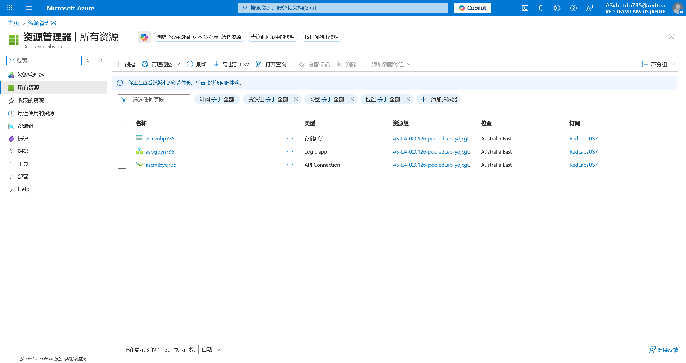
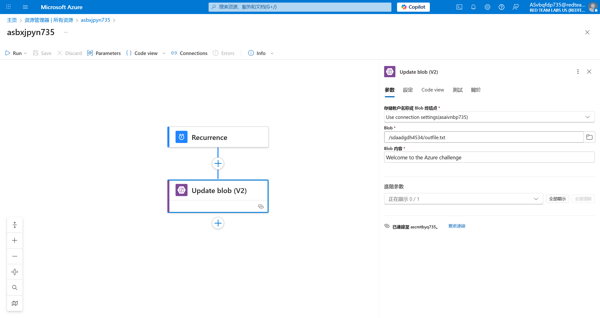
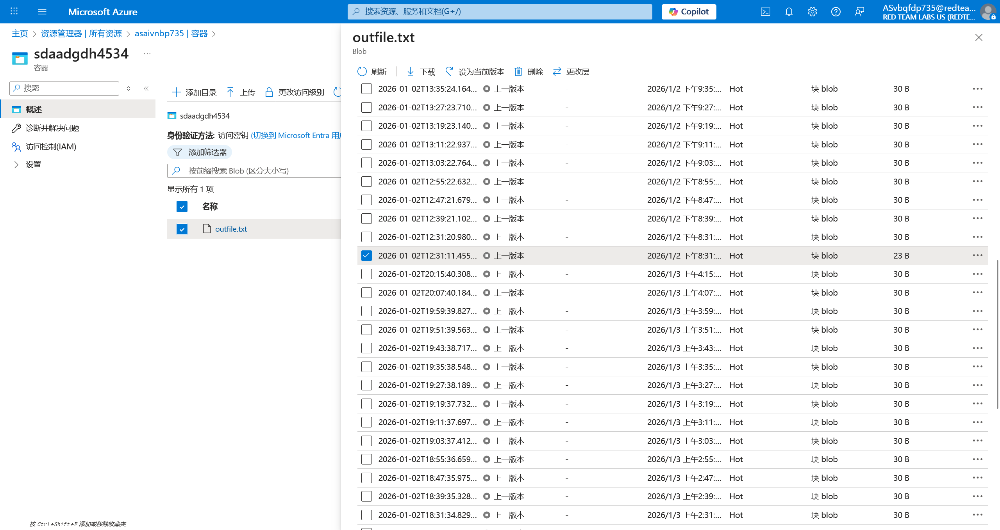

# Logic App 22 - Recurrence Trigger and Storage Blob

> Recurrence Trigger and Storage Blob

:::info

**Scenario**

In certain scenarios, a logic app can be triggered in multiple ways and that could reveal sensitive data. Leverage this information to obtain the flag from the blob.

**Overview**

What is logic app workflow?

A logic app workflow is a visual representation and implementation of a business process or integration scenario in Azure Logic Apps. It defines the steps, actions, and conditions that are executed in a specific sequence to automate a particular workflow.

**Hint**

- Recurrence trigger in place.

**Impact**

- Sometimes previous blob versions may contain sensitive data that could increase the attack surface of the target.

**Reference**

- [Logic Apps Docs](https://learn.microsoft.com/en-us/azure/logic-apps/logic-apps-overview)
- [Azure Blob Storage Docs](https://learn.microsoft.com/en-us/azure/storage/blobs/storage-blobs-overview)
- [Azure Blob Storage Connector](https://learn.microsoft.com/en-us/connectors/azureblob/)

:::

根据题目给出的 UserCreds 信息，登录 Azure 查看所有资源



进入 Logic app的编辑界面，可以看到每 8 分钟，文件就会被更改一次



已知 Blob Container 是有版本历史机制的，进入储存账户，打开对应的Blob Container


在历史版本中，成功根据文件大小，定位到目标版本



:::info Flags

<details>

<summary> In which storage account object did we get the flag? (Blob or Container) </summary>

```plaintext
Blob
```

</details>

<details>

<summary> What is the flag value we obtain ? </summary>

```plaintext
asdfgtvo735aszwgnji735
```

</details>

:::
