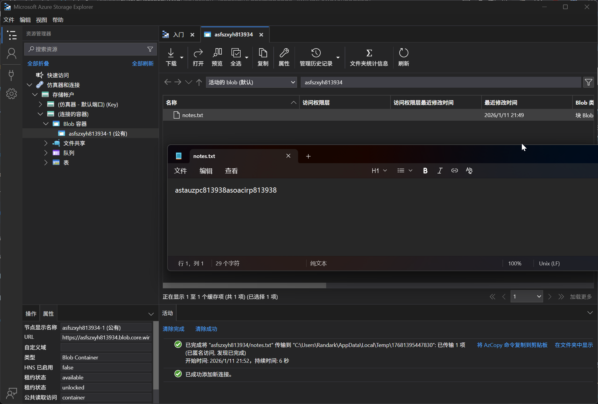

# Storage Account 01 - Anonymous Blob Access

> Anonymous Blob Access

:::info

**Scenario**

Storage account has a feature to access containers and blob anonymously. Abuse this feature and gain access to the flag.

**Overview**

What is anonymous blob or container access?

Azure Blob Storage provides the user settings to enable public access to individual blobs or containers. By setting the access level of a container or blob to "Public Blob" or "Public Container," you allow anonymous read access to those resources.

**Hint**

- FTP servers can be accessed anonymously.

**Impact**

- A lot of companies allow anonymous container access which could cause unauthorized access to data, data leakage, and malicious activity in some cases anonymous access due to lack of accountability, it becomes difficult to identify the source of unauthorized access to the resource, which can hinder incident response and forensic investigations during security incidents.
- Enabling anonymous access may introduce compliance and regulatory challenges, especially if the data stored in the container is subject to specific regulations or data protection requirements.

**Reference**

- [Storage Blob Docs](https://learn.microsoft.com/en-us/azure/storage/blobs/storage-blobs-introduction)
- [Azure Storage Explorer](https://azure.microsoft.com/en-in/products/storage/storage-explorer)

:::

题目给出了 ContainerURL 信息，使用 Microsoft Azure Storage Explorer 进行查看



即可获得 flag

:::info Flags

<details>

<summary> What is the flag value? </summary>

```plaintext
astauzpc813938asoacirp813938
```

</details>

:::
