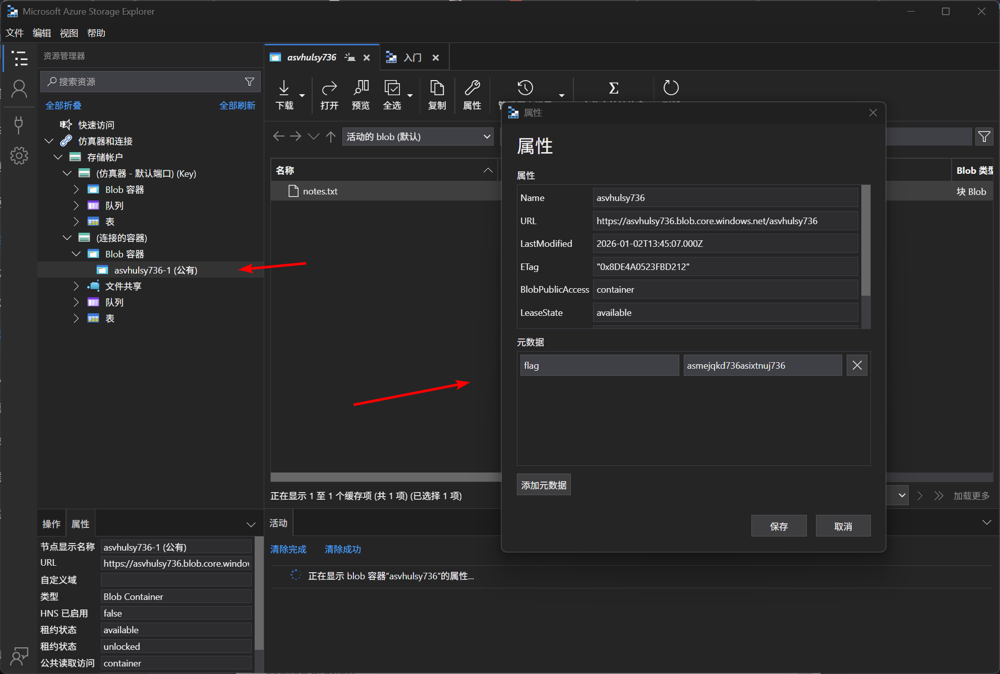

# Storage Account 03 - Sensitive Info in Metadata

> Sensitive Info in Metadata

:::info

**Scenario**

Storage containers can be accessed anonymously (if configured for anonymous access). Like other files or folders, containers also contain metadata. Let's check if we can find something interesting in the container.

**Overview**

What is metadata in containers and its uses?

Metadata is a key-value pair, we can assign custom metadata to the containers to provide additional information to the container and its contents. The common use cases for container metadata are filtering and querying, organization and management, and access control and authorization. By using Azure Storage Container Metadata, you can enhance the organization, retrieval, and management of containers and the contents within the Azure storage account.

**Hint**

- Every file or folder contains some metadata.

**Impact**

- Sometimes valuable information can be extracted from metadata which could give the attacker some more insights on the target.

**Reference**

- [Storage Blob Docs](https://learn.microsoft.com/en-us/azure/storage/blobs/storage-blobs-introduction)
- [Storage Explorer](https://azure.microsoft.com/en-in/products/storage/storage-explorer)

:::

题目给出了 StorageAccountURL 信息，使用 Microsoft Azure Storage Explorer 作为容器匿名访问进行连接


即可得到 flag

同时在属性中，可以得到另外一个 flag



:::info Flags

<details>

<summary> In which property of the storage container did we find the flag value? </summary>

```plaintext
Metadata
```

</details>

<details>

<summary> What is the flag value? </summary>

```plaintext
asmejqkd736asixtnuj736
```

</details>

:::
