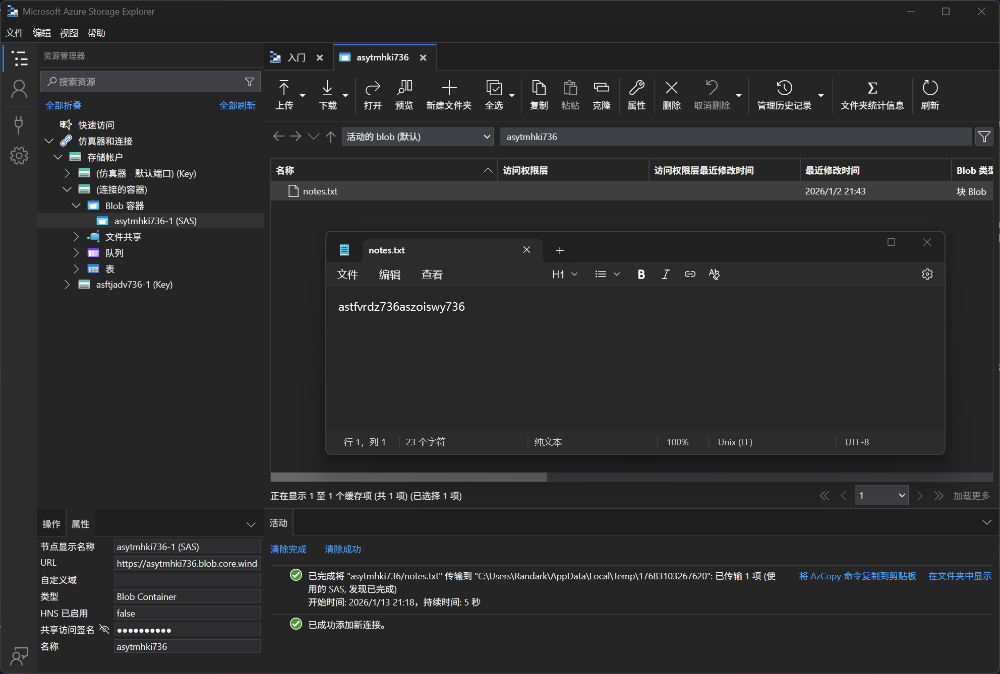

# Storage Account 05 - SAS URI

> SAS URI

:::info

**Scenario**

Storage accounts can be accessed through various methods, and one option is using the SAS URL. Utilize the provided SAS URL to locate the flag.

**Overview**

What is SAS URL (Shared Access Signature URL)?

A SAS URL (Shared Access Signature URL) is a URL that contains a shared access signature token. It allows secure access to specific resources within an Azure storage account for a limited period, without requiring the account key. SAS URLs provide us with a way to grant granular access permissions to clients or applications without exposing the storage account keys.

**Hint**

- Access resources without exposing keys

**Impact**

- Once a SAS URL is leaked, we lose control over who can access the resource during the validity period of the SAS token. Revoking access is not possible on the leaked URL, which can be distributed or accessed by multiple parties.

**Reference**

- [Storage Blob Docs](https://learn.microsoft.com/en-us/azure/storage/blobs/storage-blobs-introduction)
- [Azure Storage Explorer](https://azure.microsoft.com/en-in/products/storage/storage-explorer)
- [Shared Access Signature](https://learn.microsoft.com/en-us/azure/storage/common/storage-sas-overview)

:::

题目给出了 SASToken 信息，连接到 Blob Container



即可获得 flag

:::info Flags

<details>

<summary> What type of credential did we use to connect to the storage account? (SAS URL or connection string) </summary>

```plaintext
SAS URL
```

</details>

<details>

<summary> What is the flag value? </summary>

```plaintext
astfvrdz736aszoiswy736
```

</details>

:::
