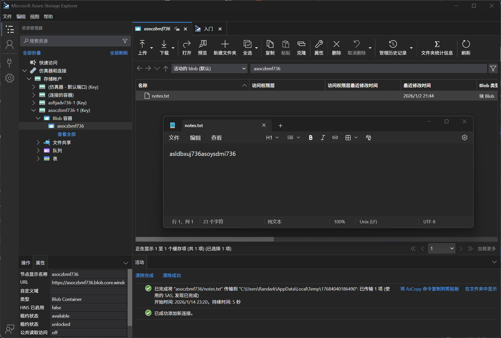

# Storage Account 06 - Access Key (Blob Access)

> Access Key (Blob Access)

:::info

**Scenario**

Storage accounts can be accessed through various methods, and one of them is by using the storage account keys. Use the storage account keys to locate the flag.

**Overview**

What are storage account keys?

A storage account key is a credential that provides access to the Azure storage account. The account key is generated when the storage account is created and acts as a shared secret between the application and the storage account. There are two keys for a storage account, primary and secondary.

**Hint**

- Access storage container without authentication

**Impact**

- The disclosure of sensitive keys such as storage account keys can lead to unauthorized access, data breach, and service interruption in some cases it might also lead to unauthorized billing and reputational damage.
- A lot of companies hardcode these sensitive storage account keys into their code which could be disclosed to unauthorized personnel.

**Reference**

- [Storage Blob Docs](https://learn.microsoft.com/en-us/azure/storage/blobs/storage-blobs-introduction)
- [Storage account keys](https://learn.microsoft.com/en-us/azure/storage/common/storage-account-keys-manage?tabs=azure-portal)

:::

题目给出了 StorageAccountKey 和 StorageAccountName 信息，尝试连接到 Blob Container


输入凭据后即可连接



:::info Flags

<details>

<summary> What type of credential did we use to connect to the storage account? (Access key or connection string) </summary>

```plaintext
Access key
```

</details>

<details>

<summary>  What is the flag value? </summary>

```plaintext
asldbxuj736asoysdmi736
```

</details>

:::
