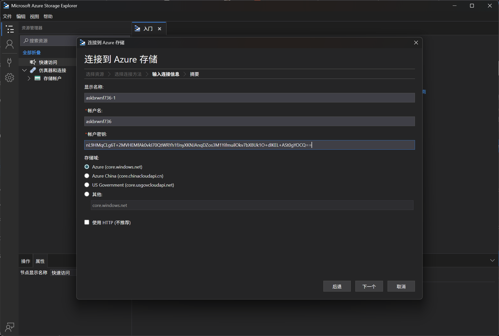

# Storage Account 07 - Access Key (File Share Access)

> Access Key (File Share Access)

:::info

**Scenario**

Storage accounts can be accessed through various methods, and one of them is by using the storage account keys. Use the storage account keys to locate the flag.

**Overview**

What are storage account keys?

A storage account Key is a credential that provides access to the Azure storage account. The account key is generated when you create the storage account and acts as a shared secret between your application and the storage account. There are two keys for a storage account primary and secondary.

**Hint**

- Access storage container without authentication.

**Impact**

- Disclosure of sensitive keys in this case the storage account keys can lead to unauthorized access, data breach, and service interruption in some cases it might also lead to unauthorized billing and reputational damage.
- A lot of companies hardcode these sensitive storage account keys into their code which could be disclosed to unauthorized personnel.

**Reference**

- [Azure Files Docs](https://learn.microsoft.com/en-us/azure/storage/files/)
- [Azure Storage Explorer](https://azure.microsoft.com/en-us/products/storage/storage-explorer)

:::

题目给出了 StorageAccountKey 和 StorageAccountName 两个信息

使用这两个信息，可以连接到储存账户



在文件共享中，可以获得flag


:::info Flags

<details>

<summary> What type of credential did we use to connect to the storage account? (Access key or connection string) </summary>

```plaintext
Access key
```

</details>

<details>

<summary> What is the flag value? </summary>

```plaintext
ndhbvlgkow3926669bxpqoghsrn3926765asstwidr736asmjbvir736
```

</details>

:::
