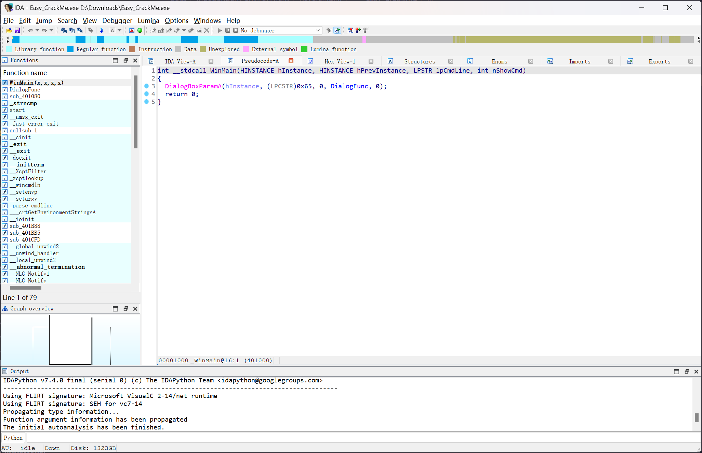

# Easy Crack

> Windows Point 100

32 位程序，使用 IDA 直接反编译看一下



```c
int __stdcall WinMain(HINSTANCE hInstance, HINSTANCE hPrevInstance, LPSTR lpCmdLine, int nShowCmd)
{
    DialogBoxParamA(hInstance, (LPCSTR)0x65, 0, DialogFunc, 0);
    return 0;
}
```

`main`函数只是创建了一个对话框出来，查看对话框函数具体的调用

```c
INT_PTR __stdcall DialogFunc(HWND hDlg, UINT a2, WPARAM a3, LPARAM a4)
{
    if ( a2 != 273 )
        return 0;
    if ( (unsigned __int16)a3 == 2 )
    {
        EndDialog(hDlg, 2);
        return 1;
    }
    else if ( (unsigned __int16)a3 == 1001 )
    {
        sub_401080(hDlg);
        return 1;
    }
    else
    {
        return 0;
    }
}
```

继续跟进`sub_401080`函数

```c
int __cdecl sub_401080(HWND hDlg)
{
    CHAR String[97]; // [esp+4h] [ebp-64h] BYREF
    __int16 v3; // [esp+65h] [ebp-3h]
    char v4; // [esp+67h] [ebp-1h]

    memset(String, 0, sizeof(String));
    v3 = 0;
    v4 = 0;
    GetDlgItemTextA(hDlg, 1000, String, 100);
    if ( String[1] != 97 || strncmp(&String[2], Str2, 2u) || strcmp(&String[4], aR3versing) || String[0] != 69 )
        return MessageBoxA(hDlg, aIncorrectPassw, Caption, 0x10u);
    MessageBoxA(hDlg, Text, Caption, 0x40u);
    return EndDialog(hDlg, 0);
}
```

很明显，中间存在有一个比较逻辑

```c
if ( String[1] != 97 || strncmp(&String[2], Str2, 2u) || strcmp(&String[4], aR3versing) || String[0] != 69 )
```

查看具体的数据结构

```c
.data:0040606C aR3versing      db 'R3versing',0        ; DATA XREF: sub_401080+51↑o
.data:00406076                 align 4
.data:00406078 ; char Str2[]
.data:00406078 Str2            db '5y',0               ; DATA XREF: sub_401080+3D↑o
.data:0040607B                 align 10h
```

即可编写脚本进行解密

```python
Str2 = "5y"

aR3versing = "R3versing"

a = chr(69) + chr(97) + Str2 + aR3versing

print(a)
# Ea5yR3versing
```
