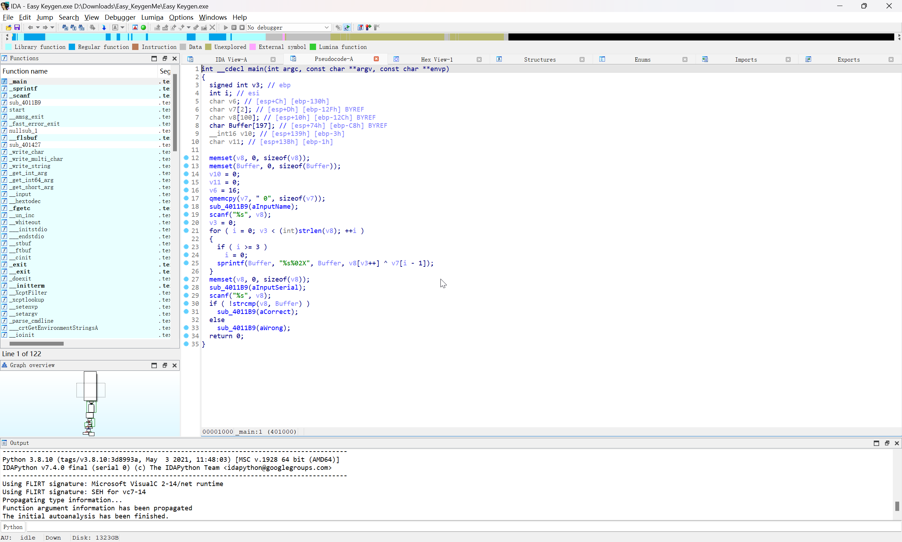

# Easy Keygen

> Windows Point 100

题目附带有一份 README

:::info

ReversingKr KeygenMe

Find the Name when the Serial is 5B134977135E7D13

:::

32 位程序，使用 IDA 直接反编译看一下



```c
int __cdecl main(int argc, const char **argv, const char **envp)
{
    signed int v3; // ebp
    int i; // esi
    char v6; // [esp+Ch] [ebp-130h]
    char v7[2]; // [esp+Dh] [ebp-12Fh] BYREF
    char v8[100]; // [esp+10h] [ebp-12Ch] BYREF
    char Buffer[197]; // [esp+74h] [ebp-C8h] BYREF
    __int16 v10; // [esp+139h] [ebp-3h]
    char v11; // [esp+13Bh] [ebp-1h]

    memset(v8, 0, sizeof(v8));
    memset(Buffer, 0, sizeof(Buffer));
    v10 = 0;
    v11 = 0;
    v6 = 16;
    qmemcpy(v7, "0", sizeof(v7));
    sub_4011B9(aInputName);
    scanf("%s", v8);
    v3 = 0;
    for (i = 0; v3 < (int)strlen(v8); ++i )
    {
        if (i>= 3 )
            i = 0;
        sprintf(Buffer, "%s%02X", Buffer, v8[v3++] ^ v7[i - 1]);
    }
    memset(v8, 0, sizeof(v8));
    sub_4011B9(aInputSerial);
    scanf("%s", v8);
    if (!strcmp(v8, Buffer) )
        sub_4011B9(aCorrect);
    else
        sub_4011B9(aWrong);
    return 0;
}
```

并且已知需要输入的 `aInputSerial` 数据为 `5B134977135E7D13`

抽出来关键逻辑

这里对 `v7` 进行了初始化

```c
qmemcpy(v7, "0", sizeof(v7));
```

然后是一个循环操作

```c
for (i = 0; v3 < (int)strlen(v8); ++i )
{
    if (i>= 3 )
    i = 0;
    sprintf(Buffer, "%s%02X", Buffer, v8[v3++] ^ v7[i - 1]);
}
```

最后是一个答案判断

```c
if (!strcmp(v8, Buffer) )
    sub_4011B9(aCorrect);
else
    sub_4011B9(aWrong);
```

直接编写脚本进行解密

```python
s = [16, 32, 48]
serial = "5B134977135E7D13"
flag = ""

a = 0

for i in range(len(serial) // 2):
    if a >= 3:
        a = 0
    flag += chr(int(serial[i * 2 : i * 2 + 2], 16) ^ int(s[a]))
    a += 1

print(flag)
# K3yg3nm3
```
