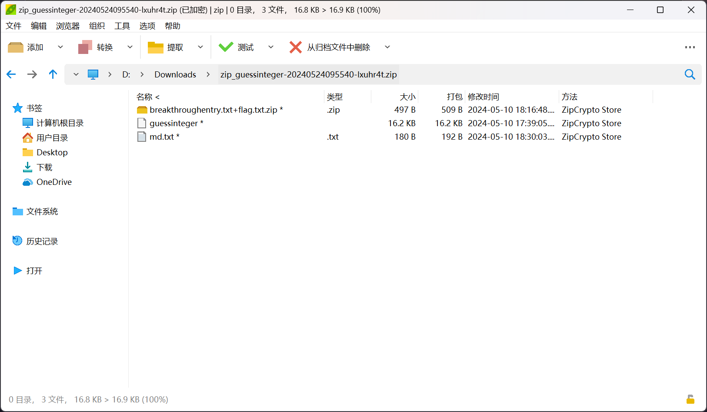
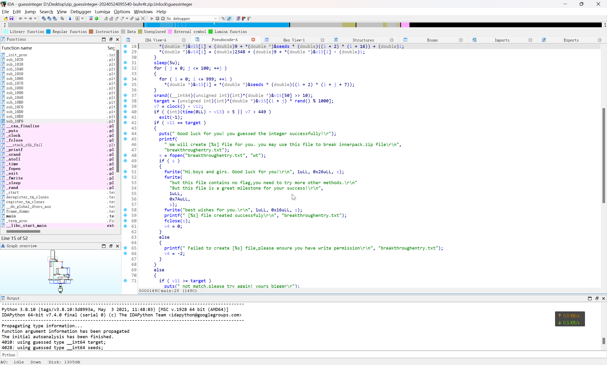

# 2024 铁人三项 决赛 Misc - Zip_guessinteger

## ZIP 文件明文爆破



根据 [ZIP 已知明文攻击深入利用 - CSDN 博客](https://blog.csdn.net/q851579181q/article/details/109767425) 这篇文章的技术西路，可以采用明文攻击的思路进行破解

首先，构建明文文件

```bash
echo -n 'breakthroughentry.txt' > plain.txt
```

然后开始明文攻击

:::warning

这里需要使用 `-o` 选项来指定偏移量，才可以正确爆破

:::

```bash
$ unzip -l zip_guessinteger-20240524095540-lxuhr4t.zip
Archive:  zip_guessinteger-20240524095540-lxuhr4t.zip
  Length      Date    Time    Name
---------  ---------- -----   ----
      497  2024-05-10 18:16   breakthroughentry.txt+flag.txt.zip
    16616  2024-05-10 17:39   guessinteger
      180  2024-05-10 18:30   md.txt
---------                     -------
    17293                     3 files

$ bkcrack -C zip_guessinteger-20240524095540-lxuhr4t.zip -c breakthroughentry.txt+flag.txt.zip -p plain.txt -o 30
bkcrack 1.7.0 - 2024-05-26
[15:08:44] Z reduction using 13 bytes of known plaintext
100.0 % (13 / 13)
[15:08:44] Attack on 516233 Z values at index 37
Keys: 003e5ac3 885a9927 00c436d9
3.2 % (16405 / 516233)
Found a solution. Stopping.
You may resume the attack with the option: --continue-attack 16405
[15:10:04] Keys
003e5ac3 885a9927 00c436d9
```

得到了密钥之后，就可以指定密钥进行解压

```bash
$ bkcrack -C zip_guessinteger-20240524095540-lxuhr4t.zip -k 003e5ac3 885a9927 00c436d9 -D zip_guessinteger-20240524095540-lxuhr4t.zip.Unlock.zip
bkcrack 1.7.0 - 2024-05-26
[15:47:18] Writing decrypted archive zip_guessinteger-20240524095540-lxuhr4t.zip.Unlock.zip
100.0 % (3 / 3)
```

## 分析第二层压缩包

然后查看压缩包内容

```plaintext title="md.txt"
恭喜你，已经破解了这个 zip 包。这是成功的第一步。还需要您破解内部的 zip 包。你可能需要先从研究 guessinteger 入手哦。期待你的好消息。
```

去查看 `guessinteger` 文件的逻辑



```c
int __fastcall main(int argc, const char **argv, const char **envp)
{
    int v4; // [rsp+14h] [rbp-3EECh]
    int i; // [rsp+18h] [rbp-3EE8h]
    int j; // [rsp+1Ch] [rbp-3EE4h]
    int v7; // [rsp+2Ch] [rbp-3ED4h]
    int v8; // [rsp+2Ch] [rbp-3ED4h]
    FILE *s; // [rsp+38h] [rbp-3EC8h]
    FILE *sa; // [rsp+38h] [rbp-3EC8h]
    __int64 v11; // [rsp+48h] [rbp-3EB8h]
    int v12; // [rsp+50h] [rbp-3EB0h]
    int v13; // [rsp+58h] [rbp-3EA8h]
    __int64 v14[1000]; // [rsp+70h] [rbp-3E90h] BYREF
    __int64 v15[1002]; // [rsp+1FB0h] [rbp-1F50h] BYREF

    v15[1001] = __readfsqword(0x28u);
    memset(v14, 0, sizeof(v14));
    memset(v15, 0, 0x1F40uLL);
    v12 = clock();
    v13 = time(0LL);
    if ( argc > 1 )
    {
        if ( argc == 2 )
        {
            v11 = atoll(argv[1]);
            for ( i = 0; i <= 999; ++i )
            {
                *(double *)&v15[i] = (double)9 + *(double *)&seeds * (double)((i + 2) * (i + 16)) + (double)i;
                *(double *)&v14[i] = (double)2348 + (double)9 + *(double *)&v15[i] - (double)i;
            }
            sleep(5u);
            for ( j = 0; j <= 100; ++j )
            {
                for ( i = 0; i <= 999; ++i )
                    *(double *)&v15[i] = *(double *)&seeds * (double)((i + 2) * (i + j + 7));
            }
            srand((__int64)(unsigned int)(int)*(double *)&v15[50] >> 10);
            target = (unsigned int)(int)*(double *)&v15[(i + j) * rand() % 1000];
            v7 = clock() - v12;
            if ( (int)(time(0LL) - v13) > 5 || v7 > 449 )
                exit(-1);
            if ( v11 == target )
            {
                puts(" Good luck for you! you guessed the integer successfully!\r");
                printf(
                " We will create [%s] file for you. you may use this file to break innerpack.zip file\r\n",
                "breakthroughentry.txt");
                s = fopen("breakthroughentry.txt", "wt");
                if ( s )
                {
                    fwrite("Hi.boys and girs. Good luck for you!\r\n", 1uLL, 0x26uLL, s);
                    fwrite(
                        "but this file contains no flag,you need to try more other methods.\r\n"
                        "But this file is a great milestone for your success!\r\n",
                        1uLL,
                        0x7AuLL,
                        s);
                    fwrite("best wishes for you.\r\n", 1uLL, 0x16uLL, s);
                    printf(" [%s] file created successfuly\r\n", "breakthroughentry.txt");
                    fclose(s);
                    v4 = 0;
                }
                else
                {
                    printf(" Failed to create [%s] file,please ensure you have write permission\r\n", "breakthroughentry.txt");
                    v4 = -2;
                }
            }
            else
            {
                if ( v11 >= target )
                    puts(" not match.please try again! yours bigger\r");
                else
                    puts(" not match.please try again! yours smaller\r");
                v4 = -1;
            }
        }
        else
        {
            puts("guess an integer game, only one argument\r");
            v4 = -1;
            sleep(5u);
        }
    }
    else
    {
        puts("guess an integer game, no input\r");
        sleep(5u);
        v4 = -1;
    }
    v8 = clock() - v12;
    if ( (int)(time(0LL) - v13) > 5 || v8 > 449 )
    {
        sa = fopen("breakthroughentry.txt", "wt");
        if ( sa )
        {
        fwrite("Hi.boys and girs. good luck for you!\r\n", 1uLL, 0x26uLL, sa);
        fwrite(
            "But this file contains no flag,you need to try more other methods.\r\n"
            "but this file is a great milestone for your success!\r\n",
            1uLL,
            0x7AuLL,
            sa);
        fwrite("Best wishes for you.\r\n", 1uLL, 0x16uLL, sa);
        fclose(sa);
        return -1;
        }
    }
    return v4;
}
```

一个很明显的文件写入的逻辑，这里不纠结程序如何运行，直接提取文件内容写入文件

```plaintext title="breakthroughentry.txt"
Hi.boys and girs. good luck for you!
But this file contains no flag,you need to try more other methods.
but this file is a great milestone for your success!
Best wishes for you.
```

:::warning

接下来按理来说是构造压缩包然后明文攻击，但是所有可能的压缩参数都尝试过了，都显示压缩算法不一致

:::

故直接附上答案

```flag
flag{ea4c4090-a512-47ed-a817-8771e1640a63}
```
