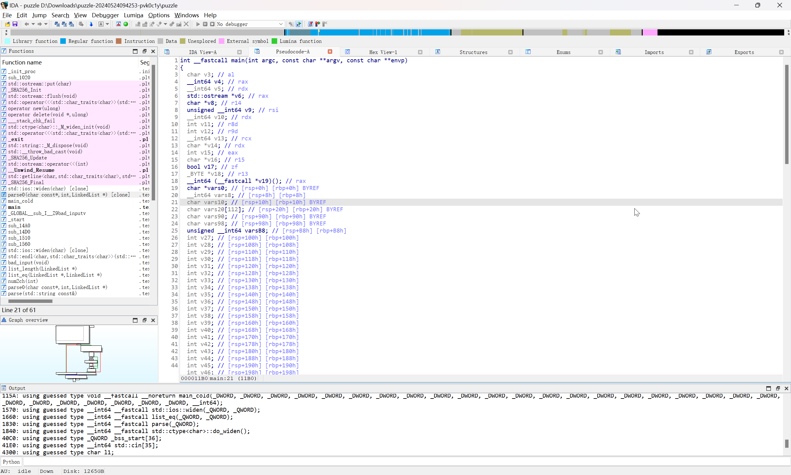

# 2024 铁人三项 决赛 Reverse - 文字谜题

:::info Reference

[长城杯2024决赛RE - NOXKE](https://blog.noxke.fun/2024/05/25/ctf_wp/%E9%95%BF%E5%9F%8E%E6%9D%AF2024%E5%86%B3%E8%B5%9BRE/)

:::

首先老样子，直接 IDA 先分析一波

## 基本分析



```c
int __fastcall main(int argc, const char **argv, const char **envp)
{
    char v3; // al
    __int64 v4; // rax
    __int64 v5; // rdx
    std::ostream *v6; // rax
    char *v8; // r14
    unsigned __int64 v9; // rsi
    __int64 v10; // rdx
    int v11; // r8d
    int v12; // r9d
    __int64 v13; // rcx
    char *v14; // rdx
    int v15; // eax
    char *v16; // r15
    bool v17; // zf
    _BYTE *v18; // r13
    __int64 (__fastcall *v19)(); // rax
    char *vars0; // [rsp+0h] [rbp+0h] BYREF
    __int64 vars8; // [rsp+8h] [rbp+8h]
    char vars10; // [rsp+10h] [rbp+10h] BYREF
    char vars20[112]; // [rsp+20h] [rbp+20h] BYREF
    char vars90; // [rsp+90h] [rbp+90h] BYREF
    char vars98; // [rsp+98h] [rbp+98h] BYREF
    unsigned __int64 varsB8; // [rsp+B8h] [rbp+B8h]
    int v27; // [rsp+100h] [rbp+100h]
    int v28; // [rsp+108h] [rbp+108h]
    int v29; // [rsp+110h] [rbp+110h]
    int v30; // [rsp+118h] [rbp+118h]
    int v31; // [rsp+120h] [rbp+120h]
    int v32; // [rsp+128h] [rbp+128h]
    int v33; // [rsp+130h] [rbp+130h]
    int v34; // [rsp+138h] [rbp+138h]
    int v35; // [rsp+140h] [rbp+140h]
    int v36; // [rsp+148h] [rbp+148h]
    int v37; // [rsp+150h] [rbp+150h]
    int v38; // [rsp+158h] [rbp+158h]
    int v39; // [rsp+160h] [rbp+160h]
    int v40; // [rsp+168h] [rbp+168h]
    int v41; // [rsp+170h] [rbp+170h]
    int v42; // [rsp+178h] [rbp+178h]
    int v43; // [rsp+180h] [rbp+180h]
    int v44; // [rsp+188h] [rbp+188h]
    int v45; // [rsp+190h] [rbp+190h]
    int v46; // [rsp+198h] [rbp+198h]
    int v47; // [rsp+1A0h] [rbp+1A0h]
    int v48; // [rsp+1A8h] [rbp+1A8h]
    __int64 v49; // [rsp+1B0h] [rbp+1B0h]

    varsB8 = __readfsqword(0x28u);
    std::operator<<<std::char_traits<char>>(_bss_start, "Enter your magic code:", envp);
    vars10 = 0;
    vars0 = &vars10;
    vars8 = 0LL;
    v3 = std::ios::widen(*(__int64 *)((char *)&std::cin[30] + *(_QWORD *)(std::cin[0] - 24)), 10LL);
    std::getline<char,std::char_traits<char>,std::allocator<char>>(std::cin, &vars0, (unsigned int)v3);
    std::endl<char,std::char_traits<char>>((std::ostream *)_bss_start);
    v4 = parse(&vars0);
    if ((unsigned __int8)list_eq(v4, &l1) && vars8 == 571 )
    {
        SHA256_Init(vars20);
        SHA256_Update(vars20, vars0, vars8);
        v8 = &vars90;
        SHA256_Final(&vars90, vars20);
        v9 = (unsigned __int64)"Congratulations! Your flag is: flag{W0w_U_Ar3_V3ry_G00d_A7_C0unt1n9_";
        std::operator<<<std::char_traits<char>>(
        _bss_start,
        "Congratulations! Your flag is: flag{W0w_U_Ar3_V3ry_G00d_A7_C0unt1n9_",
        v10);
        do
        {
            v13 = _bss_start[0];
            v14 = (char *)_bss_start + *(_QWORD *)(_bss_start[0] - 24LL);
            v15 = *((_DWORD *)v14 + 6);
            *((_QWORD *)v14 + 2) = 2LL;
            v16 = (char *)_bss_start + *(_QWORD *)(v13 - 24);
            v17 = v16[225] == 0;
            *((_DWORD *)v14 + 6) = v15 & 0xFFFFFFB5 | 8;
            if (v17)
            {
                v18 = (_BYTE *)*((_QWORD *)v16 + 30);
                if (!v18)
                main_cold(
                    (unsigned int)_bss_start,
                    v9,
                    (_DWORD)v14,
                    v13,
                    v11,
                    v12,
                    v27,
                    v28,
                    v29,
                    v30,
                    v31,
                    v32,
                    v33,
                    v34,
                    v35,
                    v36,
                    v37,
                    v38,
                    v39,
                    v40,
                    v41,
                    v42,
                    v43,
                    v44,
                    v45,
                    v46,
                    v47,
                    v48,
                    v49);
                if (!v18[56] )
                {
                    std::ctype<char>::_M_widen_init(*((_QWORD *)v16 + 30));
                    v19 = *(__int64 (__fastcall **)())(*(_QWORD *)v18 + 48LL);
                    if (v19 != std::ctype<char>::do_widen )
                        ((void (__fastcall *)(_BYTE *, __int64))v19)(v18, 32LL);
                }
                v16[225] = 1;
            }
            v16[224] = 48;
            v9 = (unsigned __int8)*v8;
            std::ostream::operator<<(_bss_start, v9);
            ++v8;
        }
        while (&vars98 != v8);
        v6 = (std::ostream *)std::operator<<<std::char_traits<char>>(_bss_start, 125LL);
    }
    else
    {
        v6 = (std::ostream *)std::operator<<<std::char_traits<char>>(_bss_start, "Sorry, bad input :(", v5);
    }
    std::endl<char,std::char_traits<char>>(v6);
    std::string::_M_dispose(&vars0);
    return 0;
}
```

## 核心逻辑

在这一部分，对用户输入使用 `parse()` 函数进行处理

```c
varsB8 = __readfsqword(0x28u);
std::operator<<<std::char_traits<char>>(_bss_start, "Enter your magic code:", envp);
vars10 = 0;
vars0 = &vars10;
vars8 = 0LL;
v3 = std::ios::widen(*(__int64 *)((char *)&std::cin[30] + *(_QWORD *)(std::cin[0] - 24)), 10LL);
std::getline<char,std::char_traits<char>,std::allocator<char>>(std::cin, &vars0, (unsigned int)v3);
std::endl<char,std::char_traits<char>>((std::ostream *)_bss_start);
v4 = parse(&vars0);
```

并将 `parse(<user_inpuit>)` 返回的结果与 `list_eq` 进行比较

```c
if ((unsigned __int8)list_eq(v4, &l1) && vars8 == 571 )
```

校验通过后，计算用户输入的字符串的 hash

```c
SHA256_Init(vars20);
SHA256_Update(vars20, vars0, vars8);
v8 = &vars90;
SHA256_Final(&vars90, vars20);
```

后续代码为 flag 的输出部分

## 分析`list_eq()`函数

```c
char __fastcall list_eq(__int128 a1)
{
    char result; // al
    bool v2; // al
    bool v3; // dl

    result = 1;
    if ( a1 != 0 )
    {
        v2 = (_QWORD)a1 == 0LL;
        v3 = *((_QWORD *)&a1 + 1) == 0LL;
        do
        {
            result = v3 || v2;
            if ( result )
                return 0;
            if ( *(_BYTE *)a1 != **((_BYTE **)&a1 + 1) )
                return result;
            *(_QWORD *)&a1 = *(_QWORD *)(a1 + 8);
            *((_QWORD *)&a1 + 1) = *(_QWORD *)(*((_QWORD *)&a1 + 1) + 8LL);
            v2 = (_QWORD)a1 == 0LL;
            v3 = *((_QWORD *)&a1 + 1) == 0LL;
        }
        while ( a1 != 0 );
        return 1;
    }
    return result;
}
```

是两个链表的比较

## 分析 `parse()` 函数

```c
__int64 __fastcall parse(_QWORD *a1)
{
    return parse0(*a1, 1LL, 0LL);
}

__int64 __fastcall parse0(char *a1, signed int a2, __int64 a3)
{
    char v6; // al
    __int64 v7; // rax
    __int64 v8; // rdx
    __int64 v9; // rbp
    __int64 v10; // rax
    int v11; // edi
    char v12; // al
    __int64 v13; // rax
    __int64 v14; // rdx
    __int64 v15; // rbp
    __int64 v16; // rax
    int v17; // ecx
    __int64 result; // rax

LABEL_1:
    while (1)
    {
        v6 = *a1;
        if (!*a1)
        break;
        while (1)
        {
            ++a1;
            if (v6 == 97)
        {
            a2 *= 2;
            goto LABEL_1;
        }
        if (v6 == 98)
            break;
        if (v6 != 45)
            goto LABEL_17;
        v7 = operator new(0x10uLL);
        v8 = a3;
        v9 = v7;
        v10 = 1LL;
        if (a3)
        {
            do
            {
                v8 = *(_QWORD *)(v8 + 8);
                v11 = v10++;
            }
            while (v8);
        }
        else
        {
            v11 = 0;
        }
        v12 = num2ch(a2 + v11);
        *(_QWORD *)(v9 + 8) = a3;
        a2 = 1;
        a3 = v9;
        *(_BYTE *)v9 = v12;
        v6 = *a1;
        if (!*a1)
            goto LABEL_8;
        }
        if (a2 % 3 != 1 || (a2 & 1) != 0 )
LABEL_17:
        bad_input();
        a2 = (a2 - 1) / 3u;
    }
LABEL_8:
    v13 = operator new(0x10uLL);
    v14 = a3;
    v15 = v13;
    v16 = 1LL;
    if (a3)
    {
        do
        {
            v14 = *(_QWORD *)(v14 + 8);
            v17 = v16++;
        }
        while (v14);
    }
    else
    {
        v17 = 0;
    }
    *(_BYTE *)v15 = num2ch(a2 + v17);
    result = v15;
    *(_QWORD *)(v15 + 8) = a3;
    return result;
}
```

接收 `a1`, `a2`, `a3` 3 个参数传入，3 个字符分别对应 3 种处理

关注第一个 for 循环，初始化 `i = 1`

```c
LABEL_2:
    for (i = a2; ; i = (i - 1) / 3u )
```

依次取出一个字符进行比较，若字符为 `a`，`i *= 2`，goto 进行下一次循环，跳过 for 循环结尾的 `i = (i - 1) / 3`

```c
if (v6 == 'a')
{
    i *= 2;
    goto LABEL_2;
}
```

若字符为 b，使用 break 跳出 while 循环，需要确保 `i % 3 == 1` 和 `i & 1 == 0`，随后执行 for 循环结尾的 `i = (i - 1) / 3`

```c
    if (v6 == 'b')
        break;
    if (i % 3 != 1 || (i & 1) != 0 )
LABEL_18:
    bad_input(a1, a2, a3);
```

若字符为 `-`，创建一个新的链表节点 v9，计算链表长度 v11，计算 `v12 = num2ch(i+v11)`，将计算得到的 v12 储存在节点 v9 中，并将 v9 插入到结果链表头部

```c
v7 = operator new(0x10uLL);
v8 = v4;
v9 = v7;
v10 = 1LL;
if (v4)
{
    do
    {
        v8 = *(_QWORD *)(v8 + 8);
        v11 = v10++;
    }
    while (v8);
}
else
{
    v11 = 0;
}
a1 = (unsigned int)(i + v11);
v12 = num2ch(a1, a2, v8);
*(_QWORD *)(v9 + 8) = v4;
i = 1;
v4 = v9;
*(_BYTE *)v9 = v12;
```

`num2ch` 对输入的字符异或 `0x8D`，并且要求输入字符小于 `0x100`，即为一个字节

```c
__int64 __fastcall num2ch(__int64 a1, __int64 a2, __int64 a3)
{
    LOBYTE(a1) = a1 ^ 0x8D;
    if ((unsigned int)(a1 - 1) > 0xFE )
        bad_input(a1, a2, a3);
    return (unsigned int)a1;
}
```

若字符不为 `ab-`，parse 返回

parse 对应的算法如下（这里使用列表代替链表，方向相反）

```python
def parse(s:str):
    i = 1
    ls = []
    for c in s:
        if (c == 'a'):
            i *= 2
        elif (c == 'b'):
            assert((i % 3 == 1) and (i % 2 == 0))
            i = (i - 1) // 3
        elif (c == '-'):
            deep = len(ls)
            new_c = (i + deep) ^ 0x8D
            ls.append(new_c)
            i = 1
```

## 动态调试抓取数据

通过动态调试获取校验链表 l1 的值

```c
.bss:00005D849CA5F300 ; l1
.bss:00005D849CA5F300 _ZL2l1          db 49h                  ; DATA XREF: main+97↑o
.bss:00005D849CA5F300                                         ; _GLOBAL__sub_I__Z9bad_inputv+9B↑w
.bss:00005D849CA5F301                 align 8
.bss:00005D849CA5F308 qword_5D849CA5F308 dq 5D849CA5F310h     ; DATA XREF: _GLOBAL__sub_I__Z9bad_inputv+A2↑w
.bss:00005D849CA5F310 ; l2
.bss:00005D849CA5F310 _ZL2l2          db 53h                  ; DATA XREF: _GLOBAL__sub_I__Z9bad_inputv+5B↑o
.bss:00005D849CA5F310                                         ; _GLOBAL__sub_I__Z9bad_inputv+94↑w
.bss:00005D849CA5F311                 align 8
.bss:00005D849CA5F318 qword_5D849CA5F318 dq 5D849CA5F320h     ; DATA XREF: _GLOBAL__sub_I__Z9bad_inputv+54↑w
.bss:00005D849CA5F320 ; l3
.bss:00005D849CA5F320 _ZL2l3          db 43h                  ; DATA XREF: _GLOBAL__sub_I__Z9bad_inputv+4D↑o
.bss:00005D849CA5F320                                         ; _GLOBAL__sub_I__Z9bad_inputv+8D↑w
.bss:00005D849CA5F321                 align 8
.bss:00005D849CA5F328 qword_5D849CA5F328 dq 5D849CA5F330h     ; DATA XREF: _GLOBAL__sub_I__Z9bad_inputv+46↑w
.bss:00005D849CA5F330 ; l4
.bss:00005D849CA5F330 _ZL2l4          db 43h                  ; DATA XREF: _GLOBAL__sub_I__Z9bad_inputv+3F↑o
.bss:00005D849CA5F330                                         ; _GLOBAL__sub_I__Z9bad_inputv+86↑w
.bss:00005D849CA5F331                 align 8
.bss:00005D849CA5F338 qword_5D849CA5F338 dq 5D849CA5F340h     ; DATA XREF: _GLOBAL__sub_I__Z9bad_inputv+38↑w
.bss:00005D849CA5F340 ; l5
.bss:00005D849CA5F340 _ZL2l5          db 32h                  ; DATA XREF: _GLOBAL__sub_I__Z9bad_inputv+31↑o
.bss:00005D849CA5F340                                         ; _GLOBAL__sub_I__Z9bad_inputv+7F↑w
.bss:00005D849CA5F341                 align 8
.bss:00005D849CA5F348 qword_5D849CA5F348 dq 5D849CA5F350h     ; DATA XREF: _GLOBAL__sub_I__Z9bad_inputv+2A↑w
.bss:00005D849CA5F350 ; l6
.bss:00005D849CA5F350 _ZL2l6          db 30h                  ; DATA XREF: _GLOBAL__sub_I__Z9bad_inputv+23↑o
.bss:00005D849CA5F350                                         ; _GLOBAL__sub_I__Z9bad_inputv+78↑w
.bss:00005D849CA5F351                 align 8
.bss:00005D849CA5F358 qword_5D849CA5F358 dq 5D849CA5F360h     ; DATA XREF: _GLOBAL__sub_I__Z9bad_inputv+1C↑w
.bss:00005D849CA5F360 ; l7
.bss:00005D849CA5F360 _ZL2l7          db 32h                  ; DATA XREF: _GLOBAL__sub_I__Z9bad_inputv+7↑w
.bss:00005D849CA5F360                                         ; _GLOBAL__sub_I__Z9bad_inputv+15↑o
.bss:00005D849CA5F361                 align 8
.bss:00005D849CA5F368 qword_5D849CA5F368 dq 5D849CA5F370h     ; DATA XREF: _GLOBAL__sub_I__Z9bad_inputv+E↑w
.bss:00005D849CA5F370 ; l8
.bss:00005D849CA5F370 _ZL2l8          dq 34h                  ; DATA XREF: _GLOBAL__sub_I__Z9bad_inputv↑o
.bss:00005D849CA5F370                                         ; _GLOBAL__sub_I__Z9bad_inputv+62↑w
.bss:00005D849CA5F378 qword_5D849CA5F378 dq 0                 ; DATA XREF: _GLOBAL__sub_I__Z9bad_inputv+6D↑w
```

即为

```python
ans_ls = [0x34, 0x32, 0x30, 0x32, 0x43, 0x43, 0x53, 0x49]
```

## 解题脚本

需要计算每个值对应的字符串输入，由于逆推难度较大，考虑使用递归暴力计算

计算逻辑中存在`(i-1)//3`的操作，因此实际计算的最大值可能远大于`0x100`，此处选择`100000`，保留最短输入字符串

```python
ans_ls = [0x34, 0x32, 0x30, 0x32, 0x43, 0x43, 0x53, 0x49]
ls = [(ans_ls[i] ^ 0x8D) - i for i in range(8)]

parse_ls = [None for _ in range(0x100)]

def recur(k, s):
    if (k > 100000):
        return
    global parse_ls
    try:
        if (parse_ls[k] == None or len(s) < len(parse_ls[k])):
            parse_ls[k] = s
    except:
        pass
    try:
        recur(k*2, s+'a')
    except:
        pass
    if ((k % 3 == 1) and (k % 2 == 0)):
        try:
            recur((k-1)//3, s+'b')
        except:
            pass

recur(1, "")

for i in range(0x100):
    print(hex(i), parse_ls[i])

for d in ls:
    print(parse_ls[d], end='-')
```

通过爆破，即可得到正确的输入值

```shell
PS D:\_Code\test> & d:/_Code/test/env/Scripts/python.exe d:/_Code/test/test.py
0x0 None
0x1 
0x2 a
0x3 aaaabab
0x4 aa
0x5 aaaab
0x6 aaaababa
0x7 aaaabaaabaababab
0x8 aaa
0x9 aaaabaaabaabababaab
0xa aaaaba
0xb aaaabaaabaabab
0xc aaaababaa
0xd aaaabaaab
0xe aaaabaaabaabababa
0xf aaaabaaaaabababab
0x10 aaaa
0x11 aaaabaaabaab
0x12 aaaabaaabaabababaaba
0x13 aaaabaaabaababaaabab
0x14 aaaabaa
0x15 aaaaaab
0x16 aaaabaaabaababa
0x17 aaaabaaaaababab
0x18 aaaababaaa
0x19 aaaabaaabaababaaababaab
0x1a aaaabaaaba
0x1b aaaabaaaaabababaaabaaaabaabaabaaaababababaaababababababaababaabababaaabaababababaabababaababaabaabababababaabab
0x1c aaaabaaabaabababaa
0x1d aaaabaaabaababaaab
0x1e aaaabaaaaababababa
0x1f aaaabaaaaabababaaabaaaabaabaabaaaababababaaababababababaababaabababaaabaababababaabababaababaabaababababab
0x20 aaaaa
0x21 aaaabaaabaababaaababaabaab
0x22 aaaabaaabaaba
0x23 aaaabaaaaabab
0x24 aaaabaaabaabababaabaa
0x25 aaaabaaabaabababaaaab
0x26 aaaabaaabaababaaababa
0x27 aaaabaaabaababaaababaaaababaababab
0x28 aaaabaaa
0x29 aaaabaaaaabababaaabaaaabaabaabaaaababababaaababababababaababaabababaaabaababababaabababaababaabaabababababaab
0x2a aaaaaaba
0x2b aaaabaaabaabababaaaabaabaabab
0x2c aaaabaaabaababaa
0x2d aaaabaaabaabaaab
0x2e aaaabaaaaabababa
0x2f aaaabaaaaabababaaabaaaabaabaabaaaababababaaababababababaababaabababaaabaababababaabababaababaabaabababab
0x30 aaaababaaaa
0x31 aaaabaaabaabababaaaabaab
0x32 aaaabaaabaababaaababaaba
0x33 aaaabaaabaababaaabaaabab
0x34 aaaabaaabaa
0x35 aaaabaaaaab
0x36 aaaabaaaaabababaaabaaaabaabaabaaaababababaaababababababaababaabababaaabaababababaabababaababaabaabababababaababa
0x37 aaaabaaaaabababaaabaaaabaabaabaaaababababaaababababababaababaabababaaabaababababaabababaababaabaababababaaababab
0x38 aaaabaaabaabababaaa
0x39 aaaabaaabaabababaaaabaabaababaab
0x3a aaaabaaabaababaaaba
0x3b aaaabaaabaababaaababaaaababaabab
0x3c aaaabaaaaababababaa
0x3d aaaabaaaaabababaaab
0x3e aaaabaaaaabababaaabaaaabaabaabaaaababababaaababababababaababaabababaaabaababababaabababaababaabaabababababa
0x3f aaaabaaaaabababaaabaaaabaabaabaaaababababaaababababababaababaabababaaabaababababaabababaababaaaabababababab
0x40 aaaaaa
0x41 aaaabaaabaabababaaaabaabaab
0x42 aaaabaaabaababaaababaabaaba
0x43 aaaabaaabaababaaababaaaabab
0x44 aaaabaaabaabaa
0x45 aaaabaaabaaaab
0x46 aaaabaaaaababa
0x47 aaaabaaaaabababaaabaaaabaabaabaaaababababaaababababababaababaabababaaabaababababaabababaababaabaababab
0x48 aaaabaaabaabababaabaaa
0x49 aaaabaaaaabababaaabaaaabaabaabaaaababababaaababababababaababaabababaaabaababababaabababaababaabaababababaaabababaab
0x4a aaaabaaabaabababaaaaba
0x4b aaaaaaaabaabab
0x4c aaaabaaabaababaaababaa
0x4d aaaabaaabaababaaabaaab
0x4e aaaabaaabaababaaababaaaababaabababa
0x4f aaaabaaabaababaaababaaaabaaabababab
0x50 aaaabaaaa
0x51 aaaabaaaaabababaaabaab
0x52 aaaabaaaaabababaaabaaaabaabaabaaaababababaaababababababaababaabababaaabaababababaabababaababaabaabababababaaba
0x53 aaaabaaaaabababaaabaaaabaabaabaaaababababaaababababababaababaabababaaabaababababaabababaababaabaababababaaabab
0x54 aaaaaabaa
0x55 aaaaaaaab
0x56 aaaabaaabaabababaaaabaabaababa
0x57 aaaabaaabaabababaaaabaaaababab
0x58 aaaabaaabaababaaa
0x59 aaaabaaabaababaaababaaaababaab
0x5a aaaabaaabaabaaaba
0x5b aaaabaaaaabababaaabaaaabaabaabaaaababababaaababababababaababaabababaaabaababababaabababaabab
0x5c aaaabaaaaabababaa
0x5d aaaabaaaaababaaab
0x5e aaaabaaaaabababaaabaaaabaabaabaaaababababaaababababababaababaabababaaabaababababaabababaababaabaababababa
0x5f aaaabaaaaabababaaabaaaabaabaabaaaababababaaababababababaababaabababaaabaababababaabababaababaaaababababab
0x60 aaaababaaaaa
0x61 aaaabaaaaabababaaabaaaabaabaabaaaababababaaababababababaababaabababaaabaababababaabababaababaabaababababaaabababaabaab
0x62 aaaabaaabaabababaaaabaaba
0x63 aaaabaaabaabababaaaaaabab
0x64 aaaabaaabaababaaababaabaa
0x65 aaaabaaabaababaaababaaaab
0x66 aaaabaaabaababaaabaaababa
0x67 aaaabaaaaabababaaabaaaabaabaabaaaababababaaababababababaababaabababaaabaababababaababab
0x68 aaaabaaabaaa
0x69 aaaabaaabaababaaababaaaabaaababababaab
0x6a aaaabaaaaaba
0x6b aaaabaaaaabababaaabaaaabaabaabaaaababababaaababababababaababaabababaaabaababababaabababaababaabaabab
0x6c aaaabaaaaabababaaabaaaabaabaabaaaababababaaababababababaababaabababaaabaababababaabababaababaabaabababababaababaa
0x6d aaaabaaaaabababaaabaaaabaabaabaaaababababaaababababababaababaabababaaabaababababaabababaababaabaabababababaabaaab
0x6e aaaabaaaaabababaaabaaaabaabaabaaaababababaaababababababaababaabababaaabaababababaabababaababaabaababababaaabababa
0x6f aaaabaaaaabababaaabaaaabaabaabaaaababababaaababababababaababaabababab
0x70 aaaabaaabaabababaaaa
0x71 aaaaaaaabaab
0x72 aaaabaaabaabababaaaabaabaababaaba
0x73 aaaabaaabaabababaaaabaabaabaaabab
0x74 aaaabaaabaababaaabaa
0x75 aaaabaaabaababaaaaab
0x76 aaaabaaabaababaaababaaaababaababa
0x77 aaaabaaabaababaaababaaaabaaababab
0x78 aaaabaaaaababababaaa
0x79 aaaabaaaaabababaaabaaaabaabaabaaaababababaaababababababaababaabababaaabaababababaabababaababaab
0x7a aaaabaaaaabababaaaba
0x7b aaaabaaabaababaaababaaaababaababaaabaababaabab
0x7c aaaabaaaaabababaaabaaaabaabaabaaaababababaaababababababaababaabababaaabaababababaabababaababaabaabababababaa
0x7d aaaabaaaaabababaaabaaaabaabaabaaaababababaaababababababaababaabababaaabaababababaabababaababaabaababababaaab
0x7e aaaabaaaaabababaaabaaaabaabaabaaaababababaaababababababaababaabababaaabaababababaabababaababaaaababababababa
0x7f aaaabaaabaababaaabaaabaaabaaaabaababababababab
0x80 aaaaaaa
0x81 aaaabaaaaabababaaabaaaabaabaabaaaababababaaababababababaababaabababaaabaababababaabababaababaabaababababaaabababaabaabaab
0x82 aaaabaaabaabababaaaabaabaaba
0x83 aaaabaaabaabababaaaabaaaabab
0x84 aaaabaaabaababaaababaabaabaa
0x85 aaaabaaabaababaaababaabaaaab
0x86 aaaabaaabaababaaababaaaababa
0x87 aaaabaaabaabababaaaabaabaababaaaabaababab
0x88 aaaabaaabaabaaa
0x89 aaaabaaaaabababaaabaaaabaabaabaaaababababaaababababababaababaabababaaabaababababaabababaab
0x8a aaaabaaabaaaaba
0x8b aaaabaaabaababaaababaaaababaababaaabaabab
0x8c aaaabaaaaababaa
0x8d aaaabaaaaabaaab
0x8e aaaabaaaaabababaaabaaaabaabaabaaaababababaaababababababaababaabababaaabaababababaabababaababaabaabababa
0x8f aaaabaaaaabababaaabaaaabaabaabaaaababababaaababababababaababaabababaaabaababababaabababaababaaaabababab
0x90 aaaabaaabaabababaabaaaa
0x91 aaaabaaaaabababaaabaaaabaabaabaaaababababaaababababababaababaabababaaabaababababaabababaababaabaabababababaabaaabaab
0x92 aaaabaaaaabababaaabaaaabaabaabaaaababababaaababababababaababaabababaaabaababababaabababaababaabaababababaaabababaaba
0x93 aaaabaaaaabababaaabaaaabaabaabaaaababababaaababababababaababaabababaaabaababababaabababaababaabaababababaaababaaabab
0x94 aaaabaaabaabababaaaabaa
0x95 aaaabaaabaabababaaaaaab
0x96 aaaaaaaabaababa
0x97 aaaaaaaaaababab
0x98 aaaabaaabaababaaababaaa
0x99 aaaabaaabaabababaaaabaabaabaaababaab
0x9a aaaabaaabaababaaabaaaba
0x9b aaaabaaaaabababaaabaaaabaabaabaaaababababaaababababababaababaabababaaabaababababaabab
0x9c aaaabaaabaababaaababaaaababaabababaa
0x9d aaaabaaabaababaaababaaaababaababaaab
0x9e aaaabaaabaababaaababaaaabaaababababa
0x9f aaaabaaaaabababaaabaaaabaabaabaaaabababababaababababab
0xa0 aaaabaaaaa
0xa1 aaaabaaaaabababaaabaaaabaabaabaaaababababaaababababababaababaabababaaabaababababaabababaababaabaab
0xa2 aaaabaaaaabababaaabaaba
0xa3 aaaabaaaaabababaaaaabab
0xa4 aaaabaaaaabababaaabaaaabaabaabaaaababababaaababababababaababaabababaaabaababababaabababaababaabaabababababaabaa
0xa5 aaaabaaaaabababaaabaaaabaabaabaaaababababaaababababababaababaabababaaabaababababaabababaababaabaabababababaaaab
0xa6 aaaabaaaaabababaaabaaaabaabaabaaaababababaaababababababaababaabababaaabaababababaabababaababaabaababababaaababa
0xa7 aaaabaaaaabababaaabaaaabaabaabaaaababababaaababababababaababaababab
0xa8 aaaaaabaaa
0xa9 aaaabaaabaababaaabaaabaaabaaaabaabababababababaab
0xaa aaaaaaaaba
0xab aaaabaaaaabababaaabaaaabaabaabaaaababababaaababababababaababaabababaaabaababababaabababaababaabaabababababaabaaabaabaabaabab
0xac aaaabaaabaabababaaaabaabaababaa
0xad aaaabaaabaabababaaaabaabaabaaab
0xae aaaabaaabaabababaaaabaaaabababa
0xaf aaaabaaaaabababaaabaaaabaabaabaaaababababaaababababababaababaabababaaabaabababab
0xb0 aaaabaaabaababaaaa
0xb1 aaaabaaabaababaaababaabaaaabaab
0xb2 aaaabaaabaababaaababaaaababaaba
0xb3 aaaabaaabaababaaababaaaabaaabab
0xb4 aaaabaaabaabaaabaa
0xb5 aaaabaaabaabaaaaab
0xb6 aaaabaaaaabababaaabaaaabaabaabaaaababababaaababababababaababaabababaaabaababababaabababaababa
0xb7 aaaabaaaaabababaaabaaaabaabaabaaaababababaaababababababaababaabababaaabaababababaababaaababab
0xb8 aaaabaaaaabababaaa
0xb9 aaaabaaabaababaaababaaaababaababaaabaababaab
0xba aaaabaaaaababaaaba
0xbb aaaabaaabaababaaababaaaabaaabababaaababaabab
0xbc aaaabaaaaabababaaabaaaabaabaabaaaababababaaababababababaababaabababaaabaababababaabababaababaabaababababaa
0xbd aaaabaaaaabababaaabaaaabaabaabaaaababababaaababababababaababaabababaaabaababababaabababaababaabaabababaaab
0xbe aaaabaaaaabababaaabaaaabaabaabaaaababababaaababababababaababaabababaaabaababababaabababaababaaaabababababa
0xbf aaaabaaabaababaaabaaabaaabaaaabaabababababab
0xc0 aaaababaaaaaa
0xc1 aaaabaaaaabababaaabaaaabaabaabaaaababababaaababababababaababaabababaaabaababababaabababaababaabaabababababaabaaabaabaab
0xc2 aaaabaaaaabababaaabaaaabaabaabaaaababababaaababababababaababaabababaaabaababababaabababaababaabaababababaaabababaabaaba
0xc3 aaaabaaaaabababaaabaaaabaabaabaaaababababaaababababababaababaabababaaabaababababaabababaababaabaababababaaabababaaaabab
0xc4 aaaabaaabaabababaaaabaabaa
0xc5 aaaabaaabaabababaaaabaaaab
0xc6 aaaabaaabaabababaaaaaababa
0xc7 aaaabaaaaabababaaabaaaabaabaabaaaababababaaababababababaababaabababaaabaababababaabababaababaaaabababababaaabaabaababab
0xc8 aaaabaaabaababaaababaabaaa
0xc9 aaaaaaaaaabababaab
0xca aaaabaaabaababaaababaaaaba
0xcb aaaabaaabaabababaaaabaabaababaaaabaabab
0xcc aaaabaaabaababaaabaaababaa
0xcd aaaabaaabaababaaabaaabaaab
0xce aaaabaaaaabababaaabaaaabaabaabaaaababababaaababababababaababaabababaaabaababababaabababa
0xcf aaaabaaaaabababaaabaaaabaabaabaaaababababaaababababababaababaabababaaabaabababaaabababab
0xd0 aaaabaaabaaaa
0xd1 aaaabaaabaababaaababaaaababaababaaabaab
0xd2 aaaabaaabaababaaababaaaabaaababababaaba
0xd3 aaaabaaabaababaaababaaaabaaabababaaabab
0xd4 aaaabaaaaabaa
0xd5 aaaabaaaaaaab
0xd6 aaaabaaaaabababaaabaaaabaabaabaaaababababaaababababababaababaabababaaabaababababaabababaababaabaababa
0xd7 aaaabaaaaabababaaabaaaabaabaabaaaababababaaababababababaababaabababaaabaababababaabababaababaaaababab
0xd8 aaaabaaaaabababaaabaaaabaabaabaaaababababaaababababababaababaabababaaabaababababaabababaababaabaabababababaababaaa
0xd9 aaaabaaaaabababaaaaababaab
0xda aaaabaaaaabababaaabaaaabaabaabaaaababababaaababababababaababaabababaaabaababababaabababaababaabaabababababaabaaaba
0xdb aaaabaaabaababaaababaaaababaababaaabaabaaabababaabab
0xdc aaaabaaaaabababaaabaaaabaabaabaaaababababaaababababababaababaabababaaabaababababaabababaababaabaababababaaabababaa
0xdd aaaabaaaaabababaaabaaaabaabaabaaaababababaaababababababaababaabababaaabaababababaabababaababaabaababababaaababaaab
0xde aaaabaaaaabababaaabaaaabaabaabaaaababababaaababababababaababaababababa
0xdf aaaabaaaaabababaaabaaaabaabaabaaaababababaaababababababaabaaababababab
0xe0 aaaabaaabaabababaaaaa
0xe1 aaaabaaabaababaaabaaabaaabaaaabaabababababababaabaab
0xe2 aaaaaaaabaaba
0xe3 aaaaaaaaaabab
0xe4 aaaabaaabaabababaaaabaabaababaabaa
0xe5 aaaabaaabaabababaaaabaabaababaaaab
0xe6 aaaabaaabaabababaaaabaabaabaaababa
0xe7 aaaabaaaaabababaaabaaaabaabaabaaaababababaaababababababaababaabababaaabaababababaabababaababaabaabababababaaaaaabaabababaababab
0xe8 aaaabaaabaababaaabaaa
0xe9 aaaabaaaaabababaaabaaaabaabaabaaaababababaaababababababaababaabababaaabaababababaab
0xea aaaabaaabaababaaaaaba
0xeb aaaabaaaaabababaaabaaaabaabaabaaaababababaaababababababaababaabababaaabaababababaabababaababaaaabababababaaabaabaabababaabaabab
0xec aaaabaaabaababaaababaaaababaababaa
0xed aaaabaaabaababaaababaaaababaabaaab
0xee aaaabaaabaababaaababaaaabaaabababa
0xef aaaabaaaaabababaaabaaaabaabaabaaaabababababaabababab
0xf0 aaaabaaaaababababaaaa
0xf1 aaaabaaabaabaaaaabaab
0xf2 aaaabaaaaabababaaabaaaabaabaabaaaababababaaababababababaababaabababaaabaababababaabababaababaaba
0xf3 aaaabaaaaabababaaabaaaabaabaabaaaababababaaababababababaababaabababaaabaababababaabababaabaaabab
0xf4 aaaabaaaaabababaaabaa
0xf5 aaaabaaaaabababaaaaab
0xf6 aaaabaaabaababaaababaaaababaababaaabaababaababa
0xf7 aaaabaaabaababaaababaaaababaababaaabaabaaababab
0xf8 aaaabaaaaabababaaabaaaabaabaabaaaababababaaababababababaababaabababaaabaababababaabababaababaabaabababababaaa
0xf9 aaaabaaabaababaaababaaaabaaabababaaababaababaab
0xfa aaaabaaaaabababaaabaaaabaabaabaaaababababaaababababababaababaabababaaabaababababaabababaababaabaababababaaaba
0xfb aaaabaaaaabababaaabaaaabaabaabaaaababababaaababababababaababaabab
0xfc aaaabaaaaabababaaabaaaabaabaabaaaababababaaababababababaababaabababaaabaababababaabababaababaaaababababababaa
0xfd aaaabaaaaabababaaabaaaabaabaabaaaababababaaababababababaababaabababaaabaababababaabababaababaaaabababababaaab
0xfe aaaabaaabaababaaabaaabaaabaaaabaabababababababa
0xff aaaabaaabaababaaabaaabaaabaaaaaabababababababab
aaaabaaabaababaaababaaaababaababaaabaababaab-aaaabaaaaabababaaabaaaabaabaabaaaababababaaababababababaababaabababaaabaababababaabababaababaaaabababababa-aaaabaaabaababaaababaaaabaaabababaaababaabab-aaaabaaaaabababaaabaaaabaabaabaaaababababaaababababababaababaabababaaabaababababaabababaababaabaababababaa-aaaabaaabaababaaababaaaaba-aaaaaaaaaabababaab-aaaabaaaaabababaaabaaaabaabaabaaaababababaaababababababaababaabababaaabaababababaabababaababaabaabababababaababaaa-aaaabaaaaabababaaabaaaabaabaabaaaababababaaababababababaababaabababaaabaababababaabababaababaabaabababaaab-
```

## 解题完成

```shell
┌──(randark㉿kali)-[~/tmp/puzzle-20240524094253-pvk0c1y]
└─$ ./puzzle 
Enter your magic code: aaaabaaabaababaaababaaaababaababaaabaababaab-aaaabaaaaabababaaabaaaabaabaabaaaababababaaababababababaababaabababaaabaababababaabababaababaaaabababababa-aaaabaaabaababaaababaaaabaaabababaaababaabab-aaaabaaaaabababaaabaaaabaabaabaaaababababaaababababababaababaabababaaabaababababaabababaababaabaababababaa-aaaabaaabaababaaababaaaaba-aaaaaaaaaabababaab-aaaabaaaaabababaaabaaaabaabaabaaaababababaaababababababaababaabababaaabaababababaabababaababaabaabababababaababaaa-aaaabaaaaabababaaabaaaabaabaabaaaababababaaababababababaababaabababaaabaababababaabababaababaabaabababaaab

Congratulations! Your flag is: flag{W0w_U_Ar3_V3ry_G00d_A7_C0unt1n9_3c968eb5d72c3dca}
```
