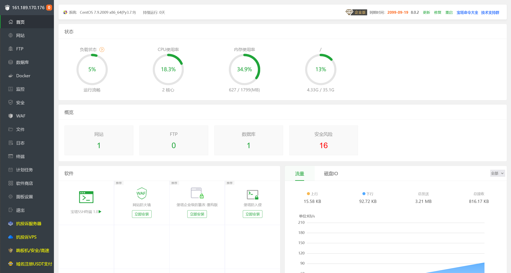

# 2024 盘古石 - 服务器 - WEB 服务器

:::info References

[2024 盘古石取证比赛（服务器） - yanke_wolf - 博客园](https://www.cnblogs.com/yanke-wolf/p/18189983)

[2024 盘古石杯晋级赛_支婉静 - CSDN 博客](https://blog.csdn.net/wow0524/article/details/139426950)

:::

## 1

> 分析网站服务器检材，网站搭建使用的服务器管理软件当前版本是否支持 32 位系统：[答案格式：是 / 否] [★☆☆☆☆]

登录服务器之后，执行 `su root` 切换到高权限账户，查看网络信息

```bash
(remote) root@ip-10-0-10-1.cn-northwest-1.compute.internal:/home/centos# netstat -anopt
Active Internet connections (servers and established)
Proto Recv-Q Send-Q Local Address           Foreign Address         State       PID/Program name     Timer
tcp        0      0 0.0.0.0:80              0.0.0.0:*               LISTEN      2592/nginx: master   off (0.00/0/0)
tcp        0      0 0.0.0.0:22              0.0.0.0:*               LISTEN      1510/sshd            off (0.00/0/0)
tcp        0      0 0.0.0.0:888             0.0.0.0:*               LISTEN      2592/nginx: master   off (0.00/0/0)
tcp        0      0 127.0.0.1:25            0.0.0.0:*               LISTEN      1366/master          off (0.00/0/0)
tcp        0      0 0.0.0.0:39802           0.0.0.0:*               LISTEN      7518/python3         off (0.00/0/0)
tcp        0      1 10.0.10.1:34586         172.67.148.203:8782     SYN_SENT    2600/nginx: worker   on (54.39/6/0)
tcp        0      1 10.0.10.1:59734         104.21.73.196:8782      SYN_SENT    2601/nginx: worker   on (54.39/6/0)
tcp        0     64 10.0.10.1:22            218.106.157.103:56033   ESTABLISHED 9264/sshd: centos [on (0.28/0/0)
tcp6       0      0 :::3306                 :::*                    LISTEN      2417/mysqld          off (0.00/0/0)
tcp6       0      0 :::22                   :::*                    LISTEN      1510/sshd            off (0.00/0/0)
tcp6       0      0 ::1:25                  :::*                    LISTEN      1366/master          off (0.00/0/0)
```

尝试定位 nginx 的配置文件目录

```bash
(remote) root@ip-10-0-10-1.cn-northwest-1.compute.internal:/home/centos# find / -name "nginx.conf"
/www/server/nginx/src/conf/nginx.conf
/www/server/nginx/conf/nginx.conf
```

看到这个路径，基本可以确定有宝塔的存在，尝试访问宝塔

```bash
(remote) root@ip-10-0-10-1.cn-northwest-1.compute.internal:/home/centos# bt
=============== 宝塔面板命令行 ==================
(1) 重启面板服务           (8) 改面板端口
(2) 停止面板服务           (9) 清除面板缓存
(3) 启动面板服务           (10) 清除登录限制
(4) 重载面板服务           (11) 设置是否开启 IP + User-Agent 验证
(5) 修改面板密码           (12) 取消域名绑定限制
(6) 修改面板用户名         (13) 取消 IP 访问限制
(7) 强制修改 MySQL 密码      (14) 查看面板默认信息
(22) 显示面板错误日志      (15) 清理系统垃圾
(23) 关闭 BasicAuth 认证     (16) 修复面板 (检查错误并更新面板文件到最新版)
(24) 关闭动态口令认证      (17) 设置日志切割是否压缩
(25) 设置是否保存文件历史副本  (18) 设置是否自动备份面板
(26) 关闭面板 ssl           (28) 修改面板安全入口
(0) 取消                   (29) 取消访问设备验证
===============================================
请输入命令编号：14
===============================================
正在执行 (14)...
===============================================
==================================================================
BT-Panel default info!
==================================================================
外网面板地址:  http://161.189.170.176:39802/39c115ad
内网面板地址:  http://10.0.10.1:39802/39c115ad
username: s6wh8tig
password: ********
If you cannot access the panel,
release the following panel port [39802] in the security group
若无法访问面板，请检查防火墙 / 安全组是否有放行面板 [39802] 端口
注意：初始密码仅在首次登录面板前能正确获取，其它时间请通过 bt 5 命令修改密码
==================================================================
```

执行修改密码，登录宝塔



可以确定版本号为 `8.0.2` 不支持 32 位系统

```flag
flag{否}
```

## 2

> 分析网站服务器检材，数据库备份的频率是一周多少次：[答案格式：数字] [★★☆☆☆]

在宝塔中未发现有计划任务


在服务器系统中进行排查

```bash
(remote) root@ip-10-0-10-1.cn-northwest-1.compute.internal:/tmp# crontab -l
*/5 * * * *  flock -xn /www/server/cron/e5b996fee678856191a1f336d0996b33.lock -c /www/server/cron/e5b996fee678856191a1f336d0996b33 >> /www/server/cron/e5b996fee678856191a1f336d0996b33.log 2>&1

0 0 * * 0 /root/backup.sh
```

查看脚本文件的内容

```bash title="/root/backup.sh"
#!/bin/bash

DB_USER="root"
DB_PASSWORD="root"
DB_NAME="2828"
BACKUP_PATH="/root/backup"

cd $BACKUP_PATH

DATE=$(date +%Y%m%d%H%M%S)

AES_PASS=$(echo -n "$DB_NAME" | openssl enc -aes-256-cbc -a -salt -pass pass:mysecretpassword -nosalt)

BACKUP_FILE_NAME="${DB_NAME}_${DATE}.sql"

mysqldump -u $DB_USER -p$DB_PASSWORD $DB_NAME > $BACKUP_FILE_NAME

File_Name="${DB_NAME}.sql.gz"

tar -czvf - $BACKUP_FILE_NAME | openssl des3 -salt -k $AES_PASS -out $File_Name

rm -rf  $BACKUP_FILE_NAME

mysqladmin -u $DB_USER -p$DB_PASSWORD drop $DB_NAME --force
```

很明显的数据库备份脚本

```flag
flag{1}
```

## 3

> 分析网站服务器检材，数据库备份生成的文件的密码是：

在上一题中就有，在数据库备份脚本中

```flag
flag{mysecretpassword}
```

## 4

> 分析网站服务器检材，网站前台首页的网站标题是：

手动加一个解析


但是返回了 302

```plaintext
root@jmt-projekt:~# http 161.189.170.176:8008
HTTP/1.1 302 Moved Temporarily
Cache-Control: no-store, no-cache, must-revalidate, post-check=0, pre-check=0
Connection: keep-alive
Content-Type: text/html;charset=utf-8
Date: Mon, 14 Oct 2024 05:50:48 GMT
Expires: Thu, 19 Nov 1981 08:52:00 GMT
Location: https://www.google.com/
Pragma: no-cache
Server: nginx
Set-Cookie: PHPSESSID=5e8673fiih968cduqvllo8ukm7; expires=Tue, 15-Oct-2024 05:50:48 GMT; Max-Age=86400; path=/
Transfer-Encoding: chunked
```

估计是存在有 Host 的判断机制，手动本地添加 hosts 记录之后进行访问

:::warning

远程服务器原有的 `touzilicai.com:80` 规则不可用，建议更换为其他端口（非 80 端口）

或者直接在终端内进行访问

:::

在服务器的 `/etc/hosts` 中添加以下记录

```plaintext
127.0.0.1 touzilicai.com
```

保存之后，访问

```bash
(remote) root@ip-10-0-10-1.cn-northwest-1.compute.internal:/tmp# curl -v touzilicai.com
* About to connect() to touzilicai.com port 80 (#0)
*   Trying 127.0.0.1...
* Connected to touzilicai.com (127.0.0.1) port 80 (#0)
> GET / HTTP/1.1
> User-Agent: curl/7.29.0
> Host: touzilicai.com
> Accept: */*
>
< HTTP/1.1 302 Moved Temporarily
< Server: nginx
< Date: Mon, 14 Oct 2024 06:01:31 GMT
< Content-Type: text/html;charset=utf-8
< Transfer-Encoding: chunked
< Connection: keep-alive
< Set-Cookie: PHPSESSID=v3kvu10ct4hflo5hok68kqdo22; expires=Tue, 15-Oct-2024 06:01:31 GMT; Max-Age=86400; path=/
< Expires: Thu, 19 Nov 1981 08:52:00 GMT
< Cache-Control: no-store, no-cache, must-revalidate, post-check=0, pre-check=0
< Pragma: no-cache
< location: http://touzilicai.com/Home/Run/index
<
* Connection #0 to host touzilicai.com left intact

(remote) root@ip-10-0-10-1.cn-northwest-1.compute.internal:/tmp# curl -v http://touzilicai.com/Home/Run/index | grep title
  % Total    % Received % Xferd  Average Speed   Time    Time     Time  Current
                                 Dload  Upload   Total   Spent    Left  Speed
  0     0    0     0    0     0      0      0 --:--:-- --:--:-- --:--:--     0* About to connect() to touzilicai.com port 80 (#0)
*   Trying 127.0.0.1...
* Connected to touzilicai.com (127.0.0.1) port 80 (#0)
> GET /Home/Run/index HTTP/1.1
> User-Agent: curl/7.29.0
> Host: touzilicai.com
> Accept: */*
>
< HTTP/1.1 200 OK
< Server: nginx
< Date: Mon, 14 Oct 2024 06:02:08 GMT
< Content-Type: text/html; charset=utf-8
< Transfer-Encoding: chunked
< Connection: keep-alive
< Vary: Accept-Encoding
< Set-Cookie: PHPSESSID=crrt4q6d49h8mq9dkqv79dnrv0; expires=Tue, 15-Oct-2024 06:02:08 GMT; Max-Age=86400; path=/
< Expires: Thu, 19 Nov 1981 08:52:00 GMT
< Pragma: no-cache
< Cache-control: private
< X-Powered-By: ThinkPHP
<
{[data not shown]
100 30632    0 30632    0     0   854k      <title> 威尼斯 </title>
  0 --  <style type="text/css" title="fading circle style">.circle-color-17 > div::before { background-color: #ccc; }</style>
:--:-- -        .game_box .title{
-:--:-- --:--:--                <div class="title">
  8             <div class="title">
79k
* Connection #0 to host touzilicai.com left intact
```

即可得到网站首页的标题

```flag
flag{威尼斯}
```

## 5

> 分析网站服务器检材，受害人第一次成功登录网站的时间是：[答案格式：年 - 月 - 日 - 时 - 分 - 秒]

TODO 待完善

```flag
flag{2024-04-25-09-49-38}
```

## 6

> 分析网站服务器检材，前台页面中，港澳数字竞猜游戏中，进入贵宾厅最低点数是：[答案格式：1234]

```flag
flag{100000}
```

## 7

> 分析网站服务器检材，受害人在平台一共盈利了多少钱：

```flag
flag{35000}
```

## 8

> 分析网站服务器检材，网站根目录下，哪个路径存在漏洞

```flag
flag{/Home/User/tkpwdpost.html}
```

## 9

> 分析网站服务器检材，黑客通过哪个文件上传的木马文件

```flag
flag{tmpugklv.php}
```

## 10

> 分析网站服务器检材，网站使用的数据库前缀是：

```flag
flag{think_}
```

## 11

> 分析网站服务器检材，木马文件的密码是：

```flag
flag{2335}
```
